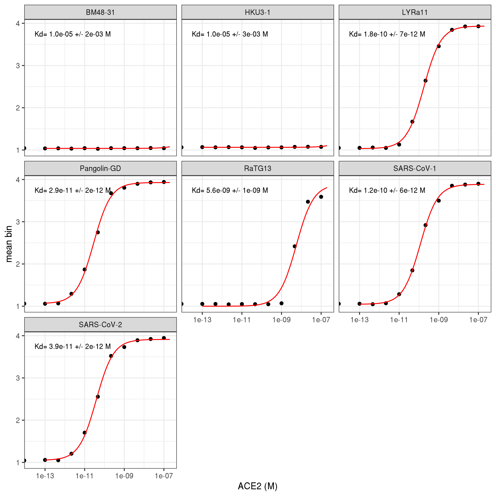
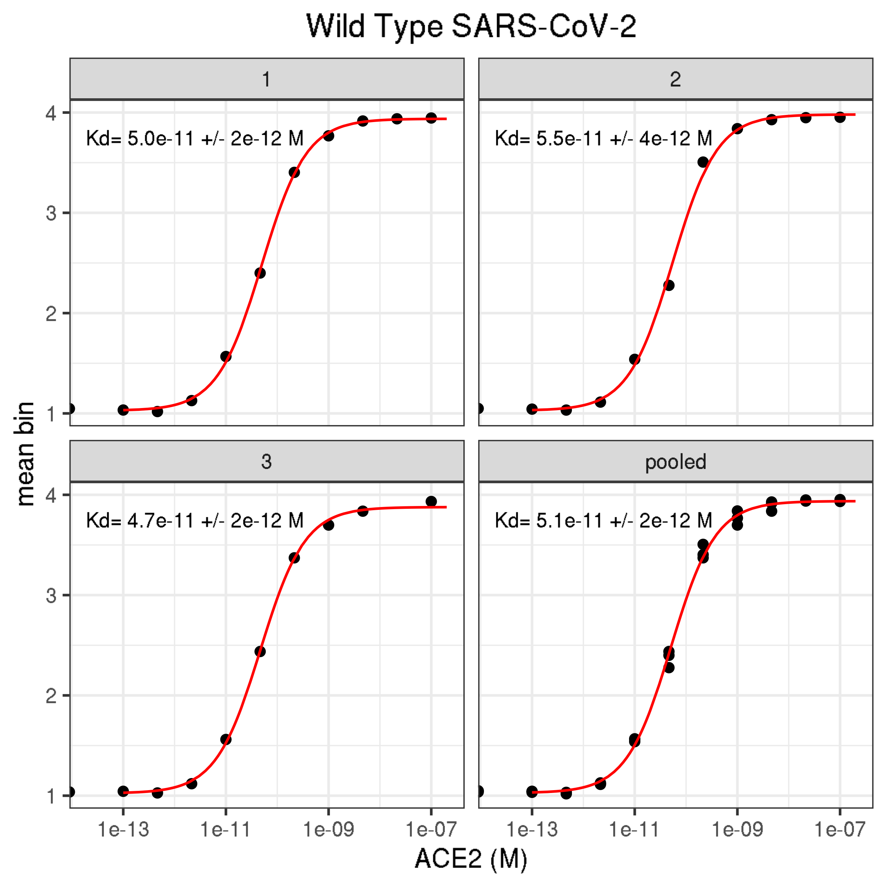
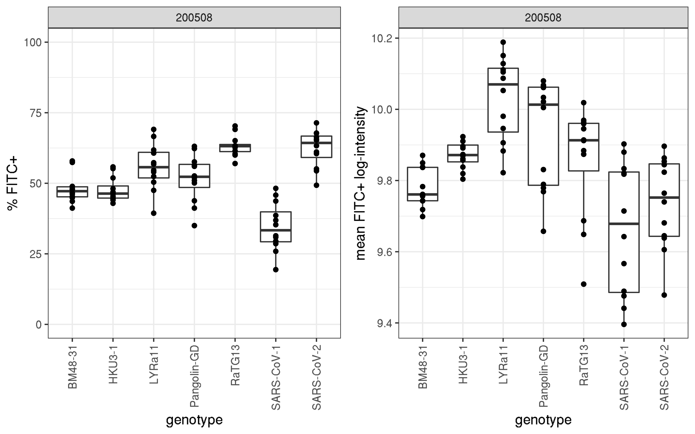

Isogenic validation experiments
================

``` r
require("knitr")
knitr::opts_chunk$set(echo = T)
knitr::opts_chunk$set(dev.args = list(png = list(type = "cairo")))

#list of packages to install/load
packages = c("ggplot2", "data.table", "tidyverse", "dplyr", "broom", "gridExtra")
#install any packages not already installed
installed_packages <- packages %in% rownames(installed.packages())
if(any(installed_packages == F)){
  install.packages(packages[!installed_packages])
}
#load packages
invisible(lapply(packages, library, character.only=T))

#make results directory
if(!file.exists("results")){
 dir.create(file.path("results"))
}
```

## Experiment: isogenic validation of yeast-display RBD mutants and homologs

**2020-05-01** WT SARS-CoV-2 Spike RBD was validated in triplicate.

**2020-05-08** WT SARS-CoV-2 Spike RBD and 6 homologs were validated in
isogenic experiments.

### Read in data table with mean bin at each concentration

``` r
dt <- read.csv(file="homolog_validations.csv", stringsAsFactors=F)
```

### Duplicate rows that correspond to May01 wild type triplicate experiment so we can fit models to the pooled replicates

``` r
wildtype <- dt %>%
  filter(expt=="200501") %>%
  mutate(replicate = "pooled",
         titration = "wt_pooled")

dt <- dt %>% rbind(wildtype)

print(nrow(dt))
```

    ## [1] 156

### Calculate log-mean `geomean_FITC` and `FITC+` for each titration

``` r
dt <- dt %>%
  group_by(titration) %>%
  mutate(mean_FITCpos = mean(FITCpos),
         stderr_FITCpos = sd(FITCpos)/sqrt(length(FITCpos)),
         log_geomean_FITC = log(geomean_FITC),
         mean_logMFI_FITC = mean(log(geomean_FITC)),
         stderr_logMFI_FITC = sd(log(geomean_FITC))/sqrt(length(geomean_FITC))
         ) %>%
  ungroup()

head(dt, n=5)
```

    ## # A tibble: 5 x 24
    ##     expt cell  titration genotype replicate   conc_M Events Cells_percent
    ##    <int> <chr> <chr>     <chr>    <chr>        <dbl>  <int>         <dbl>
    ## 1 200508 A1    1         SARS-Co… 1         0.        10000          84  
    ## 2 200508 A2    1         SARS-Co… 1         1.00e-13  10000          84.1
    ## 3 200508 A3    1         SARS-Co… 1         4.64e-13   1736          79  
    ## 4 200508 A4    1         SARS-Co… 1         2.15e-12  10000          70.8
    ## 5 200508 A5    1         SARS-Co… 1         1.00e-11   9274          84.7
    ## # … with 16 more variables: Singles_percent <dbl>,
    ## #   SinglesV2_percent <dbl>, SinglesV2_count <int>, FITCpos <dbl>,
    ## #   geomean_FITC <int>, geomean_PE <dbl>, bin1 <dbl>, bin2 <dbl>,
    ## #   bin3 <dbl>, bin4 <dbl>, mean_bin <dbl>, mean_FITCpos <dbl>,
    ## #   stderr_FITCpos <dbl>, log_geomean_FITC <dbl>, mean_logMFI_FITC <dbl>,
    ## #   stderr_logMFI_FITC <dbl>

### Use `broom` to get the results from fitting `nls` model by group

``` r
nls_broom <- dt %>%
  group_by(titration) %>%
  do(tidy(nls(mean_bin ~ a*(conc_M/(conc_M+Kd))+b,
              data=.,
              start=list(a=3,b=1,Kd=1e-10),
              lower=list(a=2,b=1,Kd=1e-15),
              upper=list(a=3,b=1.5,Kd=1e-5),
              algorithm="port"
              )
          )
  )

dt <- dt %>%
  merge(nls_broom %>%
          filter(term=="Kd") %>%
          select(estimate, std.error) %>%
          rename(Kd="estimate",
                 Kd_SE="std.error"), by="titration")
```

    ## Adding missing grouping variables: `titration`

``` r
head(dt, n=5)
```

    ##   titration   expt cell   genotype replicate   conc_M Events Cells_percent
    ## 1         1 200508   A1 SARS-CoV-2         1 0.00e+00  10000          84.0
    ## 2         1 200508   A2 SARS-CoV-2         1 1.00e-13  10000          84.1
    ## 3         1 200508   A3 SARS-CoV-2         1 4.64e-13   1736          79.0
    ## 4         1 200508   A4 SARS-CoV-2         1 2.15e-12  10000          70.8
    ## 5         1 200508   A5 SARS-CoV-2         1 1.00e-11   9274          84.7
    ##   Singles_percent SinglesV2_percent SinglesV2_count FITCpos geomean_FITC
    ## 1            99.5              99.6            8328    66.4        19026
    ## 2            99.5              99.6            8343    65.6        19213
    ## 3            99.2              98.8            1345    67.7        18462
    ## 4            96.4              85.3            5826    71.4        19858
    ## 5            99.2              99.6            7765    61.1        17403
    ##   geomean_PE bin1  bin2  bin3 bin4 mean_bin mean_FITCpos stderr_FITCpos
    ## 1       60.7 95.5  4.43 0.054    0 1.045387       62.325       1.882621
    ## 2       66.8 94.2  5.72 0.055    0 1.058315       62.325       1.882621
    ## 3       68.2 94.9  4.95 0.110    0 1.051721       62.325       1.882621
    ## 4      106.0 79.5 20.50 0.048    0 1.205861       62.325       1.882621
    ## 5      338.0 29.8 70.00 0.210    0 1.704130       62.325       1.882621
    ##   log_geomean_FITC mean_logMFI_FITC stderr_logMFI_FITC           Kd
    ## 1         9.853562         9.736162         0.03694794 3.866311e-11
    ## 2         9.863342         9.736162         0.03694794 3.866311e-11
    ## 3         9.823470         9.736162         0.03694794 3.866311e-11
    ## 4         9.896362         9.736162         0.03694794 3.866311e-11
    ## 5         9.764398         9.736162         0.03694794 3.866311e-11
    ##          Kd_SE
    ## 1 2.373195e-12
    ## 2 2.373195e-12
    ## 3 2.373195e-12
    ## 4 2.373195e-12
    ## 5 2.373195e-12

### Write summary table to CSV file

``` r
isogenic_titrations_summary <- dt %>%
  select(expt, titration, genotype, replicate, Kd, Kd_SE, mean_FITCpos, stderr_FITCpos, mean_logMFI_FITC, stderr_logMFI_FITC) %>%
  unique()

isogenic_titrations_summary
```

    ##       expt titration    genotype replicate           Kd        Kd_SE
    ## 1   200508         1  SARS-CoV-2         1 3.866311e-11 2.373195e-12
    ## 13  200501        10  SARS-CoV-2         3 4.674871e-11 2.300602e-12
    ## 25  200508         2      RaTG13         1 5.583304e-09 1.463659e-09
    ## 37  200508         3 Pangolin-GD         1 2.851742e-11 2.056310e-12
    ## 49  200508         4      HKU3-1         1 1.000000e-05 2.541911e-03
    ## 61  200508         5  SARS-CoV-1         1 1.170649e-10 6.097434e-12
    ## 73  200508         6      LYRa11         1 1.755139e-10 7.423707e-12
    ## 85  200508         7     BM48-31         1 1.000000e-05 2.474081e-03
    ## 97  200501         8  SARS-CoV-2         1 4.991108e-11 1.950496e-12
    ## 109 200501         9  SARS-CoV-2         2 5.470428e-11 4.497110e-12
    ## 121 200501 wt_pooled  SARS-CoV-2    pooled 5.076563e-11 1.857872e-12
    ##     mean_FITCpos stderr_FITCpos mean_logMFI_FITC stderr_logMFI_FITC
    ## 1       62.32500       1.882621         9.736162         0.03694794
    ## 13            NA             NA               NA                 NA
    ## 25      63.25000       1.060624         9.857094         0.04516238
    ## 37      51.75833       2.420195         9.929917         0.04389709
    ## 49      47.70000       1.240906         9.872199         0.01120010
    ## 61      34.51667       2.473460         9.664973         0.05368526
    ## 73      55.88333       2.367643        10.030140         0.03428097
    ## 85      48.04167       1.444397         9.779923         0.01605766
    ## 97      61.93333       1.619452               NA                 NA
    ## 109     58.77500       2.263181               NA                 NA
    ## 121           NA             NA               NA                 NA

``` r
write.csv(isogenic_titrations_summary,"./results/isogenic_titrations_summary.csv", row.names = FALSE)
```

### Now predict `mean_bin` using the models

``` r
conc_M = c(1:20 %o% 10^(-13:-7)) # this should only generate 120 estimates per titration (faster!)

nls_predictions <- dt %>%
  select(titration, expt, genotype, replicate) %>%
  merge(nls_broom %>%
          select(-statistic, -p.value, -std.error) %>%
          spread(term, estimate),
        by="titration") %>%
  unique() %>%
  merge(dt %>% select(titration, Kd_SE) %>% unique(), by="titration") %>%
  merge(as.data.frame(conc_M), all=TRUE) %>%
  mutate(mean_bin = a*(conc_M/(conc_M+Kd))+b)

head(nls_predictions, n=5)
```

    ##   titration   expt    genotype replicate        a        b           Kd
    ## 1         1 200508  SARS-CoV-2         1 2.862388 1.050111 3.866311e-11
    ## 2        10 200501  SARS-CoV-2         3 2.854494 1.023073 4.674871e-11
    ## 3         2 200508      RaTG13         1 2.886087 1.000000 5.583304e-09
    ## 4         3 200508 Pangolin-GD         1 2.867730 1.060853 2.851742e-11
    ## 5         4 200508      HKU3-1         1 2.000000 1.063136 1.000000e-05
    ##          Kd_SE conc_M mean_bin
    ## 1 2.373195e-12  1e-13 1.057496
    ## 2 2.300602e-12  1e-13 1.029166
    ## 3 1.463659e-09  1e-13 1.000052
    ## 4 2.056310e-12  1e-13 1.070874
    ## 5 2.541911e-03  1e-13 1.063136

### Make plots for titration curves for May08 homolog experiment

``` r
annotations <- dt %>%
  filter(expt != "200501") %>%
  select(titration, genotype, expt, replicate, Kd, Kd_SE) %>%
  unique() %>%
  remove_rownames()

ggplot(dt %>% filter(expt != "200501"), aes(conc_M, mean_bin)) +
  geom_point() +
  geom_line(data = nls_predictions %>% filter(expt != "200501"),
            aes(conc_M, mean_bin),
            color="red") +
  scale_x_log10(lim=c(2e-14,2e-07)) +
  xlab("ACE2 (M)") +
  ylab("mean bin") +
  facet_wrap(~ genotype) +
  geom_text(
    data    = annotations,
    mapping = aes(x = 2.5e-12,
                  y = 3.75,
                  label = c(paste(
                    "Kd=", format(Kd, digits=2),
                    "+/-", format(Kd_SE, digits=1), "M"))),
    size=3) +
  theme_bw()
```



``` r
ggsave(
  "./results/homolog_titration.pdf",
  scale = 1,
  width = NA,
  height = NA,
  useDingbats=F
)
```

### Make plots just for May01 wildtype triplicate titrations

``` r
annotations <- dt %>%
  filter(expt == "200501") %>%
  select(titration, genotype, expt, replicate, Kd, Kd_SE) %>%
  unique() %>%
  remove_rownames()

ggplot(dt %>% filter(expt == "200501"), aes(conc_M, mean_bin)) +
  geom_point() +
  geom_line(data = nls_predictions %>% filter(expt == "200501"),
            aes(conc_M, mean_bin),
            color="red") +
  scale_x_log10(lim=c(2e-14,2e-07)) +
  xlab("ACE2 (M)") +
  ylab("mean bin") +
  facet_wrap(~ replicate) + # this time facet on replicate
  geom_text(
    data    = annotations,
    mapping = aes(x = 2.5e-12,
                  y = 3.75,
                  label = c(paste(
                    "Kd=", format(Kd, digits=2),
                    "+/-", format(Kd_SE, digits=1), "M"))),
    size=3) +
  ggtitle("Wild Type SARS-CoV-2") +
  theme_bw() +
  theme(plot.title = element_text(hjust = 0.5))
```



``` r
ggsave(
  "./results/wildtype_triplicate_titration.pdf",
  scale = 1,
  width = NA,
  height = NA,
  useDingbats = F
)
```

### Plot FITC+ and geomean\_FITC by genotype

We will ignore the original WT isogenic titration experiment (May01)
because it is not really possible to compare across experiments due to
variability with induction, etc.

``` r
p1 <- ggplot(dt %>% filter(expt!="200501"), aes(genotype, FITCpos)) +
  geom_boxplot() +
  geom_point() +
  scale_y_continuous(lim=c(0, 100)) +
  ylab("% FITC+") +
  facet_wrap(~ expt, scales="free_x") +
  theme_bw() +
  theme(text = element_text(size=12),
        axis.text.x=element_text(angle=90, hjust=1, vjust=0.5))

p2 <- ggplot(dt %>% filter(expt!="200501"), aes(genotype, log_geomean_FITC)) +
  geom_boxplot() +
  geom_point() +
  ylab("mean FITC+ log-intensity") +
  facet_wrap(~ expt, scales="free_x") +
  theme_bw() +
  theme(text = element_text(size=12),
        axis.text.x=element_text(angle=90, hjust=1, vjust=0.5))

grid.arrange(p1, p2, ncol=2, widths=c(8,8), heights=c(6))
```



``` r
g <- arrangeGrob(p1, p2, ncol=2, widths=c(8,8), heights=c(6))

ggsave(
  "./results/homolog_FITC_expression.pdf",
  g,
  scale = 1,
  width = NA,
  height = NA
)
```
