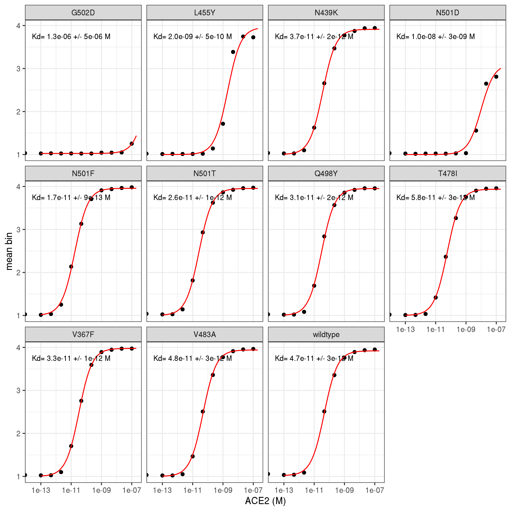
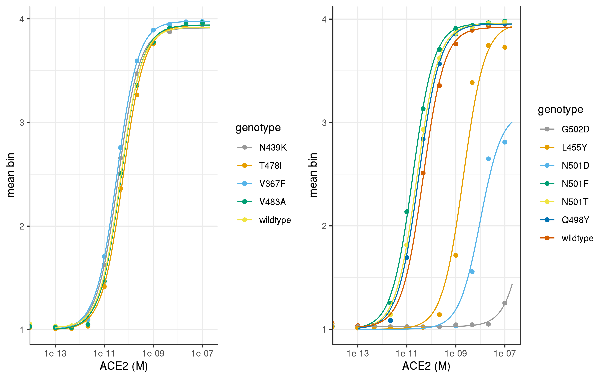
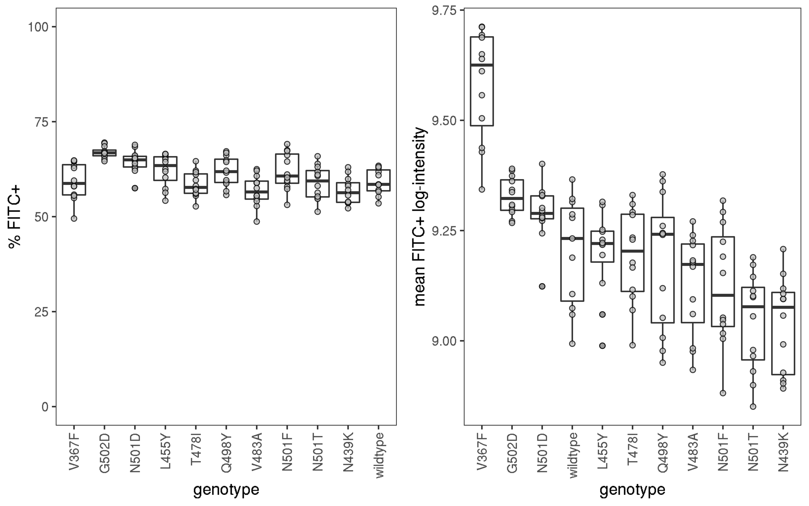
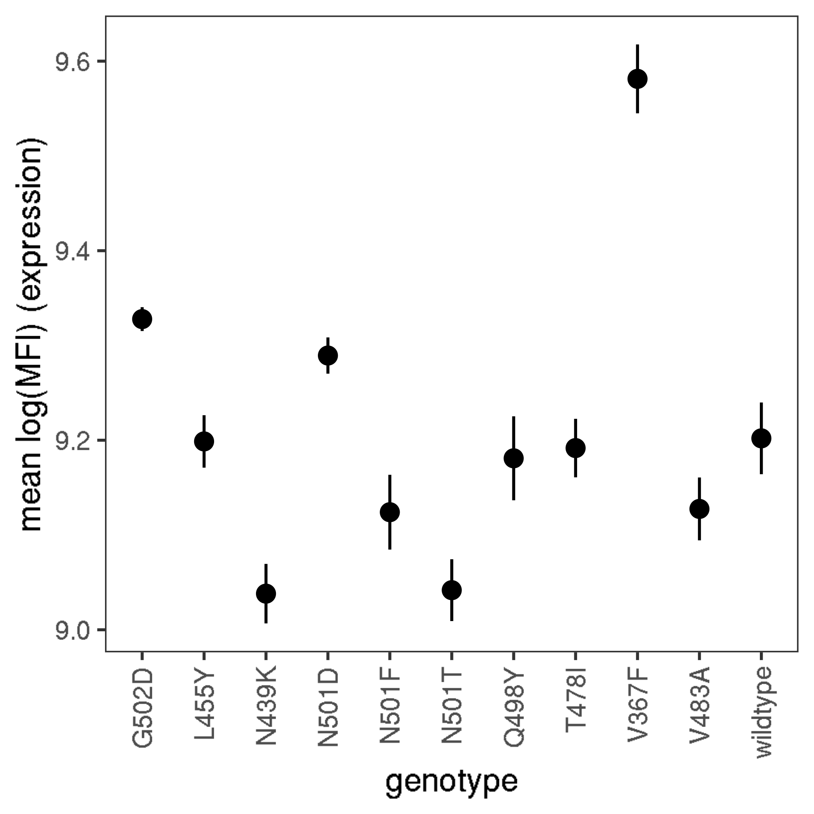

Isogenic validation experiments of point mutants
================

``` r
require("knitr")
knitr::opts_chunk$set(echo = T)
knitr::opts_chunk$set(dev.args = list(png = list(type = "cairo")))

#list of packages to install/load
packages = c("ggplot2", "data.table", "tidyverse", "dplyr", "broom", "gridExtra")
#install any packages not already installed
installed_packages <- packages %in% rownames(installed.packages())
if(any(installed_packages == F)){
  install.packages(packages[!installed_packages])
}
#load packages
invisible(lapply(packages, library, character.only=T))

#make results directory
if(!file.exists("results")){
 dir.create(file.path("results"))
}
```

### Define colorblind-friendly palette

``` r
# The palette with grey:
cbPalette <- c("#999999", "#E69F00", "#56B4E9", "#009E73", "#F0E442", 
               "#0072B2", "#D55E00", "#CC79A7")
# The palette with black
cbbPalette <- c("#000000", "#E69F00", "#56B4E9", "#009E73", "#F0E442", 
                "#0072B2", "#D55E00", "#CC79A7")
```

## Experiment: isogenic validation of yeast-display RBD mutants and homologs

**2020-06-08** WT SARS-CoV-2 Spike RBD and 10 point mutants were
validated in isogenic experiments.

### Read in data table with mean bin at each concentration

``` r
dt <- read.csv(file="point-mut-validations.csv", stringsAsFactors=F)
```

### Calculate log-mean `geomean_FITC` and `FITC+` for each titration

``` r
dt <- dt %>%
  group_by(titration) %>%
  mutate(mean_FITCpos = mean(FITCpos),
         stderr_FITCpos = sd(FITCpos)/sqrt(length(FITCpos)),
         log_geomean_FITC = log(geomean_FITC),
         mean_logMFI_FITC = mean(log(geomean_FITC),na.rm=T),
         stderr_logMFI_FITC = sd(log(geomean_FITC),na.rm=T)/sqrt(length(geomean_FITC))
         ) %>%
  ungroup()

head(dt, n=5)
```

    ## # A tibble: 5 x 18
    ##   FITCpos geomean_FITC  bin1  bin2   bin3   bin4 mean_bin plate titration
    ##     <dbl>        <int> <dbl> <dbl>  <dbl>  <dbl>    <dbl> <chr>     <int>
    ## 1    61.8        11682  94.9  4.73  0.290  0.12      1.06 plat…         1
    ## 2    63.4        11100  96.8  2.97  0.18   0.016     1.03 plat…         1
    ## 3    62.8        11180  96.4  3.27  0.27   0.021     1.04 plat…         1
    ## 4    63.1        10710  91.4  8.44  0.18   0.033     1.09 plat…         1
    ## 5    NA             NA  NA   NA    NA     NA        NA    plat…         1
    ## # … with 9 more variables: genotype <chr>, conc_logM <dbl>, conc_M <dbl>,
    ## #   category <chr>, mean_FITCpos <dbl>, stderr_FITCpos <dbl>,
    ## #   log_geomean_FITC <dbl>, mean_logMFI_FITC <dbl>,
    ## #   stderr_logMFI_FITC <dbl>

### Use `broom` to get the results from fitting `nls` model by group

``` r
nls_broom <- dt %>%
  group_by(titration) %>%
  do(tidy(nls(mean_bin ~ a*(conc_M/(conc_M+Kd))+b,
              data=.,
              start=list(a=3,b=1,Kd=1e-10),
              lower=list(a=2,b=1,Kd=1e-15),
              upper=list(a=3,b=1.5,Kd=1e-5),
              algorithm="port"
              )
          )
  )

dt <- dt %>%
  merge(nls_broom %>%
          filter(term=="Kd") %>%
          select(estimate, std.error) %>%
          rename(Kd="estimate",
                 Kd_SE="std.error"), by="titration")
```

    ## Adding missing grouping variables: `titration`

``` r
head(dt, n=5)
```

    ##   titration FITCpos geomean_FITC bin1 bin2 bin3  bin4 mean_bin   plate
    ## 1         1    61.8        11682 94.9 4.73 0.29 0.120 1.056677 plate_1
    ## 2         1    63.4        11100 96.8 2.97 0.18 0.016 1.033791 plate_1
    ## 3         1    62.8        11180 96.4 3.27 0.27 0.021 1.038745 plate_1
    ## 4         1    63.1        10710 91.4 8.44 0.18 0.033 1.088943 plate_1
    ## 5         1      NA           NA   NA   NA   NA    NA       NA plate_1
    ##   genotype conc_logM      conc_M category mean_FITCpos stderr_FITCpos
    ## 1 wildtype   0.00000 0.00000e+00 wildtype           NA             NA
    ## 2 wildtype -13.00000 1.00000e-13 wildtype           NA             NA
    ## 3 wildtype -12.33333 4.64159e-13 wildtype           NA             NA
    ## 4 wildtype -11.66667 2.15443e-12 wildtype           NA             NA
    ## 5 wildtype -11.00000 1.00000e-11 wildtype           NA             NA
    ##   log_geomean_FITC mean_logMFI_FITC stderr_logMFI_FITC           Kd
    ## 1         9.365804         9.201997         0.03622582 4.655741e-11
    ## 2         9.314700         9.201997         0.03622582 4.655741e-11
    ## 3         9.321882         9.201997         0.03622582 4.655741e-11
    ## 4         9.278933         9.201997         0.03622582 4.655741e-11
    ## 5               NA         9.201997         0.03622582 4.655741e-11
    ##          Kd_SE
    ## 1 2.636883e-12
    ## 2 2.636883e-12
    ## 3 2.636883e-12
    ## 4 2.636883e-12
    ## 5 2.636883e-12

### Write summary table to CSV file

``` r
point_mutants_summary <- dt %>%
  select(titration, genotype, Kd, Kd_SE, mean_FITCpos, stderr_FITCpos, mean_logMFI_FITC, stderr_logMFI_FITC) %>%
  unique()

point_mutants_summary
```

    ##     titration genotype           Kd        Kd_SE mean_FITCpos
    ## 1           1 wildtype 4.655741e-11 2.636883e-12           NA
    ## 13          2    Q498Y 3.075992e-11 1.916850e-12     61.90000
    ## 25          3    N501D 1.002456e-08 2.628794e-09     64.50000
    ## 37          4    N501F 1.744798e-11 9.071681e-13     61.90833
    ## 49          5    N501T 2.604717e-11 1.282445e-12     58.91667
    ## 61          6    G502D 1.253813e-06 5.424802e-06     66.93333
    ## 73          7    L455Y 2.039996e-09 4.886386e-10     62.23333
    ## 85          8    N439K 3.661899e-11 1.691784e-12     56.76667
    ## 97          9    T478I 5.784582e-11 2.978651e-12     58.50000
    ## 109        10    V367F 3.267925e-11 1.391010e-12     59.28333
    ## 121        11    V483A 4.821330e-11 2.806203e-12     56.83333
    ##     stderr_FITCpos mean_logMFI_FITC stderr_logMFI_FITC
    ## 1               NA         9.201997         0.03622582
    ## 13       1.1460737         9.180942         0.04429979
    ## 25       0.8708234         9.289367         0.01911649
    ## 37       1.4275672         9.124061         0.03945146
    ## 49       1.2893993         9.041795         0.03262070
    ## 61       0.4409586         9.327816         0.01257126
    ## 73       1.2443407         9.198746         0.02765887
    ## 85       1.0219806         9.038120         0.03137877
    ## 97       0.9774736         9.191740         0.03087233
    ## 109      1.4062002         9.581303         0.03633517
    ## 121      1.1721732         9.127527         0.03315611

``` r
write.csv(point_mutants_summary,"./results/point_mutants_summary.csv", row.names = FALSE)
```

### Now predict `mean_bin` using the models

``` r
conc_M = c(1:20 %o% 10^(-13:-7)) # this should only generate 120 estimates per titration (faster!)

nls_predictions <- dt %>%
  select(titration, genotype, category) %>%
  merge(nls_broom %>%
          select(-statistic, -p.value, -std.error) %>%
          spread(term, estimate),
        by="titration") %>%
  unique() %>%
  merge(dt %>% select(titration, Kd_SE) %>% unique(), by="titration") %>%
  merge(as.data.frame(conc_M), all=TRUE) %>%
  mutate(mean_bin = a*(conc_M/(conc_M+Kd))+b)

head(nls_predictions, n=5)
```

    ##   titration genotype category        a        b           Kd        Kd_SE
    ## 1         1 wildtype wildtype 2.903381 1.017305 4.655741e-11 2.636883e-12
    ## 2         2    Q498Y    other 2.952816 1.000000 3.075992e-11 1.916850e-12
    ## 3         3    N501D    other 2.106022 1.000000 1.002456e-08 2.628794e-09
    ## 4         4    N501F    other 2.957913 1.000000 1.744798e-11 9.071681e-13
    ## 5         5    N501T    other 2.954752 1.000000 2.604717e-11 1.282445e-12
    ##   conc_M mean_bin
    ## 1  1e-13 1.023528
    ## 2  1e-13 1.009568
    ## 3  1e-13 1.000021
    ## 4  1e-13 1.016856
    ## 5  1e-13 1.011300

### Make plots for titration curves for June08 point mutant experiment

``` r
annotations <- dt %>%
  select(titration, genotype, Kd, Kd_SE) %>%
  unique() %>%
  remove_rownames()

ggplot(dt, aes(conc_M, mean_bin)) +
  geom_point() +
  geom_line(data = nls_predictions,
            aes(conc_M, mean_bin),
            color="red") + 
  scale_x_log10(lim=c(2e-14,2e-07)) +
  xlab("ACE2 (M)") +
  ylab("mean bin") +
  facet_wrap(~ genotype) +
  geom_text(
    data    = annotations,
    mapping = aes(x = 1e-11,
                  y = 3.75,
                  label = c(paste(
                    "Kd=", format(Kd, digits=2),
                    "+/-", format(Kd_SE, digits=1), "M"))),
    size=3) +
  theme_bw()
```



``` r
ggsave(
  "./results/point-mut_titration.pdf",
  scale = 1,
  width = NA,
  height = NA,
  useDingbats=F
)
```

### Multiple curves on one plot.

``` r
annotations <- dt %>%
  select(titration, genotype, Kd, Kd_SE) %>%
  unique() %>%
  remove_rownames()

p1<- ggplot(dt %>% filter(category=="wildtype" | category=="circulating"), aes(conc_M, mean_bin)) +
  geom_point(aes(color=genotype)) +
  geom_line(data = nls_predictions %>% filter(category=="wildtype" | category=="circulating"),
            aes(conc_M, mean_bin, color=genotype),
            ) + 
  scale_x_log10(lim=c(2e-14,2e-07)) +
  xlab("ACE2 (M)") +
  ylab("mean bin") +
  scale_color_manual(values=cbPalette) +
  theme_bw()

p2<- ggplot(dt %>% filter(category=="wildtype" | category=="other"), aes(conc_M, mean_bin)) +
  geom_point(aes(color=genotype)) +
  geom_line(data = nls_predictions %>% filter(category=="wildtype" | category=="other"),
            aes(conc_M, mean_bin, color=genotype),
            ) + 
  scale_x_log10(lim=c(2e-14,2e-07)) +
  xlab("ACE2 (M)") +
  ylab("mean bin") +
  scale_color_manual(values=cbPalette) +
  theme_bw()

grid.arrange(p1, p2, ncol=2, widths=c(6,6), heights=c(6))
```



``` r
g <- arrangeGrob(p1, p2, ncol=2, widths=c(6,6), heights=c(6))

ggsave(
  "./results/point-mut_titration_multiple.pdf",
  g,
  scale = 1,
  width = 9,
  height = 3,
  useDingbats=F
)
```

### Plot FITC+ and geomean\_FITC by genotype

``` r
p1 <- ggplot(dt, aes(x=reorder(genotype, -log_geomean_FITC), y=FITCpos)) +
  geom_boxplot() +
  geom_point(shape=21, fill="grey", alpha=0.75) +
  scale_y_continuous(lim=c(0, 100)) +
  xlab("genotype") +
  ylab("% FITC+") +
  #facet_wrap(~ expt, scales="free_x") +
  theme_bw() +
  theme(text = element_text(size=12),
        axis.text.x=element_text(angle=90, hjust=1, vjust=0.5),
        panel.grid.major = element_blank(),
        panel.grid.minor = element_blank())

p2 <- ggplot(dt, aes(x=reorder(genotype, -mean_logMFI_FITC), y=log_geomean_FITC)) +
  geom_boxplot() +
  geom_point(shape=21, fill="grey", alpha=0.75) +
  xlab("genotype") +
  ylab("mean FITC+ log-intensity") +
  #facet_wrap(~ expt, scales="free_x") +
  theme_bw() +
  theme(text = element_text(size=12),
        axis.text.x=element_text(angle=90, hjust=1, vjust=0.5),
        panel.grid.major = element_blank(),
        panel.grid.minor = element_blank())

grid.arrange(p1, p2, ncol=2, widths=c(6,6), heights=c(6))
```



``` r
g <- arrangeGrob(p1, p2, ncol=2, widths=c(6,6), heights=c(6))

ggsave(
  "./results/point-mut_FITC_expression.pdf",
  g,
  scale = 1,
  width = 8,
  height = 4
)
```

``` r
p1 <- ggplot(dt, aes(x=genotype, y=log_geomean_FITC-mean(as.data.frame(dt[dt$genotype=="wildtype","log_geomean_FITC"])$log_geomean_FITC,na.rm=T))) +
  #stat_summary(fun.y=mean,geom="point",size=3,shape=16)+
  stat_summary(fun.y=mean,
               fun.ymin=function(x) mean(x) - sd(x)/sqrt(length(x)),
               fun.ymax=function(x) mean(x) + sd(x)/sqrt(length(x)),
               geom="pointrange")+
  xlab("genotype") +
  ylab("delta_log(MFI) (expression)") +
  #facet_wrap(~ expt, scales="free_x") +
  theme_bw() +
  theme(text = element_text(size=12),
        axis.text.x=element_text(angle=90, hjust=1, vjust=0.5),
        panel.grid.major = element_blank(),
        panel.grid.minor = element_blank())

p1
```



``` r
ggsave(
  "./results/point-mut_FITC_expression_mean-SE.pdf",
  p1,
  scale = 1,
  width = 4,
  height = 4,
  useDingbats=F
)
```
