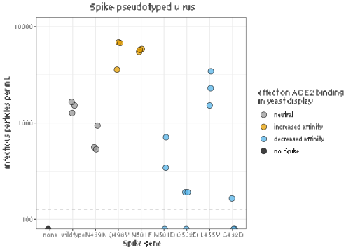
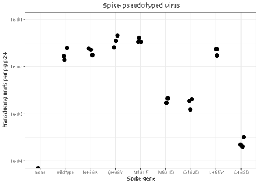

Titer Spike pseudovirus by flow cytometry
================

``` r
require("knitr")
knitr::opts_chunk$set(echo = T)
knitr::opts_chunk$set(dev.args = list(png = list(type = "cairo")))
#list of packages to install/load
packages = c("ggplot2", "data.table", "tidyverse", "dplyr", "gridExtra")
#install any packages not already installed
installed_packages <- packages %in% rownames(installed.packages())
if(any(installed_packages == F)){
  install.packages(packages[!installed_packages])
}
#load packages
invisible(lapply(packages, library, character.only=T))
#make results directory
if(!file.exists("results")){
 dir.create(file.path("results"))
}
```

## Experiment: Titer Spike point mutant pseudovirus by flow cytometry

**2020-06-01** Mutants tested: Neutral in bulk yeast display
experiments: \* wildtype \* N439K

Deleterious in bulk yeast display experiments: \* N501D \* L455Y \*
C432D \* G502D

Beneficial in bulk yeast display experiments: \* N501F \* Q498Y

### Define colorblind-friendly palette

``` r
# The palette with grey:
cbPalette <- c("#999999", "#E69F00", "#56B4E9", "#009E73", "#F0E442", 
               "#0072B2", "#D55E00", "#CC79A7")
# The palette with black
cbbPalette <- c("#000000", "#E69F00", "#56B4E9", "#009E73", "#F0E442", 
                "#0072B2", "#D55E00", "#CC79A7")
```

### Read in data from flow cytometry and p24 quantifications

``` r
dt <- read.csv(file="pseudovirus_titers.csv", stringsAsFactors=F)
head(dt)
```

    ##   FITC_perc_linegate genotype expectation n_cells uL_virus
    ## 1              11.60 wildtype     neutral   12700       50
    ## 2              11.40 wildtype     neutral   12700       50
    ## 3               6.08 wildtype     neutral   12700       50
    ## 4              22.20    Q498Y  beneficial   12700       50
    ## 5              27.40    Q498Y  beneficial   12700       50
    ## 6              17.70    Q498Y  beneficial   12700       50
    ##   virus_per_mL_stringent p24_pg_per_mL
    ## 1                  31300       1258255
    ## 2                  30700       1831364
    ## 3                  15900       1135455
    ## 4                  63800       1794519
    ## 5                  81300       1788182
    ## 6                  49500       1938636

### Plot titers as measured by flow cytometry

``` r
dt <- dt %>% mutate(genotype = factor(genotype, 
                                levels=c("none", "VSV_G", "wildtype", 
                                         "N439K", "Q498Y", "N501F", 
                                         "N501D", "G502D", "L455Y", "C432D")),
              uL_virus = factor(uL_virus))

ggplot(dt %>%
         filter(uL_virus == "50" | genotype=="none")
       ,
       aes(genotype, virus_per_mL_stringent/exp(mean(log(dt[dt$genotype=="wildtype" & dt$uL_virus=="50","virus_per_mL_stringent"]))))
       ) +
  geom_point(size=3.5,
             shape=16,
             position=position_jitter(width = 0.1, height = 0, seed = 0)) +
  geom_hline(yintercept=25/exp(mean(log(dt[dt$genotype=="wildtype" & dt$uL_virus=="50","virus_per_mL_stringent"]))), color="grey", linetype="dashed") + #Limit of detection
  scale_y_log10(lim=c(8e-4, 1e1)) +
  xlab("Spike gene") +
  ylab("relative titer") +
  theme_bw()  +
  ggtitle("Spike-pseudotyped virus") +
  theme(plot.title = element_text(hjust = 0.5))
```

    ## Warning: Transformation introduced infinite values in continuous y-axis

<!-- -->

``` r
ggsave(
  "./results/stringent_titers.pdf",
  scale = 1,
  width = 6,
  height = 4,
  useDingbats=F
)
```

    ## Warning: Transformation introduced infinite values in continuous y-axis

### Plot titers normalized by p24 quantity in viral supernatant

``` r
ggplot(dt %>%
         filter(uL_virus == "50" | genotype=="none")
       ,
       aes(genotype, virus_per_mL_stringent/p24_pg_per_mL)
       ) +
  geom_point(size=3.5,
             shape=16,
             position=position_jitter(width = 0.1, height = 0, seed = 0)) +
  scale_y_log10(lim=c(1e-4, 1e-1)) +
  xlab("Spike gene") +
  ylab("transducing units per pg p24") +
  theme_bw()  +
  ggtitle("Spike-pseudotyped virus") +
  theme(plot.title = element_text(hjust = 0.5))
```

    ## Warning: Transformation introduced infinite values in continuous y-axis

<!-- -->

``` r
ggsave(
  "./results/stringent_titers_p24_normalized.pdf",
  scale = 1,
  width = 6,
  height = 4,
  useDingbats=F
)
```

    ## Warning: Transformation introduced infinite values in continuous y-axis
