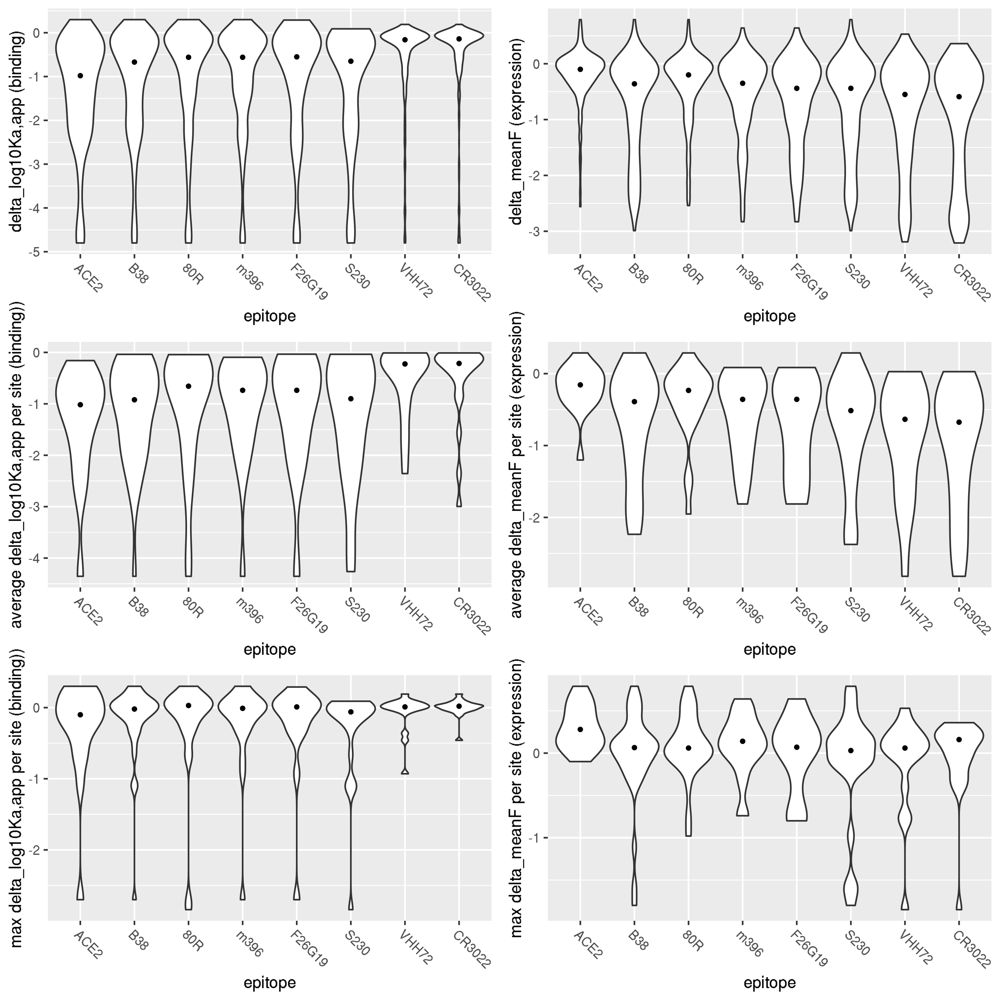
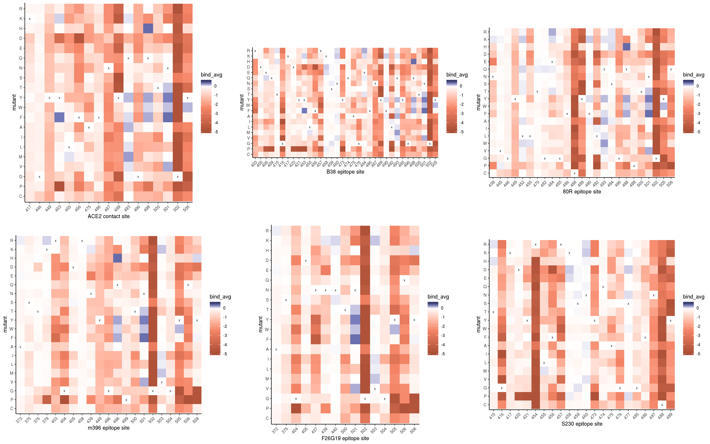
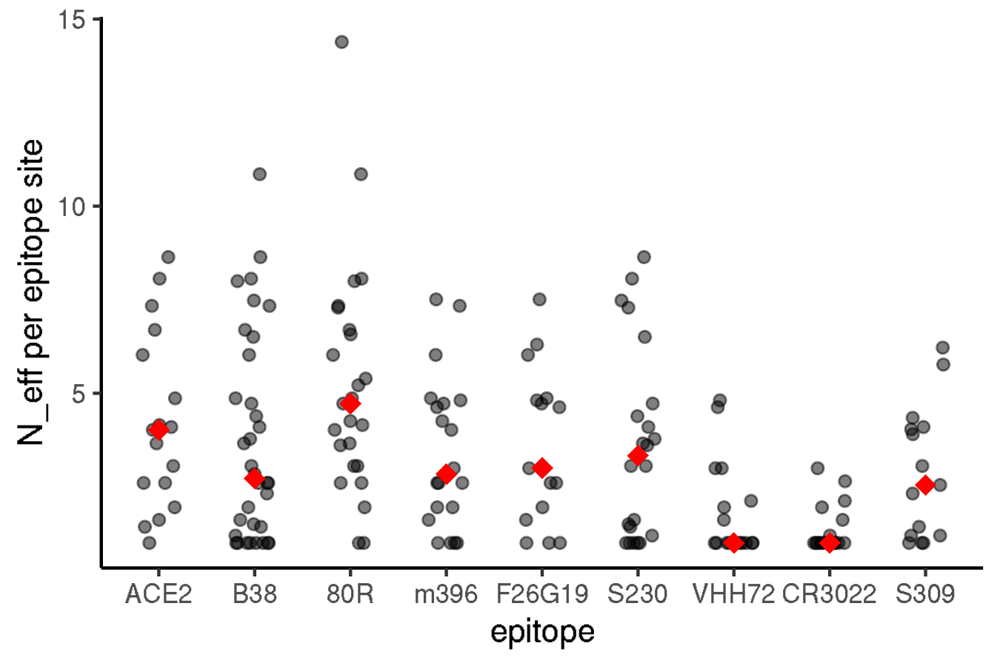

Mutational tolerance in antibody epitopes
================
Tyler Starr
5/12/2020

This notebook analyzes the mutational tolerance of residues within
eptiopes of different monoclonal antibodies

``` r
require("knitr")
knitr::opts_chunk$set(echo = T)
knitr::opts_chunk$set(dev.args = list(png = list(type = "cairo")))

#list of packages to install/load
packages = c("yaml","data.table","tidyverse","gridExtra","bio3d")
#install any packages not already installed
installed_packages <- packages %in% rownames(installed.packages())
if(any(installed_packages == F)){
  install.packages(packages[!installed_packages])
}
#load packages
invisible(lapply(packages, library, character.only=T))

#read in config file
config <- read_yaml("config.yaml")

#read in file giving concordance between RBD numbering and SARS-CoV-2 Spike numbering
RBD_sites <- data.table(read.csv(file="data/RBD_sites.csv",stringsAsFactors=F))

#make output directory
if(!file.exists(config$antibody_epitopes_dir)){
  dir.create(file.path(config$antibody_epitopes_dir))
}
```

Session info for reproducing environment:

``` r
sessionInfo()
```

    ## R version 3.6.1 (2019-07-05)
    ## Platform: x86_64-pc-linux-gnu (64-bit)
    ## Running under: Ubuntu 14.04.5 LTS
    ## 
    ## Matrix products: default
    ## BLAS/LAPACK: /app/easybuild/software/OpenBLAS/0.2.18-GCC-5.4.0-2.26-LAPACK-3.6.1/lib/libopenblas_prescottp-r0.2.18.so
    ## 
    ## locale:
    ##  [1] LC_CTYPE=en_US.UTF-8       LC_NUMERIC=C              
    ##  [3] LC_TIME=en_US.UTF-8        LC_COLLATE=en_US.UTF-8    
    ##  [5] LC_MONETARY=en_US.UTF-8    LC_MESSAGES=en_US.UTF-8   
    ##  [7] LC_PAPER=en_US.UTF-8       LC_NAME=C                 
    ##  [9] LC_ADDRESS=C               LC_TELEPHONE=C            
    ## [11] LC_MEASUREMENT=en_US.UTF-8 LC_IDENTIFICATION=C       
    ## 
    ## attached base packages:
    ## [1] stats     graphics  grDevices utils     datasets  methods   base     
    ## 
    ## other attached packages:
    ##  [1] bio3d_2.3-4       gridExtra_2.3     forcats_0.4.0    
    ##  [4] stringr_1.4.0     dplyr_0.8.3       purrr_0.3.2      
    ##  [7] readr_1.3.1       tidyr_0.8.3       tibble_2.1.3     
    ## [10] ggplot2_3.2.0     tidyverse_1.2.1   data.table_1.12.2
    ## [13] yaml_2.2.0        knitr_1.23       
    ## 
    ## loaded via a namespace (and not attached):
    ##  [1] Rcpp_1.0.1       cellranger_1.1.0 pillar_1.4.2     compiler_3.6.1  
    ##  [5] tools_3.6.1      digest_0.6.20    lubridate_1.7.4  jsonlite_1.6    
    ##  [9] evaluate_0.14    nlme_3.1-140     gtable_0.3.0     lattice_0.20-38 
    ## [13] pkgconfig_2.0.2  rlang_0.4.0      cli_1.1.0        rstudioapi_0.10 
    ## [17] parallel_3.6.1   haven_2.1.1      xfun_0.7         withr_2.1.2     
    ## [21] xml2_1.2.0       httr_1.4.0       hms_0.4.2        generics_0.0.2  
    ## [25] grid_3.6.1       tidyselect_0.2.5 glue_1.3.1       R6_2.4.0        
    ## [29] readxl_1.3.1     rmarkdown_1.13   modelr_0.1.4     magrittr_1.5    
    ## [33] backports_1.1.4  scales_1.0.0     htmltools_0.3.6  rvest_0.3.4     
    ## [37] assertthat_0.2.1 colorspace_1.4-1 stringi_1.4.3    lazyeval_0.2.2  
    ## [41] munsell_0.5.0    broom_0.5.2      crayon_1.3.4

## Setup

Read in tables of variant effects on binding and expression for single
mutations to the SARS-CoV-2 RBD and for homolog RBDs.

``` r
homologs <- data.table(read.csv(file=config$homolog_effects_file,stringsAsFactors = F))
mutants <- data.table(read.csv(file=config$single_mut_effects_file,stringsAsFactors = F))

#rename mutants site indices to prevent shared names with RBD_sites, simplifying some downstream calculations that cross-index these tables
setnames(mutants, "site_RBD", "RBD_site");setnames(mutants, "site_SARS2", "SARS2_site")

#add mean, max, min mut effects per site annotations
RBD_sites[,mean_bind := mean(mutants[SARS2_site==site_SARS2 & wildtype != mutant & mutant != "*",bind_avg],na.rm=T),by=site_SARS2]
RBD_sites[,max_bind := max(mutants[SARS2_site==site_SARS2 & wildtype != mutant & mutant != "*",bind_avg],na.rm=T),by=site_SARS2]
RBD_sites[,min_bind := min(mutants[SARS2_site==site_SARS2 & wildtype != mutant & mutant != "*",bind_avg],na.rm=T),by=site_SARS2]

RBD_sites[,mean_expr := mean(mutants[SARS2_site==site_SARS2 & wildtype != mutant & mutant != "*",expr_avg],na.rm=T),by=site_SARS2]
RBD_sites[,max_expr := max(mutants[SARS2_site==site_SARS2 & wildtype != mutant & mutant != "*",expr_avg],na.rm=T),by=site_SARS2]
RBD_sites[,min_expr := min(mutants[SARS2_site==site_SARS2 & wildtype != mutant & mutant != "*",expr_avg],na.rm=T),by=site_SARS2]
```

## Compare mutational tolerance of antibody epitopes

We have mapped antibody epitope residues for seven mAbs with published
structures – six of the seven mAbs were raised against SARS-CoV-1, but
at least two of them cross-react with SARS-CoV-2 (CR3022, VHH72), and
more generally, they highlight the types of epitopes that SARS-related
CoV RBDs can induce. The seventh, B38, was isolated from a SARS-CoV-2
convalescent patient. I expect many more SARS-CoV-2 raised mAbs will be
upcoming, and we can add them in as needed, including preprint
structures (e.g. S309) whose structures are not yet publically
available.

Let’s compare patterns of mutational sensitiivity within each of the mAb
epitopes, and ocmpare to ACE2 contact residues for reference. (We may
also need to account for epitopes like CR3022 and VHH72, where the
epitope is partially overlapping with residues that make
intra/inter-protomer contacts within full Spike. Perhaps analysis of
natrual sequence variation can help here?) Below, we output violin plots
for individual mutational effects at sites within each epitope (top
row), and for the average mutational effect per site for sites within
each epitope (bottom row).

    ## Warning: Removed 4 rows containing non-finite values (stat_ydensity).

    ## Warning: Removed 4 rows containing non-finite values (stat_summary).



We can see for the first 5 antibodies, all of which bind epitopes mostly
or fully within the RBM, that epitope sites exhibit mutational
constraint with regards to binding (though not as much constraint as on
the ACE2-contact residues themselves). There is *perhaps* some visual
variation among antibody epitopes in the severity of the average
mutational effect to epitope contact positions. (However, statistically,
there is not variation in the median effect of mutatioins on binding in
these five epitopes, Kruskal-Wallis ANOVA P-value 0.28). The average
mutation in these RBM motif epitope sites incurs a \~0.5-0.6 reduction
in log<sub>10</sub>(*K*<sub>A,app</sub>) ACE2-binding affinity, which is
likely meaningful (more extreme than SARS-CoV-1 reduction in affinity
(0.25 log10Ka uniits), on par with LYRa11 (0.5 log10Ka units) which can
still promote huACE2-mediated cellular entry, but with reduced
quantitative in vitro infectivity according to Letko et al. 2020).
Furthermore, sites in B38 and S230 epitopes might exhibit slightly
higher mutational constraint than those in the other RBM-directed mAbs,
though these differences may be minor – and more broadly, of course, we
don’t know which positions are part of the “functional epitope” and
therefore which mutations in the epitope would actually confer Ab
escape. S230 and B38 bind overlapping but distinct sets of RBM residues,
illustrated on `dms-view` [here for
S230](https://dms-view.github.io/?pdb-url=https%3A%2F%2Fraw.githubusercontent.com%2Fdms-view%2FSARS-CoV-2%2Fmaster%2Fdata%2FSpike%2FBloomLab2020%2F6m0j.pdb&markdown-url=https%3A%2F%2Fraw.githubusercontent.com%2Fdms-view%2FSARS-CoV-2%2Fmaster%2Fdata%2FSpike%2FBloomLab2020%2FBloomLab_rbd.md&data-url=https%3A%2F%2Fraw.githubusercontent.com%2Fdms-view%2FSARS-CoV-2%2Fmaster%2Fdata%2FSpike%2FBloomLab2020%2Fresults%2FBloomLab2020_rbd.csv&condition=natural+frequencies&site_metric=site_entropy&mutation_metric=mut_frequency&selected_sites=415%2C416%2C417%2C420%2C421%2C454%2C455%2C456%2C457%2C458%2C459%2C460%2C473%2C474%2C475%2C476%2C477%2C485%2C486%2C487%2C488%2C489)
and [here for
B38](https://dms-view.github.io/?pdb-url=https%3A%2F%2Fraw.githubusercontent.com%2Fdms-view%2FSARS-CoV-2%2Fmaster%2Fdata%2FSpike%2FBloomLab2020%2F6m0j.pdb&markdown-url=https%3A%2F%2Fraw.githubusercontent.com%2Fdms-view%2FSARS-CoV-2%2Fmaster%2Fdata%2FSpike%2FBloomLab2020%2FBloomLab_rbd.md&data-url=https%3A%2F%2Fraw.githubusercontent.com%2Fdms-view%2FSARS-CoV-2%2Fmaster%2Fdata%2FSpike%2FBloomLab2020%2Fresults%2FBloomLab2020_rbd.csv&condition=natural+frequencies&site_metric=site_entropy&mutation_metric=mut_frequency&selected_sites=403%2C405%2C406%2C409%2C415%2C416%2C417%2C420%2C421%2C453%2C455%2C456%2C457%2C458%2C459%2C460%2C473%2C474%2C475%2C476%2C484%2C486%2C487%2C489%2C490%2C492%2C493%2C495%2C496%2C498%2C500%2C501%2C502%2C505).
Both bind the “inner surface” of the RBM lobe containig the
disulfide-stabilized loop, but B38 contains more extensive sets of
contacts through the medial and other lateral edge of the RBM saddle,
while S230 only contacts this lobe. (Should re-check the S230 paper,
S230 I believe binds “RBD down” and may make contacts to other Spike
subunits). Taken together, it seems that RBM-directed antibodies do
target epitopes that are mutationally constrained, though mutations that
have no or positive effects on ACE2-binding affinity are certainly
present, and further study is needed\! Also suggests more constraint is
possible by honing in a more focused response on the key ACE2 contact
residues, which are more constrained than the average epitope position.

The last two antibodies, VHH72 and CR3022, bind epitopes fully or mostly
within the “core” RBD, meaning mutational effects on ACE2 binding are
relatively minor – however, these epitopes do exhibit constraint in
terms of mutational effects on RBD expression/stability, with average
mutational defects of \~0.5 log-MFI units, which is substantial relative
to the tight range of expression seen among the panel of RBD homologs.

For a more high-resolution look, we can visualize heatmaps of the sites
that constitute each antibody’s epitope. (Not sure there’s much
interesting here, haven’t looked in detail but keeping it here for now
anyway.)



To put constraint on epitopes in context, let’s look at the fraction of
mutations within each epitope that are compatible with two levels of
affinity – that of SARS-CoV-1, the lowest known affinity capable of
mediating human infectivity, and LYRa11, which can promote
huACE2-mediated cellular infection in cell culture, though at reduced
infectivity compared to e.g. SARS-CoV-1 RBD.

``` r
epitopes_table <- data.frame(epitope=unique(mutants_epitope$epitope))
for(i in 1:nrow(epitopes_table)){
  epitopes_table$median_bind[i] <- median(mutants_epitope[epitope==epitopes_table$epitope[i] & mutant!=wildtype & mutant!="*",bind_avg],na.rm=T)
  epitopes_table$median_expr[i] <- median(mutants_epitope[epitope==epitopes_table$epitope[i] & mutant!=wildtype & mutant!="*",expr_avg],na.rm=T)
  epitopes_table$frac_SARS_CoV_1[i] <- nrow(mutants_epitope[epitope==epitopes_table$epitope[i] & mutant!=wildtype & mutant!="*" & bind_avg > homologs[homolog=="SARS-CoV-1",bind_avg],])/nrow(mutants_epitope[epitope==epitopes_table$epitope[i] & mutant!=wildtype & mutant!="*",])
  epitopes_table$frac_LYRa11[i] <- nrow(mutants_epitope[epitope==epitopes_table$epitope[i] & mutant!=wildtype & mutant!="*" & bind_avg > homologs[homolog=="LYRa11",bind_avg],])/nrow(mutants_epitope[epitope==epitopes_table$epitope[i] & mutant!=wildtype & mutant!="*",])
}

kable(epitopes_table, digits=2, col.names=c("epitope","median delta_log<sub>10</sub>(*K*<sub>A,app</sub>)","median delta_log-fluorescence","fraction > SARS-CoV-1 affinity","fraction > LYRa11 affinity"))
```

| epitope | median delta\_log<sub>10</sub>(*K*<sub>A,app</sub>) | median delta\_log-fluorescence | fraction \> SARS-CoV-1 affinity | fraction \> LYRa11 affinity |
| :------ | --------------------------------------------------: | -----------------------------: | ------------------------------: | --------------------------: |
| ACE2    |                                              \-0.98 |                         \-0.10 |                            0.21 |                        0.34 |
| B38     |                                              \-0.67 |                         \-0.36 |                            0.31 |                        0.42 |
| 80R     |                                              \-0.56 |                         \-0.20 |                            0.37 |                        0.48 |
| m396    |                                              \-0.56 |                         \-0.35 |                            0.35 |                        0.48 |
| F26G19  |                                              \-0.55 |                         \-0.44 |                            0.35 |                        0.49 |
| S230    |                                              \-0.65 |                         \-0.44 |                            0.33 |                        0.44 |
| VHH72   |                                              \-0.16 |                         \-0.55 |                            0.61 |                        0.72 |
| CR3022  |                                              \-0.14 |                         \-0.59 |                            0.63 |                        0.73 |

## Comparison to natural sequence diversity

Let’s compare our mutational constraint on antibody epitopes to natural
diversity in different antibody epitopes from an alignment of
sarbecovirus RBDs. First, we read in an alignment of RBD amino acid
sequences from across the sarbecovirus clade (noting that many of these
sequences are so-called “Clade 2” sequences, which have not been shown
to bind human or any other ACE2 – so whether they evolve under
constraint for ACE2-binding, at this point, is unclear\! Bat ACE2 is
also under elevated positive selection, so these Clade 2 sequences could
be adapted to “odd” ACE2s within bat hosts, or who knows what…). We then
compute the entropy of each alignment position, and compare the
site-wise entropy of sites in each antibody epitope.

We see that epitopes exhibit the least natural sequence variation for
the core-RBD mAbs, VHH72 and CR3022. Among the RBM-directed mAbs, 80R
seems to bind sites that are more variable across the sarbecovirus
clade.


