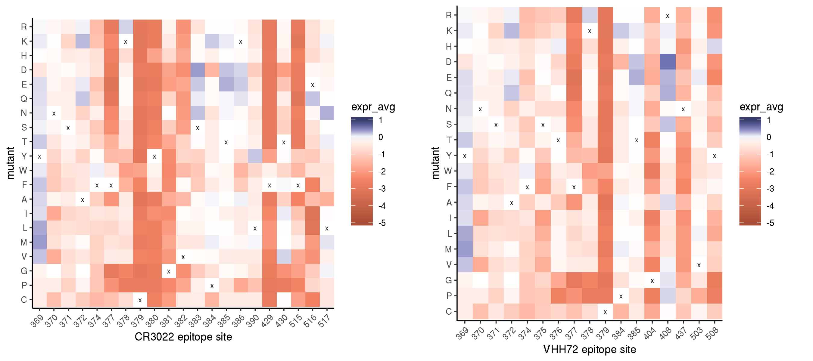

Mutational tolerance in antibody epitopes
================
Tyler Starr
5/12/2020

This notebook analyzes the mutational tolerance of residues within
epitopes of different monoclonal antibodies. I suggest opening the PyMol
session in the repo at `data/structures/surface_constraint_features.pse`
when browsing this notebook, as I think the structures loaded in this
session communicate a lot about the variation in these epitopes and
their structural relationship. (And a few times, I’ll allude to points
where I feel like the plots are capturing what I can *see* in this
structural representation…)

## Setup

``` r
require("knitr")
knitr::opts_chunk$set(echo = T)
knitr::opts_chunk$set(dev.args = list(png = list(type = "cairo")))

#list of packages to install/load
packages = c("yaml","data.table","tidyverse","gridExtra","bio3d")
#install any packages not already installed
installed_packages <- packages %in% rownames(installed.packages())
if(any(installed_packages == F)){
  install.packages(packages[!installed_packages])
}
#load packages
invisible(lapply(packages, library, character.only=T))

#read in config file
config <- read_yaml("config.yaml")

#read in file giving concordance between RBD numbering and SARS-CoV-2 Spike numbering
RBD_sites <- data.table(read.csv(file="data/RBD_sites.csv",stringsAsFactors=F))

#make output directory
if(!file.exists(config$antibody_epitopes_dir)){
  dir.create(file.path(config$antibody_epitopes_dir))
}
```

Session info for reproducing environment:

``` r
sessionInfo()
```

    ## R version 3.6.1 (2019-07-05)
    ## Platform: x86_64-pc-linux-gnu (64-bit)
    ## Running under: Ubuntu 14.04.5 LTS
    ## 
    ## Matrix products: default
    ## BLAS/LAPACK: /app/easybuild/software/OpenBLAS/0.2.18-GCC-5.4.0-2.26-LAPACK-3.6.1/lib/libopenblas_prescottp-r0.2.18.so
    ## 
    ## locale:
    ##  [1] LC_CTYPE=en_US.UTF-8       LC_NUMERIC=C              
    ##  [3] LC_TIME=en_US.UTF-8        LC_COLLATE=en_US.UTF-8    
    ##  [5] LC_MONETARY=en_US.UTF-8    LC_MESSAGES=en_US.UTF-8   
    ##  [7] LC_PAPER=en_US.UTF-8       LC_NAME=C                 
    ##  [9] LC_ADDRESS=C               LC_TELEPHONE=C            
    ## [11] LC_MEASUREMENT=en_US.UTF-8 LC_IDENTIFICATION=C       
    ## 
    ## attached base packages:
    ## [1] stats     graphics  grDevices utils     datasets  methods   base     
    ## 
    ## other attached packages:
    ##  [1] bio3d_2.3-4       gridExtra_2.3     forcats_0.4.0    
    ##  [4] stringr_1.4.0     dplyr_0.8.3       purrr_0.3.2      
    ##  [7] readr_1.3.1       tidyr_0.8.3       tibble_2.1.3     
    ## [10] ggplot2_3.2.0     tidyverse_1.2.1   data.table_1.12.2
    ## [13] yaml_2.2.0        knitr_1.23       
    ## 
    ## loaded via a namespace (and not attached):
    ##  [1] Rcpp_1.0.1       cellranger_1.1.0 pillar_1.4.2     compiler_3.6.1  
    ##  [5] tools_3.6.1      digest_0.6.20    lubridate_1.7.4  jsonlite_1.6    
    ##  [9] evaluate_0.14    nlme_3.1-140     gtable_0.3.0     lattice_0.20-38 
    ## [13] pkgconfig_2.0.2  rlang_0.4.0      cli_1.1.0        rstudioapi_0.10 
    ## [17] parallel_3.6.1   haven_2.1.1      xfun_0.7         withr_2.1.2     
    ## [21] xml2_1.2.0       httr_1.4.0       hms_0.4.2        generics_0.0.2  
    ## [25] grid_3.6.1       tidyselect_0.2.5 glue_1.3.1       R6_2.4.0        
    ## [29] readxl_1.3.1     rmarkdown_1.13   modelr_0.1.4     magrittr_1.5    
    ## [33] backports_1.1.4  scales_1.0.0     htmltools_0.3.6  rvest_0.3.4     
    ## [37] assertthat_0.2.1 colorspace_1.4-1 stringi_1.4.3    lazyeval_0.2.2  
    ## [41] munsell_0.5.0    broom_0.5.2      crayon_1.3.4

Read in tables of variant effects on binding and expression for single
mutations to the SARS-CoV-2 RBD and for homolog RBDs.

``` r
homologs <- data.table(read.csv(file=config$homolog_effects_file,stringsAsFactors = F))
mutants <- data.table(read.csv(file=config$single_mut_effects_file,stringsAsFactors = F))

#rename mutants site indices to prevent shared names with RBD_sites, simplifying some downstream calculations that cross-index these tables
setnames(mutants, "site_RBD", "RBD_site");setnames(mutants, "site_SARS2", "SARS2_site")

#add mean, max, min mut effects per site annotations
RBD_sites[,mean_bind := mean(mutants[SARS2_site==site_SARS2 & wildtype != mutant & mutant != "*",bind_avg],na.rm=T),by=site_SARS2]
RBD_sites[,max_bind := max(mutants[SARS2_site==site_SARS2 & wildtype != mutant & mutant != "*",bind_avg],na.rm=T),by=site_SARS2]
RBD_sites[,min_bind := min(mutants[SARS2_site==site_SARS2 & wildtype != mutant & mutant != "*",bind_avg],na.rm=T),by=site_SARS2]

RBD_sites[,mean_expr := mean(mutants[SARS2_site==site_SARS2 & wildtype != mutant & mutant != "*",expr_avg],na.rm=T),by=site_SARS2]
RBD_sites[,max_expr := max(mutants[SARS2_site==site_SARS2 & wildtype != mutant & mutant != "*",expr_avg],na.rm=T),by=site_SARS2]
RBD_sites[,min_expr := min(mutants[SARS2_site==site_SARS2 & wildtype != mutant & mutant != "*",expr_avg],na.rm=T),by=site_SARS2]
```

## Compare mutational tolerance within antibody epitopes

We have annotated antibody epitope residues for seven mAbs with
published structures – six of the seven mAbs were raised against
SARS-CoV-1, but at least two of them cross-react with SARS-CoV-2
(CR3022, VHH72), and more generally, they highlight the types of
epitopes that SARS-related CoV RBDs can induce. The seventh, B38, was
isolated from a SARS-CoV-2 convalescent patient. Of course, many more
SARS-CoV-2 raised mAbs will be upcoming, and we can add them in as
needed, including mAbs (e.g. S309) whose structures are not yet publicly
available.

Let’s compare patterns of mutational sensitivity within each of the mAb
epitopes, and compare to ACE2 contact residues for reference. Below, we
output violin plots for individual mutational effects at sites within
each epitope (top row), the average mutational effect per site for
residues within each epitope (middle row), and the maximum mutational
effect of any of the possible mutations per site for residues within
each epitope (bottom row). The mean and max per-site give more global
views of mutational constraint.


We can see for the first 5 antibodies, all of which bind epitopes mostly
or fully within the RBM, that epitope sites exhibit mutational
constraint with regards to binding (though not as much constraint as on
the ACE2-contact residues themselves). There is *perhaps* some visual
variation among antibody epitopes in the severity of the average
mutational effect to epitope contact positions. (However, statistically,
there is not variation in the median effect of mutations on binding in
these five epitopes, Kruskal-Wallis ANOVA P-value 0.28). The average
mutation in these RBM motif epitope sites incurs a \~0.5-0.6 reduction
in log<sub>10</sub>(*K*<sub>A,app</sub>) ACE2-binding affinity, which is
likely meaningful (more extreme than SARS-CoV-1 reduction in affinity
(0.25 log10Ka uniits), on par with LYRa11 (0.5 log10Ka units) which can
still promote huACE2-mediated cellular entry, but with reduced
quantitative in vitro infectivity according to Letko et al. 2020).

As we can see in the structural alignment of mAbs bound to the RBD ini
the PyMol session file I point to at the beginning of this notebook,
these mAbs all clue into a couple “patches” of constrained residues in
the RBM. 80R and B38 both bind to two patches at the direct ACE2 contact
interface that are mutationally constrained, centered around residues
\~Y489 and \~Y505. (These two mAbs also seem to have the most contact
residues, suggesting they achieve the most “engagement” compared to
other mAbs, apparently without sacrificing by engaging lots of
mutationally tolerant sites.) S230 engages just the \~Y489 patch. F26G19
and m396, on the other hand, focus on this \~Y505 lobe, and continue to
follow two channels of mutational constraint down the “side” of the RBD,
toward \~N437 and \~G404, respectively. These two “modes” of RBM
recognition do seem to occupy the major patches of mutational constraint
in this region, suggesting refining the approaches of these two types of
RBM-directed mAbs might be fruitful.

The other two antibodies, VHH72 and CR3022, bind epiitopes within the
“core RBD”, meaning mutational constraint on expression might be more
relevant – and we do see that mutations in these epitopes suffer
expression defects, with an average mutation defect of \~0.5 log-MFI
uniits, which is substantial relative to the tight range of expression
seen among our panel of RBD homologs. We can see that much of the core
RBD surface is constrained with respect to mutational effects on
expression, along a lateral “belt” around the middle of the core RBD,
though many of the more mutationally sensitive positions are buried in
little ‘crevices’ on the RBD surface, compared to the more mutationally
tolerant knobs that jut out. CR3022 does hone in one of these more
obvious expression-constrained ‘patches’, centered around residue
\~Y380. VHH72 binds to a seemingly less “red” patch just to the side of
CR3022, centered around \~S375. Though we don’t have the structure yet,
S309 will be binding to another pretty striking “patch” of mutational
sensitivity in the core RBD, in the channel around N343 and its attached
glycan. Our structural analysis points to another super obvious patch of
mutational constraint, for which we have *not* seen any mAbs described
(though perhaps we should look?), centered around E465 on the opposite
side of the RBD from the VHH72 epitope. This region contacts the
NTD/S<sup>A</sup> domain in the closed full Spike quaternary context but
is exposed in the RBD-up conformation. Could be intersting to look more
into\!

For a more high-resolution look at the effects of particular mutations
within each antibody epitope, we can visualize heatmaps of the sites
that constitute each antibody’s epitope. (Not sure there’s much
interesting here, haven’t looked in detail but keeping it here for now
anyway.) We visualize mutational effects on *binding* for the
RBM-directed mAbs, and *expression* for the core RBD mAbs.




To put constraint on epitopes in context, let’s look at the fraction of
mutations within each epitope that are compatible with two levels of
affinity – that of SARS-CoV-1, the lowest known affinity capable of
mediating human infectivity, and LYRa11, which can promote
huACE2-mediated cellular infection in cell culture, though at reduced
infectivity compared to e.g. SARS-CoV-1 RBD. Finally, we output the
fraction of mutations within each epitope that have an expression effect
of \>0.2, a somewhat arbitrary value (the range of expression phenotypes
was \~0.18, but all higher than our SARS-CoV-2 wildtype).

| epitope | median delta\_log<sub>10</sub>(*K*<sub>A,app</sub>) | median delta\_log-fluorescence | fraction muts \> SARS-CoV-1 affinity | fraction muts \> LYRa11 affinity | fraction muts \> -0.2 expression effect |
| :------ | --------------------------------------------------: | -----------------------------: | -----------------------------------: | -------------------------------: | --------------------------------------: |
| ACE2    |                                              \-0.98 |                         \-0.10 |                                 0.21 |                             0.34 |                                    0.62 |
| B38     |                                              \-0.67 |                         \-0.36 |                                 0.31 |                             0.42 |                                    0.38 |
| 80R     |                                              \-0.56 |                         \-0.20 |                                 0.37 |                             0.48 |                                    0.49 |
| m396    |                                              \-0.56 |                         \-0.35 |                                 0.35 |                             0.48 |                                    0.39 |
| F26G19  |                                              \-0.55 |                         \-0.44 |                                 0.35 |                             0.49 |                                    0.33 |
| S230    |                                              \-0.65 |                         \-0.44 |                                 0.33 |                             0.44 |                                    0.33 |
| VHH72   |                                              \-0.16 |                         \-0.55 |                                 0.61 |                             0.72 |                                    0.28 |
| CR3022  |                                              \-0.14 |                         \-0.59 |                                 0.63 |                             0.73 |                                    0.26 |

## Comparison to natural sequence diversity

Let’s compare our mutational constraint on antibody epitopes to natural
diversity in different antibody epitopes from an alignment of
sarbecovirus RBDs. We read in an alignment of RBD amino acid sequences
from across the sarbecovirus clade (noting that many of these sequences
are so-called “Clade 2” sequences, which have not been shown to bind
human or any other ACE2 – so whether they evolve under constraint for
ACE2-binding, at this point, is unclear. Bat ACE2 is also under elevated
positive selection, so these Clade 2 sequences could be adapted to “odd”
ACE2s within bat hosts, or who knows what…). We then compute the entropy
of each alignment position, and compare the site-wise entropy/number of
effective amino acids (N<sub>eff</sub>) of sites in each antibody
epitope.

We see that epitopes exhibit the least natural sequence variation for
the core-RBD mAbs, VHH72 and CR3022. Among the RBM-directed mAbs, 80R
seems to bind sites that are more variable across the sarbecovirus
clade.


