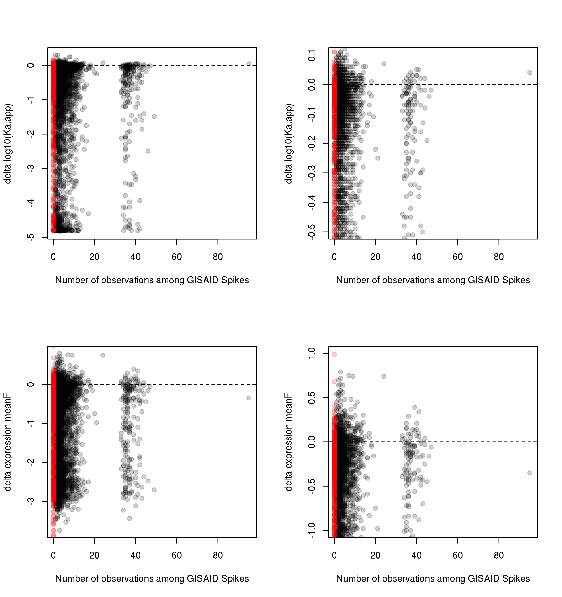
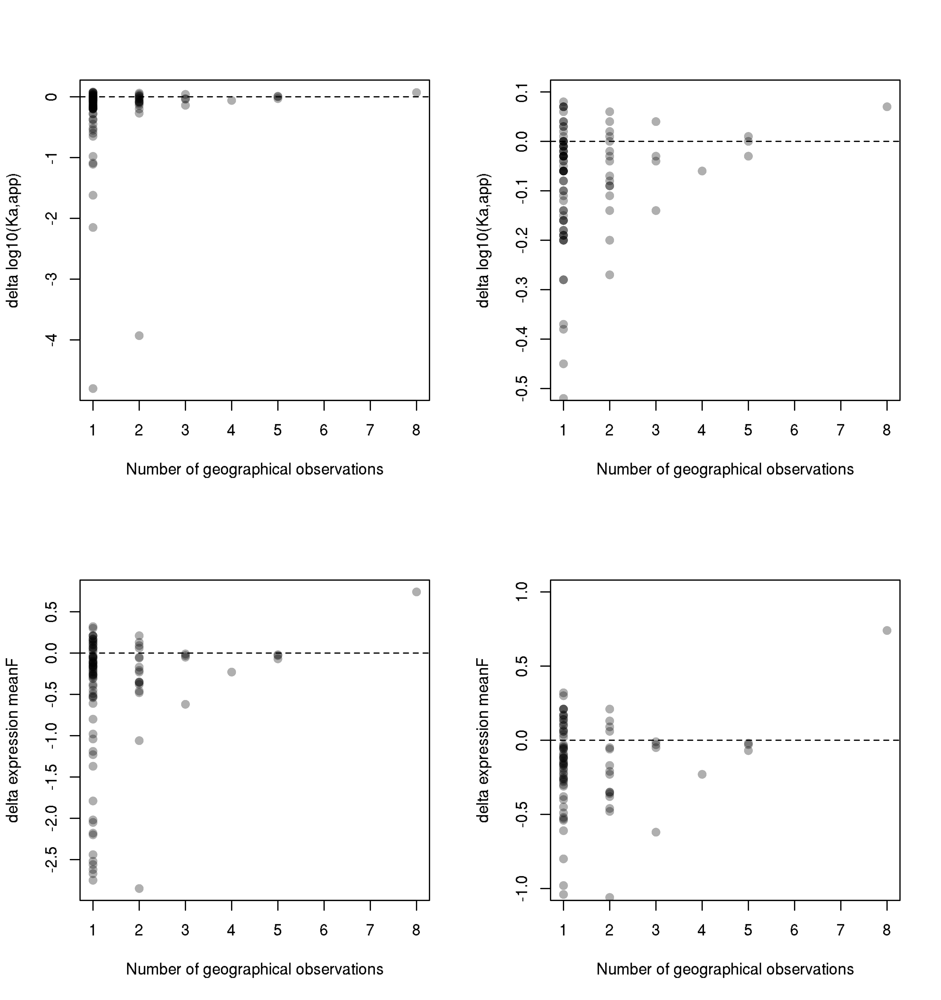
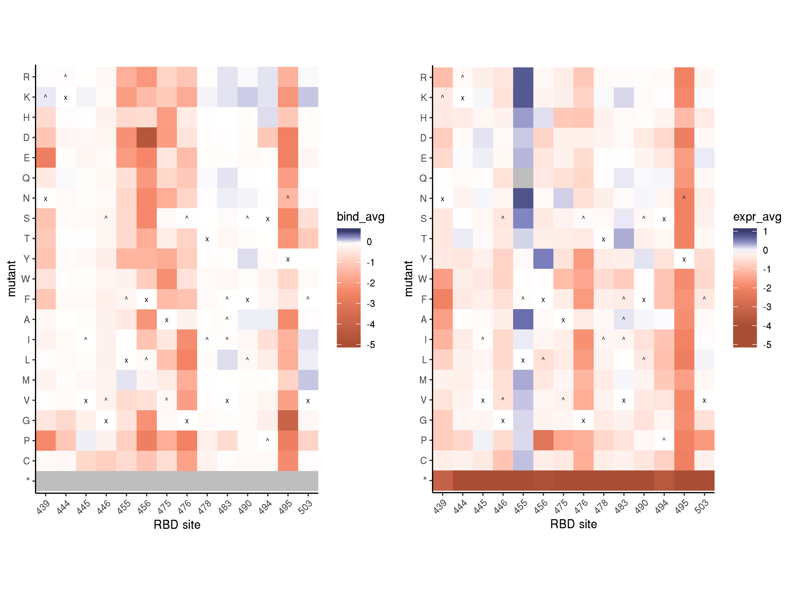
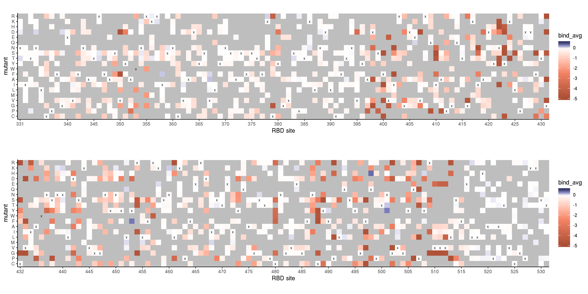
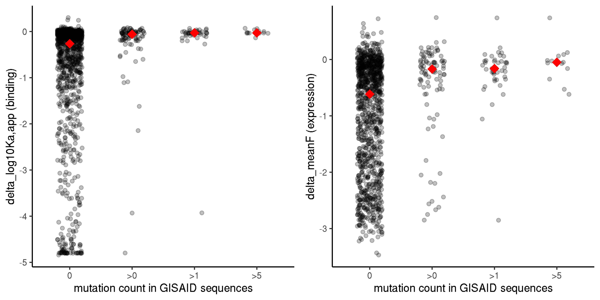
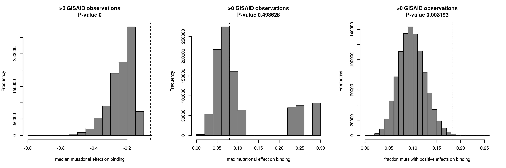
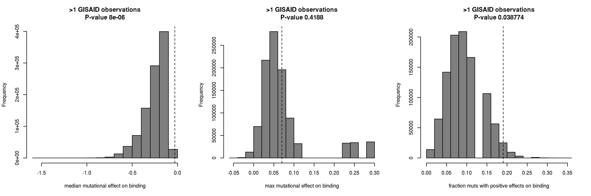
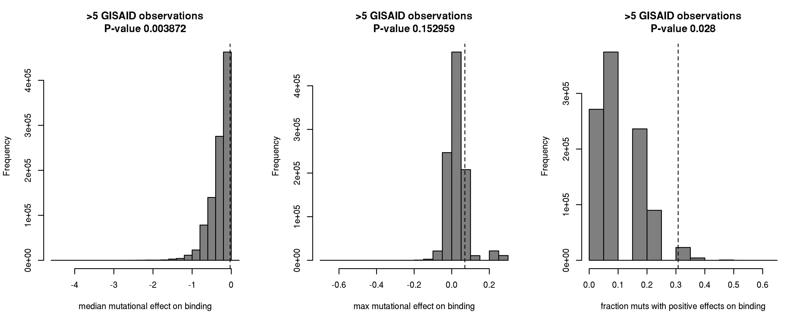

Circulating SARS-CoV-2 RBD variants
================
Tyler Starr
5/12/2020

This notebook analyzes RBD variants that have been sampled in isolates
within the current SARS-CoV-2 pandemic.

## Setup

``` r
require("knitr")
knitr::opts_chunk$set(echo = T)
knitr::opts_chunk$set(dev.args = list(png = list(type = "cairo")))

#list of packages to install/load
packages = c("yaml","data.table","tidyverse","gridExtra","bio3d","seqinr")
#install any packages not already installed
installed_packages <- packages %in% rownames(installed.packages())
if(any(installed_packages == F)){
  install.packages(packages[!installed_packages])
}
#load packages
invisible(lapply(packages, library, character.only=T))

#read in config file
config <- read_yaml("config.yaml")

#read in file giving concordance between RBD numbering and SARS-CoV-2 Spike numbering
RBD_sites <- data.table(read.csv(file="data/RBD_sites.csv",stringsAsFactors=F))

#make output directory
if(!file.exists(config$circulating_variants_dir)){
  dir.create(file.path(config$circulating_variants_dir))
}
```

Session info for reproducing environment:

``` r
sessionInfo()
```

    ## R version 3.6.1 (2019-07-05)
    ## Platform: x86_64-pc-linux-gnu (64-bit)
    ## Running under: Ubuntu 14.04.6 LTS
    ## 
    ## Matrix products: default
    ## BLAS/LAPACK: /app/easybuild/software/OpenBLAS/0.2.18-GCC-5.4.0-2.26-LAPACK-3.6.1/lib/libopenblas_prescottp-r0.2.18.so
    ## 
    ## locale:
    ##  [1] LC_CTYPE=en_US.UTF-8       LC_NUMERIC=C              
    ##  [3] LC_TIME=en_US.UTF-8        LC_COLLATE=en_US.UTF-8    
    ##  [5] LC_MONETARY=en_US.UTF-8    LC_MESSAGES=en_US.UTF-8   
    ##  [7] LC_PAPER=en_US.UTF-8       LC_NAME=C                 
    ##  [9] LC_ADDRESS=C               LC_TELEPHONE=C            
    ## [11] LC_MEASUREMENT=en_US.UTF-8 LC_IDENTIFICATION=C       
    ## 
    ## attached base packages:
    ## [1] stats     graphics  grDevices utils     datasets  methods   base     
    ## 
    ## other attached packages:
    ##  [1] seqinr_3.4-5      bio3d_2.3-4       gridExtra_2.3    
    ##  [4] forcats_0.4.0     stringr_1.4.0     dplyr_0.8.3      
    ##  [7] purrr_0.3.2       readr_1.3.1       tidyr_0.8.3      
    ## [10] tibble_2.1.3      ggplot2_3.2.0     tidyverse_1.2.1  
    ## [13] data.table_1.12.2 yaml_2.2.0        knitr_1.23       
    ## 
    ## loaded via a namespace (and not attached):
    ##  [1] tidyselect_0.2.5 xfun_0.7         haven_2.1.1      lattice_0.20-38 
    ##  [5] colorspace_1.4-1 generics_0.0.2   htmltools_0.3.6  rlang_0.4.0     
    ##  [9] pillar_1.4.2     glue_1.3.1       withr_2.1.2      modelr_0.1.4    
    ## [13] readxl_1.3.1     munsell_0.5.0    gtable_0.3.0     cellranger_1.1.0
    ## [17] rvest_0.3.4      evaluate_0.14    parallel_3.6.1   broom_0.5.2     
    ## [21] Rcpp_1.0.1       scales_1.0.0     backports_1.1.4  jsonlite_1.6    
    ## [25] hms_0.4.2        digest_0.6.20    stringi_1.4.3    grid_3.6.1      
    ## [29] ade4_1.7-13      cli_1.1.0        tools_3.6.1      magrittr_1.5    
    ## [33] lazyeval_0.2.2   crayon_1.3.4     pkgconfig_2.0.2  MASS_7.3-51.4   
    ## [37] xml2_1.2.0       lubridate_1.7.4  assertthat_0.2.1 rmarkdown_1.13  
    ## [41] httr_1.4.0       rstudioapi_0.10  R6_2.4.0         nlme_3.1-140    
    ## [45] compiler_3.6.1

Read in tables of variant effects on binding and expression for single
mutations to the SARS-CoV-2 RBD.

``` r
mutants <- data.table(read.csv(file=config$single_mut_effects_file,stringsAsFactors = F))

#rename mutants site indices to prevent shared names with RBD_sites, simplifying some downstream calculations that cross-index these tables
setnames(mutants, "site_RBD", "RBD_site");setnames(mutants, "site_SARS2", "SARS2_site")
```

## Analyzing amino acid diversity in GISAID Spike sequences

We constructed an alignment of all Spike sequences available on GISAID
as of 27 May, 2020. On the EpiCoV page, under downloads, one of the
pre-made options is a fasta of all Spike sequences isolated thus far,
which is updated each day. I have downloaded this file, unzipped,
replaced spaces in fasta headers with underscores, and aligned
sequences. We load in this alignment using the `read.fasta` function of
the `bio3d` package, and trim the alignment to RBD residues. We remove
sequecnes from non-human isolates (e.g. bat, pangolin, “environment”,
mink, cat, TIGER) and sequences with gap `-` characters, and then
iterate through the alignment and save any observed mutations. We then
filter mutations based on rationale below, and add counts of filtered
observations for each mutation as an ‘nobs’ colum in our overall mutants
data table.

We filter out any mutations that were *only* observed on sequences with
large numbers of missing `X` characters – from my initial pass, I saw
some singleton amino acid variants which would require \>1 nt change,
and these were only found in a single sequence with many X amino acid
characters (the first half of the sequence was well determined, but the
second half was all X’s, with the annotated “differences” being within
short stretches between Xs with determiined amino acids), which made me
realize I needed to be careful not only of sequences rich in gap “-”
characters, but also ambiguous “X” characters. However, I didn’t want to
remove all sequences with undetermined characters off the bat, because
another pattern I saw is that for isolates bearing the N439K mutation,
\>10 are well determined across the entire RBD, but \~80 have many X
characters (in part of the RBD that is *not* near the N439K sequence
call). So, my preference would be to believe a mutation observed in an
X-rich sequence *if the variant in the sequence is observed in at least
one variant that does not contain an X*, but not believe mutations that
are *only* observed in X-rich sequences. (I noticed this issue with
N439K, but this is not the only mutation like this which is observed on
0X sequences at least once but other times on sequences with X
characters.) That is the filtering I therefore do below. This is
basically the limits of my genomic dataset sleuthing. Is there anything
else we should be doing to assess validity of observed mutants,
particularly e.g. could N439K simply be a biased sequencing error that
emerges in these Scotland sequencing samples? Would love ideas or help
in better filtering amino acid variants to retain.

``` r
alignment <- bio3d::read.fasta(file="data/alignments/Spike_GISAID/spike_GISAID_aligned.fasta", rm.dup=T)
```

    ## [1] " ** Duplicated sequence id's: Spike|hCoV-19/USA/MI-MDHHS-SC20330/2020|2020-03-19|EPI_ISL_450609|Original|hCoV-19^^Michigan|Human|Michigan_Department_of_Health_and_Human_Services|Michigan_Department_of_Health_and_Human_Services|Blankenship|USA **"

``` r
#remove non-human samples
keep <- grep("Human",alignment$id);  alignment$ali <- alignment$ali[keep,]; alignment$id <- alignment$id[keep]

#remove columns that are gaps in first reference sequence
alignment$ali <- alignment$ali[,alignment$ali[1,]!="-"]

alignment_RBD <- alignment; alignment_RBD$ali <- alignment$ali[,RBD_sites$site_SARS2]

#check that the first sequence entry matches our reference RBD sequence
stopifnot(sum(!(alignment_RBD$ali[1,] == RBD_sites[,amino_acid_SARS2]))==0)

#remove sequences have gaps, as the amino acid calls may be generally unreliable
remove <- c()
for(i in 1:nrow(alignment_RBD$ali)){
  if(sum(alignment_RBD$ali[i,]=="-") > 0){remove <- c(remove,i)}
}

alignment_RBD$ali <- alignment_RBD$ali[-remove,];alignment_RBD$id <- alignment_RBD$id[-remove]

#output all mutation differences from the WT/reference RBD sequence
#I do this by iterating over rows and columns of the alignment matrix which is STUPID but effective
variants_vec <- c()
isolates_vec <- c()
for(j in 1:ncol(alignment_RBD$ali)){
  #print(i)
  for(i in 1:nrow(alignment_RBD$ali)){
    if(alignment_RBD$ali[i,j] != alignment_RBD$ali[1,j] & !(alignment_RBD$ali[i,j] %in% c("X","-"))){
      variants_vec <- c(variants_vec, paste(alignment_RBD$ali[1,j],j,alignment_RBD$ali[i,j],sep=""))
      isolates_vec <- c(isolates_vec, alignment_RBD$id[i])
    }
  }
}

#remove any mutations that are *only* observed in X-rich sequences of dubious quality (keep counts in X-rich sequences if they were observed in at least one higher quality isolate)
#make a data frame that gives each observed mutation, the isolate it was observed in, and the number of X characters in that sequence. Also, parse the header to give the country/geographic division of the sample
variants <- data.frame(isolate=isolates_vec,mutation=variants_vec)
for(i in 1:nrow(variants)){
  variants$number_X[i] <- sum(alignment_RBD$ali[which(alignment_RBD$id == variants[i,"isolate"]),]=="X")
  variants$geography[i] <- strsplit(as.character(variants$isolate[i]),split="/")[[1]][2]
}
#filter the sequence set for mutations observed in at least one X=0 background
variants_filtered <- data.frame(mutation=unique(variants[variants$number_X==0,"mutation"])) #only keep variants observed in at least one sequence with 0 X
for(i in 1:nrow(variants_filtered)){
  variants_filtered$n_obs[i] <- sum(variants$mutation == variants_filtered$mutation[i]) #but keep counts for any sequence with observed filtered muts
  variants_filtered$n_geography[i] <- length(unique(variants[variants$mutation == variants_filtered$mutation[i],"geography"]))
  variants_filtered$list_geography[i] <- list(list(unique(variants[variants$mutation == variants_filtered$mutation[i],"geography"])))
}

#add count to mutants df
mutants[,nobs:=0]
mutants[,ngeo:=0]
mutants[,geo_list:=as.list(NA)]
for(i in 1:nrow(mutants)){
  if(mutants$mutation_RBD[i] %in% variants_filtered$mutation){
    mutants$nobs[i] <- variants_filtered[variants_filtered$mutation==mutants$mutation_RBD[i],"n_obs"]
    mutants$ngeo[i] <- variants_filtered[variants_filtered$mutation==mutants$mutation_RBD[i],"n_geography"]
    mutants$geo_list[i] <- variants_filtered[variants_filtered$mutation==mutants$mutation_RBD[i],"list_geography"]
  }
}
```

We see 478 amino acid polymorphisims within the 31483 sequences uploaded
in GISAID, which represents 98 of our 3819 measured missense mutants. In
the table below, we can see that many of these mutations are observed
only one or a few times, so there may still be unaccounted for
sequencinig artifacts, which we tried to account for at least minimally
with some filtering above.

``` r
kable(table(mutants[mutant!=wildtype & mutant!="*",nobs]),col.names=c("mutation count","frequency"))
```

| mutation count | frequency |
| :------------- | --------: |
| 0              |      3721 |
| 1              |        56 |
| 2              |        16 |
| 3              |         7 |
| 4              |         4 |
| 5              |         2 |
| 7              |         1 |
| 8              |         2 |
| 10             |         3 |
| 12             |         1 |
| 13             |         1 |
| 24             |         1 |
| 30             |         1 |
| 31             |         1 |
| 49             |         1 |
| 131            |         1 |

We plot each mutations experimental phenotype versus the number of times
it is observed in the circulating Spike alignment, for binding (top) and
expression (bottom), with the righthand plots simply zooming in on the
region surrounding zero for better visualization. We can see that some
of the mutations that are observed just one or a couple of times are
highly deleterious, and anything sampled more than a handful of times
exhibits \~neutral or perhaps small positive binding and/or expression
effects.



We also make plots showing mutational effects versus the number of
geographic regions in which a mutation has been observed.



Here are tables giving mutations that were seen \>20 times, and those
seen any number of times with measured binding effects \>0.05. We are
currently slotted to validate the effect of N439K in both yeast display
and pseudovirus/mammalian experimental assays, and V367F, T478I, and
V483A in yeast display. (S477N just came online as being prevalent with
the newest GISAID set of sequences we used, after we had started cloning
for validations.)

| Mutation | expr, lib1 | expr, lib2 | expression effect | bind, lib1 | bind, lib2 | binding effect | number of GISAID sequences | number locations |
| :------- | ---------: | ---------: | ----------------: | ---------: | ---------: | -------------: | -------------------------: | ---------------: |
| V367F    |         NA |       0.74 |              0.74 |       0.02 |       0.13 |           0.07 |                         24 |                8 |
| N439K    |     \-0.33 |     \-0.36 |            \-0.35 |       0.11 |     \-0.02 |           0.04 |                        131 |                2 |
| S477N    |       0.02 |       0.10 |              0.06 |       0.02 |       0.09 |           0.06 |                         31 |                2 |
| T478I    |     \-0.14 |     \-0.18 |            \-0.16 |     \-0.05 |     \-0.02 |         \-0.04 |                         49 |                1 |
| V483A    |       0.01 |       0.17 |              0.09 |       0.00 |     \-0.05 |         \-0.03 |                         30 |                2 |

| Mutation | expr, lib1 | expr, lib2 | expression effect | bind, lib1 | bind, lib2 | binding effect | number of GISAID sequences | number locations |
| :------- | ---------: | ---------: | ----------------: | ---------: | ---------: | -------------: | -------------------------: | ---------------: |
| G339D    |       0.21 |       0.40 |              0.30 |       0.04 |       0.07 |           0.06 |                          1 |                1 |
| V367F    |         NA |       0.74 |              0.74 |       0.02 |       0.13 |           0.07 |                         24 |                8 |
| K378R    |       0.07 |       0.24 |              0.16 |       0.03 |       0.13 |           0.08 |                          1 |                1 |
| E406Q    |       0.06 |       0.02 |              0.04 |       0.08 |       0.06 |           0.07 |                          1 |                1 |
| N440K    |       0.07 |     \-0.31 |            \-0.12 |       0.05 |       0.09 |           0.07 |                          1 |                1 |
| S477N    |       0.02 |       0.10 |              0.06 |       0.02 |       0.09 |           0.06 |                         31 |                2 |
| Y508H    |       0.13 |       0.14 |              0.14 |       0.10 |       0.05 |           0.07 |                          1 |                1 |

Let’s visualize the positions with interesting circulating variants in
our *favorite* exploratory heatmaps\! Below, we output maps first for
positions with circulating variants observed \>20 times (left two maps),
and second for those positions with circulating variants of at least
\>0.05 effect on binding (right two maps). These maps show the
SARS-CoV-2 wildtype state with an “x” indicator, the SARS-CoV-1 state
with an “o”, and “^” marks any amino acid variants observed at least one
time in the GISAID sequences.



## Strength of selection among circulating variants

To characterize the effect of selection, we can compare the distribution
of functional effects of mutations at different n\_obs cutoffs, compared
to the “raw” distribution of functional effects – in this case, we
should look at the DFE of only those amino acid mutations that can be
introduced with single nucleotide mutations given the SARS-CoV-2
reference nt sequence.

First, we add a column to our mutants data frame indicating whether a
mutation is accessible by single nucleotide mutations.

``` r
#define a function that takes a character of three nucleotides (a codon), and outputs all amino acids that can be accessed via single-nt mutation of that codon
get.codon.muts <- function(codon){
  nt <- c("a","c","g","t")
  codon_split <- strsplit(codon,split="")[[1]]
  codon_muts <- vector()
  for(i in nt[nt!=codon_split[1]]){
    codon_muts <- c(codon_muts,translate(c(i,codon_split[2:3])))
  }
  for(i in nt[nt!=codon_split[2]]){
    codon_muts <- c(codon_muts,translate(c(codon_split[1],i,codon_split[3])))
  }
  for(i in nt[nt!=codon_split[3]]){
    codon_muts <- c(codon_muts,translate(c(codon_split[1:2],i)))
  }
  return(codon_muts)
}

mutants[,SARS2_codon:=RBD_sites[site_SARS2==SARS2_site,codon_SARS2],by=mutation]
mutants[,singlemut := mutant %in% get.codon.muts(SARS2_codon),by=mutation]
```

Are any of our observed GISAID mutations \>1nt changes? In the current
alignment, no\!

``` r
kable(mutants[singlemut==F & nobs>0,.(mutation_RBD,mutation,expr_lib1,expr_lib2,expr_avg,bind_lib1,bind_lib2,bind_avg,nobs,SARS2_codon)])
```

| mutation\_RBD | mutation | expr\_lib1 | expr\_lib2 | expr\_avg | bind\_lib1 | bind\_lib2 | bind\_avg | nobs | SARS2\_codon |
| :------------ | :------- | ---------: | ---------: | --------: | ---------: | ---------: | --------: | ---: | :----------- |

Below is a heatmap of binding effects for all mutations accessible in
single nucleotide changes from the SARS-CoV-2 WT reference sequence,
with others grayed out. We can see that several affinity-enhancing
mutations (including at least two that we are currently planning to
validiate), are accessible with single-nt mutations. Therefore,
affinity-enhancing mutations, if selectively beneficial, would be
readily accessible via mutation. However, there are probably some
positions where beneficial mutations are possible, but none are
available from single-nt mutations which we could dig into if
interesting.



As has been seen in other studies, the genetic code is structured in a
conservative way such that neighboring codons exhibit similiar
biochemical properties, which causes single-nt amino acid changes to
have less deleterious effects than multiple-nt-mutant codon changes. We
see this trend in our data as well, further illustrating why we should
compare circulating variants to the single-nt-mutant amino acid effects
as the “raw” distribution of functional effects. (Median mutational
effect of single-nt mutants = -0.22; median mutational effect of all
amino acid muts = -0.34; P-value 2.3^{-4}, Wilcoxon rank-sum test.)

To illustrate how selection acts on circulating variants, let’s compare
the functional effects of observed mutations to those observed zero
times. The violin plots below show the distribution of functional
effects on binding (left) and expression (right), comparing single-nt
amino acid mutations with 0 observed counts in GISAID versus
increasingly stringent GISAID count cutoffs. We can see a bias among
circulating mutants for both binding and expression effects that are
visually by eye higher than expected by random mutation alone. This
suggests that purifying selection is removing deleterious RBD mutations
that affect traits correlated with our measured binding and expression
phenotypes. We may also see evidence that there is not strong positive
selection for enhanced ACE2-binding affinity, as there are single
mutations that can cause larger affinity increases than are actually
seen in the GISAID set. We can evaluate these two conclusions further
below with permutation tests.



Let’s use permutation tests to evaluate whether the shift in median
mutational effects among GISAID sequences of different minimum frequency
cutoffs is significant relative to the overall distribution of
single-mutant effects. We draw samples without replacement from the raw
distribution of mutational effects (single-nt mutants only), drawing the
same number of random mutations as in our GISAID sets. Within each
random sample, we determine the median mutational effect, as well as the
highest mutational effect and the fraction of mutations that have
binding efects \>0. We then compare our actual values to these random
samples to evaluate the biases in mutational effects among mutations
observed in the GISAID sequences.

The plots below show the distribution of a statistic in our 1e6 sampled
sets, and the dashed line shows the actual value in our set of mutants
observed in GISAID sequences some number of time – the first set of
plots for mutations observed 1 or more times in GISAID sequences, the
second set of plots for mutations observed more than 1 time, and the
third set of plots for mutations observed more than 5 times. We evaluate
a P-value for each comparison by determining the fraction of subsampled
replicates with a value equal to or greater than the actual value. We
can see that the median effect of mutations is significantly higher in
the GISAID mutation sets than random samples, indicating that purifying
selection shapes the mutations that are sampled in GISAID. We do not see
strong evidence for positive selection for affinity-enhancing mutations
among circulating variants – a large fraction of randomly sub-sampled
sets of mutations sample at least one mutation with a higher
affinity-enhancing effect than any seen in our actual dataset, and the
fraction of mutations with binding effect \>0, though significantly
lower in sub-samples, is not strongly diverged, and is conflated by the
purifying selection which wiill naturally increase this metric among the
observed set of mutants.

``` r
set.seed(18041)
n_rep <- 1000000
median_0 <- vector(length=n_rep)
max_0 <- vector(length=n_rep)
frac_pos_0 <- vector(length=n_rep)

for(i in 1:n_rep){
  sample <- sample(mutants[singlemut==T & wildtype!=mutant & mutant!="stop" & !is.na(bind_avg),bind_avg],nrow(mutants[nobs>0,]))
  median_0[i] <- median(sample)
  max_0[i] <- max(sample)
  frac_pos_0[i] <- sum(sample>0)/length(sample)
}

par(mfrow=c(1,3))
hist(median_0,xlab="median mutational effect on binding",col="gray50",main=paste(">0 GISAID observations\nP-value",sum(median_0>=median(mutants[nobs>0,bind_avg]))/length(median_0)));abline(v=median(mutants[nobs>0,bind_avg]),lty=2)

hist(max_0,xlab="max mutational effect on binding",col="gray50",main=paste(">0 GISAID observations\nP-value",sum(max_0>=max(mutants[nobs>0,bind_avg]))/length(max_0)));abline(v=max(mutants[nobs>0,bind_avg]),lty=2)

hist(frac_pos_0,xlab="fraction muts with positive effects on binding",col="gray50",main=paste(">0 GISAID observations\nP-value",sum(frac_pos_0>=sum(mutants[nobs>0,bind_avg]>0)/nrow(mutants[nobs>0,]))/length(frac_pos_0)));abline(v=sum(mutants[nobs>0,bind_avg]>0)/nrow(mutants[nobs>0,]),lty=2)
```



``` r
invisible(dev.print(pdf, paste(config$circulating_variants_dir,"/permutation_greater-than-zero-GISAID.pdf",sep="")))
```

``` r
n_rep <- 1000000
median_1 <- vector(length=n_rep)
max_1 <- vector(length=n_rep)
frac_pos_1 <- vector(length=n_rep)

for(i in 1:n_rep){
  sample <- sample(mutants[singlemut==T & wildtype!=mutant & mutant!="stop" & !is.na(bind_avg),bind_avg],nrow(mutants[nobs>1,]))
  median_1[i] <- median(sample)
  max_1[i] <- max(sample)
  frac_pos_1[i] <- sum(sample>0)/length(sample)
}

par(mfrow=c(1,3))
hist(median_1,xlab="median mutational effect on binding",col="gray50",main=paste(">1 GISAID observations\nP-value",sum(median_1>=median(mutants[nobs>1,bind_avg]))/length(median_1)));abline(v=median(mutants[nobs>1,bind_avg]),lty=2)

hist(max_1,xlab="max mutational effect on binding",col="gray50",main=paste(">1 GISAID observations\nP-value",sum(max_1>=max(mutants[nobs>1,bind_avg]))/length(max_1)));abline(v=max(mutants[nobs>1,bind_avg]),lty=2)

hist(frac_pos_1,xlab="fraction muts with positive effects on binding",col="gray50",main=paste(">1 GISAID observations\nP-value",sum(frac_pos_1>=sum(mutants[nobs>1,bind_avg]>0)/nrow(mutants[nobs>1,]))/length(frac_pos_1)));abline(v=sum(mutants[nobs>1,bind_avg]>0)/nrow(mutants[nobs>1,]),lty=2)
```



``` r
invisible(dev.print(pdf, paste(config$circulating_variants_dir,"/permutation_greater-than-one-GISAID.pdf",sep="")))
```

``` r
n_rep <- 1000000
median_5 <- vector(length=n_rep)
max_5 <- vector(length=n_rep)
frac_pos_5 <- vector(length=n_rep)

for(i in 1:n_rep){
  sample <- sample(mutants[singlemut==T & wildtype!=mutant & mutant!="stop" & !is.na(bind_avg),bind_avg],nrow(mutants[nobs>5,]))
  median_5[i] <- median(sample)
  max_5[i] <- max(sample)
  frac_pos_5[i] <- sum(sample>0)/length(sample)
}

par(mfrow=c(1,3))
hist(median_5,xlab="median mutational effect on binding",col="gray50",main=paste(">5 GISAID observations\nP-value",sum(median_5>=median(mutants[nobs>5,bind_avg]))/length(median_5)));abline(v=median(mutants[nobs>5,bind_avg]),lty=2)

hist(max_5,xlab="max mutational effect on binding",col="gray50",main=paste(">5 GISAID observations\nP-value",sum(max_5>=max(mutants[nobs>5,bind_avg]))/length(max_5)));abline(v=max(mutants[nobs>5,bind_avg]),lty=2)

hist(frac_pos_5,xlab="fraction muts with positive effects on binding",col="gray50",main=paste(">5 GISAID observations\nP-value",sum(frac_pos_5>=sum(mutants[nobs>5,bind_avg]>0)/nrow(mutants[nobs>5,]))/length(frac_pos_5)));abline(v=sum(mutants[nobs>5,bind_avg]>0)/nrow(mutants[nobs>5,]),lty=2)
```



``` r
invisible(dev.print(pdf, paste(config$circulating_variants_dir,"/permutation_greater-than-five-GISAID.pdf",sep="")))
```
