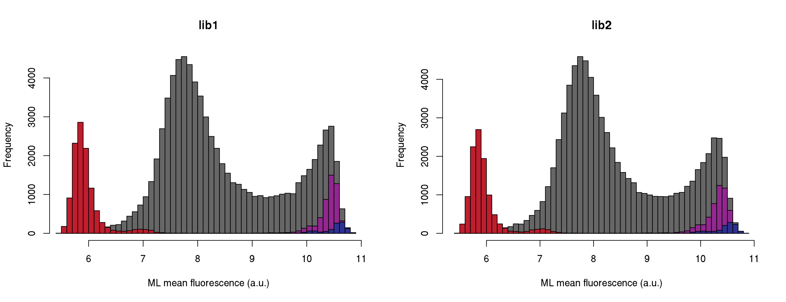
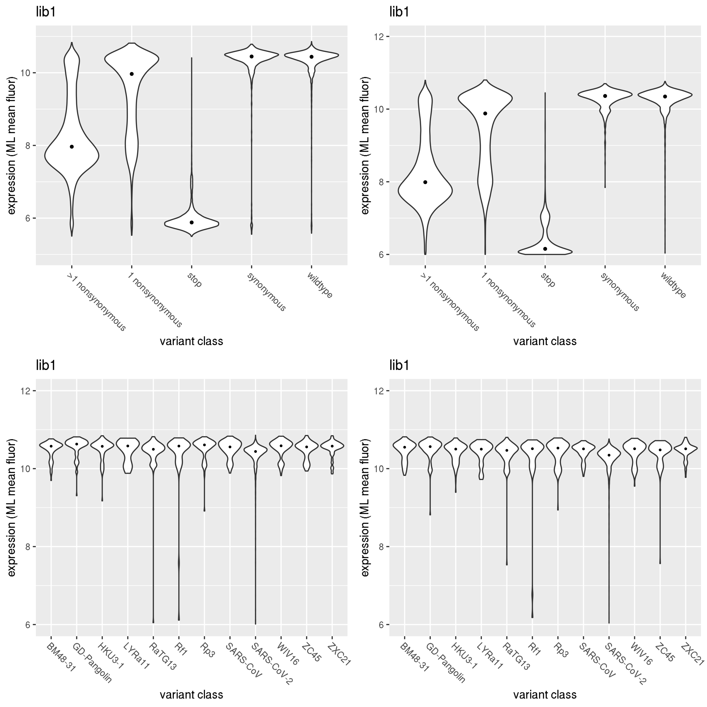

Compute per-barcode expression functional score
================
Tyler Starr
4/30/2020

This notebook reads in per-barcode counts from `count_variants.ipynb`
for expression Sort-seq experiments, computes functional scores for RBD
expression levels, and does some basic QC on variant expression
functional scores.

``` r
require("knitr")
knitr::opts_chunk$set(echo = T)
knitr::opts_chunk$set(dev.args = list(png = list(type = "cairo")))

#list of packages to install/load
packages = c("yaml","data.table","tidyverse","Hmisc","fitdistrplus","gridExtra")
#install any packages not already installed
installed_packages <- packages %in% rownames(installed.packages())
if(any(installed_packages == F)){
  install.packages(packages[!installed_packages])
}
#load packages
invisible(lapply(packages, library, character.only=T))

#read in config file
config <- read_yaml("config.yaml")

#make output directory
if(!file.exists(config$expression_sortseq_dir)){
  dir.create(file.path(config$expression_sortseq_dir))
}
```

Session info for reproducing environment:

``` r
sessionInfo()
```

    ## R version 3.6.1 (2019-07-05)
    ## Platform: x86_64-pc-linux-gnu (64-bit)
    ## Running under: Ubuntu 14.04.6 LTS
    ## 
    ## Matrix products: default
    ## BLAS/LAPACK: /app/easybuild/software/OpenBLAS/0.2.18-GCC-5.4.0-2.26-LAPACK-3.6.1/lib/libopenblas_prescottp-r0.2.18.so
    ## 
    ## locale:
    ##  [1] LC_CTYPE=en_US.UTF-8       LC_NUMERIC=C              
    ##  [3] LC_TIME=en_US.UTF-8        LC_COLLATE=en_US.UTF-8    
    ##  [5] LC_MONETARY=en_US.UTF-8    LC_MESSAGES=en_US.UTF-8   
    ##  [7] LC_PAPER=en_US.UTF-8       LC_NAME=C                 
    ##  [9] LC_ADDRESS=C               LC_TELEPHONE=C            
    ## [11] LC_MEASUREMENT=en_US.UTF-8 LC_IDENTIFICATION=C       
    ## 
    ## attached base packages:
    ## [1] stats     graphics  grDevices utils     datasets  methods   base     
    ## 
    ## other attached packages:
    ##  [1] gridExtra_2.3       fitdistrplus_1.0-14 npsurv_0.4-0       
    ##  [4] lsei_1.2-0          MASS_7.3-51.4       Hmisc_4.2-0        
    ##  [7] Formula_1.2-3       survival_2.44-1.1   lattice_0.20-38    
    ## [10] forcats_0.4.0       stringr_1.4.0       dplyr_0.8.3        
    ## [13] purrr_0.3.2         readr_1.3.1         tidyr_0.8.3        
    ## [16] tibble_2.1.3        ggplot2_3.2.0       tidyverse_1.2.1    
    ## [19] data.table_1.12.2   yaml_2.2.0          knitr_1.23         
    ## 
    ## loaded via a namespace (and not attached):
    ##  [1] Rcpp_1.0.1          lubridate_1.7.4     assertthat_0.2.1   
    ##  [4] digest_0.6.20       R6_2.4.0            cellranger_1.1.0   
    ##  [7] backports_1.1.4     acepack_1.4.1       evaluate_0.14      
    ## [10] httr_1.4.0          pillar_1.4.2        rlang_0.4.0        
    ## [13] lazyeval_0.2.2      readxl_1.3.1        rstudioapi_0.10    
    ## [16] rpart_4.1-15        Matrix_1.2-17       checkmate_1.9.4    
    ## [19] rmarkdown_1.13      splines_3.6.1       foreign_0.8-71     
    ## [22] htmlwidgets_1.3     munsell_0.5.0       broom_0.5.2        
    ## [25] compiler_3.6.1      modelr_0.1.4        xfun_0.7           
    ## [28] pkgconfig_2.0.2     base64enc_0.1-3     htmltools_0.3.6    
    ## [31] nnet_7.3-12         tidyselect_0.2.5    htmlTable_1.13.1   
    ## [34] crayon_1.3.4        withr_2.1.2         grid_3.6.1         
    ## [37] nlme_3.1-140        jsonlite_1.6        gtable_0.3.0       
    ## [40] magrittr_1.5        scales_1.0.0        cli_1.1.0          
    ## [43] stringi_1.4.3       latticeExtra_0.6-28 xml2_1.2.0         
    ## [46] generics_0.0.2      RColorBrewer_1.1-2  tools_3.6.1        
    ## [49] glue_1.3.1          hms_0.4.2           colorspace_1.4-1   
    ## [52] cluster_2.1.0       rvest_0.3.4         haven_2.1.1

## Setup

First, we will read in metadata on our sort samples and the table giving
number of reads of each barcode in each of the sort bins, convert from
Illumina read counts to estimates of the number of cells that were
sorted into a bin, and add some other useful information to our counts
data.

Note: we are loading our per-barcode counts in as a `data.table` object,
which improves speed by vectorizing many typical dataframe operations
and automatically parallelizing when possible, and has more streamlined
slicing and dicing operators without requiring all of the same `$` and
`""` syntax typically needed in a `data.frame`. Many ways of slicing a
typical `data.frame` will not work with the `data.table`, so check out
guides on `data.table` if you’re going to dig in yourself\!

``` r
#read dataframe with list of barcode runs
barcode_runs <- read.csv(file=config$barcode_runs,stringsAsFactors=F); barcode_runs <- subset(barcode_runs, select=-c(R1))

#eliminate rows from barcode_runs that are not from an expression sort-seq experiment
barcode_runs <- barcode_runs[barcode_runs$sample_type == "SortSeq",]

#read file giving count of each barcode in each sort partition
counts <- data.table(read.csv(file=config$variant_counts_file,stringsAsFactors=F)); counts <- counts[order(counts$library,counts$target,counts$barcode),]

#eliminate rows from counts that are not part of an expression sort-seq bin
counts <- subset(counts, sample %in% barcode_runs[barcode_runs$sample_type=="SortSeq","sample"])

#for each bin, normalize the read counts to the observed ratio of cell recovery among bins
for(i in 1:nrow(barcode_runs)){
  lib <- as.character(barcode_runs$library[i])
  bin <- as.character(barcode_runs$sample[i])
  if(sum(counts[library==lib & sample==bin,"count"]) < barcode_runs$number_cells[i]){ #if there are fewer reads from a sortseq bin than cells sorted
    counts[library==lib & sample==bin, count.norm := as.numeric(count)] #don't normalize cell counts, make count.norm the same as count
    print(paste("reads < cells for",lib,bin,", un-normalized")) #print to console to inform of undersampled bins
  }else{
    ratio <- sum(counts[library==lib & sample==bin,"count"])/barcode_runs$number_cells[i]
    counts[library==lib & sample==bin, count.norm := as.numeric(count/ratio)] #normalize read counts by the average read:cell ratio, report in new "count.norm" column
  }
}

#annotate each barcode as to whether it's a homolog variant, SARS-CoV-2 wildtype, synonymous muts only, stop, nonsynonymous, >1 nonsynonymous mutations
counts[target != "SARS-CoV-2", variant_class := target]
counts[target == "SARS-CoV-2" & n_codon_substitutions==0, variant_class := "wildtype"]
counts[target == "SARS-CoV-2" & n_codon_substitutions > 0 & n_aa_substitutions==0, variant_class := "synonymous"]
counts[target == "SARS-CoV-2" & n_aa_substitutions>0 & grepl("*",aa_substitutions,fixed=T), variant_class := "stop"]
counts[target == "SARS-CoV-2" & n_aa_substitutions == 1 & !grepl("*",aa_substitutions,fixed=T), variant_class := "1 nonsynonymous"]
counts[target == "SARS-CoV-2" & n_aa_substitutions > 1 & !grepl("*",aa_substitutions,fixed=T), variant_class := ">1 nonsynonymous"]

#cast the counts data frame into wide format for lib1 and lib2 replicates
counts_lib1 <- dcast(counts[library=="lib1",], barcode + variant_call_support + target + variant_class + aa_substitutions + n_aa_substitutions + codon_substitutions + n_codon_substitutions ~ library + sample, value.var="count.norm")
counts_lib2 <- dcast(counts[library=="lib2",], barcode + variant_call_support + target + variant_class + aa_substitutions + n_aa_substitutions + codon_substitutions + n_codon_substitutions ~ library + sample, value.var="count.norm")
```

## Calculating mean fluorescence

Next, for each barcode, calculate its mean fluorescence as an indicator
of RBD expression level. We will use a maximum likelihood approach to
determine the mean and standard deviation of fluorescence for a barcode,
given its distribution of cell counts across sort bins, and the known
fluorescence boundaries of those sort bins from the sorting log. The
package `fitdistcens` enables this ML estimation for these type of
*censored* observations, where we know we observed a cell within some
fluorescence interval but do not know the exact fluorescence value
attributed to that observation.

``` r
#define function to calculate ML meanF
calc.MLmean <- function(b1,b2,b3,b4,min.b1,min.b2,min.b3,min.b4,max.b4,min.count=1){ #b1-4 gives observed cell counts in bins 1-4; remaining arguments give fluorescence boundaries of the respective bins; min.count gives minimum number of total observations needed across bins in order to calculate meanF (default 1)
  data <- data.frame(left=c(rep(min.b1,round(b1)),rep(min.b2,round(b2)),rep(min.b3,round(b3)),rep(min.b4,round(b4))),
                     right=c(rep(min.b2,round(b1)),rep(min.b3,round(b2)),rep(min.b4,round(b3)),rep(max.b4,round(b4)))) #define data input in format required for fitdistcens
  if(nrow(unique(data))>1 & nrow(data)>min.count){ #only fits if above user-specified min.count, and if the data satisfies the fitdistcens requirement that cells are observed in at least two of the censored partitions to enable ML estimation of identifiable parameters
    fit <- fitdistcens(data,"norm")
    return(list(as.numeric(summary(fit)$estimate["mean"]),as.numeric(summary(fit)$estimate["sd"])))
  } else {
    return(list(as.numeric(NA),as.numeric(NA)))
  }
}

#fit ML mean and sd fluorescence for each barcode, and calculate total cell count as the sum across the four bins. Multiply cell counts by a factor of 20 to minimize rounding errors since fitdistcens requires rounding to integer inputs
invisible(counts_lib1[,c("ML_meanF","ML_sdF") := tryCatch(calc.MLmean(b1=lib1_SortSeq_bin1*20,b2=lib1_SortSeq_bin2*20,
                                                                      b3=lib1_SortSeq_bin3*20,b4=lib1_SortSeq_bin4*20,
                                                                      min.b1=log(20),min.b2=log(1791.5),min.b3=log(5845.5),
                                                                      min.b4=log(16877.5),max.b4=log(200000)),
                                                          error=function(e){return(list(as.numeric(NA),as.numeric(NA)))}),by=barcode])
counts_lib1[,total_count := sum(lib1_SortSeq_bin1,lib1_SortSeq_bin2,lib1_SortSeq_bin3,lib1_SortSeq_bin4),by=barcode]

#save temp data file for downstream troubleshooting since the ML meanF took >1hr to calculate -- don't use these for final anlaysis though for reproducibility!
save(counts_lib1,file=paste(config$expression_sortseq_dir,"/dt.temp.lib1.Rda",sep=""))

invisible(counts_lib2[,c("ML_meanF","ML_sdF") := tryCatch(calc.MLmean(b1=lib2_SortSeq_bin1*20,b2=lib2_SortSeq_bin2*20,
                                                                      b3=lib2_SortSeq_bin3*20,b4=lib2_SortSeq_bin4*20,
                                                                      min.b1=log(20),min.b2=log(1790.5),min.b3=log(5401.5),
                                                                      min.b4=log(15597.5),max.b4=log(200000)),
                                                          error=function(e){return(list(as.numeric(NA),as.numeric(NA)))}),by=barcode])
counts_lib2[,total_count := sum(lib2_SortSeq_bin1,lib2_SortSeq_bin2,lib2_SortSeq_bin3,lib2_SortSeq_bin4),by=barcode]

#save temp data file for downstream troubleshooting since the ML meanF took >1hr to calculate -- don't use these for final anlaysis though for reproducibility!
save(counts_lib2,file=paste(config$expression_sortseq_dir,"/dt.temp.lib2.Rda",sep=""))

#load(file=paste(config$expression_sortseq_dir,"/dt.temp.lib1.Rda",sep=""))
#load(file=paste(config$expression_sortseq_dir,"/dt.temp.lib2.Rda",sep=""))
```

## Basic plotting and QC

Let’s look at the distibution of expression scores by variant class for
each library.

``` r
#histograms of lib1 and lib2, separating out by variant class and type
par(mfrow=c(1,2))
hist(counts_lib1[variant_class %in% (c("1 nonsynonymous",">1 nonsynonymous")),ML_meanF],col="gray40",main="lib1",breaks=50,xlab="ML mean fluorescence (a.u.)")
hist(counts_lib1[variant_class %in% (c("synonymous","wildtype")),ML_meanF],col="#92278F",add=T,breaks=50)
hist(counts_lib1[variant_class == target,ML_meanF],col="#2E3192",add=T,breaks=50)
hist(counts_lib1[variant_class %in% (c("stop")),ML_meanF],col="#BE1E2D",add=T,breaks=50)

hist(counts_lib2[variant_class %in% (c("1 nonsynonymous",">1 nonsynonymous")),ML_meanF],col="gray40",breaks=50,main="lib2",xlab="ML mean fluorescence (a.u.)")
hist(counts_lib2[variant_class %in% (c("synonymous","wildtype")),ML_meanF],col="#92278F",add=T,breaks=50)
hist(counts_lib2[target != "SARS-CoV-2",ML_meanF],col="#2E3192",add=T,breaks=50)
hist(counts_lib2[variant_class %in% (c("stop")),ML_meanF],col="#BE1E2D",add=T,breaks=50)
```


Next let’s look at the distributon of cell counts across the four bins
for each barcode.

``` r
#histograms
par(mfrow=c(1,2))
hist(log10(counts_lib1$total_count+0.1),xlab="cell count (log10, plus 0.1 pseudocount)",main="lib1",col="gray50")
hist(log10(counts_lib2$total_count+0.1),xlab="cell count (log10, plus 0.1 pseudocount)",main="lib2",col="gray50")
```


Next, we want to generate estimates of variance in ML mean fluor
measurements. We will use an empirical approach to assign variance
estimates as a function of cell count (coverage), which is likely the
dominant factor determinig precision of a mean fluor estimate. We have
replicate measurements of WT/synonymous variants in the library across a
range of `total_count` values. We bin WT/synonymous barcodes within
groupings of similar `total_count` values, giving us a sampling
distribution of mean fluor across different levels of coverage, from
which we can compute variances.

``` r
#estimate variance as a function of cell counts using repeat WT distributions
#I notice that a small number WT variants, even with high counts, have null-like meanFs. I don't think these are the "experimental noise" I want to capture in this analysis, but rather are genuinely nonexpressing variants -- probably with a mutation outside of the PacBio sequencing or some other phenomenon. I will exclude these for the purpose of estimating variance in the meanF estimates

wt_lib1 <- counts_lib1[variant_class %in% c("synonymous","wildtype") & ML_meanF>9,]
wt_lib2 <- counts_lib2[variant_class %in% c("synonymous","wildtype") & ML_meanF>9,]

#make bins of observations as a function of cell count
n.breaks.wt_lib1 <- 30
wt.bins_lib1 <- data.frame(bin=1:n.breaks.wt_lib1)
breaks.wt_lib1 <- cut2(wt_lib1$total_count,m=250,g=n.breaks.wt_lib1,onlycuts=T)
#pool observations that fall within the bin breaks, compute sd within each sampling distribution
for(i in 1:nrow(wt.bins_lib1)){
  wt.bins_lib1$range.cells[i] <- list(c(breaks.wt_lib1[i],breaks.wt_lib1[i+1]))
  data <- wt_lib1[total_count >= wt.bins_lib1$range.cells[i][[1]][[1]] & total_count < wt.bins_lib1$range.cells[i][[1]][[2]],]
  wt.bins_lib1$median.cells[i] <- median(data$total_count,na.rm=T)
  wt.bins_lib1$mean.ML_meanF[i] <- mean(data$ML_meanF,na.rm=T)
  wt.bins_lib1$sd.ML_meanF[i] <- sd(data$ML_meanF,na.rm=T)
}
#look at relationship between variance and cell counts; fit curve to estimate variance from cell count
#ML meanF
par(mfrow=c(2,2))
y1_lib1 <- (wt.bins_lib1$sd.ML_meanF)^2;x1_lib1 <- wt.bins_lib1$median.cells
plot(x1_lib1,y1_lib1,xlab="number cells",ylab="variance in ML meanF measurement",main="lib1",pch=19,col="#92278F")
plot(log(x1_lib1),log(y1_lib1),xlab="log(number cells)",ylab="log(variance in ML meanF measurement)",main="lib1",pch=19,col="#92278F")
fit_variance_v_count_lib1 <- lm(log(y1_lib1) ~ log(x1_lib1));summary(fit_variance_v_count_lib1);abline(fit_variance_v_count_lib1)
```

    ## 
    ## Call:
    ## lm(formula = log(y1_lib1) ~ log(x1_lib1))
    ## 
    ## Residuals:
    ##      Min       1Q   Median       3Q      Max 
    ## -0.63837 -0.23591  0.04111  0.21980  0.82272 
    ## 
    ## Coefficients:
    ##              Estimate Std. Error t value Pr(>|t|)    
    ## (Intercept)  -0.01042    0.34382   -0.03    0.976    
    ## log(x1_lib1) -0.76863    0.07573  -10.15 6.93e-11 ***
    ## ---
    ## Signif. codes:  0 '***' 0.001 '**' 0.01 '*' 0.05 '.' 0.1 ' ' 1
    ## 
    ## Residual standard error: 0.3516 on 28 degrees of freedom
    ## Multiple R-squared:  0.7863, Adjusted R-squared:  0.7787 
    ## F-statistic:   103 on 1 and 28 DF,  p-value: 6.927e-11

``` r
#lib2
n.breaks.wt_lib2 <- 30
wt.bins_lib2 <- data.frame(bin=1:n.breaks.wt_lib2)
breaks.wt_lib2 <- cut2(wt_lib2$total_count,m=250,g=n.breaks.wt_lib2,onlycuts=T)
#pool observations that fall within the bin breaks, compute sd within each sampling distribution
for(i in 1:nrow(wt.bins_lib2)){
  wt.bins_lib2$range.cells[i] <- list(c(breaks.wt_lib2[i],breaks.wt_lib2[i+1]))
  data <- wt_lib2[total_count >= wt.bins_lib2$range.cells[i][[1]][[1]] & total_count < wt.bins_lib2$range.cells[i][[1]][[2]],]
  wt.bins_lib2$median.cells[i] <- median(data$total_count,na.rm=T)
  wt.bins_lib2$mean.ML_meanF[i] <- mean(data$ML_meanF,na.rm=T)
  wt.bins_lib2$sd.ML_meanF[i] <- sd(data$ML_meanF,na.rm=T)
}
#look at relationship between variance and cell counts; fit curve to estimate variance from cell count
#ML meanF
y1_lib2 <- (wt.bins_lib2$sd.ML_meanF)^2;x1_lib2 <- wt.bins_lib2$median.cells
plot(x1_lib2,y1_lib2,xlab="number cells",ylab="variance in ML meanF measurement",main="lib2",pch=19,col="#92278F")
plot(log(x1_lib2),log(y1_lib2),xlab="log(number cells)",ylab="log(variance in ML meanF measurement)",main="lib2",pch=19,col="#92278F")
fit_variance_v_count_lib2 <- lm(log(y1_lib2) ~ log(x1_lib2));summary(fit_variance_v_count_lib2);abline(fit_variance_v_count_lib2)
```

    ## 
    ## Call:
    ## lm(formula = log(y1_lib2) ~ log(x1_lib2))
    ## 
    ## Residuals:
    ##      Min       1Q   Median       3Q      Max 
    ## -0.60830 -0.18287  0.01297  0.17315  0.66172 
    ## 
    ## Coefficients:
    ##              Estimate Std. Error t value Pr(>|t|)    
    ## (Intercept)  -0.66739    0.24174  -2.761   0.0101 *  
    ## log(x1_lib2) -0.62021    0.05612 -11.051 1.01e-11 ***
    ## ---
    ## Signif. codes:  0 '***' 0.001 '**' 0.01 '*' 0.05 '.' 0.1 ' ' 1
    ## 
    ## Residual standard error: 0.2778 on 28 degrees of freedom
    ## Multiple R-squared:  0.8135, Adjusted R-squared:  0.8068 
    ## F-statistic: 122.1 on 1 and 28 DF,  p-value: 1.013e-11


For each library measurement, assign it an estimated variance in the
mean fluor estimate based on the empirical variance for the
`total_count` bin to which a measurement belongs, based on the empirical
relationship between log-variance and log-count. Censor all measurements
for fewer than 20 cells, and return the number and fraction of barcodes
for which we are retaining expression measurements.

``` r
#function to estimate variance from cell count given the fits above
est.var <- function(count,fit){
  return(exp(as.numeric(fit$coefficients[1]) + as.numeric(fit$coefficients[2]) * log(count)))
}
counts_lib1[,var_ML_meanF := est.var(total_count,fit_variance_v_count_lib1),by=barcode]
counts_lib2[,var_ML_meanF := est.var(total_count,fit_variance_v_count_lib2),by=barcode]

#filter for minimum counts
counts_filtered_lib1 <- copy(counts_lib1)
counts_filtered_lib2 <- copy(counts_lib2)

counts_filtered_lib1[total_count < 20, c("ML_meanF","var_ML_meanF") := as.numeric(NA),by=barcode]
counts_filtered_lib2[total_count < 20, c("ML_meanF","var_ML_meanF") := as.numeric(NA),by=barcode]

print(paste("Generated meanF estimates for ",round(sum(!is.na(counts_filtered_lib1$ML_meanF))/nrow(counts_filtered_lib1),digits=4)*100,"% (",sum(!is.na(counts_filtered_lib1$ML_meanF)),") of lib1 barcodes",sep=""))
```

    ## [1] "Generated meanF estimates for 92.93% (92603) of lib1 barcodes"

``` r
print(paste("Generated meanF estimates for ",round(sum(!is.na(counts_filtered_lib2$ML_meanF))/nrow(counts_filtered_lib2),digits=4)*100,"% (",sum(!is.na(counts_filtered_lib2$ML_meanF)),") of lib2 barcodes",sep=""))
```

    ## [1] "Generated meanF estimates for 90.51% (88423) of lib2 barcodes"

Here is our final distribution of expression among retained barcodes.

``` r
#histograms of lib1 and lib2, separating out by variant class and type
par(mfrow=c(1,2))
hist(counts_filtered_lib1[variant_class %in% (c("1 nonsynonymous",">1 nonsynonymous")),ML_meanF],col="gray40",breaks=50,xlab="ML mean fluorescence (a.u.)",main="lib1")
hist(counts_filtered_lib1[variant_class %in% (c("synonymous","wildtype")),ML_meanF],col="#92278F",add=T,breaks=50)
hist(counts_filtered_lib1[variant_class == target,ML_meanF],col="#2E3192",add=T,breaks=50)
hist(counts_filtered_lib1[variant_class %in% (c("stop")),ML_meanF],col="#BE1E2D",add=T,breaks=50)

hist(counts_filtered_lib2[variant_class %in% (c("1 nonsynonymous",">1 nonsynonymous")),ML_meanF],col="gray40",breaks=50,xlab="ML mean fluorescence (a.u.)",main="lib2")
hist(counts_filtered_lib2[variant_class %in% (c("synonymous","wildtype")),ML_meanF],col="#92278F",add=T,breaks=50)
hist(counts_filtered_lib2[target != "SARS-CoV-2",ML_meanF],col="#2E3192",add=T,breaks=50)
hist(counts_filtered_lib2[variant_class %in% (c("stop")),ML_meanF],col="#BE1E2D",add=T,breaks=50)
```



``` r
invisible(dev.print(pdf, paste(config$expression_sortseq_dir,"/hist_ML-meanF-per-barcode.pdf",sep="")))
```

Here is this information faceted out by category within violin plots. We
first break out variant classes among SARS-CoV-2 variants, and then we
look at this metric across the unmutated versions of each of our RBD
homologs in the library.

``` r
p1 <- ggplot(counts_filtered_lib1[target=="SARS-CoV-2" & !is.na(ML_meanF),],aes(x=variant_class,y=ML_meanF))+
  geom_violin(scale="width")+stat_summary(fun.y=median,geom="point",size=1)+
  ggtitle("lib1")+xlab("variant class")+ylab("expression (ML mean fluor)")+theme(axis.text.x=element_text(angle=-45,hjust=0))+
  scale_y_continuous(limits=c(5,11))

p2 <- ggplot(counts_filtered_lib2[target=="SARS-CoV-2" & !is.na(ML_meanF),],aes(x=variant_class,y=ML_meanF))+
  geom_violin(scale="width")+stat_summary(fun.y=median,geom="point",size=1)+
  ggtitle("lib2")+xlab("variant class")+ylab("expression (ML mean fluor)")+theme(axis.text.x=element_text(angle=-45,hjust=0))+
  scale_y_continuous(limits=c(5,11))

p3 <- ggplot(counts_filtered_lib1[!is.na(ML_meanF) & !(variant_class %in% c("synonymous","1 nonsynonymous",">1 nonsynonymous","stop")),],aes(x=target,y=ML_meanF))+
  geom_violin(scale="width")+stat_summary(fun.y=median,geom="point",size=0.5)+
  ggtitle("lib1")+xlab("variant class")+ylab("expression (ML mean fluor)")+theme(axis.text.x=element_text(angle=-45,hjust=0))+
  scale_y_continuous(limits=c(5,11))

p4 <- ggplot(counts_filtered_lib2[!is.na(ML_meanF) & !(variant_class %in% c("synonymous","1 nonsynonymous",">1 nonsynonymous","stop")),],aes(x=target,y=ML_meanF))+
  geom_violin(scale="width")+stat_summary(fun.y=median,geom="point",size=0.5)+
  ggtitle("lib2")+xlab("variant class")+ylab("expression (ML mean fluor)")+theme(axis.text.x=element_text(angle=-45,hjust=0))+
  scale_y_continuous(limits=c(5,11))

grid.arrange(p1,p2,p3,p4,ncol=2)
```



``` r
#save pdf
invisible(dev.print(pdf, paste(config$expression_sortseq_dir,"/violin-plot_ML-meanF-by-target.pdf",sep="")))
```

## Data Output

Finally, let’s output our measurements for downstream analyses. Since
only the SARS-CoV-2 data is going into the global epistasis models, we
will output separate files, for all barcodes, and for barcodes
containing SARS-CoV-2 targets only. We also report a relative expression
metric, delta\_ML\_meanF, by subtracting the mean expression of WT and
synonymous variants from each ML\_meanF metric. This should calibrate
measurements between the two libraries for fitting joint global
epistasis models, in which the average wildtype expression is different
by a very small amount. We censor out the low meanF wildtype
measurements from the computation of the mean WT expression and remove
these delta\_ML\_meanF measurements for these low-fluorescence wildtype
barcodes, because these are likely artifactual points and we don’t want
them to drag down the perceived WT fluorescence, thereby aberrantly
making many individual mutations seem to improve expression. The cutoffs
for each library were picked so that the median and mean fluorescence of
WT variants were beginning to converge (within 0.05), suggesting outlier
effects were diminished.

``` r
counts_filtered_lib1[,library:="lib1"]
counts_filtered_lib2[,library:="lib2"]

counts_filtered_lib1$delta_ML_meanF <- counts_filtered_lib1$ML_meanF - mean(counts_filtered_lib1[variant_class %in% c("wildtype","synonymous") & ML_meanF>10.2,ML_meanF],na.rm=T)
counts_filtered_lib1[variant_class %in% c("wildtype","synonymous") & ML_meanF<10.2, delta_ML_meanF := NA]

counts_filtered_lib2$delta_ML_meanF <- counts_filtered_lib2$ML_meanF - mean(counts_filtered_lib2[variant_class %in% c("wildtype","synonymous") & ML_meanF>10.1,ML_meanF],na.rm=T)
counts_filtered_lib2[variant_class %in% c("wildtype","synonymous") & ML_meanF<10.1, delta_ML_meanF := NA]

write.csv(rbind(counts_filtered_lib1[,.(library, target, barcode, variant_call_support, total_count, ML_meanF, delta_ML_meanF, var_ML_meanF, 
                                        variant_class, aa_substitutions, n_aa_substitutions)],
                counts_filtered_lib2[,.(library, target, barcode, variant_call_support, total_count, ML_meanF, delta_ML_meanF, var_ML_meanF, 
                                        variant_class, aa_substitutions, n_aa_substitutions)]),file=config$expression_sortseq_all_targets_file)

write.csv(rbind(counts_filtered_lib1[target=="SARS-CoV-2",.(library, target, barcode, variant_call_support, total_count, ML_meanF, delta_ML_meanF, var_ML_meanF, 
                                        variant_class, aa_substitutions, n_aa_substitutions)],
                counts_filtered_lib2[target=="SARS-CoV-2",.(library, target, barcode, variant_call_support, total_count, ML_meanF, delta_ML_meanF, var_ML_meanF, 
                                        variant_class, aa_substitutions, n_aa_substitutions)]),file=config$expression_sortseq_file)
```
