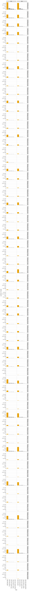

# Count variants in each sample
This Python Jupyter notebook counts occurrences of each barcode in each sample from Illumina barcode sequencing, and adds these counts to the codon variant table.

## Set up analysis
### Import Python modules.
Use [plotnine](https://plotnine.readthedocs.io/en/stable/) for ggplot2-like plotting.

The analysis relies heavily on the Bloom lab's [dms_variants](https://jbloomlab.github.io/dms_variants) package:


```python
import itertools
import multiprocessing
import multiprocessing.pool
import os
import warnings

import alignparse
import alignparse.targets

import dms_variants.codonvarianttable
from dms_variants.constants import CBPALETTE
import dms_variants.illuminabarcodeparser
import dms_variants.utils
import dms_variants.plotnine_themes

from IPython.display import display, HTML

import pandas as pd

from plotnine import *

import yaml
```

Set [plotnine](https://plotnine.readthedocs.io/en/stable/) theme to the gray-grid one defined in `dms_variants`:


```python
theme_set(dms_variants.plotnine_themes.theme_graygrid())
```

Versions of key software:


```python
print(f"Using alignparse version {alignparse.__version__}")
print(f"Using dms_variants version {dms_variants.__version__}")
```

    Using alignparse version 0.1.3
    Using dms_variants version 0.6.0


Ignore warnings that clutter output:


```python
warnings.simplefilter('ignore')
```

### Parameters for notebook
Read the configuration file:


```python
with open('config.yaml') as f:
    config = yaml.safe_load(f)
```

Make output directory if needed:


```python
os.makedirs(config['counts_dir'], exist_ok=True)
os.makedirs(config['figs_dir'], exist_ok=True)
```

## Initialize codon variant table
Initialize the [CodonVariantTable](https://jbloomlab.github.io/dms_variants/dms_variants.codonvarianttable.html#dms_variants.codonvarianttable.CodonVariantTable) using the wildtype gene sequence and the CSV file with the table of variants:


```python
# get wildtype gene sequence for primary target
targets = alignparse.targets.Targets(seqsfile=config['amplicons'],
                                     feature_parse_specs=config['feature_parse_specs'])
geneseq = targets.get_target(config['primary_target']).get_feature('gene').seq
print(f"Read gene of {len(geneseq)} nt for {config['primary_target']} from {config['amplicons']}")
      
print('Initializing CodonVariantTable from gene sequence and ' +
      config['codon_variant_table_file'])
      
variants = dms_variants.codonvarianttable.CodonVariantTable(
                geneseq=geneseq,
                barcode_variant_file=config['codon_variant_table_file'],
                substitutions_are_codon=True,
                substitutions_col='codon_substitutions',
                primary_target=config['primary_target'])
```

    Read gene of 603 nt for SARS-CoV-2 from data/PacBio_amplicons.gb
    Initializing CodonVariantTable from gene sequence and results/variants/codon_variant_table.csv


## Setup to parse barcodes
Read data frame with list of all barcode runs.
Note how multiple R1 files are delimited by `; ` and are split out separately:


```python
print(f"Reading list of barcode runs from {config['barcode_runs']}")

barcode_runs = (pd.read_csv(config['barcode_runs'])
                .assign(R1=lambda x: x['R1'].str.split('; '))
                )
      
display(HTML(barcode_runs.to_html(index=False)))
```

    Reading list of barcode runs from data/barcode_runs.csv


<table border="1" class="dataframe">
  <thead>
    <tr style="text-align: right;">
      <th>library</th>
      <th>sample</th>
      <th>sample_type</th>
      <th>sort_bin</th>
      <th>concentration</th>
      <th>date</th>
      <th>number_cells</th>
      <th>R1</th>
    </tr>
  </thead>
  <tbody>
    <tr>
      <td>lib1</td>
      <td>SortSeq_bin1</td>
      <td>SortSeq</td>
      <td>1</td>
      <td>NaN</td>
      <td>200416</td>
      <td>6600000</td>
      <td>[/shared/ngs/illumina/tstarr/200427_D00300_0952_AHFCLCBCX3/Unaligned/Project_tstarr/Sample_200416_lib1_FITCbin1/200416_lib1_FITCbin1_TGGAACAA_L001_R1_001.fastq.gz, /fh/fast/bloom_j/SR/ngs/illumina/tstarr/200427_D00300_0952_AHFCLCBCX3/Unaligned/Project_tstarr/Sample_200416_lib1_FITCbin1/200416_lib1_FITCbin1_TGGAACAA_L001_R1_002.fastq.gz, /fh/fast/bloom_j/SR/ngs/illumina/tstarr/200427_D00300_0952_AHFCLCBCX3/Unaligned/Project_tstarr/Sample_200416_lib1_FITCbin1/200416_lib1_FITCbin1_TGGAACAA_L001_R1_003.fastq.gz, /fh/fast/bloom_j/SR/ngs/illumina/tstarr/200427_D00300_0952_AHFCLCBCX3/Unaligned/Project_tstarr/Sample_200416_lib1_FITCbin1/200416_lib1_FITCbin1_TGGAACAA_L001_R1_004.fastq.gz, /fh/fast/bloom_j/SR/ngs/illumina/tstarr/200427_D00300_0952_AHFCLCBCX3/Unaligned/Project_tstarr/Sample_200416_lib1_FITCbin1/200416_lib1_FITCbin1_TGGAACAA_L001_R1_005.fastq.gz, /fh/fast/bloom_j/SR/ngs/illumina/tstarr/200427_D00300_0952_AHFCLCBCX3/Unaligned/Project_tstarr/Sample_200416_lib1_FITCbin1/200416_lib1_FITCbin1_TGGAACAA_L002_R1_001.fastq.gz, /fh/fast/bloom_j/SR/ngs/illumina/tstarr/200427_D00300_0952_AHFCLCBCX3/Unaligned/Project_tstarr/Sample_200416_lib1_FITCbin1/200416_lib1_FITCbin1_TGGAACAA_L002_R1_002.fastq.gz, /fh/fast/bloom_j/SR/ngs/illumina/tstarr/200427_D00300_0952_AHFCLCBCX3/Unaligned/Project_tstarr/Sample_200416_lib1_FITCbin1/200416_lib1_FITCbin1_TGGAACAA_L002_R1_003.fastq.gz, /fh/fast/bloom_j/SR/ngs/illumina/tstarr/200427_D00300_0952_AHFCLCBCX3/Unaligned/Project_tstarr/Sample_200416_lib1_FITCbin1/200416_lib1_FITCbin1_TGGAACAA_L002_R1_004.fastq.gz, /fh/fast/bloom_j/SR/ngs/illumina/tstarr/200427_D00300_0952_AHFCLCBCX3/Unaligned/Project_tstarr/Sample_200416_lib1_FITCbin1/200416_lib1_FITCbin1_TGGAACAA_L002_R1_005.fastq.gz]</td>
    </tr>
    <tr>
      <td>lib1</td>
      <td>SortSeq_bin2</td>
      <td>SortSeq</td>
      <td>2</td>
      <td>NaN</td>
      <td>200416</td>
      <td>3060000</td>
      <td>[/shared/ngs/illumina/tstarr/200427_D00300_0952_AHFCLCBCX3/Unaligned/Project_tstarr/Sample_200416_lib1_FITCbin2/200416_lib1_FITCbin2_TGGCTTCA_L001_R1_001.fastq.gz, /fh/fast/bloom_j/SR/ngs/illumina/tstarr/200427_D00300_0952_AHFCLCBCX3/Unaligned/Project_tstarr/Sample_200416_lib1_FITCbin2/200416_lib1_FITCbin2_TGGCTTCA_L001_R1_002.fastq.gz, /fh/fast/bloom_j/SR/ngs/illumina/tstarr/200427_D00300_0952_AHFCLCBCX3/Unaligned/Project_tstarr/Sample_200416_lib1_FITCbin2/200416_lib1_FITCbin2_TGGCTTCA_L002_R1_001.fastq.gz, /fh/fast/bloom_j/SR/ngs/illumina/tstarr/200427_D00300_0952_AHFCLCBCX3/Unaligned/Project_tstarr/Sample_200416_lib1_FITCbin2/200416_lib1_FITCbin2_TGGCTTCA_L002_R1_002.fastq.gz]</td>
    </tr>
    <tr>
      <td>lib1</td>
      <td>SortSeq_bin3</td>
      <td>SortSeq</td>
      <td>3</td>
      <td>NaN</td>
      <td>200416</td>
      <td>2511000</td>
      <td>[/shared/ngs/illumina/tstarr/200427_D00300_0952_AHFCLCBCX3/Unaligned/Project_tstarr/Sample_200416_lib1_FITCbin3/200416_lib1_FITCbin3_TGGTGGTA_L001_R1_001.fastq.gz, /shared/ngs/illumina/tstarr/200427_D00300_0952_AHFCLCBCX3/Unaligned/Project_tstarr/Sample_200416_lib1_FITCbin3/200416_lib1_FITCbin3_TGGTGGTA_L001_R1_002.fastq.gz, /shared/ngs/illumina/tstarr/200427_D00300_0952_AHFCLCBCX3/Unaligned/Project_tstarr/Sample_200416_lib1_FITCbin3/200416_lib1_FITCbin3_TGGTGGTA_L002_R1_001.fastq.gz, /shared/ngs/illumina/tstarr/200427_D00300_0952_AHFCLCBCX3/Unaligned/Project_tstarr/Sample_200416_lib1_FITCbin3/200416_lib1_FITCbin3_TGGTGGTA_L002_R1_002.fastq.gz]</td>
    </tr>
    <tr>
      <td>lib1</td>
      <td>SortSeq_bin4</td>
      <td>SortSeq</td>
      <td>4</td>
      <td>NaN</td>
      <td>200416</td>
      <td>2992000</td>
      <td>[/shared/ngs/illumina/tstarr/200427_D00300_0952_AHFCLCBCX3/Unaligned/Project_tstarr/Sample_200416_lib1_FITCbin4/200416_lib1_FITCbin4_TTCACGCA_L001_R1_001.fastq.gz, /shared/ngs/illumina/tstarr/200427_D00300_0952_AHFCLCBCX3/Unaligned/Project_tstarr/Sample_200416_lib1_FITCbin4/200416_lib1_FITCbin4_TTCACGCA_L001_R1_002.fastq.gz, /shared/ngs/illumina/tstarr/200427_D00300_0952_AHFCLCBCX3/Unaligned/Project_tstarr/Sample_200416_lib1_FITCbin4/200416_lib1_FITCbin4_TTCACGCA_L002_R1_001.fastq.gz, /shared/ngs/illumina/tstarr/200427_D00300_0952_AHFCLCBCX3/Unaligned/Project_tstarr/Sample_200416_lib1_FITCbin4/200416_lib1_FITCbin4_TTCACGCA_L002_R1_002.fastq.gz]</td>
    </tr>
    <tr>
      <td>lib2</td>
      <td>SortSeq_bin1</td>
      <td>SortSeq</td>
      <td>1</td>
      <td>NaN</td>
      <td>200416</td>
      <td>6420000</td>
      <td>[/shared/ngs/illumina/tstarr/200427_D00300_0953_BHFCMKBCX3/Unaligned/Project_tstarr/Sample_200416_lib2_FITCbin1/200416_lib2_FITCbin1_TGGAACAA_L001_R1_001.fastq.gz, /shared/ngs/illumina/tstarr/200427_D00300_0953_BHFCMKBCX3/Unaligned/Project_tstarr/Sample_200416_lib2_FITCbin1/200416_lib2_FITCbin1_TGGAACAA_L001_R1_002.fastq.gz, /shared/ngs/illumina/tstarr/200427_D00300_0953_BHFCMKBCX3/Unaligned/Project_tstarr/Sample_200416_lib2_FITCbin1/200416_lib2_FITCbin1_TGGAACAA_L001_R1_003.fastq.gz, /shared/ngs/illumina/tstarr/200427_D00300_0953_BHFCMKBCX3/Unaligned/Project_tstarr/Sample_200416_lib2_FITCbin1/200416_lib2_FITCbin1_TGGAACAA_L001_R1_004.fastq.gz, /shared/ngs/illumina/tstarr/200427_D00300_0953_BHFCMKBCX3/Unaligned/Project_tstarr/Sample_200416_lib2_FITCbin1/200416_lib2_FITCbin1_TGGAACAA_L002_R1_001.fastq.gz, /shared/ngs/illumina/tstarr/200427_D00300_0953_BHFCMKBCX3/Unaligned/Project_tstarr/Sample_200416_lib2_FITCbin1/200416_lib2_FITCbin1_TGGAACAA_L002_R1_002.fastq.gz, /shared/ngs/illumina/tstarr/200427_D00300_0953_BHFCMKBCX3/Unaligned/Project_tstarr/Sample_200416_lib2_FITCbin1/200416_lib2_FITCbin1_TGGAACAA_L002_R1_003.fastq.gz, /shared/ngs/illumina/tstarr/200427_D00300_0953_BHFCMKBCX3/Unaligned/Project_tstarr/Sample_200416_lib2_FITCbin1/200416_lib2_FITCbin1_TGGAACAA_L002_R1_004.fastq.gz]</td>
    </tr>
    <tr>
      <td>lib2</td>
      <td>SortSeq_bin2</td>
      <td>SortSeq</td>
      <td>2</td>
      <td>NaN</td>
      <td>200416</td>
      <td>2808000</td>
      <td>[/shared/ngs/illumina/tstarr/200427_D00300_0953_BHFCMKBCX3/Unaligned/Project_tstarr/Sample_200416_lib2_FITCbin2/200416_lib2_FITCbin2_TGGCTTCA_L001_R1_001.fastq.gz, /shared/ngs/illumina/tstarr/200427_D00300_0953_BHFCMKBCX3/Unaligned/Project_tstarr/Sample_200416_lib2_FITCbin2/200416_lib2_FITCbin2_TGGCTTCA_L001_R1_002.fastq.gz, /shared/ngs/illumina/tstarr/200427_D00300_0953_BHFCMKBCX3/Unaligned/Project_tstarr/Sample_200416_lib2_FITCbin2/200416_lib2_FITCbin2_TGGCTTCA_L002_R1_001.fastq.gz, /shared/ngs/illumina/tstarr/200427_D00300_0953_BHFCMKBCX3/Unaligned/Project_tstarr/Sample_200416_lib2_FITCbin2/200416_lib2_FITCbin2_TGGCTTCA_L002_R1_002.fastq.gz]</td>
    </tr>
    <tr>
      <td>lib2</td>
      <td>SortSeq_bin3</td>
      <td>SortSeq</td>
      <td>3</td>
      <td>NaN</td>
      <td>200416</td>
      <td>2574000</td>
      <td>[/shared/ngs/illumina/tstarr/200427_D00300_0953_BHFCMKBCX3/Unaligned/Project_tstarr/Sample_200416_lib2_FITCbin3/200416_lib2_FITCbin3_TGGTGGTA_L001_R1_001.fastq.gz, /shared/ngs/illumina/tstarr/200427_D00300_0953_BHFCMKBCX3/Unaligned/Project_tstarr/Sample_200416_lib2_FITCbin3/200416_lib2_FITCbin3_TGGTGGTA_L001_R1_002.fastq.gz, /shared/ngs/illumina/tstarr/200427_D00300_0953_BHFCMKBCX3/Unaligned/Project_tstarr/Sample_200416_lib2_FITCbin3/200416_lib2_FITCbin3_TGGTGGTA_L002_R1_001.fastq.gz, /shared/ngs/illumina/tstarr/200427_D00300_0953_BHFCMKBCX3/Unaligned/Project_tstarr/Sample_200416_lib2_FITCbin3/200416_lib2_FITCbin3_TGGTGGTA_L002_R1_002.fastq.gz]</td>
    </tr>
    <tr>
      <td>lib2</td>
      <td>SortSeq_bin4</td>
      <td>SortSeq</td>
      <td>4</td>
      <td>NaN</td>
      <td>200416</td>
      <td>2530000</td>
      <td>[/shared/ngs/illumina/tstarr/200427_D00300_0953_BHFCMKBCX3/Unaligned/Project_tstarr/Sample_200416_lib2_FITCbin4/200416_lib2_FITCbin4_TTCACGCA_L001_R1_001.fastq.gz, /shared/ngs/illumina/tstarr/200427_D00300_0953_BHFCMKBCX3/Unaligned/Project_tstarr/Sample_200416_lib2_FITCbin4/200416_lib2_FITCbin4_TTCACGCA_L001_R1_002.fastq.gz, /shared/ngs/illumina/tstarr/200427_D00300_0953_BHFCMKBCX3/Unaligned/Project_tstarr/Sample_200416_lib2_FITCbin4/200416_lib2_FITCbin4_TTCACGCA_L002_R1_001.fastq.gz, /shared/ngs/illumina/tstarr/200427_D00300_0953_BHFCMKBCX3/Unaligned/Project_tstarr/Sample_200416_lib2_FITCbin4/200416_lib2_FITCbin4_TTCACGCA_L002_R1_002.fastq.gz]</td>
    </tr>
    <tr>
      <td>lib1</td>
      <td>TiteSeq_01_bin1</td>
      <td>TiteSeq</td>
      <td>1</td>
      <td>1.0</td>
      <td>200420</td>
      <td>1098088</td>
      <td>[/shared/ngs/illumina/tstarr/200427_D00300_0952_AHFCLCBCX3/Unaligned/Project_tstarr/Sample_200420_s01-b1/200420_s01-b1_AACGTGAT_L001_R1_001.fastq.gz, /shared/ngs/illumina/tstarr/200427_D00300_0952_AHFCLCBCX3/Unaligned/Project_tstarr/Sample_200420_s01-b1/200420_s01-b1_AACGTGAT_L002_R1_001.fastq.gz]</td>
    </tr>
    <tr>
      <td>lib1</td>
      <td>TiteSeq_01_bin2</td>
      <td>TiteSeq</td>
      <td>2</td>
      <td>1.0</td>
      <td>200420</td>
      <td>393166</td>
      <td>[/shared/ngs/illumina/tstarr/200427_D00300_0952_AHFCLCBCX3/Unaligned/Project_tstarr/Sample_200420_s01-b2/200420_s01-b2_AAACATCG_L001_R1_001.fastq.gz, /shared/ngs/illumina/tstarr/200427_D00300_0952_AHFCLCBCX3/Unaligned/Project_tstarr/Sample_200420_s01-b2/200420_s01-b2_AAACATCG_L002_R1_001.fastq.gz]</td>
    </tr>
    <tr>
      <td>lib1</td>
      <td>TiteSeq_01_bin3</td>
      <td>TiteSeq</td>
      <td>3</td>
      <td>1.0</td>
      <td>200420</td>
      <td>718545</td>
      <td>[/shared/ngs/illumina/tstarr/200427_D00300_0952_AHFCLCBCX3/Unaligned/Project_tstarr/Sample_200420_s01-b3/200420_s01-b3_ATGCCTAA_L001_R1_001.fastq.gz, /shared/ngs/illumina/tstarr/200427_D00300_0952_AHFCLCBCX3/Unaligned/Project_tstarr/Sample_200420_s01-b3/200420_s01-b3_ATGCCTAA_L002_R1_001.fastq.gz]</td>
    </tr>
    <tr>
      <td>lib1</td>
      <td>TiteSeq_01_bin4</td>
      <td>TiteSeq</td>
      <td>4</td>
      <td>1.0</td>
      <td>200420</td>
      <td>3242062</td>
      <td>[/shared/ngs/illumina/tstarr/200427_D00300_0952_AHFCLCBCX3/Unaligned/Project_tstarr/Sample_200420_s01-b4/200420_s01-b4_AGTGGTCA_L001_R1_001.fastq.gz, /shared/ngs/illumina/tstarr/200427_D00300_0952_AHFCLCBCX3/Unaligned/Project_tstarr/Sample_200420_s01-b4/200420_s01-b4_AGTGGTCA_L001_R1_002.fastq.gz, /shared/ngs/illumina/tstarr/200427_D00300_0952_AHFCLCBCX3/Unaligned/Project_tstarr/Sample_200420_s01-b4/200420_s01-b4_AGTGGTCA_L002_R1_001.fastq.gz, /shared/ngs/illumina/tstarr/200427_D00300_0952_AHFCLCBCX3/Unaligned/Project_tstarr/Sample_200420_s01-b4/200420_s01-b4_AGTGGTCA_L002_R1_002.fastq.gz]</td>
    </tr>
    <tr>
      <td>lib1</td>
      <td>TiteSeq_02_bin1</td>
      <td>TiteSeq</td>
      <td>1</td>
      <td>2.0</td>
      <td>200420</td>
      <td>1155923</td>
      <td>[/shared/ngs/illumina/tstarr/200427_D00300_0952_AHFCLCBCX3/Unaligned/Project_tstarr/Sample_200420_s02-b1/200420_s02-b1_ACCACTGT_L001_R1_001.fastq.gz, /shared/ngs/illumina/tstarr/200427_D00300_0952_AHFCLCBCX3/Unaligned/Project_tstarr/Sample_200420_s02-b1/200420_s02-b1_ACCACTGT_L002_R1_001.fastq.gz]</td>
    </tr>
    <tr>
      <td>lib1</td>
      <td>TiteSeq_02_bin2</td>
      <td>TiteSeq</td>
      <td>2</td>
      <td>2.0</td>
      <td>200420</td>
      <td>428581</td>
      <td>[/shared/ngs/illumina/tstarr/200427_D00300_0952_AHFCLCBCX3/Unaligned/Project_tstarr/Sample_200420_s02-b2/200420_s02-b2_ACATTGGC_L001_R1_001.fastq.gz, /shared/ngs/illumina/tstarr/200427_D00300_0952_AHFCLCBCX3/Unaligned/Project_tstarr/Sample_200420_s02-b2/200420_s02-b2_ACATTGGC_L002_R1_001.fastq.gz]</td>
    </tr>
    <tr>
      <td>lib1</td>
      <td>TiteSeq_02_bin3</td>
      <td>TiteSeq</td>
      <td>3</td>
      <td>2.0</td>
      <td>200420</td>
      <td>757956</td>
      <td>[/shared/ngs/illumina/tstarr/200427_D00300_0952_AHFCLCBCX3/Unaligned/Project_tstarr/Sample_200420_s02-b3/200420_s02-b3_CAGATCTG_L001_R1_001.fastq.gz, /shared/ngs/illumina/tstarr/200427_D00300_0952_AHFCLCBCX3/Unaligned/Project_tstarr/Sample_200420_s02-b3/200420_s02-b3_CAGATCTG_L002_R1_001.fastq.gz]</td>
    </tr>
    <tr>
      <td>lib1</td>
      <td>TiteSeq_02_bin4</td>
      <td>TiteSeq</td>
      <td>4</td>
      <td>2.0</td>
      <td>200420</td>
      <td>3309826</td>
      <td>[/shared/ngs/illumina/tstarr/200427_D00300_0952_AHFCLCBCX3/Unaligned/Project_tstarr/Sample_200420_s02-b4/200420_s02-b4_CATCAAGT_L001_R1_001.fastq.gz, /shared/ngs/illumina/tstarr/200427_D00300_0952_AHFCLCBCX3/Unaligned/Project_tstarr/Sample_200420_s02-b4/200420_s02-b4_CATCAAGT_L001_R1_002.fastq.gz, /shared/ngs/illumina/tstarr/200427_D00300_0952_AHFCLCBCX3/Unaligned/Project_tstarr/Sample_200420_s02-b4/200420_s02-b4_CATCAAGT_L002_R1_001.fastq.gz, /shared/ngs/illumina/tstarr/200427_D00300_0952_AHFCLCBCX3/Unaligned/Project_tstarr/Sample_200420_s02-b4/200420_s02-b4_CATCAAGT_L002_R1_002.fastq.gz]</td>
    </tr>
    <tr>
      <td>lib1</td>
      <td>TiteSeq_03_bin1</td>
      <td>TiteSeq</td>
      <td>1</td>
      <td>3.0</td>
      <td>200420</td>
      <td>1263859</td>
      <td>[/shared/ngs/illumina/tstarr/200427_D00300_0952_AHFCLCBCX3/Unaligned/Project_tstarr/Sample_200420_s03-b1/200420_s03-b1_CGCTGATC_L001_R1_001.fastq.gz, /shared/ngs/illumina/tstarr/200427_D00300_0952_AHFCLCBCX3/Unaligned/Project_tstarr/Sample_200420_s03-b1/200420_s03-b1_CGCTGATC_L002_R1_001.fastq.gz]</td>
    </tr>
    <tr>
      <td>lib1</td>
      <td>TiteSeq_03_bin2</td>
      <td>TiteSeq</td>
      <td>2</td>
      <td>3.0</td>
      <td>200420</td>
      <td>395754</td>
      <td>[/shared/ngs/illumina/tstarr/200427_D00300_0952_AHFCLCBCX3/Unaligned/Project_tstarr/Sample_200420_s03-b2/200420_s03-b2_ACAAGCTA_L001_R1_001.fastq.gz, /shared/ngs/illumina/tstarr/200427_D00300_0952_AHFCLCBCX3/Unaligned/Project_tstarr/Sample_200420_s03-b2/200420_s03-b2_ACAAGCTA_L002_R1_001.fastq.gz]</td>
    </tr>
    <tr>
      <td>lib1</td>
      <td>TiteSeq_03_bin3</td>
      <td>TiteSeq</td>
      <td>3</td>
      <td>3.0</td>
      <td>200420</td>
      <td>792803</td>
      <td>[/shared/ngs/illumina/tstarr/200427_D00300_0952_AHFCLCBCX3/Unaligned/Project_tstarr/Sample_200420_s03-b3/200420_s03-b3_CTGTAGCC_L001_R1_001.fastq.gz, /shared/ngs/illumina/tstarr/200427_D00300_0952_AHFCLCBCX3/Unaligned/Project_tstarr/Sample_200420_s03-b3/200420_s03-b3_CTGTAGCC_L002_R1_001.fastq.gz]</td>
    </tr>
    <tr>
      <td>lib1</td>
      <td>TiteSeq_03_bin4</td>
      <td>TiteSeq</td>
      <td>4</td>
      <td>3.0</td>
      <td>200420</td>
      <td>3088611</td>
      <td>[/shared/ngs/illumina/tstarr/200427_D00300_0952_AHFCLCBCX3/Unaligned/Project_tstarr/Sample_200420_s03-b4/200420_s03-b4_AGTACAAG_L001_R1_001.fastq.gz, /shared/ngs/illumina/tstarr/200427_D00300_0952_AHFCLCBCX3/Unaligned/Project_tstarr/Sample_200420_s03-b4/200420_s03-b4_AGTACAAG_L001_R1_002.fastq.gz, /shared/ngs/illumina/tstarr/200427_D00300_0952_AHFCLCBCX3/Unaligned/Project_tstarr/Sample_200420_s03-b4/200420_s03-b4_AGTACAAG_L002_R1_001.fastq.gz, /shared/ngs/illumina/tstarr/200427_D00300_0952_AHFCLCBCX3/Unaligned/Project_tstarr/Sample_200420_s03-b4/200420_s03-b4_AGTACAAG_L002_R1_002.fastq.gz]</td>
    </tr>
    <tr>
      <td>lib1</td>
      <td>TiteSeq_04_bin1</td>
      <td>TiteSeq</td>
      <td>1</td>
      <td>4.0</td>
      <td>200420</td>
      <td>1313645</td>
      <td>[/shared/ngs/illumina/tstarr/200427_D00300_0952_AHFCLCBCX3/Unaligned/Project_tstarr/Sample_200420_s04-b1/200420_s04-b1_AACAACCA_L001_R1_001.fastq.gz, /shared/ngs/illumina/tstarr/200427_D00300_0952_AHFCLCBCX3/Unaligned/Project_tstarr/Sample_200420_s04-b1/200420_s04-b1_AACAACCA_L002_R1_001.fastq.gz]</td>
    </tr>
    <tr>
      <td>lib1</td>
      <td>TiteSeq_04_bin2</td>
      <td>TiteSeq</td>
      <td>2</td>
      <td>4.0</td>
      <td>200420</td>
      <td>491501</td>
      <td>[/shared/ngs/illumina/tstarr/200427_D00300_0952_AHFCLCBCX3/Unaligned/Project_tstarr/Sample_200420_s04-b2/200420_s04-b2_AACCGAGA_L001_R1_001.fastq.gz, /shared/ngs/illumina/tstarr/200427_D00300_0952_AHFCLCBCX3/Unaligned/Project_tstarr/Sample_200420_s04-b2/200420_s04-b2_AACCGAGA_L002_R1_001.fastq.gz]</td>
    </tr>
    <tr>
      <td>lib1</td>
      <td>TiteSeq_04_bin3</td>
      <td>TiteSeq</td>
      <td>3</td>
      <td>4.0</td>
      <td>200420</td>
      <td>915779</td>
      <td>[/shared/ngs/illumina/tstarr/200427_D00300_0952_AHFCLCBCX3/Unaligned/Project_tstarr/Sample_200420_s04-b3/200420_s04-b3_AACGCTTA_L001_R1_001.fastq.gz, /shared/ngs/illumina/tstarr/200427_D00300_0952_AHFCLCBCX3/Unaligned/Project_tstarr/Sample_200420_s04-b3/200420_s04-b3_AACGCTTA_L002_R1_001.fastq.gz]</td>
    </tr>
    <tr>
      <td>lib1</td>
      <td>TiteSeq_04_bin4</td>
      <td>TiteSeq</td>
      <td>4</td>
      <td>4.0</td>
      <td>200420</td>
      <td>3016617</td>
      <td>[/shared/ngs/illumina/tstarr/200427_D00300_0952_AHFCLCBCX3/Unaligned/Project_tstarr/Sample_200420_s04-b4/200420_s04-b4_AAGACGGA_L001_R1_001.fastq.gz, /shared/ngs/illumina/tstarr/200427_D00300_0952_AHFCLCBCX3/Unaligned/Project_tstarr/Sample_200420_s04-b4/200420_s04-b4_AAGACGGA_L001_R1_002.fastq.gz, /shared/ngs/illumina/tstarr/200427_D00300_0952_AHFCLCBCX3/Unaligned/Project_tstarr/Sample_200420_s04-b4/200420_s04-b4_AAGACGGA_L002_R1_001.fastq.gz, /shared/ngs/illumina/tstarr/200427_D00300_0952_AHFCLCBCX3/Unaligned/Project_tstarr/Sample_200420_s04-b4/200420_s04-b4_AAGACGGA_L002_R1_002.fastq.gz]</td>
    </tr>
    <tr>
      <td>lib1</td>
      <td>TiteSeq_05_bin1</td>
      <td>TiteSeq</td>
      <td>1</td>
      <td>5.0</td>
      <td>200420</td>
      <td>1453744</td>
      <td>[/shared/ngs/illumina/tstarr/200427_D00300_0952_AHFCLCBCX3/Unaligned/Project_tstarr/Sample_200420_s05-b1/200420_s05-b1_AAGGTACA_L001_R1_001.fastq.gz, /shared/ngs/illumina/tstarr/200427_D00300_0952_AHFCLCBCX3/Unaligned/Project_tstarr/Sample_200420_s05-b1/200420_s05-b1_AAGGTACA_L002_R1_001.fastq.gz]</td>
    </tr>
    <tr>
      <td>lib1</td>
      <td>TiteSeq_05_bin2</td>
      <td>TiteSeq</td>
      <td>2</td>
      <td>5.0</td>
      <td>200420</td>
      <td>339887</td>
      <td>[/shared/ngs/illumina/tstarr/200427_D00300_0952_AHFCLCBCX3/Unaligned/Project_tstarr/Sample_200420_s05-b2/200420_s05-b2_ACACAGAA_L001_R1_001.fastq.gz, /shared/ngs/illumina/tstarr/200427_D00300_0952_AHFCLCBCX3/Unaligned/Project_tstarr/Sample_200420_s05-b2/200420_s05-b2_ACACAGAA_L002_R1_001.fastq.gz]</td>
    </tr>
    <tr>
      <td>lib1</td>
      <td>TiteSeq_05_bin3</td>
      <td>TiteSeq</td>
      <td>3</td>
      <td>5.0</td>
      <td>200420</td>
      <td>774823</td>
      <td>[/shared/ngs/illumina/tstarr/200427_D00300_0952_AHFCLCBCX3/Unaligned/Project_tstarr/Sample_200420_s05-b3/200420_s05-b3_ACAGCAGA_L001_R1_001.fastq.gz, /shared/ngs/illumina/tstarr/200427_D00300_0952_AHFCLCBCX3/Unaligned/Project_tstarr/Sample_200420_s05-b3/200420_s05-b3_ACAGCAGA_L002_R1_001.fastq.gz]</td>
    </tr>
    <tr>
      <td>lib1</td>
      <td>TiteSeq_05_bin4</td>
      <td>TiteSeq</td>
      <td>4</td>
      <td>5.0</td>
      <td>200420</td>
      <td>3016775</td>
      <td>[/shared/ngs/illumina/tstarr/200427_D00300_0952_AHFCLCBCX3/Unaligned/Project_tstarr/Sample_200420_s05-b4/200420_s05-b4_ACCTCCAA_L001_R1_001.fastq.gz, /shared/ngs/illumina/tstarr/200427_D00300_0952_AHFCLCBCX3/Unaligned/Project_tstarr/Sample_200420_s05-b4/200420_s05-b4_ACCTCCAA_L001_R1_002.fastq.gz, /shared/ngs/illumina/tstarr/200427_D00300_0952_AHFCLCBCX3/Unaligned/Project_tstarr/Sample_200420_s05-b4/200420_s05-b4_ACCTCCAA_L002_R1_001.fastq.gz, /shared/ngs/illumina/tstarr/200427_D00300_0952_AHFCLCBCX3/Unaligned/Project_tstarr/Sample_200420_s05-b4/200420_s05-b4_ACCTCCAA_L002_R1_002.fastq.gz]</td>
    </tr>
    <tr>
      <td>lib1</td>
      <td>TiteSeq_06_bin1</td>
      <td>TiteSeq</td>
      <td>1</td>
      <td>6.0</td>
      <td>200420</td>
      <td>1748302</td>
      <td>[/shared/ngs/illumina/tstarr/200427_D00300_0952_AHFCLCBCX3/Unaligned/Project_tstarr/Sample_200420_s06-b1/200420_s06-b1_ACGCTCGA_L001_R1_001.fastq.gz, /shared/ngs/illumina/tstarr/200427_D00300_0952_AHFCLCBCX3/Unaligned/Project_tstarr/Sample_200420_s06-b1/200420_s06-b1_ACGCTCGA_L002_R1_001.fastq.gz]</td>
    </tr>
    <tr>
      <td>lib1</td>
      <td>TiteSeq_06_bin2</td>
      <td>TiteSeq</td>
      <td>2</td>
      <td>6.0</td>
      <td>200420</td>
      <td>470059</td>
      <td>[/shared/ngs/illumina/tstarr/200427_D00300_0952_AHFCLCBCX3/Unaligned/Project_tstarr/Sample_200420_s06-b2/200420_s06-b2_ACGTATCA_L001_R1_001.fastq.gz, /shared/ngs/illumina/tstarr/200427_D00300_0952_AHFCLCBCX3/Unaligned/Project_tstarr/Sample_200420_s06-b2/200420_s06-b2_ACGTATCA_L002_R1_001.fastq.gz]</td>
    </tr>
    <tr>
      <td>lib1</td>
      <td>TiteSeq_06_bin3</td>
      <td>TiteSeq</td>
      <td>3</td>
      <td>6.0</td>
      <td>200420</td>
      <td>914665</td>
      <td>[/shared/ngs/illumina/tstarr/200427_D00300_0952_AHFCLCBCX3/Unaligned/Project_tstarr/Sample_200420_s06-b3/200420_s06-b3_ACTATGCA_L001_R1_001.fastq.gz, /shared/ngs/illumina/tstarr/200427_D00300_0952_AHFCLCBCX3/Unaligned/Project_tstarr/Sample_200420_s06-b3/200420_s06-b3_ACTATGCA_L002_R1_001.fastq.gz]</td>
    </tr>
    <tr>
      <td>lib1</td>
      <td>TiteSeq_06_bin4</td>
      <td>TiteSeq</td>
      <td>4</td>
      <td>6.0</td>
      <td>200420</td>
      <td>2818049</td>
      <td>[/shared/ngs/illumina/tstarr/200427_D00300_0952_AHFCLCBCX3/Unaligned/Project_tstarr/Sample_200420_s06-b4/200420_s06-b4_AGAGTCAA_L001_R1_001.fastq.gz, /shared/ngs/illumina/tstarr/200427_D00300_0952_AHFCLCBCX3/Unaligned/Project_tstarr/Sample_200420_s06-b4/200420_s06-b4_AGAGTCAA_L001_R1_002.fastq.gz, /shared/ngs/illumina/tstarr/200427_D00300_0952_AHFCLCBCX3/Unaligned/Project_tstarr/Sample_200420_s06-b4/200420_s06-b4_AGAGTCAA_L002_R1_001.fastq.gz, /shared/ngs/illumina/tstarr/200427_D00300_0952_AHFCLCBCX3/Unaligned/Project_tstarr/Sample_200420_s06-b4/200420_s06-b4_AGAGTCAA_L002_R1_002.fastq.gz]</td>
    </tr>
    <tr>
      <td>lib1</td>
      <td>TiteSeq_07_bin1</td>
      <td>TiteSeq</td>
      <td>1</td>
      <td>7.0</td>
      <td>200420</td>
      <td>1979689</td>
      <td>[/shared/ngs/illumina/tstarr/200427_D00300_0952_AHFCLCBCX3/Unaligned/Project_tstarr/Sample_200420_s07-b1/200420_s07-b1_AGATCGCA_L001_R1_001.fastq.gz, /shared/ngs/illumina/tstarr/200427_D00300_0952_AHFCLCBCX3/Unaligned/Project_tstarr/Sample_200420_s07-b1/200420_s07-b1_AGATCGCA_L002_R1_001.fastq.gz]</td>
    </tr>
    <tr>
      <td>lib1</td>
      <td>TiteSeq_07_bin2</td>
      <td>TiteSeq</td>
      <td>2</td>
      <td>7.0</td>
      <td>200420</td>
      <td>537885</td>
      <td>[/shared/ngs/illumina/tstarr/200427_D00300_0952_AHFCLCBCX3/Unaligned/Project_tstarr/Sample_200420_s07-b2/200420_s07-b2_AGCAGGAA_L001_R1_001.fastq.gz, /shared/ngs/illumina/tstarr/200427_D00300_0952_AHFCLCBCX3/Unaligned/Project_tstarr/Sample_200420_s07-b2/200420_s07-b2_AGCAGGAA_L002_R1_001.fastq.gz]</td>
    </tr>
    <tr>
      <td>lib1</td>
      <td>TiteSeq_07_bin3</td>
      <td>TiteSeq</td>
      <td>3</td>
      <td>7.0</td>
      <td>200420</td>
      <td>890081</td>
      <td>[/shared/ngs/illumina/tstarr/200427_D00300_0952_AHFCLCBCX3/Unaligned/Project_tstarr/Sample_200420_s07-b3/200420_s07-b3_AGTCACTA_L001_R1_001.fastq.gz, /shared/ngs/illumina/tstarr/200427_D00300_0952_AHFCLCBCX3/Unaligned/Project_tstarr/Sample_200420_s07-b3/200420_s07-b3_AGTCACTA_L002_R1_001.fastq.gz]</td>
    </tr>
    <tr>
      <td>lib1</td>
      <td>TiteSeq_07_bin4</td>
      <td>TiteSeq</td>
      <td>4</td>
      <td>7.0</td>
      <td>200420</td>
      <td>2516765</td>
      <td>[/shared/ngs/illumina/tstarr/200427_D00300_0952_AHFCLCBCX3/Unaligned/Project_tstarr/Sample_200420_s07-b4/200420_s07-b4_ATCCTGTA_L001_R1_001.fastq.gz, /shared/ngs/illumina/tstarr/200427_D00300_0952_AHFCLCBCX3/Unaligned/Project_tstarr/Sample_200420_s07-b4/200420_s07-b4_ATCCTGTA_L002_R1_001.fastq.gz]</td>
    </tr>
    <tr>
      <td>lib1</td>
      <td>TiteSeq_08_bin1</td>
      <td>TiteSeq</td>
      <td>1</td>
      <td>8.0</td>
      <td>200420</td>
      <td>2169439</td>
      <td>[/shared/ngs/illumina/tstarr/200427_D00300_0952_AHFCLCBCX3/Unaligned/Project_tstarr/Sample_200420_s08-b1/200420_s08-b1_ATTGAGGA_L001_R1_001.fastq.gz, /shared/ngs/illumina/tstarr/200427_D00300_0952_AHFCLCBCX3/Unaligned/Project_tstarr/Sample_200420_s08-b1/200420_s08-b1_ATTGAGGA_L002_R1_001.fastq.gz]</td>
    </tr>
    <tr>
      <td>lib1</td>
      <td>TiteSeq_08_bin2</td>
      <td>TiteSeq</td>
      <td>2</td>
      <td>8.0</td>
      <td>200420</td>
      <td>683426</td>
      <td>[/shared/ngs/illumina/tstarr/200427_D00300_0952_AHFCLCBCX3/Unaligned/Project_tstarr/Sample_200420_s08-b2/200420_s08-b2_CAACCACA_L001_R1_001.fastq.gz, /shared/ngs/illumina/tstarr/200427_D00300_0952_AHFCLCBCX3/Unaligned/Project_tstarr/Sample_200420_s08-b2/200420_s08-b2_CAACCACA_L002_R1_001.fastq.gz]</td>
    </tr>
    <tr>
      <td>lib1</td>
      <td>TiteSeq_08_bin3</td>
      <td>TiteSeq</td>
      <td>3</td>
      <td>8.0</td>
      <td>200420</td>
      <td>939831</td>
      <td>[/shared/ngs/illumina/tstarr/200427_D00300_0952_AHFCLCBCX3/Unaligned/Project_tstarr/Sample_200420_s08-b3/200420_s08-b3_GACTAGTA_L001_R1_001.fastq.gz, /shared/ngs/illumina/tstarr/200427_D00300_0952_AHFCLCBCX3/Unaligned/Project_tstarr/Sample_200420_s08-b3/200420_s08-b3_GACTAGTA_L002_R1_001.fastq.gz]</td>
    </tr>
    <tr>
      <td>lib1</td>
      <td>TiteSeq_08_bin4</td>
      <td>TiteSeq</td>
      <td>4</td>
      <td>8.0</td>
      <td>200420</td>
      <td>1933943</td>
      <td>[/shared/ngs/illumina/tstarr/200427_D00300_0952_AHFCLCBCX3/Unaligned/Project_tstarr/Sample_200420_s08-b4/200420_s08-b4_CAATGGAA_L001_R1_001.fastq.gz, /shared/ngs/illumina/tstarr/200427_D00300_0952_AHFCLCBCX3/Unaligned/Project_tstarr/Sample_200420_s08-b4/200420_s08-b4_CAATGGAA_L002_R1_001.fastq.gz]</td>
    </tr>
    <tr>
      <td>lib1</td>
      <td>TiteSeq_09_bin1</td>
      <td>TiteSeq</td>
      <td>1</td>
      <td>9.0</td>
      <td>200420</td>
      <td>2562240</td>
      <td>[/shared/ngs/illumina/tstarr/200427_D00300_0952_AHFCLCBCX3/Unaligned/Project_tstarr/Sample_200420_s09-b1/200420_s09-b1_CACTTCGA_L001_R1_001.fastq.gz, /shared/ngs/illumina/tstarr/200427_D00300_0952_AHFCLCBCX3/Unaligned/Project_tstarr/Sample_200420_s09-b1/200420_s09-b1_CACTTCGA_L001_R1_002.fastq.gz, /shared/ngs/illumina/tstarr/200427_D00300_0952_AHFCLCBCX3/Unaligned/Project_tstarr/Sample_200420_s09-b1/200420_s09-b1_CACTTCGA_L002_R1_001.fastq.gz, /shared/ngs/illumina/tstarr/200427_D00300_0952_AHFCLCBCX3/Unaligned/Project_tstarr/Sample_200420_s09-b1/200420_s09-b1_CACTTCGA_L002_R1_002.fastq.gz]</td>
    </tr>
    <tr>
      <td>lib1</td>
      <td>TiteSeq_09_bin2</td>
      <td>TiteSeq</td>
      <td>2</td>
      <td>9.0</td>
      <td>200420</td>
      <td>804434</td>
      <td>[/shared/ngs/illumina/tstarr/200427_D00300_0952_AHFCLCBCX3/Unaligned/Project_tstarr/Sample_200420_s09-b2/200420_s09-b2_CAGCGTTA_L001_R1_001.fastq.gz, /shared/ngs/illumina/tstarr/200427_D00300_0952_AHFCLCBCX3/Unaligned/Project_tstarr/Sample_200420_s09-b2/200420_s09-b2_CAGCGTTA_L002_R1_001.fastq.gz]</td>
    </tr>
    <tr>
      <td>lib1</td>
      <td>TiteSeq_09_bin3</td>
      <td>TiteSeq</td>
      <td>3</td>
      <td>9.0</td>
      <td>200420</td>
      <td>1241187</td>
      <td>[/shared/ngs/illumina/tstarr/200427_D00300_0952_AHFCLCBCX3/Unaligned/Project_tstarr/Sample_200420_s09-b3/200420_s09-b3_CATACCAA_L001_R1_001.fastq.gz, /shared/ngs/illumina/tstarr/200427_D00300_0952_AHFCLCBCX3/Unaligned/Project_tstarr/Sample_200420_s09-b3/200420_s09-b3_CATACCAA_L002_R1_001.fastq.gz]</td>
    </tr>
    <tr>
      <td>lib1</td>
      <td>TiteSeq_09_bin4</td>
      <td>TiteSeq</td>
      <td>4</td>
      <td>9.0</td>
      <td>200420</td>
      <td>770944</td>
      <td>[/shared/ngs/illumina/tstarr/200427_D00300_0952_AHFCLCBCX3/Unaligned/Project_tstarr/Sample_200420_s09-b4/200420_s09-b4_CCAGTTCA_L001_R1_001.fastq.gz, /shared/ngs/illumina/tstarr/200427_D00300_0952_AHFCLCBCX3/Unaligned/Project_tstarr/Sample_200420_s09-b4/200420_s09-b4_CCAGTTCA_L002_R1_001.fastq.gz]</td>
    </tr>
    <tr>
      <td>lib1</td>
      <td>TiteSeq_10_bin1</td>
      <td>TiteSeq</td>
      <td>1</td>
      <td>10.0</td>
      <td>200420</td>
      <td>3083369</td>
      <td>[/shared/ngs/illumina/tstarr/200427_D00300_0952_AHFCLCBCX3/Unaligned/Project_tstarr/Sample_200420_s10-b1/200420_s10-b1_CCGAAGTA_L001_R1_001.fastq.gz, /shared/ngs/illumina/tstarr/200427_D00300_0952_AHFCLCBCX3/Unaligned/Project_tstarr/Sample_200420_s10-b1/200420_s10-b1_CCGAAGTA_L001_R1_002.fastq.gz, /shared/ngs/illumina/tstarr/200427_D00300_0952_AHFCLCBCX3/Unaligned/Project_tstarr/Sample_200420_s10-b1/200420_s10-b1_CCGAAGTA_L002_R1_001.fastq.gz, /shared/ngs/illumina/tstarr/200427_D00300_0952_AHFCLCBCX3/Unaligned/Project_tstarr/Sample_200420_s10-b1/200420_s10-b1_CCGAAGTA_L002_R1_002.fastq.gz]</td>
    </tr>
    <tr>
      <td>lib1</td>
      <td>TiteSeq_10_bin2</td>
      <td>TiteSeq</td>
      <td>2</td>
      <td>10.0</td>
      <td>200420</td>
      <td>1231009</td>
      <td>[/shared/ngs/illumina/tstarr/200427_D00300_0952_AHFCLCBCX3/Unaligned/Project_tstarr/Sample_200420_s10-b2/200420_s10-b2_CCGTGAGA_L001_R1_001.fastq.gz, /shared/ngs/illumina/tstarr/200427_D00300_0952_AHFCLCBCX3/Unaligned/Project_tstarr/Sample_200420_s10-b2/200420_s10-b2_CCGTGAGA_L002_R1_001.fastq.gz]</td>
    </tr>
    <tr>
      <td>lib1</td>
      <td>TiteSeq_10_bin3</td>
      <td>TiteSeq</td>
      <td>3</td>
      <td>10.0</td>
      <td>200420</td>
      <td>1249638</td>
      <td>[/shared/ngs/illumina/tstarr/200427_D00300_0952_AHFCLCBCX3/Unaligned/Project_tstarr/Sample_200420_s10-b3/200420_s10-b3_CCTCCTGA_L001_R1_001.fastq.gz, /shared/ngs/illumina/tstarr/200427_D00300_0952_AHFCLCBCX3/Unaligned/Project_tstarr/Sample_200420_s10-b3/200420_s10-b3_CCTCCTGA_L002_R1_001.fastq.gz]</td>
    </tr>
    <tr>
      <td>lib1</td>
      <td>TiteSeq_10_bin4</td>
      <td>TiteSeq</td>
      <td>4</td>
      <td>10.0</td>
      <td>200420</td>
      <td>14989</td>
      <td>[/shared/ngs/illumina/tstarr/200427_D00300_0952_AHFCLCBCX3/Unaligned/Project_tstarr/Sample_200420_s10-b4/200420_s10-b4_CGAACTTA_L001_R1_001.fastq.gz, /shared/ngs/illumina/tstarr/200427_D00300_0952_AHFCLCBCX3/Unaligned/Project_tstarr/Sample_200420_s10-b4/200420_s10-b4_CGAACTTA_L002_R1_001.fastq.gz]</td>
    </tr>
    <tr>
      <td>lib1</td>
      <td>TiteSeq_11_bin1</td>
      <td>TiteSeq</td>
      <td>1</td>
      <td>11.0</td>
      <td>200420</td>
      <td>3515078</td>
      <td>[/shared/ngs/illumina/tstarr/200427_D00300_0952_AHFCLCBCX3/Unaligned/Project_tstarr/Sample_200420_s11-b1/200420_s11-b1_CGACTGGA_L001_R1_001.fastq.gz, /shared/ngs/illumina/tstarr/200427_D00300_0952_AHFCLCBCX3/Unaligned/Project_tstarr/Sample_200420_s11-b1/200420_s11-b1_CGACTGGA_L001_R1_002.fastq.gz, /shared/ngs/illumina/tstarr/200427_D00300_0952_AHFCLCBCX3/Unaligned/Project_tstarr/Sample_200420_s11-b1/200420_s11-b1_CGACTGGA_L001_R1_003.fastq.gz, /shared/ngs/illumina/tstarr/200427_D00300_0952_AHFCLCBCX3/Unaligned/Project_tstarr/Sample_200420_s11-b1/200420_s11-b1_CGACTGGA_L002_R1_001.fastq.gz, /shared/ngs/illumina/tstarr/200427_D00300_0952_AHFCLCBCX3/Unaligned/Project_tstarr/Sample_200420_s11-b1/200420_s11-b1_CGACTGGA_L002_R1_002.fastq.gz, /shared/ngs/illumina/tstarr/200427_D00300_0952_AHFCLCBCX3/Unaligned/Project_tstarr/Sample_200420_s11-b1/200420_s11-b1_CGACTGGA_L002_R1_003.fastq.gz]</td>
    </tr>
    <tr>
      <td>lib1</td>
      <td>TiteSeq_11_bin2</td>
      <td>TiteSeq</td>
      <td>2</td>
      <td>11.0</td>
      <td>200420</td>
      <td>1774663</td>
      <td>[/shared/ngs/illumina/tstarr/200427_D00300_0952_AHFCLCBCX3/Unaligned/Project_tstarr/Sample_200420_s11-b2/200420_s11-b2_CGCATACA_L001_R1_001.fastq.gz, /shared/ngs/illumina/tstarr/200427_D00300_0952_AHFCLCBCX3/Unaligned/Project_tstarr/Sample_200420_s11-b2/200420_s11-b2_CGCATACA_L002_R1_001.fastq.gz]</td>
    </tr>
    <tr>
      <td>lib1</td>
      <td>TiteSeq_11_bin3</td>
      <td>TiteSeq</td>
      <td>3</td>
      <td>11.0</td>
      <td>200420</td>
      <td>137284</td>
      <td>[/shared/ngs/illumina/tstarr/200427_D00300_0952_AHFCLCBCX3/Unaligned/Project_tstarr/Sample_200420_s11-b3/200420_s11-b3_CTCAATGA_L001_R1_001.fastq.gz, /shared/ngs/illumina/tstarr/200427_D00300_0952_AHFCLCBCX3/Unaligned/Project_tstarr/Sample_200420_s11-b3/200420_s11-b3_CTCAATGA_L002_R1_001.fastq.gz]</td>
    </tr>
    <tr>
      <td>lib1</td>
      <td>TiteSeq_11_bin4</td>
      <td>TiteSeq</td>
      <td>4</td>
      <td>11.0</td>
      <td>200420</td>
      <td>1315</td>
      <td>[/shared/ngs/illumina/tstarr/200427_D00300_0952_AHFCLCBCX3/Unaligned/Project_tstarr/Sample_200420_s11-b4/200420_s11-b4_CTGAGCCA_L001_R1_001.fastq.gz, /shared/ngs/illumina/tstarr/200427_D00300_0952_AHFCLCBCX3/Unaligned/Project_tstarr/Sample_200420_s11-b4/200420_s11-b4_CTGAGCCA_L002_R1_001.fastq.gz]</td>
    </tr>
    <tr>
      <td>lib1</td>
      <td>TiteSeq_12_bin1</td>
      <td>TiteSeq</td>
      <td>1</td>
      <td>12.0</td>
      <td>200420</td>
      <td>4359593</td>
      <td>[/shared/ngs/illumina/tstarr/200427_D00300_0952_AHFCLCBCX3/Unaligned/Project_tstarr/Sample_200420_s12-b1/200420_s12-b1_CTGGCATA_L001_R1_001.fastq.gz, /shared/ngs/illumina/tstarr/200427_D00300_0952_AHFCLCBCX3/Unaligned/Project_tstarr/Sample_200420_s12-b1/200420_s12-b1_CTGGCATA_L001_R1_002.fastq.gz, /shared/ngs/illumina/tstarr/200427_D00300_0952_AHFCLCBCX3/Unaligned/Project_tstarr/Sample_200420_s12-b1/200420_s12-b1_CTGGCATA_L001_R1_003.fastq.gz, /shared/ngs/illumina/tstarr/200427_D00300_0952_AHFCLCBCX3/Unaligned/Project_tstarr/Sample_200420_s12-b1/200420_s12-b1_CTGGCATA_L002_R1_001.fastq.gz, /shared/ngs/illumina/tstarr/200427_D00300_0952_AHFCLCBCX3/Unaligned/Project_tstarr/Sample_200420_s12-b1/200420_s12-b1_CTGGCATA_L002_R1_002.fastq.gz, /shared/ngs/illumina/tstarr/200427_D00300_0952_AHFCLCBCX3/Unaligned/Project_tstarr/Sample_200420_s12-b1/200420_s12-b1_CTGGCATA_L002_R1_003.fastq.gz]</td>
    </tr>
    <tr>
      <td>lib1</td>
      <td>TiteSeq_12_bin2</td>
      <td>TiteSeq</td>
      <td>2</td>
      <td>12.0</td>
      <td>200420</td>
      <td>1025749</td>
      <td>[/shared/ngs/illumina/tstarr/200427_D00300_0952_AHFCLCBCX3/Unaligned/Project_tstarr/Sample_200420_s12-b2/200420_s12-b2_GAATCTGA_L001_R1_001.fastq.gz, /shared/ngs/illumina/tstarr/200427_D00300_0952_AHFCLCBCX3/Unaligned/Project_tstarr/Sample_200420_s12-b2/200420_s12-b2_GAATCTGA_L002_R1_001.fastq.gz]</td>
    </tr>
    <tr>
      <td>lib1</td>
      <td>TiteSeq_12_bin3</td>
      <td>TiteSeq</td>
      <td>3</td>
      <td>12.0</td>
      <td>200420</td>
      <td>4733</td>
      <td>[/shared/ngs/illumina/tstarr/200427_D00300_0952_AHFCLCBCX3/Unaligned/Project_tstarr/Sample_200420_s12-b3/200420_s12-b3_CAAGACTA_L001_R1_001.fastq.gz, /shared/ngs/illumina/tstarr/200427_D00300_0952_AHFCLCBCX3/Unaligned/Project_tstarr/Sample_200420_s12-b3/200420_s12-b3_CAAGACTA_L002_R1_001.fastq.gz]</td>
    </tr>
    <tr>
      <td>lib1</td>
      <td>TiteSeq_12_bin4</td>
      <td>TiteSeq</td>
      <td>4</td>
      <td>12.0</td>
      <td>200420</td>
      <td>1471</td>
      <td>[/shared/ngs/illumina/tstarr/200427_D00300_0952_AHFCLCBCX3/Unaligned/Project_tstarr/Sample_200420_s12-b4/200420_s12-b4_GAGCTGAA_L001_R1_001.fastq.gz, /shared/ngs/illumina/tstarr/200427_D00300_0952_AHFCLCBCX3/Unaligned/Project_tstarr/Sample_200420_s12-b4/200420_s12-b4_GAGCTGAA_L002_R1_001.fastq.gz]</td>
    </tr>
    <tr>
      <td>lib1</td>
      <td>TiteSeq_13_bin1</td>
      <td>TiteSeq</td>
      <td>1</td>
      <td>13.0</td>
      <td>200420</td>
      <td>4896651</td>
      <td>[/shared/ngs/illumina/tstarr/200427_D00300_0952_AHFCLCBCX3/Unaligned/Project_tstarr/Sample_200420_s13-b1/200420_s13-b1_GATAGACA_L001_R1_001.fastq.gz, /shared/ngs/illumina/tstarr/200427_D00300_0952_AHFCLCBCX3/Unaligned/Project_tstarr/Sample_200420_s13-b1/200420_s13-b1_GATAGACA_L001_R1_002.fastq.gz, /shared/ngs/illumina/tstarr/200427_D00300_0952_AHFCLCBCX3/Unaligned/Project_tstarr/Sample_200420_s13-b1/200420_s13-b1_GATAGACA_L001_R1_003.fastq.gz, /shared/ngs/illumina/tstarr/200427_D00300_0952_AHFCLCBCX3/Unaligned/Project_tstarr/Sample_200420_s13-b1/200420_s13-b1_GATAGACA_L002_R1_001.fastq.gz, /shared/ngs/illumina/tstarr/200427_D00300_0952_AHFCLCBCX3/Unaligned/Project_tstarr/Sample_200420_s13-b1/200420_s13-b1_GATAGACA_L002_R1_002.fastq.gz, /shared/ngs/illumina/tstarr/200427_D00300_0952_AHFCLCBCX3/Unaligned/Project_tstarr/Sample_200420_s13-b1/200420_s13-b1_GATAGACA_L002_R1_003.fastq.gz]</td>
    </tr>
    <tr>
      <td>lib1</td>
      <td>TiteSeq_13_bin2</td>
      <td>TiteSeq</td>
      <td>2</td>
      <td>13.0</td>
      <td>200420</td>
      <td>346010</td>
      <td>[/shared/ngs/illumina/tstarr/200427_D00300_0952_AHFCLCBCX3/Unaligned/Project_tstarr/Sample_200420_s13-b2/200420_s13-b2_GCCACATA_L001_R1_001.fastq.gz, /shared/ngs/illumina/tstarr/200427_D00300_0952_AHFCLCBCX3/Unaligned/Project_tstarr/Sample_200420_s13-b2/200420_s13-b2_GCCACATA_L002_R1_001.fastq.gz]</td>
    </tr>
    <tr>
      <td>lib1</td>
      <td>TiteSeq_13_bin3</td>
      <td>TiteSeq</td>
      <td>3</td>
      <td>13.0</td>
      <td>200420</td>
      <td>3460</td>
      <td>[/shared/ngs/illumina/tstarr/200427_D00300_0952_AHFCLCBCX3/Unaligned/Project_tstarr/Sample_200420_s13-b3/200420_s13-b3_GCGAGTAA_L001_R1_001.fastq.gz, /shared/ngs/illumina/tstarr/200427_D00300_0952_AHFCLCBCX3/Unaligned/Project_tstarr/Sample_200420_s13-b3/200420_s13-b3_GCGAGTAA_L002_R1_001.fastq.gz]</td>
    </tr>
    <tr>
      <td>lib1</td>
      <td>TiteSeq_13_bin4</td>
      <td>TiteSeq</td>
      <td>4</td>
      <td>13.0</td>
      <td>200420</td>
      <td>1340</td>
      <td>[/shared/ngs/illumina/tstarr/200427_D00300_0952_AHFCLCBCX3/Unaligned/Project_tstarr/Sample_200420_s13-b4/200420_s13-b4_GCTAACGA_L001_R1_001.fastq.gz, /shared/ngs/illumina/tstarr/200427_D00300_0952_AHFCLCBCX3/Unaligned/Project_tstarr/Sample_200420_s13-b4/200420_s13-b4_GCTAACGA_L002_R1_001.fastq.gz]</td>
    </tr>
    <tr>
      <td>lib1</td>
      <td>TiteSeq_14_bin1</td>
      <td>TiteSeq</td>
      <td>1</td>
      <td>14.0</td>
      <td>200420</td>
      <td>5115094</td>
      <td>[/shared/ngs/illumina/tstarr/200427_D00300_0952_AHFCLCBCX3/Unaligned/Project_tstarr/Sample_200420_s14-b1/200420_s14-b1_GCTCGGTA_L001_R1_001.fastq.gz, /shared/ngs/illumina/tstarr/200427_D00300_0952_AHFCLCBCX3/Unaligned/Project_tstarr/Sample_200420_s14-b1/200420_s14-b1_GCTCGGTA_L001_R1_002.fastq.gz, /shared/ngs/illumina/tstarr/200427_D00300_0952_AHFCLCBCX3/Unaligned/Project_tstarr/Sample_200420_s14-b1/200420_s14-b1_GCTCGGTA_L001_R1_003.fastq.gz, /shared/ngs/illumina/tstarr/200427_D00300_0952_AHFCLCBCX3/Unaligned/Project_tstarr/Sample_200420_s14-b1/200420_s14-b1_GCTCGGTA_L002_R1_001.fastq.gz, /shared/ngs/illumina/tstarr/200427_D00300_0952_AHFCLCBCX3/Unaligned/Project_tstarr/Sample_200420_s14-b1/200420_s14-b1_GCTCGGTA_L002_R1_002.fastq.gz, /shared/ngs/illumina/tstarr/200427_D00300_0952_AHFCLCBCX3/Unaligned/Project_tstarr/Sample_200420_s14-b1/200420_s14-b1_GCTCGGTA_L002_R1_003.fastq.gz]</td>
    </tr>
    <tr>
      <td>lib1</td>
      <td>TiteSeq_14_bin2</td>
      <td>TiteSeq</td>
      <td>2</td>
      <td>14.0</td>
      <td>200420</td>
      <td>211469</td>
      <td>[/shared/ngs/illumina/tstarr/200427_D00300_0952_AHFCLCBCX3/Unaligned/Project_tstarr/Sample_200420_s14-b2/200420_s14-b2_GGAGAACA_L001_R1_001.fastq.gz, /shared/ngs/illumina/tstarr/200427_D00300_0952_AHFCLCBCX3/Unaligned/Project_tstarr/Sample_200420_s14-b2/200420_s14-b2_GGAGAACA_L002_R1_001.fastq.gz]</td>
    </tr>
    <tr>
      <td>lib1</td>
      <td>TiteSeq_14_bin3</td>
      <td>TiteSeq</td>
      <td>3</td>
      <td>14.0</td>
      <td>200420</td>
      <td>3186</td>
      <td>[/shared/ngs/illumina/tstarr/200427_D00300_0952_AHFCLCBCX3/Unaligned/Project_tstarr/Sample_200420_s14-b3/200420_s14-b3_GGTGCGAA_L001_R1_001.fastq.gz, /shared/ngs/illumina/tstarr/200427_D00300_0952_AHFCLCBCX3/Unaligned/Project_tstarr/Sample_200420_s14-b3/200420_s14-b3_GGTGCGAA_L002_R1_001.fastq.gz]</td>
    </tr>
    <tr>
      <td>lib1</td>
      <td>TiteSeq_14_bin4</td>
      <td>TiteSeq</td>
      <td>4</td>
      <td>14.0</td>
      <td>200420</td>
      <td>1243</td>
      <td>[/shared/ngs/illumina/tstarr/200427_D00300_0952_AHFCLCBCX3/Unaligned/Project_tstarr/Sample_200420_s14-b4/200420_s14-b4_GTACGCAA_L001_R1_001.fastq.gz, /shared/ngs/illumina/tstarr/200427_D00300_0952_AHFCLCBCX3/Unaligned/Project_tstarr/Sample_200420_s14-b4/200420_s14-b4_GTACGCAA_L002_R1_001.fastq.gz]</td>
    </tr>
    <tr>
      <td>lib1</td>
      <td>TiteSeq_15_bin1</td>
      <td>TiteSeq</td>
      <td>1</td>
      <td>15.0</td>
      <td>200420</td>
      <td>4844047</td>
      <td>[/shared/ngs/illumina/tstarr/200427_D00300_0952_AHFCLCBCX3/Unaligned/Project_tstarr/Sample_200420_s15-b1/200420_s15-b1_GTCGTAGA_L001_R1_001.fastq.gz, /shared/ngs/illumina/tstarr/200427_D00300_0952_AHFCLCBCX3/Unaligned/Project_tstarr/Sample_200420_s15-b1/200420_s15-b1_GTCGTAGA_L001_R1_002.fastq.gz, /shared/ngs/illumina/tstarr/200427_D00300_0952_AHFCLCBCX3/Unaligned/Project_tstarr/Sample_200420_s15-b1/200420_s15-b1_GTCGTAGA_L002_R1_001.fastq.gz, /shared/ngs/illumina/tstarr/200427_D00300_0952_AHFCLCBCX3/Unaligned/Project_tstarr/Sample_200420_s15-b1/200420_s15-b1_GTCGTAGA_L002_R1_002.fastq.gz]</td>
    </tr>
    <tr>
      <td>lib1</td>
      <td>TiteSeq_15_bin2</td>
      <td>TiteSeq</td>
      <td>2</td>
      <td>15.0</td>
      <td>200420</td>
      <td>189729</td>
      <td>[/shared/ngs/illumina/tstarr/200427_D00300_0952_AHFCLCBCX3/Unaligned/Project_tstarr/Sample_200420_s15-b2/200420_s15-b2_GTCTGTCA_L001_R1_001.fastq.gz, /shared/ngs/illumina/tstarr/200427_D00300_0952_AHFCLCBCX3/Unaligned/Project_tstarr/Sample_200420_s15-b2/200420_s15-b2_GTCTGTCA_L002_R1_001.fastq.gz]</td>
    </tr>
    <tr>
      <td>lib1</td>
      <td>TiteSeq_15_bin3</td>
      <td>TiteSeq</td>
      <td>3</td>
      <td>15.0</td>
      <td>200420</td>
      <td>3206</td>
      <td>[/shared/ngs/illumina/tstarr/200427_D00300_0952_AHFCLCBCX3/Unaligned/Project_tstarr/Sample_200420_s15-b3/200420_s15-b3_GTGTTCTA_L001_R1_001.fastq.gz, /shared/ngs/illumina/tstarr/200427_D00300_0952_AHFCLCBCX3/Unaligned/Project_tstarr/Sample_200420_s15-b3/200420_s15-b3_GTGTTCTA_L002_R1_001.fastq.gz]</td>
    </tr>
    <tr>
      <td>lib1</td>
      <td>TiteSeq_15_bin4</td>
      <td>TiteSeq</td>
      <td>4</td>
      <td>15.0</td>
      <td>200420</td>
      <td>1305</td>
      <td>[/shared/ngs/illumina/tstarr/200427_D00300_0952_AHFCLCBCX3/Unaligned/Project_tstarr/Sample_200420_s15-b4/200420_s15-b4_TAGGATGA_L001_R1_001.fastq.gz, /shared/ngs/illumina/tstarr/200427_D00300_0952_AHFCLCBCX3/Unaligned/Project_tstarr/Sample_200420_s15-b4/200420_s15-b4_TAGGATGA_L002_R1_001.fastq.gz]</td>
    </tr>
    <tr>
      <td>lib1</td>
      <td>TiteSeq_16_bin1</td>
      <td>TiteSeq</td>
      <td>1</td>
      <td>16.0</td>
      <td>200420</td>
      <td>5012897</td>
      <td>[/shared/ngs/illumina/tstarr/200427_D00300_0952_AHFCLCBCX3/Unaligned/Project_tstarr/Sample_200420_s16-b1/200420_s16-b1_TATCAGCA_L001_R1_001.fastq.gz, /shared/ngs/illumina/tstarr/200427_D00300_0952_AHFCLCBCX3/Unaligned/Project_tstarr/Sample_200420_s16-b1/200420_s16-b1_TATCAGCA_L001_R1_002.fastq.gz, /shared/ngs/illumina/tstarr/200427_D00300_0952_AHFCLCBCX3/Unaligned/Project_tstarr/Sample_200420_s16-b1/200420_s16-b1_TATCAGCA_L001_R1_003.fastq.gz, /shared/ngs/illumina/tstarr/200427_D00300_0952_AHFCLCBCX3/Unaligned/Project_tstarr/Sample_200420_s16-b1/200420_s16-b1_TATCAGCA_L002_R1_001.fastq.gz, /shared/ngs/illumina/tstarr/200427_D00300_0952_AHFCLCBCX3/Unaligned/Project_tstarr/Sample_200420_s16-b1/200420_s16-b1_TATCAGCA_L002_R1_002.fastq.gz, /shared/ngs/illumina/tstarr/200427_D00300_0952_AHFCLCBCX3/Unaligned/Project_tstarr/Sample_200420_s16-b1/200420_s16-b1_TATCAGCA_L002_R1_003.fastq.gz]</td>
    </tr>
    <tr>
      <td>lib1</td>
      <td>TiteSeq_16_bin2</td>
      <td>TiteSeq</td>
      <td>2</td>
      <td>16.0</td>
      <td>200420</td>
      <td>229348</td>
      <td>[/shared/ngs/illumina/tstarr/200427_D00300_0952_AHFCLCBCX3/Unaligned/Project_tstarr/Sample_200420_s16-b2/200420_s16-b2_TCCGTCTA_L001_R1_001.fastq.gz, /shared/ngs/illumina/tstarr/200427_D00300_0952_AHFCLCBCX3/Unaligned/Project_tstarr/Sample_200420_s16-b2/200420_s16-b2_TCCGTCTA_L002_R1_001.fastq.gz]</td>
    </tr>
    <tr>
      <td>lib1</td>
      <td>TiteSeq_16_bin3</td>
      <td>TiteSeq</td>
      <td>3</td>
      <td>16.0</td>
      <td>200420</td>
      <td>3614</td>
      <td>[/shared/ngs/illumina/tstarr/200427_D00300_0952_AHFCLCBCX3/Unaligned/Project_tstarr/Sample_200420_s16-b3/200420_s16-b3_TCTTCACA_L001_R1_001.fastq.gz, /shared/ngs/illumina/tstarr/200427_D00300_0952_AHFCLCBCX3/Unaligned/Project_tstarr/Sample_200420_s16-b3/200420_s16-b3_TCTTCACA_L002_R1_001.fastq.gz]</td>
    </tr>
    <tr>
      <td>lib1</td>
      <td>TiteSeq_16_bin4</td>
      <td>TiteSeq</td>
      <td>4</td>
      <td>16.0</td>
      <td>200420</td>
      <td>1494</td>
      <td>[/shared/ngs/illumina/tstarr/200427_D00300_0952_AHFCLCBCX3/Unaligned/Project_tstarr/Sample_200420_s16-b4/200420_s16-b4_TGAAGAGA_L001_R1_001.fastq.gz, /shared/ngs/illumina/tstarr/200427_D00300_0952_AHFCLCBCX3/Unaligned/Project_tstarr/Sample_200420_s16-b4/200420_s16-b4_TGAAGAGA_L002_R1_001.fastq.gz]</td>
    </tr>
    <tr>
      <td>lib2</td>
      <td>TiteSeq_01_bin1</td>
      <td>TiteSeq</td>
      <td>1</td>
      <td>1.0</td>
      <td>200422</td>
      <td>1038116</td>
      <td>[/shared/ngs/illumina/tstarr/200427_D00300_0953_BHFCMKBCX3/Unaligned/Project_tstarr/Sample_200422_s01-b1/200422_s01-b1_AACGTGAT_L001_R1_001.fastq.gz, /shared/ngs/illumina/tstarr/200427_D00300_0953_BHFCMKBCX3/Unaligned/Project_tstarr/Sample_200422_s01-b1/200422_s01-b1_AACGTGAT_L002_R1_001.fastq.gz]</td>
    </tr>
    <tr>
      <td>lib2</td>
      <td>TiteSeq_01_bin2</td>
      <td>TiteSeq</td>
      <td>2</td>
      <td>1.0</td>
      <td>200422</td>
      <td>403045</td>
      <td>[/shared/ngs/illumina/tstarr/200427_D00300_0953_BHFCMKBCX3/Unaligned/Project_tstarr/Sample_200422_s01-b2/200422_s01-b2_AAACATCG_L001_R1_001.fastq.gz, /shared/ngs/illumina/tstarr/200427_D00300_0953_BHFCMKBCX3/Unaligned/Project_tstarr/Sample_200422_s01-b2/200422_s01-b2_AAACATCG_L002_R1_001.fastq.gz]</td>
    </tr>
    <tr>
      <td>lib2</td>
      <td>TiteSeq_01_bin3</td>
      <td>TiteSeq</td>
      <td>3</td>
      <td>1.0</td>
      <td>200422</td>
      <td>723790</td>
      <td>[/shared/ngs/illumina/tstarr/200427_D00300_0953_BHFCMKBCX3/Unaligned/Project_tstarr/Sample_200422_s01-b3/200422_s01-b3_ATGCCTAA_L001_R1_001.fastq.gz, /shared/ngs/illumina/tstarr/200427_D00300_0953_BHFCMKBCX3/Unaligned/Project_tstarr/Sample_200422_s01-b3/200422_s01-b3_ATGCCTAA_L002_R1_001.fastq.gz]</td>
    </tr>
    <tr>
      <td>lib2</td>
      <td>TiteSeq_01_bin4</td>
      <td>TiteSeq</td>
      <td>4</td>
      <td>1.0</td>
      <td>200422</td>
      <td>3578165</td>
      <td>[/shared/ngs/illumina/tstarr/200427_D00300_0953_BHFCMKBCX3/Unaligned/Project_tstarr/Sample_200422_s01-b4/200422_s01-b4_AGTGGTCA_L001_R1_001.fastq.gz, /shared/ngs/illumina/tstarr/200427_D00300_0953_BHFCMKBCX3/Unaligned/Project_tstarr/Sample_200422_s01-b4/200422_s01-b4_AGTGGTCA_L001_R1_002.fastq.gz, /shared/ngs/illumina/tstarr/200427_D00300_0953_BHFCMKBCX3/Unaligned/Project_tstarr/Sample_200422_s01-b4/200422_s01-b4_AGTGGTCA_L002_R1_001.fastq.gz, /shared/ngs/illumina/tstarr/200427_D00300_0953_BHFCMKBCX3/Unaligned/Project_tstarr/Sample_200422_s01-b4/200422_s01-b4_AGTGGTCA_L002_R1_002.fastq.gz]</td>
    </tr>
    <tr>
      <td>lib2</td>
      <td>TiteSeq_02_bin1</td>
      <td>TiteSeq</td>
      <td>1</td>
      <td>2.0</td>
      <td>200422</td>
      <td>1019028</td>
      <td>[/shared/ngs/illumina/tstarr/200427_D00300_0953_BHFCMKBCX3/Unaligned/Project_tstarr/Sample_200422_s02-b1/200422_s02-b1_ACCACTGT_L001_R1_001.fastq.gz, /shared/ngs/illumina/tstarr/200427_D00300_0953_BHFCMKBCX3/Unaligned/Project_tstarr/Sample_200422_s02-b1/200422_s02-b1_ACCACTGT_L002_R1_001.fastq.gz]</td>
    </tr>
    <tr>
      <td>lib2</td>
      <td>TiteSeq_02_bin2</td>
      <td>TiteSeq</td>
      <td>2</td>
      <td>2.0</td>
      <td>200422</td>
      <td>396617</td>
      <td>[/shared/ngs/illumina/tstarr/200427_D00300_0953_BHFCMKBCX3/Unaligned/Project_tstarr/Sample_200422_s02-b2/200422_s02-b2_ACATTGGC_L001_R1_001.fastq.gz, /shared/ngs/illumina/tstarr/200427_D00300_0953_BHFCMKBCX3/Unaligned/Project_tstarr/Sample_200422_s02-b2/200422_s02-b2_ACATTGGC_L002_R1_001.fastq.gz]</td>
    </tr>
    <tr>
      <td>lib2</td>
      <td>TiteSeq_02_bin3</td>
      <td>TiteSeq</td>
      <td>3</td>
      <td>2.0</td>
      <td>200422</td>
      <td>724996</td>
      <td>[/shared/ngs/illumina/tstarr/200427_D00300_0953_BHFCMKBCX3/Unaligned/Project_tstarr/Sample_200422_s02-b3/200422_s02-b3_CAGATCTG_L001_R1_001.fastq.gz, /shared/ngs/illumina/tstarr/200427_D00300_0953_BHFCMKBCX3/Unaligned/Project_tstarr/Sample_200422_s02-b3/200422_s02-b3_CAGATCTG_L002_R1_001.fastq.gz]</td>
    </tr>
    <tr>
      <td>lib2</td>
      <td>TiteSeq_02_bin4</td>
      <td>TiteSeq</td>
      <td>4</td>
      <td>2.0</td>
      <td>200422</td>
      <td>3347685</td>
      <td>[/shared/ngs/illumina/tstarr/200427_D00300_0953_BHFCMKBCX3/Unaligned/Project_tstarr/Sample_200422_s02-b4/200422_s02-b4_CATCAAGT_L001_R1_001.fastq.gz, /shared/ngs/illumina/tstarr/200427_D00300_0953_BHFCMKBCX3/Unaligned/Project_tstarr/Sample_200422_s02-b4/200422_s02-b4_CATCAAGT_L001_R1_002.fastq.gz, /shared/ngs/illumina/tstarr/200427_D00300_0953_BHFCMKBCX3/Unaligned/Project_tstarr/Sample_200422_s02-b4/200422_s02-b4_CATCAAGT_L002_R1_001.fastq.gz, /shared/ngs/illumina/tstarr/200427_D00300_0953_BHFCMKBCX3/Unaligned/Project_tstarr/Sample_200422_s02-b4/200422_s02-b4_CATCAAGT_L002_R1_002.fastq.gz]</td>
    </tr>
    <tr>
      <td>lib2</td>
      <td>TiteSeq_03_bin1</td>
      <td>TiteSeq</td>
      <td>1</td>
      <td>3.0</td>
      <td>200422</td>
      <td>1101875</td>
      <td>[/shared/ngs/illumina/tstarr/200427_D00300_0953_BHFCMKBCX3/Unaligned/Project_tstarr/Sample_200422_s03-b1/200422_s03-b1_CGCTGATC_L001_R1_001.fastq.gz, /shared/ngs/illumina/tstarr/200427_D00300_0953_BHFCMKBCX3/Unaligned/Project_tstarr/Sample_200422_s03-b1/200422_s03-b1_CGCTGATC_L002_R1_001.fastq.gz]</td>
    </tr>
    <tr>
      <td>lib2</td>
      <td>TiteSeq_03_bin2</td>
      <td>TiteSeq</td>
      <td>2</td>
      <td>3.0</td>
      <td>200422</td>
      <td>460767</td>
      <td>[/shared/ngs/illumina/tstarr/200427_D00300_0953_BHFCMKBCX3/Unaligned/Project_tstarr/Sample_200422_s03-b2/200422_s03-b2_ACAAGCTA_L001_R1_001.fastq.gz, /shared/ngs/illumina/tstarr/200427_D00300_0953_BHFCMKBCX3/Unaligned/Project_tstarr/Sample_200422_s03-b2/200422_s03-b2_ACAAGCTA_L002_R1_001.fastq.gz]</td>
    </tr>
    <tr>
      <td>lib2</td>
      <td>TiteSeq_03_bin3</td>
      <td>TiteSeq</td>
      <td>3</td>
      <td>3.0</td>
      <td>200422</td>
      <td>800107</td>
      <td>[/shared/ngs/illumina/tstarr/200427_D00300_0953_BHFCMKBCX3/Unaligned/Project_tstarr/Sample_200422_s03-b3/200422_s03-b3_CTGTAGCC_L001_R1_001.fastq.gz, /shared/ngs/illumina/tstarr/200427_D00300_0953_BHFCMKBCX3/Unaligned/Project_tstarr/Sample_200422_s03-b3/200422_s03-b3_CTGTAGCC_L002_R1_001.fastq.gz]</td>
    </tr>
    <tr>
      <td>lib2</td>
      <td>TiteSeq_03_bin4</td>
      <td>TiteSeq</td>
      <td>4</td>
      <td>3.0</td>
      <td>200422</td>
      <td>3341125</td>
      <td>[/shared/ngs/illumina/tstarr/200427_D00300_0953_BHFCMKBCX3/Unaligned/Project_tstarr/Sample_200422_s03-b4/200422_s03-b4_AGTACAAG_L001_R1_001.fastq.gz, /shared/ngs/illumina/tstarr/200427_D00300_0953_BHFCMKBCX3/Unaligned/Project_tstarr/Sample_200422_s03-b4/200422_s03-b4_AGTACAAG_L001_R1_002.fastq.gz, /shared/ngs/illumina/tstarr/200427_D00300_0953_BHFCMKBCX3/Unaligned/Project_tstarr/Sample_200422_s03-b4/200422_s03-b4_AGTACAAG_L002_R1_001.fastq.gz, /shared/ngs/illumina/tstarr/200427_D00300_0953_BHFCMKBCX3/Unaligned/Project_tstarr/Sample_200422_s03-b4/200422_s03-b4_AGTACAAG_L002_R1_002.fastq.gz]</td>
    </tr>
    <tr>
      <td>lib2</td>
      <td>TiteSeq_04_bin1</td>
      <td>TiteSeq</td>
      <td>1</td>
      <td>4.0</td>
      <td>200422</td>
      <td>1142980</td>
      <td>[/shared/ngs/illumina/tstarr/200427_D00300_0953_BHFCMKBCX3/Unaligned/Project_tstarr/Sample_200422_s04-b1/200422_s04-b1_AACAACCA_L001_R1_001.fastq.gz, /shared/ngs/illumina/tstarr/200427_D00300_0953_BHFCMKBCX3/Unaligned/Project_tstarr/Sample_200422_s04-b1/200422_s04-b1_AACAACCA_L002_R1_001.fastq.gz]</td>
    </tr>
    <tr>
      <td>lib2</td>
      <td>TiteSeq_04_bin2</td>
      <td>TiteSeq</td>
      <td>2</td>
      <td>4.0</td>
      <td>200422</td>
      <td>465664</td>
      <td>[/shared/ngs/illumina/tstarr/200427_D00300_0953_BHFCMKBCX3/Unaligned/Project_tstarr/Sample_200422_s04-b2/200422_s04-b2_AACCGAGA_L001_R1_001.fastq.gz, /shared/ngs/illumina/tstarr/200427_D00300_0953_BHFCMKBCX3/Unaligned/Project_tstarr/Sample_200422_s04-b2/200422_s04-b2_AACCGAGA_L002_R1_001.fastq.gz]</td>
    </tr>
    <tr>
      <td>lib2</td>
      <td>TiteSeq_04_bin3</td>
      <td>TiteSeq</td>
      <td>3</td>
      <td>4.0</td>
      <td>200422</td>
      <td>889705</td>
      <td>[/shared/ngs/illumina/tstarr/200427_D00300_0953_BHFCMKBCX3/Unaligned/Project_tstarr/Sample_200422_s04-b3/200422_s04-b3_AACGCTTA_L001_R1_001.fastq.gz, /shared/ngs/illumina/tstarr/200427_D00300_0953_BHFCMKBCX3/Unaligned/Project_tstarr/Sample_200422_s04-b3/200422_s04-b3_AACGCTTA_L002_R1_001.fastq.gz]</td>
    </tr>
    <tr>
      <td>lib2</td>
      <td>TiteSeq_04_bin4</td>
      <td>TiteSeq</td>
      <td>4</td>
      <td>4.0</td>
      <td>200422</td>
      <td>3052542</td>
      <td>[/shared/ngs/illumina/tstarr/200427_D00300_0953_BHFCMKBCX3/Unaligned/Project_tstarr/Sample_200422_s04-b4/200422_s04-b4_AAGACGGA_L001_R1_001.fastq.gz, /shared/ngs/illumina/tstarr/200427_D00300_0953_BHFCMKBCX3/Unaligned/Project_tstarr/Sample_200422_s04-b4/200422_s04-b4_AAGACGGA_L001_R1_002.fastq.gz, /shared/ngs/illumina/tstarr/200427_D00300_0953_BHFCMKBCX3/Unaligned/Project_tstarr/Sample_200422_s04-b4/200422_s04-b4_AAGACGGA_L002_R1_001.fastq.gz, /shared/ngs/illumina/tstarr/200427_D00300_0953_BHFCMKBCX3/Unaligned/Project_tstarr/Sample_200422_s04-b4/200422_s04-b4_AAGACGGA_L002_R1_002.fastq.gz]</td>
    </tr>
    <tr>
      <td>lib2</td>
      <td>TiteSeq_05_bin1</td>
      <td>TiteSeq</td>
      <td>1</td>
      <td>5.0</td>
      <td>200422</td>
      <td>1339281</td>
      <td>[/shared/ngs/illumina/tstarr/200427_D00300_0953_BHFCMKBCX3/Unaligned/Project_tstarr/Sample_200422_s05-b1/200422_s05-b1_AAGGTACA_L001_R1_001.fastq.gz, /shared/ngs/illumina/tstarr/200427_D00300_0953_BHFCMKBCX3/Unaligned/Project_tstarr/Sample_200422_s05-b1/200422_s05-b1_AAGGTACA_L002_R1_001.fastq.gz]</td>
    </tr>
    <tr>
      <td>lib2</td>
      <td>TiteSeq_05_bin2</td>
      <td>TiteSeq</td>
      <td>2</td>
      <td>5.0</td>
      <td>200422</td>
      <td>324228</td>
      <td>[/shared/ngs/illumina/tstarr/200427_D00300_0953_BHFCMKBCX3/Unaligned/Project_tstarr/Sample_200422_s05-b2/200422_s05-b2_ACACAGAA_L001_R1_001.fastq.gz, /shared/ngs/illumina/tstarr/200427_D00300_0953_BHFCMKBCX3/Unaligned/Project_tstarr/Sample_200422_s05-b2/200422_s05-b2_ACACAGAA_L002_R1_001.fastq.gz]</td>
    </tr>
    <tr>
      <td>lib2</td>
      <td>TiteSeq_05_bin3</td>
      <td>TiteSeq</td>
      <td>3</td>
      <td>5.0</td>
      <td>200422</td>
      <td>781546</td>
      <td>[/shared/ngs/illumina/tstarr/200427_D00300_0953_BHFCMKBCX3/Unaligned/Project_tstarr/Sample_200422_s05-b3/200422_s05-b3_ACAGCAGA_L001_R1_001.fastq.gz, /shared/ngs/illumina/tstarr/200427_D00300_0953_BHFCMKBCX3/Unaligned/Project_tstarr/Sample_200422_s05-b3/200422_s05-b3_ACAGCAGA_L002_R1_001.fastq.gz]</td>
    </tr>
    <tr>
      <td>lib2</td>
      <td>TiteSeq_05_bin4</td>
      <td>TiteSeq</td>
      <td>4</td>
      <td>5.0</td>
      <td>200422</td>
      <td>3172054</td>
      <td>[/shared/ngs/illumina/tstarr/200427_D00300_0953_BHFCMKBCX3/Unaligned/Project_tstarr/Sample_200422_s05-b4/200422_s05-b4_ACCTCCAA_L001_R1_001.fastq.gz, /shared/ngs/illumina/tstarr/200427_D00300_0953_BHFCMKBCX3/Unaligned/Project_tstarr/Sample_200422_s05-b4/200422_s05-b4_ACCTCCAA_L001_R1_002.fastq.gz, /shared/ngs/illumina/tstarr/200427_D00300_0953_BHFCMKBCX3/Unaligned/Project_tstarr/Sample_200422_s05-b4/200422_s05-b4_ACCTCCAA_L002_R1_001.fastq.gz, /shared/ngs/illumina/tstarr/200427_D00300_0953_BHFCMKBCX3/Unaligned/Project_tstarr/Sample_200422_s05-b4/200422_s05-b4_ACCTCCAA_L002_R1_002.fastq.gz]</td>
    </tr>
    <tr>
      <td>lib2</td>
      <td>TiteSeq_06_bin1</td>
      <td>TiteSeq</td>
      <td>1</td>
      <td>6.0</td>
      <td>200422</td>
      <td>1605180</td>
      <td>[/shared/ngs/illumina/tstarr/200427_D00300_0953_BHFCMKBCX3/Unaligned/Project_tstarr/Sample_200422_s06-b1/200422_s06-b1_ACGCTCGA_L001_R1_001.fastq.gz, /shared/ngs/illumina/tstarr/200427_D00300_0953_BHFCMKBCX3/Unaligned/Project_tstarr/Sample_200422_s06-b1/200422_s06-b1_ACGCTCGA_L002_R1_001.fastq.gz]</td>
    </tr>
    <tr>
      <td>lib2</td>
      <td>TiteSeq_06_bin2</td>
      <td>TiteSeq</td>
      <td>2</td>
      <td>6.0</td>
      <td>200422</td>
      <td>435834</td>
      <td>[/shared/ngs/illumina/tstarr/200427_D00300_0953_BHFCMKBCX3/Unaligned/Project_tstarr/Sample_200422_s06-b2/200422_s06-b2_ACGTATCA_L001_R1_001.fastq.gz, /shared/ngs/illumina/tstarr/200427_D00300_0953_BHFCMKBCX3/Unaligned/Project_tstarr/Sample_200422_s06-b2/200422_s06-b2_ACGTATCA_L002_R1_001.fastq.gz]</td>
    </tr>
    <tr>
      <td>lib2</td>
      <td>TiteSeq_06_bin3</td>
      <td>TiteSeq</td>
      <td>3</td>
      <td>6.0</td>
      <td>200422</td>
      <td>899879</td>
      <td>[/shared/ngs/illumina/tstarr/200427_D00300_0953_BHFCMKBCX3/Unaligned/Project_tstarr/Sample_200422_s06-b3/200422_s06-b3_ACTATGCA_L001_R1_001.fastq.gz, /shared/ngs/illumina/tstarr/200427_D00300_0953_BHFCMKBCX3/Unaligned/Project_tstarr/Sample_200422_s06-b3/200422_s06-b3_ACTATGCA_L002_R1_001.fastq.gz]</td>
    </tr>
    <tr>
      <td>lib2</td>
      <td>TiteSeq_06_bin4</td>
      <td>TiteSeq</td>
      <td>4</td>
      <td>6.0</td>
      <td>200422</td>
      <td>2867494</td>
      <td>[/shared/ngs/illumina/tstarr/200427_D00300_0953_BHFCMKBCX3/Unaligned/Project_tstarr/Sample_200422_s06-b4/200422_s06-b4_AGAGTCAA_L001_R1_001.fastq.gz, /shared/ngs/illumina/tstarr/200427_D00300_0953_BHFCMKBCX3/Unaligned/Project_tstarr/Sample_200422_s06-b4/200422_s06-b4_AGAGTCAA_L001_R1_002.fastq.gz, /shared/ngs/illumina/tstarr/200427_D00300_0953_BHFCMKBCX3/Unaligned/Project_tstarr/Sample_200422_s06-b4/200422_s06-b4_AGAGTCAA_L002_R1_001.fastq.gz, /shared/ngs/illumina/tstarr/200427_D00300_0953_BHFCMKBCX3/Unaligned/Project_tstarr/Sample_200422_s06-b4/200422_s06-b4_AGAGTCAA_L002_R1_002.fastq.gz]</td>
    </tr>
    <tr>
      <td>lib2</td>
      <td>TiteSeq_07_bin1</td>
      <td>TiteSeq</td>
      <td>1</td>
      <td>7.0</td>
      <td>200422</td>
      <td>1777908</td>
      <td>[/shared/ngs/illumina/tstarr/200427_D00300_0953_BHFCMKBCX3/Unaligned/Project_tstarr/Sample_200422_s07-b1/200422_s07-b1_AGATCGCA_L001_R1_001.fastq.gz, /shared/ngs/illumina/tstarr/200427_D00300_0953_BHFCMKBCX3/Unaligned/Project_tstarr/Sample_200422_s07-b1/200422_s07-b1_AGATCGCA_L002_R1_001.fastq.gz]</td>
    </tr>
    <tr>
      <td>lib2</td>
      <td>TiteSeq_07_bin2</td>
      <td>TiteSeq</td>
      <td>2</td>
      <td>7.0</td>
      <td>200422</td>
      <td>488462</td>
      <td>[/shared/ngs/illumina/tstarr/200427_D00300_0953_BHFCMKBCX3/Unaligned/Project_tstarr/Sample_200422_s07-b2/200422_s07-b2_AGCAGGAA_L001_R1_001.fastq.gz, /shared/ngs/illumina/tstarr/200427_D00300_0953_BHFCMKBCX3/Unaligned/Project_tstarr/Sample_200422_s07-b2/200422_s07-b2_AGCAGGAA_L002_R1_001.fastq.gz]</td>
    </tr>
    <tr>
      <td>lib2</td>
      <td>TiteSeq_07_bin3</td>
      <td>TiteSeq</td>
      <td>3</td>
      <td>7.0</td>
      <td>200422</td>
      <td>894981</td>
      <td>[/shared/ngs/illumina/tstarr/200427_D00300_0953_BHFCMKBCX3/Unaligned/Project_tstarr/Sample_200422_s07-b3/200422_s07-b3_AGTCACTA_L001_R1_001.fastq.gz, /shared/ngs/illumina/tstarr/200427_D00300_0953_BHFCMKBCX3/Unaligned/Project_tstarr/Sample_200422_s07-b3/200422_s07-b3_AGTCACTA_L002_R1_001.fastq.gz]</td>
    </tr>
    <tr>
      <td>lib2</td>
      <td>TiteSeq_07_bin4</td>
      <td>TiteSeq</td>
      <td>4</td>
      <td>7.0</td>
      <td>200422</td>
      <td>2534079</td>
      <td>[/shared/ngs/illumina/tstarr/200427_D00300_0953_BHFCMKBCX3/Unaligned/Project_tstarr/Sample_200422_s07-b4/200422_s07-b4_ATCCTGTA_L001_R1_001.fastq.gz, /shared/ngs/illumina/tstarr/200427_D00300_0953_BHFCMKBCX3/Unaligned/Project_tstarr/Sample_200422_s07-b4/200422_s07-b4_ATCCTGTA_L001_R1_002.fastq.gz, /shared/ngs/illumina/tstarr/200427_D00300_0953_BHFCMKBCX3/Unaligned/Project_tstarr/Sample_200422_s07-b4/200422_s07-b4_ATCCTGTA_L002_R1_001.fastq.gz, /shared/ngs/illumina/tstarr/200427_D00300_0953_BHFCMKBCX3/Unaligned/Project_tstarr/Sample_200422_s07-b4/200422_s07-b4_ATCCTGTA_L002_R1_002.fastq.gz]</td>
    </tr>
    <tr>
      <td>lib2</td>
      <td>TiteSeq_08_bin1</td>
      <td>TiteSeq</td>
      <td>1</td>
      <td>8.0</td>
      <td>200422</td>
      <td>2047995</td>
      <td>[/shared/ngs/illumina/tstarr/200427_D00300_0953_BHFCMKBCX3/Unaligned/Project_tstarr/Sample_200422_s08-b1/200422_s08-b1_ATTGAGGA_L001_R1_001.fastq.gz, /shared/ngs/illumina/tstarr/200427_D00300_0953_BHFCMKBCX3/Unaligned/Project_tstarr/Sample_200422_s08-b1/200422_s08-b1_ATTGAGGA_L002_R1_001.fastq.gz]</td>
    </tr>
    <tr>
      <td>lib2</td>
      <td>TiteSeq_08_bin2</td>
      <td>TiteSeq</td>
      <td>2</td>
      <td>8.0</td>
      <td>200422</td>
      <td>673365</td>
      <td>[/shared/ngs/illumina/tstarr/200427_D00300_0953_BHFCMKBCX3/Unaligned/Project_tstarr/Sample_200422_s08-b2/200422_s08-b2_CAACCACA_L001_R1_001.fastq.gz, /shared/ngs/illumina/tstarr/200427_D00300_0953_BHFCMKBCX3/Unaligned/Project_tstarr/Sample_200422_s08-b2/200422_s08-b2_CAACCACA_L002_R1_001.fastq.gz]</td>
    </tr>
    <tr>
      <td>lib2</td>
      <td>TiteSeq_08_bin3</td>
      <td>TiteSeq</td>
      <td>3</td>
      <td>8.0</td>
      <td>200422</td>
      <td>1016558</td>
      <td>[/shared/ngs/illumina/tstarr/200427_D00300_0953_BHFCMKBCX3/Unaligned/Project_tstarr/Sample_200422_s08-b3/200422_s08-b3_GACTAGTA_L001_R1_001.fastq.gz, /shared/ngs/illumina/tstarr/200427_D00300_0953_BHFCMKBCX3/Unaligned/Project_tstarr/Sample_200422_s08-b3/200422_s08-b3_GACTAGTA_L002_R1_001.fastq.gz]</td>
    </tr>
    <tr>
      <td>lib2</td>
      <td>TiteSeq_08_bin4</td>
      <td>TiteSeq</td>
      <td>4</td>
      <td>8.0</td>
      <td>200422</td>
      <td>2108643</td>
      <td>[/shared/ngs/illumina/tstarr/200427_D00300_0953_BHFCMKBCX3/Unaligned/Project_tstarr/Sample_200422_s08-b4/200422_s08-b4_CAATGGAA_L001_R1_001.fastq.gz, /shared/ngs/illumina/tstarr/200427_D00300_0953_BHFCMKBCX3/Unaligned/Project_tstarr/Sample_200422_s08-b4/200422_s08-b4_CAATGGAA_L002_R1_001.fastq.gz]</td>
    </tr>
    <tr>
      <td>lib2</td>
      <td>TiteSeq_09_bin1</td>
      <td>TiteSeq</td>
      <td>1</td>
      <td>9.0</td>
      <td>200422</td>
      <td>2441808</td>
      <td>[/shared/ngs/illumina/tstarr/200427_D00300_0953_BHFCMKBCX3/Unaligned/Project_tstarr/Sample_200422_s09-b1/200422_s09-b1_CACTTCGA_L001_R1_001.fastq.gz, /shared/ngs/illumina/tstarr/200427_D00300_0953_BHFCMKBCX3/Unaligned/Project_tstarr/Sample_200422_s09-b1/200422_s09-b1_CACTTCGA_L001_R1_002.fastq.gz, /shared/ngs/illumina/tstarr/200427_D00300_0953_BHFCMKBCX3/Unaligned/Project_tstarr/Sample_200422_s09-b1/200422_s09-b1_CACTTCGA_L002_R1_001.fastq.gz]</td>
    </tr>
    <tr>
      <td>lib2</td>
      <td>TiteSeq_09_bin2</td>
      <td>TiteSeq</td>
      <td>2</td>
      <td>9.0</td>
      <td>200422</td>
      <td>945878</td>
      <td>[/shared/ngs/illumina/tstarr/200427_D00300_0953_BHFCMKBCX3/Unaligned/Project_tstarr/Sample_200422_s09-b2/200422_s09-b2_CAGCGTTA_L001_R1_001.fastq.gz, /shared/ngs/illumina/tstarr/200427_D00300_0953_BHFCMKBCX3/Unaligned/Project_tstarr/Sample_200422_s09-b2/200422_s09-b2_CAGCGTTA_L002_R1_001.fastq.gz]</td>
    </tr>
    <tr>
      <td>lib2</td>
      <td>TiteSeq_09_bin3</td>
      <td>TiteSeq</td>
      <td>3</td>
      <td>9.0</td>
      <td>200422</td>
      <td>1578599</td>
      <td>[/shared/ngs/illumina/tstarr/200427_D00300_0953_BHFCMKBCX3/Unaligned/Project_tstarr/Sample_200422_s09-b3/200422_s09-b3_CATACCAA_L001_R1_001.fastq.gz, /shared/ngs/illumina/tstarr/200427_D00300_0953_BHFCMKBCX3/Unaligned/Project_tstarr/Sample_200422_s09-b3/200422_s09-b3_CATACCAA_L002_R1_001.fastq.gz]</td>
    </tr>
    <tr>
      <td>lib2</td>
      <td>TiteSeq_09_bin4</td>
      <td>TiteSeq</td>
      <td>4</td>
      <td>9.0</td>
      <td>200422</td>
      <td>1014391</td>
      <td>[/shared/ngs/illumina/tstarr/200427_D00300_0953_BHFCMKBCX3/Unaligned/Project_tstarr/Sample_200422_s09-b4/200422_s09-b4_CCAGTTCA_L001_R1_001.fastq.gz, /shared/ngs/illumina/tstarr/200427_D00300_0953_BHFCMKBCX3/Unaligned/Project_tstarr/Sample_200422_s09-b4/200422_s09-b4_CCAGTTCA_L002_R1_001.fastq.gz]</td>
    </tr>
    <tr>
      <td>lib2</td>
      <td>TiteSeq_10_bin1</td>
      <td>TiteSeq</td>
      <td>1</td>
      <td>10.0</td>
      <td>200422</td>
      <td>3012020</td>
      <td>[/shared/ngs/illumina/tstarr/200427_D00300_0953_BHFCMKBCX3/Unaligned/Project_tstarr/Sample_200422_s10-b1/200422_s10-b1_CCGAAGTA_L001_R1_001.fastq.gz, /shared/ngs/illumina/tstarr/200427_D00300_0953_BHFCMKBCX3/Unaligned/Project_tstarr/Sample_200422_s10-b1/200422_s10-b1_CCGAAGTA_L001_R1_002.fastq.gz, /shared/ngs/illumina/tstarr/200427_D00300_0953_BHFCMKBCX3/Unaligned/Project_tstarr/Sample_200422_s10-b1/200422_s10-b1_CCGAAGTA_L002_R1_001.fastq.gz, /shared/ngs/illumina/tstarr/200427_D00300_0953_BHFCMKBCX3/Unaligned/Project_tstarr/Sample_200422_s10-b1/200422_s10-b1_CCGAAGTA_L002_R1_002.fastq.gz]</td>
    </tr>
    <tr>
      <td>lib2</td>
      <td>TiteSeq_10_bin2</td>
      <td>TiteSeq</td>
      <td>2</td>
      <td>10.0</td>
      <td>200422</td>
      <td>1424829</td>
      <td>[/shared/ngs/illumina/tstarr/200427_D00300_0953_BHFCMKBCX3/Unaligned/Project_tstarr/Sample_200422_s10-b2/200422_s10-b2_CCGTGAGA_L001_R1_001.fastq.gz, /shared/ngs/illumina/tstarr/200427_D00300_0953_BHFCMKBCX3/Unaligned/Project_tstarr/Sample_200422_s10-b2/200422_s10-b2_CCGTGAGA_L002_R1_001.fastq.gz]</td>
    </tr>
    <tr>
      <td>lib2</td>
      <td>TiteSeq_10_bin3</td>
      <td>TiteSeq</td>
      <td>3</td>
      <td>10.0</td>
      <td>200422</td>
      <td>1555906</td>
      <td>[/shared/ngs/illumina/tstarr/200427_D00300_0953_BHFCMKBCX3/Unaligned/Project_tstarr/Sample_200422_s10-b3/200422_s10-b3_CCTCCTGA_L001_R1_001.fastq.gz, /shared/ngs/illumina/tstarr/200427_D00300_0953_BHFCMKBCX3/Unaligned/Project_tstarr/Sample_200422_s10-b3/200422_s10-b3_CCTCCTGA_L002_R1_001.fastq.gz]</td>
    </tr>
    <tr>
      <td>lib2</td>
      <td>TiteSeq_10_bin4</td>
      <td>TiteSeq</td>
      <td>4</td>
      <td>10.0</td>
      <td>200422</td>
      <td>21856</td>
      <td>[/shared/ngs/illumina/tstarr/200427_D00300_0953_BHFCMKBCX3/Unaligned/Project_tstarr/Sample_200422_s10-b4/200422_s10-b4_CGAACTTA_L001_R1_001.fastq.gz, /shared/ngs/illumina/tstarr/200427_D00300_0953_BHFCMKBCX3/Unaligned/Project_tstarr/Sample_200422_s10-b4/200422_s10-b4_CGAACTTA_L002_R1_001.fastq.gz]</td>
    </tr>
    <tr>
      <td>lib2</td>
      <td>TiteSeq_11_bin1</td>
      <td>TiteSeq</td>
      <td>1</td>
      <td>11.0</td>
      <td>200422</td>
      <td>3554990</td>
      <td>[/shared/ngs/illumina/tstarr/200427_D00300_0953_BHFCMKBCX3/Unaligned/Project_tstarr/Sample_200422_s11-b1/200422_s11-b1_CGACTGGA_L001_R1_001.fastq.gz, /shared/ngs/illumina/tstarr/200427_D00300_0953_BHFCMKBCX3/Unaligned/Project_tstarr/Sample_200422_s11-b1/200422_s11-b1_CGACTGGA_L001_R1_002.fastq.gz, /shared/ngs/illumina/tstarr/200427_D00300_0953_BHFCMKBCX3/Unaligned/Project_tstarr/Sample_200422_s11-b1/200422_s11-b1_CGACTGGA_L002_R1_001.fastq.gz, /shared/ngs/illumina/tstarr/200427_D00300_0953_BHFCMKBCX3/Unaligned/Project_tstarr/Sample_200422_s11-b1/200422_s11-b1_CGACTGGA_L002_R1_002.fastq.gz]</td>
    </tr>
    <tr>
      <td>lib2</td>
      <td>TiteSeq_11_bin2</td>
      <td>TiteSeq</td>
      <td>2</td>
      <td>11.0</td>
      <td>200422</td>
      <td>2052098</td>
      <td>[/shared/ngs/illumina/tstarr/200427_D00300_0953_BHFCMKBCX3/Unaligned/Project_tstarr/Sample_200422_s11-b2/200422_s11-b2_CGCATACA_L001_R1_001.fastq.gz, /shared/ngs/illumina/tstarr/200427_D00300_0953_BHFCMKBCX3/Unaligned/Project_tstarr/Sample_200422_s11-b2/200422_s11-b2_CGCATACA_L002_R1_001.fastq.gz]</td>
    </tr>
    <tr>
      <td>lib2</td>
      <td>TiteSeq_11_bin3</td>
      <td>TiteSeq</td>
      <td>3</td>
      <td>11.0</td>
      <td>200422</td>
      <td>185604</td>
      <td>[/shared/ngs/illumina/tstarr/200427_D00300_0953_BHFCMKBCX3/Unaligned/Project_tstarr/Sample_200422_s11-b3/200422_s11-b3_CTCAATGA_L001_R1_001.fastq.gz, /shared/ngs/illumina/tstarr/200427_D00300_0953_BHFCMKBCX3/Unaligned/Project_tstarr/Sample_200422_s11-b3/200422_s11-b3_CTCAATGA_L002_R1_001.fastq.gz]</td>
    </tr>
    <tr>
      <td>lib2</td>
      <td>TiteSeq_11_bin4</td>
      <td>TiteSeq</td>
      <td>4</td>
      <td>11.0</td>
      <td>200422</td>
      <td>1441</td>
      <td>[/shared/ngs/illumina/tstarr/200427_D00300_0953_BHFCMKBCX3/Unaligned/Project_tstarr/Sample_200422_s11-b4/200422_s11-b4_CTGAGCCA_L001_R1_001.fastq.gz, /shared/ngs/illumina/tstarr/200427_D00300_0953_BHFCMKBCX3/Unaligned/Project_tstarr/Sample_200422_s11-b4/200422_s11-b4_CTGAGCCA_L002_R1_001.fastq.gz]</td>
    </tr>
    <tr>
      <td>lib2</td>
      <td>TiteSeq_12_bin1</td>
      <td>TiteSeq</td>
      <td>1</td>
      <td>12.0</td>
      <td>200422</td>
      <td>5027756</td>
      <td>[/shared/ngs/illumina/tstarr/200427_D00300_0953_BHFCMKBCX3/Unaligned/Project_tstarr/Sample_200422_s12-b1/200422_s12-b1_CTGGCATA_L001_R1_001.fastq.gz, /shared/ngs/illumina/tstarr/200427_D00300_0953_BHFCMKBCX3/Unaligned/Project_tstarr/Sample_200422_s12-b1/200422_s12-b1_CTGGCATA_L001_R1_002.fastq.gz, /shared/ngs/illumina/tstarr/200427_D00300_0953_BHFCMKBCX3/Unaligned/Project_tstarr/Sample_200422_s12-b1/200422_s12-b1_CTGGCATA_L001_R1_003.fastq.gz, /shared/ngs/illumina/tstarr/200427_D00300_0953_BHFCMKBCX3/Unaligned/Project_tstarr/Sample_200422_s12-b1/200422_s12-b1_CTGGCATA_L002_R1_001.fastq.gz, /shared/ngs/illumina/tstarr/200427_D00300_0953_BHFCMKBCX3/Unaligned/Project_tstarr/Sample_200422_s12-b1/200422_s12-b1_CTGGCATA_L002_R1_002.fastq.gz, /shared/ngs/illumina/tstarr/200427_D00300_0953_BHFCMKBCX3/Unaligned/Project_tstarr/Sample_200422_s12-b1/200422_s12-b1_CTGGCATA_L002_R1_003.fastq.gz]</td>
    </tr>
    <tr>
      <td>lib2</td>
      <td>TiteSeq_12_bin2</td>
      <td>TiteSeq</td>
      <td>2</td>
      <td>12.0</td>
      <td>200422</td>
      <td>1478114</td>
      <td>[/shared/ngs/illumina/tstarr/200427_D00300_0953_BHFCMKBCX3/Unaligned/Project_tstarr/Sample_200422_s12-b2/200422_s12-b2_GAATCTGA_L001_R1_001.fastq.gz, /shared/ngs/illumina/tstarr/200427_D00300_0953_BHFCMKBCX3/Unaligned/Project_tstarr/Sample_200422_s12-b2/200422_s12-b2_GAATCTGA_L002_R1_001.fastq.gz]</td>
    </tr>
    <tr>
      <td>lib2</td>
      <td>TiteSeq_12_bin3</td>
      <td>TiteSeq</td>
      <td>3</td>
      <td>12.0</td>
      <td>200422</td>
      <td>5798</td>
      <td>[/shared/ngs/illumina/tstarr/200427_D00300_0953_BHFCMKBCX3/Unaligned/Project_tstarr/Sample_200422_s12-b3/200422_s12-b3_CAAGACTA_L001_R1_001.fastq.gz, /shared/ngs/illumina/tstarr/200427_D00300_0953_BHFCMKBCX3/Unaligned/Project_tstarr/Sample_200422_s12-b3/200422_s12-b3_CAAGACTA_L002_R1_001.fastq.gz]</td>
    </tr>
    <tr>
      <td>lib2</td>
      <td>TiteSeq_12_bin4</td>
      <td>TiteSeq</td>
      <td>4</td>
      <td>12.0</td>
      <td>200422</td>
      <td>1773</td>
      <td>[/shared/ngs/illumina/tstarr/200427_D00300_0953_BHFCMKBCX3/Unaligned/Project_tstarr/Sample_200422_s12-b4/200422_s12-b4_GAGCTGAA_L001_R1_001.fastq.gz, /shared/ngs/illumina/tstarr/200427_D00300_0953_BHFCMKBCX3/Unaligned/Project_tstarr/Sample_200422_s12-b4/200422_s12-b4_GAGCTGAA_L002_R1_001.fastq.gz]</td>
    </tr>
    <tr>
      <td>lib2</td>
      <td>TiteSeq_13_bin1</td>
      <td>TiteSeq</td>
      <td>1</td>
      <td>13.0</td>
      <td>200422</td>
      <td>5189759</td>
      <td>[/shared/ngs/illumina/tstarr/200427_D00300_0953_BHFCMKBCX3/Unaligned/Project_tstarr/Sample_200422_s13-b1/200422_s13-b1_GATAGACA_L001_R1_001.fastq.gz, /shared/ngs/illumina/tstarr/200427_D00300_0953_BHFCMKBCX3/Unaligned/Project_tstarr/Sample_200422_s13-b1/200422_s13-b1_GATAGACA_L001_R1_002.fastq.gz, /shared/ngs/illumina/tstarr/200427_D00300_0953_BHFCMKBCX3/Unaligned/Project_tstarr/Sample_200422_s13-b1/200422_s13-b1_GATAGACA_L001_R1_003.fastq.gz, /shared/ngs/illumina/tstarr/200427_D00300_0953_BHFCMKBCX3/Unaligned/Project_tstarr/Sample_200422_s13-b1/200422_s13-b1_GATAGACA_L002_R1_001.fastq.gz, /shared/ngs/illumina/tstarr/200427_D00300_0953_BHFCMKBCX3/Unaligned/Project_tstarr/Sample_200422_s13-b1/200422_s13-b1_GATAGACA_L002_R1_002.fastq.gz, /shared/ngs/illumina/tstarr/200427_D00300_0953_BHFCMKBCX3/Unaligned/Project_tstarr/Sample_200422_s13-b1/200422_s13-b1_GATAGACA_L002_R1_003.fastq.gz]</td>
    </tr>
    <tr>
      <td>lib2</td>
      <td>TiteSeq_13_bin2</td>
      <td>TiteSeq</td>
      <td>2</td>
      <td>13.0</td>
      <td>200422</td>
      <td>711044</td>
      <td>[/shared/ngs/illumina/tstarr/200427_D00300_0953_BHFCMKBCX3/Unaligned/Project_tstarr/Sample_200422_s13-b2/200422_s13-b2_GCCACATA_L001_R1_001.fastq.gz, /shared/ngs/illumina/tstarr/200427_D00300_0953_BHFCMKBCX3/Unaligned/Project_tstarr/Sample_200422_s13-b2/200422_s13-b2_GCCACATA_L002_R1_001.fastq.gz]</td>
    </tr>
    <tr>
      <td>lib2</td>
      <td>TiteSeq_13_bin3</td>
      <td>TiteSeq</td>
      <td>3</td>
      <td>13.0</td>
      <td>200422</td>
      <td>4043</td>
      <td>[/shared/ngs/illumina/tstarr/200427_D00300_0953_BHFCMKBCX3/Unaligned/Project_tstarr/Sample_200422_s13-b3/200422_s13-b3_GCGAGTAA_L001_R1_001.fastq.gz, /shared/ngs/illumina/tstarr/200427_D00300_0953_BHFCMKBCX3/Unaligned/Project_tstarr/Sample_200422_s13-b3/200422_s13-b3_GCGAGTAA_L002_R1_001.fastq.gz]</td>
    </tr>
    <tr>
      <td>lib2</td>
      <td>TiteSeq_13_bin4</td>
      <td>TiteSeq</td>
      <td>4</td>
      <td>13.0</td>
      <td>200422</td>
      <td>1684</td>
      <td>[/shared/ngs/illumina/tstarr/200427_D00300_0953_BHFCMKBCX3/Unaligned/Project_tstarr/Sample_200422_s13-b4/200422_s13-b4_GCTAACGA_L001_R1_001.fastq.gz, /shared/ngs/illumina/tstarr/200427_D00300_0953_BHFCMKBCX3/Unaligned/Project_tstarr/Sample_200422_s13-b4/200422_s13-b4_GCTAACGA_L002_R1_001.fastq.gz]</td>
    </tr>
    <tr>
      <td>lib2</td>
      <td>TiteSeq_14_bin1</td>
      <td>TiteSeq</td>
      <td>1</td>
      <td>14.0</td>
      <td>200422</td>
      <td>5468853</td>
      <td>[/shared/ngs/illumina/tstarr/200427_D00300_0953_BHFCMKBCX3/Unaligned/Project_tstarr/Sample_200422_s14-b1/200422_s14-b1_GCTCGGTA_L001_R1_001.fastq.gz, /shared/ngs/illumina/tstarr/200427_D00300_0953_BHFCMKBCX3/Unaligned/Project_tstarr/Sample_200422_s14-b1/200422_s14-b1_GCTCGGTA_L001_R1_002.fastq.gz, /shared/ngs/illumina/tstarr/200427_D00300_0953_BHFCMKBCX3/Unaligned/Project_tstarr/Sample_200422_s14-b1/200422_s14-b1_GCTCGGTA_L002_R1_001.fastq.gz, /shared/ngs/illumina/tstarr/200427_D00300_0953_BHFCMKBCX3/Unaligned/Project_tstarr/Sample_200422_s14-b1/200422_s14-b1_GCTCGGTA_L002_R1_002.fastq.gz]</td>
    </tr>
    <tr>
      <td>lib2</td>
      <td>TiteSeq_14_bin2</td>
      <td>TiteSeq</td>
      <td>2</td>
      <td>14.0</td>
      <td>200422</td>
      <td>419255</td>
      <td>[/shared/ngs/illumina/tstarr/200427_D00300_0953_BHFCMKBCX3/Unaligned/Project_tstarr/Sample_200422_s14-b2/200422_s14-b2_GGAGAACA_L001_R1_001.fastq.gz, /shared/ngs/illumina/tstarr/200427_D00300_0953_BHFCMKBCX3/Unaligned/Project_tstarr/Sample_200422_s14-b2/200422_s14-b2_GGAGAACA_L002_R1_001.fastq.gz]</td>
    </tr>
    <tr>
      <td>lib2</td>
      <td>TiteSeq_14_bin3</td>
      <td>TiteSeq</td>
      <td>3</td>
      <td>14.0</td>
      <td>200422</td>
      <td>3489</td>
      <td>[/shared/ngs/illumina/tstarr/200427_D00300_0953_BHFCMKBCX3/Unaligned/Project_tstarr/Sample_200422_s14-b3/200422_s14-b3_GGTGCGAA_L001_R1_001.fastq.gz, /shared/ngs/illumina/tstarr/200427_D00300_0953_BHFCMKBCX3/Unaligned/Project_tstarr/Sample_200422_s14-b3/200422_s14-b3_GGTGCGAA_L002_R1_001.fastq.gz]</td>
    </tr>
    <tr>
      <td>lib2</td>
      <td>TiteSeq_14_bin4</td>
      <td>TiteSeq</td>
      <td>4</td>
      <td>14.0</td>
      <td>200422</td>
      <td>1471</td>
      <td>[/shared/ngs/illumina/tstarr/200427_D00300_0953_BHFCMKBCX3/Unaligned/Project_tstarr/Sample_200422_s14-b4/200422_s14-b4_GTACGCAA_L001_R1_001.fastq.gz, /shared/ngs/illumina/tstarr/200427_D00300_0953_BHFCMKBCX3/Unaligned/Project_tstarr/Sample_200422_s14-b4/200422_s14-b4_GTACGCAA_L002_R1_001.fastq.gz]</td>
    </tr>
    <tr>
      <td>lib2</td>
      <td>TiteSeq_15_bin1</td>
      <td>TiteSeq</td>
      <td>1</td>
      <td>15.0</td>
      <td>200422</td>
      <td>5788800</td>
      <td>[/shared/ngs/illumina/tstarr/200427_D00300_0953_BHFCMKBCX3/Unaligned/Project_tstarr/Sample_200422_s15-b1/200422_s15-b1_GTCGTAGA_L001_R1_001.fastq.gz, /shared/ngs/illumina/tstarr/200427_D00300_0953_BHFCMKBCX3/Unaligned/Project_tstarr/Sample_200422_s15-b1/200422_s15-b1_GTCGTAGA_L001_R1_002.fastq.gz, /shared/ngs/illumina/tstarr/200427_D00300_0953_BHFCMKBCX3/Unaligned/Project_tstarr/Sample_200422_s15-b1/200422_s15-b1_GTCGTAGA_L001_R1_003.fastq.gz, /shared/ngs/illumina/tstarr/200427_D00300_0953_BHFCMKBCX3/Unaligned/Project_tstarr/Sample_200422_s15-b1/200422_s15-b1_GTCGTAGA_L002_R1_001.fastq.gz, /shared/ngs/illumina/tstarr/200427_D00300_0953_BHFCMKBCX3/Unaligned/Project_tstarr/Sample_200422_s15-b1/200422_s15-b1_GTCGTAGA_L002_R1_002.fastq.gz, /shared/ngs/illumina/tstarr/200427_D00300_0953_BHFCMKBCX3/Unaligned/Project_tstarr/Sample_200422_s15-b1/200422_s15-b1_GTCGTAGA_L002_R1_003.fastq.gz]</td>
    </tr>
    <tr>
      <td>lib2</td>
      <td>TiteSeq_15_bin2</td>
      <td>TiteSeq</td>
      <td>2</td>
      <td>15.0</td>
      <td>200422</td>
      <td>355156</td>
      <td>[/shared/ngs/illumina/tstarr/200427_D00300_0953_BHFCMKBCX3/Unaligned/Project_tstarr/Sample_200422_s15-b2/200422_s15-b2_GTCTGTCA_L001_R1_001.fastq.gz, /shared/ngs/illumina/tstarr/200427_D00300_0953_BHFCMKBCX3/Unaligned/Project_tstarr/Sample_200422_s15-b2/200422_s15-b2_GTCTGTCA_L002_R1_001.fastq.gz]</td>
    </tr>
    <tr>
      <td>lib2</td>
      <td>TiteSeq_15_bin3</td>
      <td>TiteSeq</td>
      <td>3</td>
      <td>15.0</td>
      <td>200422</td>
      <td>3101</td>
      <td>[/shared/ngs/illumina/tstarr/200427_D00300_0953_BHFCMKBCX3/Unaligned/Project_tstarr/Sample_200422_s15-b3/200422_s15-b3_GTGTTCTA_L001_R1_001.fastq.gz, /shared/ngs/illumina/tstarr/200427_D00300_0953_BHFCMKBCX3/Unaligned/Project_tstarr/Sample_200422_s15-b3/200422_s15-b3_GTGTTCTA_L002_R1_001.fastq.gz]</td>
    </tr>
    <tr>
      <td>lib2</td>
      <td>TiteSeq_15_bin4</td>
      <td>TiteSeq</td>
      <td>4</td>
      <td>15.0</td>
      <td>200422</td>
      <td>1345</td>
      <td>[/shared/ngs/illumina/tstarr/200427_D00300_0953_BHFCMKBCX3/Unaligned/Project_tstarr/Sample_200422_s15-b4/200422_s15-b4_TAGGATGA_L001_R1_001.fastq.gz, /shared/ngs/illumina/tstarr/200427_D00300_0953_BHFCMKBCX3/Unaligned/Project_tstarr/Sample_200422_s15-b4/200422_s15-b4_TAGGATGA_L002_R1_001.fastq.gz]</td>
    </tr>
    <tr>
      <td>lib2</td>
      <td>TiteSeq_16_bin1</td>
      <td>TiteSeq</td>
      <td>1</td>
      <td>16.0</td>
      <td>200422</td>
      <td>5531498</td>
      <td>[/shared/ngs/illumina/tstarr/200427_D00300_0953_BHFCMKBCX3/Unaligned/Project_tstarr/Sample_200422_s16-b1/200422_s16-b1_TATCAGCA_L001_R1_001.fastq.gz, /shared/ngs/illumina/tstarr/200427_D00300_0953_BHFCMKBCX3/Unaligned/Project_tstarr/Sample_200422_s16-b1/200422_s16-b1_TATCAGCA_L001_R1_002.fastq.gz, /shared/ngs/illumina/tstarr/200427_D00300_0953_BHFCMKBCX3/Unaligned/Project_tstarr/Sample_200422_s16-b1/200422_s16-b1_TATCAGCA_L001_R1_003.fastq.gz, /shared/ngs/illumina/tstarr/200427_D00300_0953_BHFCMKBCX3/Unaligned/Project_tstarr/Sample_200422_s16-b1/200422_s16-b1_TATCAGCA_L002_R1_001.fastq.gz, /shared/ngs/illumina/tstarr/200427_D00300_0953_BHFCMKBCX3/Unaligned/Project_tstarr/Sample_200422_s16-b1/200422_s16-b1_TATCAGCA_L002_R1_002.fastq.gz, /shared/ngs/illumina/tstarr/200427_D00300_0953_BHFCMKBCX3/Unaligned/Project_tstarr/Sample_200422_s16-b1/200422_s16-b1_TATCAGCA_L002_R1_003.fastq.gz]</td>
    </tr>
    <tr>
      <td>lib2</td>
      <td>TiteSeq_16_bin2</td>
      <td>TiteSeq</td>
      <td>2</td>
      <td>16.0</td>
      <td>200422</td>
      <td>345182</td>
      <td>[/shared/ngs/illumina/tstarr/200427_D00300_0953_BHFCMKBCX3/Unaligned/Project_tstarr/Sample_200422_s16-b2/200422_s16-b2_TCCGTCTA_L001_R1_001.fastq.gz, /shared/ngs/illumina/tstarr/200427_D00300_0953_BHFCMKBCX3/Unaligned/Project_tstarr/Sample_200422_s16-b2/200422_s16-b2_TCCGTCTA_L002_R1_001.fastq.gz]</td>
    </tr>
    <tr>
      <td>lib2</td>
      <td>TiteSeq_16_bin3</td>
      <td>TiteSeq</td>
      <td>3</td>
      <td>16.0</td>
      <td>200422</td>
      <td>3893</td>
      <td>[/shared/ngs/illumina/tstarr/200427_D00300_0953_BHFCMKBCX3/Unaligned/Project_tstarr/Sample_200422_s16-b3/200422_s16-b3_TCTTCACA_L001_R1_001.fastq.gz, /shared/ngs/illumina/tstarr/200427_D00300_0953_BHFCMKBCX3/Unaligned/Project_tstarr/Sample_200422_s16-b3/200422_s16-b3_TCTTCACA_L002_R1_001.fastq.gz]</td>
    </tr>
    <tr>
      <td>lib2</td>
      <td>TiteSeq_16_bin4</td>
      <td>TiteSeq</td>
      <td>4</td>
      <td>16.0</td>
      <td>200422</td>
      <td>1755</td>
      <td>[/shared/ngs/illumina/tstarr/200427_D00300_0953_BHFCMKBCX3/Unaligned/Project_tstarr/Sample_200422_s16-b4/200422_s16-b4_TGAAGAGA_L001_R1_001.fastq.gz, /shared/ngs/illumina/tstarr/200427_D00300_0953_BHFCMKBCX3/Unaligned/Project_tstarr/Sample_200422_s16-b4/200422_s16-b4_TGAAGAGA_L002_R1_001.fastq.gz]</td>
    </tr>
  </tbody>
</table>


Make sure library / sample combinations are unique:


```python
assert len(barcode_runs) == len(barcode_runs.groupby(['library', 'sample']))
```

Make sure the the libraries for which we have barcode runs are all in our variant table:


```python
unknown_libs = set(barcode_runs['library']) - set(variants.libraries)
if unknown_libs:
    raise ValueError(f"Libraries with barcode runs not in variant table: {unknown_libs}")
```

Now we initialize an [IlluminaBarcodeParser](https://jbloomlab.github.io/dms_variants/dms_variants.illuminabarcodeparser.html#dms_variants.illuminabarcodeparser.IlluminaBarcodeParser) for each library.

First, get the length of the barcode from the alignment target after making sure the same length for all targets:


```python
bclen = len(targets.targets[0].get_feature('barcode').seq)

assert (bclen == len(target.get_feature('barcode').seq) for target in targets.targets)

print(f"Barcodes of length {bclen}")
```

    Barcodes of length 16


The other barcode parsing params come from the config file:


```python
parser_params = config['illumina_barcode_parser_params']

display(HTML(
    pd.Series(parser_params, name='value')
    .rename_axis(index='parameter')
    .reset_index()
    .to_html(index=False)
    ))
```


<table border="1" class="dataframe">
  <thead>
    <tr style="text-align: right;">
      <th>parameter</th>
      <th>value</th>
    </tr>
  </thead>
  <tbody>
    <tr>
      <td>upstream</td>
      <td>GCTCGCGGCCGC</td>
    </tr>
    <tr>
      <td>downstream</td>
      <td></td>
    </tr>
    <tr>
      <td>minq</td>
      <td>20</td>
    </tr>
    <tr>
      <td>upstream_mismatch</td>
      <td>1</td>
    </tr>
    <tr>
      <td>downstream_mismatch</td>
      <td>0</td>
    </tr>
  </tbody>
</table>


The parser needs to know the set of valid barcodes, which are stored in the variant table and are different for each library.
So we create a different parser for each library using these valid barcode sets:


```python
# create dict keyed by library, value is parser for library
parsers = {lib: dms_variants.illuminabarcodeparser.IlluminaBarcodeParser(
                    bclen=bclen,
                    valid_barcodes=variants.valid_barcodes(lib),
                    **parser_params)
           for lib in variants.libraries}

print('Number of valid barcodes searched for by each parser:')
display(HTML(
    pd.DataFrame([(lib, len(p.valid_barcodes)) for lib, p in parsers.items()],
                 columns=['library', 'number of valid barcodes'])
    .to_html(index=False)
    ))
```

    Number of valid barcodes searched for by each parser:


<table border="1" class="dataframe">
  <thead>
    <tr style="text-align: right;">
      <th>library</th>
      <th>number of valid barcodes</th>
    </tr>
  </thead>
  <tbody>
    <tr>
      <td>lib1</td>
      <td>99648</td>
    </tr>
    <tr>
      <td>lib2</td>
      <td>97691</td>
    </tr>
  </tbody>
</table>


## Parse barcodes
We now parse the barcodes.
Since this will take a while, we utilize multiple CPUs via the Python [multiprocessing](https://docs.python.org/3.6/library/multiprocessing.html) module.
First, determine how many CPUs to use.
We use the minimum of the user-specified number hardcoded below and the number actually available.
(If you are running *interactively* on the Hutch cluster, you may need to reduce the number below in order to avoid an error as there is an enforced CPU limit on the home `rhino` nodes):


```python
ncpus = min(config['max_cpus'], multiprocessing.cpu_count())
print(f"Using {ncpus} CPUs")
```

    Using 16 CPUs


Parse the barcodes in parallel via a [multiprocessing.Pool](https://docs.python.org/3.6/library/multiprocessing.html#multiprocessing.pool.Pool) using all the available CPUs to get a list of the data frames with barcode counts / fates for each sample:


```python
def process_func(parser, r1files, library, sample):
    """Convenience function to be starmapped to multiprocessing pool."""
    return parser.parse(r1files, add_cols={'library': library, 'sample': sample})

# parallel computation of list of data frames
with multiprocessing.pool.Pool(processes=ncpus) as pool:
    bclist = pool.starmap(
                process_func,
                [(parsers[run.library], run.R1, run.library, run.sample)
                  for run in barcode_runs.itertuples()],
                )
```

Now concatenate the list into data frames of barcode counts and barcode fates:


```python
counts = pd.concat([samplecounts for samplecounts, _ in bclist],
                   sort=False,
                   ignore_index=True)

print('First few lines of counts data frame:')
display(HTML(counts.head().to_html(index=False)))

fates = pd.concat([samplefates for _, samplefates in bclist],
                  sort=False,
                  ignore_index=True)

print('First few lines of fates data frame:')
display(HTML(fates.head().to_html(index=False)))
```

    First few lines of counts data frame:


<table border="1" class="dataframe">
  <thead>
    <tr style="text-align: right;">
      <th>barcode</th>
      <th>count</th>
      <th>library</th>
      <th>sample</th>
    </tr>
  </thead>
  <tbody>
    <tr>
      <td>ACTATCACTACGATTG</td>
      <td>7889</td>
      <td>lib1</td>
      <td>SortSeq_bin1</td>
    </tr>
    <tr>
      <td>AGAATGTTTATTCAAA</td>
      <td>7356</td>
      <td>lib1</td>
      <td>SortSeq_bin1</td>
    </tr>
    <tr>
      <td>AGTAAACTTAGGGAAT</td>
      <td>7230</td>
      <td>lib1</td>
      <td>SortSeq_bin1</td>
    </tr>
    <tr>
      <td>TAAGGTTATTTGAATT</td>
      <td>5556</td>
      <td>lib1</td>
      <td>SortSeq_bin1</td>
    </tr>
    <tr>
      <td>TTCATCACTGTTTCCT</td>
      <td>4947</td>
      <td>lib1</td>
      <td>SortSeq_bin1</td>
    </tr>
  </tbody>
</table>


    First few lines of fates data frame:


<table border="1" class="dataframe">
  <thead>
    <tr style="text-align: right;">
      <th>fate</th>
      <th>count</th>
      <th>library</th>
      <th>sample</th>
    </tr>
  </thead>
  <tbody>
    <tr>
      <td>valid barcode</td>
      <td>22911930</td>
      <td>lib1</td>
      <td>SortSeq_bin1</td>
    </tr>
    <tr>
      <td>invalid barcode</td>
      <td>4670796</td>
      <td>lib1</td>
      <td>SortSeq_bin1</td>
    </tr>
    <tr>
      <td>low quality barcode</td>
      <td>2626939</td>
      <td>lib1</td>
      <td>SortSeq_bin1</td>
    </tr>
    <tr>
      <td>failed chastity filter</td>
      <td>2331253</td>
      <td>lib1</td>
      <td>SortSeq_bin1</td>
    </tr>
    <tr>
      <td>unparseable barcode</td>
      <td>600832</td>
      <td>lib1</td>
      <td>SortSeq_bin1</td>
    </tr>
  </tbody>
</table>


## Examine fates of parsed barcodes
First, we'll analyze the "fates" of the parsed barcodes.
These fates represent what happened to each Illumina read we parsed:
 - Did the barcode read fail the Illumina chastity filter?
 - Was the barcode *unparseable* (i.e., the read didn't appear to be a valid barcode based on flanking regions)?
 - Was the barcode sequence too *low quality* based on the Illumina quality scores?
 - Was the barcode parseable but *invalid* (i.e., not in our list of variant-associated barcodes in the codon variant table)?
 - Was the barcode *valid*, and so will be added to variant counts.
 
First, we just write a CSV file with all the barcode fates:


```python
fatesfile = os.path.join(config['counts_dir'], 'barcode_fates.csv')
print(f"Writing barcode fates to {fatesfile}")
fates.to_csv(fatesfile, index=False)
```

    Writing barcode fates to results/counts/barcode_fates.csv


Next, we tabulate the barcode fates in wide format:


```python
display(HTML(fates
             .pivot_table(columns='fate',
                          values='count',
                          index=['library', 'sample'])
             .to_html()
             ))
```


<table border="1" class="dataframe">
  <thead>
    <tr style="text-align: right;">
      <th></th>
      <th>fate</th>
      <th>failed chastity filter</th>
      <th>invalid barcode</th>
      <th>low quality barcode</th>
      <th>unparseable barcode</th>
      <th>valid barcode</th>
    </tr>
    <tr>
      <th>library</th>
      <th>sample</th>
      <th></th>
      <th></th>
      <th></th>
      <th></th>
      <th></th>
    </tr>
  </thead>
  <tbody>
    <tr>
      <th rowspan="68" valign="top">lib1</th>
      <th>SortSeq_bin1</th>
      <td>2331253</td>
      <td>4670796</td>
      <td>2626939</td>
      <td>600832</td>
      <td>22911930</td>
    </tr>
    <tr>
      <th>SortSeq_bin2</th>
      <td>1045738</td>
      <td>1137307</td>
      <td>1197536</td>
      <td>248501</td>
      <td>11262091</td>
    </tr>
    <tr>
      <th>SortSeq_bin3</th>
      <td>889973</td>
      <td>943837</td>
      <td>1012715</td>
      <td>211971</td>
      <td>9598488</td>
    </tr>
    <tr>
      <th>SortSeq_bin4</th>
      <td>1055757</td>
      <td>1171914</td>
      <td>1177048</td>
      <td>256339</td>
      <td>11220871</td>
    </tr>
    <tr>
      <th>TiteSeq_01_bin1</th>
      <td>249560</td>
      <td>268373</td>
      <td>277525</td>
      <td>62290</td>
      <td>2700607</td>
    </tr>
    <tr>
      <th>TiteSeq_01_bin2</th>
      <td>109897</td>
      <td>119077</td>
      <td>121114</td>
      <td>36476</td>
      <td>1187738</td>
    </tr>
    <tr>
      <th>TiteSeq_01_bin3</th>
      <td>150504</td>
      <td>158933</td>
      <td>170936</td>
      <td>31196</td>
      <td>1644053</td>
    </tr>
    <tr>
      <th>TiteSeq_01_bin4</th>
      <td>688025</td>
      <td>881308</td>
      <td>792964</td>
      <td>153704</td>
      <td>7287878</td>
    </tr>
    <tr>
      <th>TiteSeq_02_bin1</th>
      <td>257907</td>
      <td>277507</td>
      <td>289607</td>
      <td>72278</td>
      <td>2809360</td>
    </tr>
    <tr>
      <th>TiteSeq_02_bin2</th>
      <td>105114</td>
      <td>115647</td>
      <td>124187</td>
      <td>33065</td>
      <td>1143307</td>
    </tr>
    <tr>
      <th>TiteSeq_02_bin3</th>
      <td>187153</td>
      <td>197639</td>
      <td>213204</td>
      <td>41004</td>
      <td>2058310</td>
    </tr>
    <tr>
      <th>TiteSeq_02_bin4</th>
      <td>685007</td>
      <td>886529</td>
      <td>767887</td>
      <td>167315</td>
      <td>7313324</td>
    </tr>
    <tr>
      <th>TiteSeq_03_bin1</th>
      <td>280668</td>
      <td>313498</td>
      <td>326850</td>
      <td>71373</td>
      <td>3044424</td>
    </tr>
    <tr>
      <th>TiteSeq_03_bin2</th>
      <td>117652</td>
      <td>127576</td>
      <td>130633</td>
      <td>28469</td>
      <td>1286697</td>
    </tr>
    <tr>
      <th>TiteSeq_03_bin3</th>
      <td>191870</td>
      <td>201841</td>
      <td>219892</td>
      <td>41666</td>
      <td>2049637</td>
    </tr>
    <tr>
      <th>TiteSeq_03_bin4</th>
      <td>680189</td>
      <td>848718</td>
      <td>766133</td>
      <td>162972</td>
      <td>7149701</td>
    </tr>
    <tr>
      <th>TiteSeq_04_bin1</th>
      <td>348503</td>
      <td>382615</td>
      <td>383757</td>
      <td>84566</td>
      <td>3744362</td>
    </tr>
    <tr>
      <th>TiteSeq_04_bin2</th>
      <td>138763</td>
      <td>148496</td>
      <td>156487</td>
      <td>31322</td>
      <td>1503623</td>
    </tr>
    <tr>
      <th>TiteSeq_04_bin3</th>
      <td>212244</td>
      <td>238704</td>
      <td>240663</td>
      <td>43537</td>
      <td>2292308</td>
    </tr>
    <tr>
      <th>TiteSeq_04_bin4</th>
      <td>587904</td>
      <td>838239</td>
      <td>754851</td>
      <td>144424</td>
      <td>7016995</td>
    </tr>
    <tr>
      <th>TiteSeq_05_bin1</th>
      <td>352886</td>
      <td>386112</td>
      <td>393734</td>
      <td>82707</td>
      <td>3853093</td>
    </tr>
    <tr>
      <th>TiteSeq_05_bin2</th>
      <td>91013</td>
      <td>102509</td>
      <td>101341</td>
      <td>22148</td>
      <td>978765</td>
    </tr>
    <tr>
      <th>TiteSeq_05_bin3</th>
      <td>186949</td>
      <td>207858</td>
      <td>215751</td>
      <td>44648</td>
      <td>2116788</td>
    </tr>
    <tr>
      <th>TiteSeq_05_bin4</th>
      <td>695971</td>
      <td>914535</td>
      <td>790855</td>
      <td>166334</td>
      <td>7468906</td>
    </tr>
    <tr>
      <th>TiteSeq_06_bin1</th>
      <td>381675</td>
      <td>417566</td>
      <td>431501</td>
      <td>85322</td>
      <td>4147222</td>
    </tr>
    <tr>
      <th>TiteSeq_06_bin2</th>
      <td>128504</td>
      <td>136297</td>
      <td>141917</td>
      <td>26575</td>
      <td>1362145</td>
    </tr>
    <tr>
      <th>TiteSeq_06_bin3</th>
      <td>229107</td>
      <td>361140</td>
      <td>255596</td>
      <td>45188</td>
      <td>2372570</td>
    </tr>
    <tr>
      <th>TiteSeq_06_bin4</th>
      <td>691259</td>
      <td>807034</td>
      <td>787906</td>
      <td>164022</td>
      <td>7496634</td>
    </tr>
    <tr>
      <th>TiteSeq_07_bin1</th>
      <td>458133</td>
      <td>511597</td>
      <td>517075</td>
      <td>99670</td>
      <td>4910732</td>
    </tr>
    <tr>
      <th>TiteSeq_07_bin2</th>
      <td>113744</td>
      <td>157422</td>
      <td>129211</td>
      <td>24262</td>
      <td>1194254</td>
    </tr>
    <tr>
      <th>TiteSeq_07_bin3</th>
      <td>206271</td>
      <td>372278</td>
      <td>237680</td>
      <td>40764</td>
      <td>2137116</td>
    </tr>
    <tr>
      <th>TiteSeq_07_bin4</th>
      <td>551861</td>
      <td>553887</td>
      <td>617131</td>
      <td>122640</td>
      <td>6037524</td>
    </tr>
    <tr>
      <th>TiteSeq_08_bin1</th>
      <td>499765</td>
      <td>589565</td>
      <td>567191</td>
      <td>112653</td>
      <td>5558178</td>
    </tr>
    <tr>
      <th>TiteSeq_08_bin2</th>
      <td>154023</td>
      <td>213444</td>
      <td>171180</td>
      <td>35136</td>
      <td>1597576</td>
    </tr>
    <tr>
      <th>TiteSeq_08_bin3</th>
      <td>215697</td>
      <td>225111</td>
      <td>242368</td>
      <td>47350</td>
      <td>2359435</td>
    </tr>
    <tr>
      <th>TiteSeq_08_bin4</th>
      <td>430717</td>
      <td>444656</td>
      <td>484083</td>
      <td>101405</td>
      <td>4721167</td>
    </tr>
    <tr>
      <th>TiteSeq_09_bin1</th>
      <td>580802</td>
      <td>756866</td>
      <td>650007</td>
      <td>126792</td>
      <td>6175404</td>
    </tr>
    <tr>
      <th>TiteSeq_09_bin2</th>
      <td>173319</td>
      <td>232777</td>
      <td>197122</td>
      <td>36345</td>
      <td>1812231</td>
    </tr>
    <tr>
      <th>TiteSeq_09_bin3</th>
      <td>294079</td>
      <td>304012</td>
      <td>327659</td>
      <td>66784</td>
      <td>3190405</td>
    </tr>
    <tr>
      <th>TiteSeq_09_bin4</th>
      <td>188854</td>
      <td>188507</td>
      <td>215909</td>
      <td>45969</td>
      <td>2048085</td>
    </tr>
    <tr>
      <th>TiteSeq_10_bin1</th>
      <td>756872</td>
      <td>981268</td>
      <td>862715</td>
      <td>160892</td>
      <td>8023484</td>
    </tr>
    <tr>
      <th>TiteSeq_10_bin2</th>
      <td>281098</td>
      <td>320450</td>
      <td>322034</td>
      <td>63494</td>
      <td>3022638</td>
    </tr>
    <tr>
      <th>TiteSeq_10_bin3</th>
      <td>290190</td>
      <td>294598</td>
      <td>326509</td>
      <td>69948</td>
      <td>3159081</td>
    </tr>
    <tr>
      <th>TiteSeq_10_bin4</th>
      <td>5516</td>
      <td>6138</td>
      <td>6148</td>
      <td>1470</td>
      <td>58988</td>
    </tr>
    <tr>
      <th>TiteSeq_11_bin1</th>
      <td>1219956</td>
      <td>1605526</td>
      <td>1392119</td>
      <td>253864</td>
      <td>13017514</td>
    </tr>
    <tr>
      <th>TiteSeq_11_bin2</th>
      <td>393748</td>
      <td>496801</td>
      <td>448145</td>
      <td>87951</td>
      <td>4266103</td>
    </tr>
    <tr>
      <th>TiteSeq_11_bin3</th>
      <td>61351</td>
      <td>65219</td>
      <td>68819</td>
      <td>14740</td>
      <td>680788</td>
    </tr>
    <tr>
      <th>TiteSeq_11_bin4</th>
      <td>46569</td>
      <td>52769</td>
      <td>54061</td>
      <td>9305</td>
      <td>499246</td>
    </tr>
    <tr>
      <th>TiteSeq_12_bin1</th>
      <td>1419373</td>
      <td>1808954</td>
      <td>1639054</td>
      <td>305186</td>
      <td>15372094</td>
    </tr>
    <tr>
      <th>TiteSeq_12_bin2</th>
      <td>239351</td>
      <td>257391</td>
      <td>269712</td>
      <td>61467</td>
      <td>2660351</td>
    </tr>
    <tr>
      <th>TiteSeq_12_bin3</th>
      <td>137695</td>
      <td>147554</td>
      <td>154579</td>
      <td>34856</td>
      <td>1504560</td>
    </tr>
    <tr>
      <th>TiteSeq_12_bin4</th>
      <td>130862</td>
      <td>134971</td>
      <td>147346</td>
      <td>30231</td>
      <td>1426976</td>
    </tr>
    <tr>
      <th>TiteSeq_13_bin1</th>
      <td>1261264</td>
      <td>1542427</td>
      <td>1416717</td>
      <td>284478</td>
      <td>13578500</td>
    </tr>
    <tr>
      <th>TiteSeq_13_bin2</th>
      <td>87171</td>
      <td>95693</td>
      <td>98500</td>
      <td>22148</td>
      <td>939596</td>
    </tr>
    <tr>
      <th>TiteSeq_13_bin3</th>
      <td>105507</td>
      <td>110039</td>
      <td>120105</td>
      <td>28708</td>
      <td>1146755</td>
    </tr>
    <tr>
      <th>TiteSeq_13_bin4</th>
      <td>28706</td>
      <td>28132</td>
      <td>32055</td>
      <td>6867</td>
      <td>312806</td>
    </tr>
    <tr>
      <th>TiteSeq_14_bin1</th>
      <td>1165597</td>
      <td>1415161</td>
      <td>1349211</td>
      <td>254953</td>
      <td>12664233</td>
    </tr>
    <tr>
      <th>TiteSeq_14_bin2</th>
      <td>62204</td>
      <td>73443</td>
      <td>70335</td>
      <td>16921</td>
      <td>662029</td>
    </tr>
    <tr>
      <th>TiteSeq_14_bin3</th>
      <td>153467</td>
      <td>172027</td>
      <td>180392</td>
      <td>36377</td>
      <td>1696066</td>
    </tr>
    <tr>
      <th>TiteSeq_14_bin4</th>
      <td>5747</td>
      <td>6347</td>
      <td>6244</td>
      <td>3275</td>
      <td>57430</td>
    </tr>
    <tr>
      <th>TiteSeq_15_bin1</th>
      <td>1050819</td>
      <td>1258461</td>
      <td>1197625</td>
      <td>237471</td>
      <td>11322029</td>
    </tr>
    <tr>
      <th>TiteSeq_15_bin2</th>
      <td>63789</td>
      <td>71555</td>
      <td>71986</td>
      <td>20132</td>
      <td>682348</td>
    </tr>
    <tr>
      <th>TiteSeq_15_bin3</th>
      <td>93947</td>
      <td>108397</td>
      <td>107522</td>
      <td>22866</td>
      <td>1031656</td>
    </tr>
    <tr>
      <th>TiteSeq_15_bin4</th>
      <td>49941</td>
      <td>51920</td>
      <td>56575</td>
      <td>11337</td>
      <td>555716</td>
    </tr>
    <tr>
      <th>TiteSeq_16_bin1</th>
      <td>1147190</td>
      <td>1360402</td>
      <td>1279829</td>
      <td>253843</td>
      <td>12369694</td>
    </tr>
    <tr>
      <th>TiteSeq_16_bin2</th>
      <td>73458</td>
      <td>83023</td>
      <td>83012</td>
      <td>17154</td>
      <td>790315</td>
    </tr>
    <tr>
      <th>TiteSeq_16_bin3</th>
      <td>134284</td>
      <td>130652</td>
      <td>152216</td>
      <td>29668</td>
      <td>1451340</td>
    </tr>
    <tr>
      <th>TiteSeq_16_bin4</th>
      <td>26973</td>
      <td>31067</td>
      <td>28653</td>
      <td>6630</td>
      <td>274585</td>
    </tr>
    <tr>
      <th rowspan="68" valign="top">lib2</th>
      <th>SortSeq_bin1</th>
      <td>939431</td>
      <td>4031189</td>
      <td>2317300</td>
      <td>478426</td>
      <td>21170285</td>
    </tr>
    <tr>
      <th>SortSeq_bin2</th>
      <td>425911</td>
      <td>952092</td>
      <td>1071412</td>
      <td>217151</td>
      <td>10534348</td>
    </tr>
    <tr>
      <th>SortSeq_bin3</th>
      <td>395887</td>
      <td>874634</td>
      <td>985042</td>
      <td>198148</td>
      <td>9748300</td>
    </tr>
    <tr>
      <th>SortSeq_bin4</th>
      <td>395822</td>
      <td>898642</td>
      <td>968900</td>
      <td>192660</td>
      <td>9673196</td>
    </tr>
    <tr>
      <th>TiteSeq_01_bin1</th>
      <td>117390</td>
      <td>240786</td>
      <td>286088</td>
      <td>68200</td>
      <td>2890223</td>
    </tr>
    <tr>
      <th>TiteSeq_01_bin2</th>
      <td>52715</td>
      <td>109567</td>
      <td>126721</td>
      <td>39998</td>
      <td>1298503</td>
    </tr>
    <tr>
      <th>TiteSeq_01_bin3</th>
      <td>78301</td>
      <td>168259</td>
      <td>194403</td>
      <td>37643</td>
      <td>1955607</td>
    </tr>
    <tr>
      <th>TiteSeq_01_bin4</th>
      <td>360472</td>
      <td>798982</td>
      <td>908696</td>
      <td>167806</td>
      <td>8893124</td>
    </tr>
    <tr>
      <th>TiteSeq_02_bin1</th>
      <td>104277</td>
      <td>216073</td>
      <td>258232</td>
      <td>66285</td>
      <td>2592190</td>
    </tr>
    <tr>
      <th>TiteSeq_02_bin2</th>
      <td>49904</td>
      <td>100231</td>
      <td>122529</td>
      <td>32274</td>
      <td>1176759</td>
    </tr>
    <tr>
      <th>TiteSeq_02_bin3</th>
      <td>73704</td>
      <td>157860</td>
      <td>183496</td>
      <td>37412</td>
      <td>1851727</td>
    </tr>
    <tr>
      <th>TiteSeq_02_bin4</th>
      <td>301750</td>
      <td>678824</td>
      <td>742427</td>
      <td>160181</td>
      <td>7554582</td>
    </tr>
    <tr>
      <th>TiteSeq_03_bin1</th>
      <td>107621</td>
      <td>221787</td>
      <td>277124</td>
      <td>64585</td>
      <td>2696489</td>
    </tr>
    <tr>
      <th>TiteSeq_03_bin2</th>
      <td>49838</td>
      <td>106978</td>
      <td>122923</td>
      <td>27236</td>
      <td>1256119</td>
    </tr>
    <tr>
      <th>TiteSeq_03_bin3</th>
      <td>85052</td>
      <td>177033</td>
      <td>210010</td>
      <td>42821</td>
      <td>2052114</td>
    </tr>
    <tr>
      <th>TiteSeq_03_bin4</th>
      <td>332781</td>
      <td>733462</td>
      <td>813183</td>
      <td>169318</td>
      <td>8084171</td>
    </tr>
    <tr>
      <th>TiteSeq_04_bin1</th>
      <td>124766</td>
      <td>249574</td>
      <td>299679</td>
      <td>69283</td>
      <td>3031598</td>
    </tr>
    <tr>
      <th>TiteSeq_04_bin2</th>
      <td>49183</td>
      <td>105868</td>
      <td>121843</td>
      <td>26286</td>
      <td>1220820</td>
    </tr>
    <tr>
      <th>TiteSeq_04_bin3</th>
      <td>159</td>
      <td>8</td>
      <td>16</td>
      <td>564</td>
      <td>63</td>
    </tr>
    <tr>
      <th>TiteSeq_04_bin4</th>
      <td>294911</td>
      <td>664313</td>
      <td>748761</td>
      <td>138151</td>
      <td>7343272</td>
    </tr>
    <tr>
      <th>TiteSeq_05_bin1</th>
      <td>147164</td>
      <td>302515</td>
      <td>359089</td>
      <td>76518</td>
      <td>3641217</td>
    </tr>
    <tr>
      <th>TiteSeq_05_bin2</th>
      <td>44908</td>
      <td>96641</td>
      <td>107778</td>
      <td>24127</td>
      <td>1085269</td>
    </tr>
    <tr>
      <th>TiteSeq_05_bin3</th>
      <td>74746</td>
      <td>159590</td>
      <td>182116</td>
      <td>41460</td>
      <td>1868990</td>
    </tr>
    <tr>
      <th>TiteSeq_05_bin4</th>
      <td>315787</td>
      <td>709814</td>
      <td>793893</td>
      <td>162522</td>
      <td>8002332</td>
    </tr>
    <tr>
      <th>TiteSeq_06_bin1</th>
      <td>160247</td>
      <td>334950</td>
      <td>399423</td>
      <td>85170</td>
      <td>4017509</td>
    </tr>
    <tr>
      <th>TiteSeq_06_bin2</th>
      <td>52565</td>
      <td>118178</td>
      <td>126153</td>
      <td>25123</td>
      <td>1259230</td>
    </tr>
    <tr>
      <th>TiteSeq_06_bin3</th>
      <td>97821</td>
      <td>208098</td>
      <td>233527</td>
      <td>41622</td>
      <td>2391861</td>
    </tr>
    <tr>
      <th>TiteSeq_06_bin4</th>
      <td>308284</td>
      <td>691786</td>
      <td>773538</td>
      <td>156772</td>
      <td>7734813</td>
    </tr>
    <tr>
      <th>TiteSeq_07_bin1</th>
      <td>194244</td>
      <td>393612</td>
      <td>472471</td>
      <td>99218</td>
      <td>4702948</td>
    </tr>
    <tr>
      <th>TiteSeq_07_bin2</th>
      <td>52326</td>
      <td>116591</td>
      <td>127321</td>
      <td>24333</td>
      <td>1264620</td>
    </tr>
    <tr>
      <th>TiteSeq_07_bin3</th>
      <td>94985</td>
      <td>198927</td>
      <td>238033</td>
      <td>42824</td>
      <td>2409120</td>
    </tr>
    <tr>
      <th>TiteSeq_07_bin4</th>
      <td>462266</td>
      <td>1034529</td>
      <td>1143046</td>
      <td>221380</td>
      <td>11560628</td>
    </tr>
    <tr>
      <th>TiteSeq_08_bin1</th>
      <td>213007</td>
      <td>465389</td>
      <td>539457</td>
      <td>111945</td>
      <td>5528877</td>
    </tr>
    <tr>
      <th>TiteSeq_08_bin2</th>
      <td>69858</td>
      <td>143615</td>
      <td>166406</td>
      <td>34146</td>
      <td>1676896</td>
    </tr>
    <tr>
      <th>TiteSeq_08_bin3</th>
      <td>108385</td>
      <td>236180</td>
      <td>269558</td>
      <td>53212</td>
      <td>2724530</td>
    </tr>
    <tr>
      <th>TiteSeq_08_bin4</th>
      <td>216238</td>
      <td>485978</td>
      <td>542942</td>
      <td>107967</td>
      <td>5495579</td>
    </tr>
    <tr>
      <th>TiteSeq_09_bin1</th>
      <td>256557</td>
      <td>542537</td>
      <td>624923</td>
      <td>133753</td>
      <td>6311426</td>
    </tr>
    <tr>
      <th>TiteSeq_09_bin2</th>
      <td>95478</td>
      <td>194541</td>
      <td>234969</td>
      <td>47184</td>
      <td>2332448</td>
    </tr>
    <tr>
      <th>TiteSeq_09_bin3</th>
      <td>179993</td>
      <td>401720</td>
      <td>436091</td>
      <td>91279</td>
      <td>4414252</td>
    </tr>
    <tr>
      <th>TiteSeq_09_bin4</th>
      <td>114639</td>
      <td>250435</td>
      <td>289076</td>
      <td>56223</td>
      <td>2837083</td>
    </tr>
    <tr>
      <th>TiteSeq_10_bin1</th>
      <td>348721</td>
      <td>729809</td>
      <td>862388</td>
      <td>171248</td>
      <td>8523150</td>
    </tr>
    <tr>
      <th>TiteSeq_10_bin2</th>
      <td>149306</td>
      <td>329905</td>
      <td>373681</td>
      <td>72432</td>
      <td>3687942</td>
    </tr>
    <tr>
      <th>TiteSeq_10_bin3</th>
      <td>161087</td>
      <td>355956</td>
      <td>404698</td>
      <td>78560</td>
      <td>4057600</td>
    </tr>
    <tr>
      <th>TiteSeq_10_bin4</th>
      <td>8010</td>
      <td>18123</td>
      <td>19589</td>
      <td>3829</td>
      <td>195791</td>
    </tr>
    <tr>
      <th>TiteSeq_11_bin1</th>
      <td>363214</td>
      <td>758845</td>
      <td>900043</td>
      <td>176714</td>
      <td>8952905</td>
    </tr>
    <tr>
      <th>TiteSeq_11_bin2</th>
      <td>173629</td>
      <td>377209</td>
      <td>424662</td>
      <td>84837</td>
      <td>4283540</td>
    </tr>
    <tr>
      <th>TiteSeq_11_bin3</th>
      <td>21292</td>
      <td>48469</td>
      <td>52690</td>
      <td>11038</td>
      <td>540308</td>
    </tr>
    <tr>
      <th>TiteSeq_11_bin4</th>
      <td>20071</td>
      <td>33682</td>
      <td>50307</td>
      <td>10913</td>
      <td>500314</td>
    </tr>
    <tr>
      <th>TiteSeq_12_bin1</th>
      <td>533751</td>
      <td>1127904</td>
      <td>1321534</td>
      <td>264638</td>
      <td>13129157</td>
    </tr>
    <tr>
      <th>TiteSeq_12_bin2</th>
      <td>148520</td>
      <td>343551</td>
      <td>380409</td>
      <td>80647</td>
      <td>3905483</td>
    </tr>
    <tr>
      <th>TiteSeq_12_bin3</th>
      <td>76583</td>
      <td>163253</td>
      <td>189811</td>
      <td>34082</td>
      <td>1933368</td>
    </tr>
    <tr>
      <th>TiteSeq_12_bin4</th>
      <td>24482</td>
      <td>57799</td>
      <td>61567</td>
      <td>12824</td>
      <td>625171</td>
    </tr>
    <tr>
      <th>TiteSeq_13_bin1</th>
      <td>571104</td>
      <td>1233749</td>
      <td>1400493</td>
      <td>287259</td>
      <td>14188024</td>
    </tr>
    <tr>
      <th>TiteSeq_13_bin2</th>
      <td>82567</td>
      <td>182114</td>
      <td>205057</td>
      <td>42633</td>
      <td>2056086</td>
    </tr>
    <tr>
      <th>TiteSeq_13_bin3</th>
      <td>60881</td>
      <td>142728</td>
      <td>147827</td>
      <td>33482</td>
      <td>1451645</td>
    </tr>
    <tr>
      <th>TiteSeq_13_bin4</th>
      <td>20805</td>
      <td>48992</td>
      <td>49723</td>
      <td>20826</td>
      <td>500419</td>
    </tr>
    <tr>
      <th>TiteSeq_14_bin1</th>
      <td>403418</td>
      <td>882397</td>
      <td>1028022</td>
      <td>198432</td>
      <td>10171556</td>
    </tr>
    <tr>
      <th>TiteSeq_14_bin2</th>
      <td>45821</td>
      <td>99094</td>
      <td>115065</td>
      <td>25713</td>
      <td>1132205</td>
    </tr>
    <tr>
      <th>TiteSeq_14_bin3</th>
      <td>53711</td>
      <td>145555</td>
      <td>139244</td>
      <td>30359</td>
      <td>1345508</td>
    </tr>
    <tr>
      <th>TiteSeq_14_bin4</th>
      <td>5516</td>
      <td>7323</td>
      <td>12877</td>
      <td>9214</td>
      <td>133934</td>
    </tr>
    <tr>
      <th>TiteSeq_15_bin1</th>
      <td>523616</td>
      <td>1142280</td>
      <td>1305346</td>
      <td>266661</td>
      <td>13030442</td>
    </tr>
    <tr>
      <th>TiteSeq_15_bin2</th>
      <td>42631</td>
      <td>94072</td>
      <td>106319</td>
      <td>26090</td>
      <td>1052382</td>
    </tr>
    <tr>
      <th>TiteSeq_15_bin3</th>
      <td>43673</td>
      <td>96550</td>
      <td>112206</td>
      <td>27036</td>
      <td>1132154</td>
    </tr>
    <tr>
      <th>TiteSeq_15_bin4</th>
      <td>10657</td>
      <td>41516</td>
      <td>26234</td>
      <td>9841</td>
      <td>254097</td>
    </tr>
    <tr>
      <th>TiteSeq_16_bin1</th>
      <td>551301</td>
      <td>1197974</td>
      <td>1345310</td>
      <td>268847</td>
      <td>13702604</td>
    </tr>
    <tr>
      <th>TiteSeq_16_bin2</th>
      <td>40816</td>
      <td>90957</td>
      <td>102926</td>
      <td>21442</td>
      <td>1025637</td>
    </tr>
    <tr>
      <th>TiteSeq_16_bin3</th>
      <td>83403</td>
      <td>176836</td>
      <td>206767</td>
      <td>35261</td>
      <td>2047753</td>
    </tr>
    <tr>
      <th>TiteSeq_16_bin4</th>
      <td>22230</td>
      <td>55647</td>
      <td>54124</td>
      <td>21181</td>
      <td>540961</td>
    </tr>
  </tbody>
</table>


Now we plot the barcode-read fates for each library / sample, showing the bars for valid barcodes in orange and the others in gray.
We see that the largest fraction of barcode reads correspond to valid barcodes, and most of the others are invalid barcodes (probably because the map to variants that aren't present in our variant table since we didn't associate all variants with barcodes):


```python
barcode_fate_plot = (
    ggplot(
        fates
        .assign(sample=lambda x: pd.Categorical(x['sample'],
                                                x['sample'].unique(),
                                                ordered=True),
                fate=lambda x: pd.Categorical(x['fate'],
                                              x['fate'].unique(),
                                              ordered=True),
                is_valid=lambda x: x['fate'] == 'valid barcode'
                ), 
        aes('fate', 'count', fill='is_valid')) +
    geom_bar(stat='identity') +
    facet_grid('sample ~ library') +
    facet_grid('sample ~ library') +
    scale_fill_manual(CBPALETTE, guide=False) +
    theme(figure_size=(1.4 * (1 + fates['library'].nunique()),
                       1.7 * (1.2 + fates['sample'].nunique())),
          axis_text_x=element_text(angle=90),
          panel_grid_major_x=element_blank()
          ) +
    scale_y_continuous(labels=dms_variants.utils.latex_sci_not,
                       name='number of reads')
    )

_ = barcode_fate_plot.draw()
```





## Add barcode counts to variant table
Now we use the [CodonVariantTable.add_sample_counts_df](https://jbloomlab.github.io/dms_variants/dms_variants.codonvarianttable.html#dms_variants.codonvarianttable.CodonVariantTable.add_sample_counts_df) method to add the barcode counts to the variant table:


```python
variants.add_sample_counts_df(counts)
```

The variant table now has a `variant_count_df` attribute that gives a data frame of all the variant counts.
Here are the first few lines:


```python
display(HTML(variants.variant_count_df.head().to_html(index=False)))
```


<table border="1" class="dataframe">
  <thead>
    <tr style="text-align: right;">
      <th>target</th>
      <th>library</th>
      <th>sample</th>
      <th>barcode</th>
      <th>count</th>
      <th>variant_call_support</th>
      <th>codon_substitutions</th>
      <th>aa_substitutions</th>
      <th>n_codon_substitutions</th>
      <th>n_aa_substitutions</th>
    </tr>
  </thead>
  <tbody>
    <tr>
      <td>BM48-31</td>
      <td>lib1</td>
      <td>SortSeq_bin1</td>
      <td>ATTTGATGTCCTCATA</td>
      <td>47</td>
      <td>1</td>
      <td>BM48-31</td>
      <td>BM48-31</td>
      <td>0</td>
      <td>0</td>
    </tr>
    <tr>
      <td>BM48-31</td>
      <td>lib1</td>
      <td>SortSeq_bin1</td>
      <td>AAGAGCGAATAACATC</td>
      <td>25</td>
      <td>1</td>
      <td>BM48-31</td>
      <td>BM48-31</td>
      <td>0</td>
      <td>0</td>
    </tr>
    <tr>
      <td>BM48-31</td>
      <td>lib1</td>
      <td>SortSeq_bin1</td>
      <td>CTACCAAGGATGCTAT</td>
      <td>20</td>
      <td>4</td>
      <td>BM48-31</td>
      <td>BM48-31</td>
      <td>0</td>
      <td>0</td>
    </tr>
    <tr>
      <td>BM48-31</td>
      <td>lib1</td>
      <td>SortSeq_bin1</td>
      <td>CATGAAACGCCAACTT</td>
      <td>18</td>
      <td>9</td>
      <td>BM48-31</td>
      <td>BM48-31</td>
      <td>0</td>
      <td>0</td>
    </tr>
    <tr>
      <td>BM48-31</td>
      <td>lib1</td>
      <td>SortSeq_bin1</td>
      <td>ATATACTGAAGTCCTA</td>
      <td>17</td>
      <td>10</td>
      <td>BM48-31</td>
      <td>BM48-31</td>
      <td>0</td>
      <td>0</td>
    </tr>
  </tbody>
</table>


Confirm that we have counts for all of our library / sample combinations:


```python
pd.testing.assert_frame_equal(
    barcode_runs[['library', 'sample']]
                .sort_values(['library', 'sample'])
                .reset_index(drop=True),
    variants.variant_count_df
        [['library', 'sample']]
        .drop_duplicates()
        .sort_values(['library', 'sample'])
        .reset_index(drop=True),
    check_dtype=False,
    check_categorical=False,
    check_like=True,
    )
```


```python
barcode_runs[['library', 'sample']].sort_values(['library', 'sample'])
```


<div>
<style scoped>
    .dataframe tbody tr th:only-of-type {
        vertical-align: middle;
    }

    .dataframe tbody tr th {
        vertical-align: top;
    }

    .dataframe thead th {
        text-align: right;
    }
</style>
<table border="1" class="dataframe">
  <thead>
    <tr style="text-align: right;">
      <th></th>
      <th>library</th>
      <th>sample</th>
    </tr>
  </thead>
  <tbody>
    <tr>
      <th>0</th>
      <td>lib1</td>
      <td>SortSeq_bin1</td>
    </tr>
    <tr>
      <th>1</th>
      <td>lib1</td>
      <td>SortSeq_bin2</td>
    </tr>
    <tr>
      <th>2</th>
      <td>lib1</td>
      <td>SortSeq_bin3</td>
    </tr>
    <tr>
      <th>3</th>
      <td>lib1</td>
      <td>SortSeq_bin4</td>
    </tr>
    <tr>
      <th>8</th>
      <td>lib1</td>
      <td>TiteSeq_01_bin1</td>
    </tr>
    <tr>
      <th>...</th>
      <td>...</td>
      <td>...</td>
    </tr>
    <tr>
      <th>131</th>
      <td>lib2</td>
      <td>TiteSeq_15_bin4</td>
    </tr>
    <tr>
      <th>132</th>
      <td>lib2</td>
      <td>TiteSeq_16_bin1</td>
    </tr>
    <tr>
      <th>133</th>
      <td>lib2</td>
      <td>TiteSeq_16_bin2</td>
    </tr>
    <tr>
      <th>134</th>
      <td>lib2</td>
      <td>TiteSeq_16_bin3</td>
    </tr>
    <tr>
      <th>135</th>
      <td>lib2</td>
      <td>TiteSeq_16_bin4</td>
    </tr>
  </tbody>
</table>
<p>136 rows × 2 columns</p>
</div>


```python
((variants.variant_count_df
        [['library', 'sample']]
        .drop_duplicates()
        .sort_values(['library', 'sample'])
        .reset_index(drop=True)) == barcode_runs[['library', 'sample']].sort_values(['library', 'sample']).reset_index(drop=True)).query('sample == False')
```


<div>
<style scoped>
    .dataframe tbody tr th:only-of-type {
        vertical-align: middle;
    }

    .dataframe tbody tr th {
        vertical-align: top;
    }

    .dataframe thead th {
        text-align: right;
    }
</style>
<table border="1" class="dataframe">
  <thead>
    <tr style="text-align: right;">
      <th></th>
      <th>library</th>
      <th>sample</th>
    </tr>
  </thead>
  <tbody>
  </tbody>
</table>
</div>


Write the variant counts data frame to a CSV file.
It can then be used to re-initialize a [CodonVariantTable](https://jbloomlab.github.io/dms_variants/dms_variants.codonvarianttable.html#dms_variants.codonvarianttable.CodonVariantTable) via its [from_variant_count_df](https://jbloomlab.github.io/dms_variants/dms_variants.codonvarianttable.html#dms_variants.codonvarianttable.CodonVariantTable.from_variant_count_df) method:


```python
print(f"Writing variant counts to {config['variant_counts_file']}")
variants.variant_count_df.to_csv(config['variant_counts_file'], index=False)
```

    Writing variant counts to results/counts/variant_counts.csv


The [CodonVariantTable](https://jbloomlab.github.io/dms_variants/dms_variants.codonvarianttable.html#dms_variants.codonvarianttable.CodonVariantTable) has lots of nice functions that can be used to analyze the counts it contains.
However, we do that in the next notebook so we don't have to re-run this entire (rather computationally intensive) notebook every time we want to analyze a new aspect of the counts.


```python

```
