<h1>Table of Contents<span class="tocSkip"></span></h1>
<div class="toc"><ul class="toc-item"><li><span><a href="#Process-CCSs" data-toc-modified-id="Process-CCSs-1">Process CCSs</a></span><ul class="toc-item"><li><span><a href="#Setup" data-toc-modified-id="Setup-1.1">Setup</a></span></li><li><span><a href="#PacBio-amplicons" data-toc-modified-id="PacBio-amplicons-1.2">PacBio amplicons</a></span></li><li><span><a href="#CCS-stats-for-PacBio-runs" data-toc-modified-id="CCS-stats-for-PacBio-runs-1.3">CCS stats for PacBio runs</a></span></li><li><span><a href="#Align-CCSs-to-amplicons" data-toc-modified-id="Align-CCSs-to-amplicons-1.4">Align CCSs to amplicons</a></span></li><li><span><a href="#Write-valid-CCSs" data-toc-modified-id="Write-valid-CCSs-1.5">Write valid CCSs</a></span></li></ul></li></ul></div>

# Process CCSs
This Python Jupyter notebook processes the PacBio circular consensus sequences (CCSs) to extract barcodes and call mutations in the gene.

## Setup

Import Python modules

Plotting is done with [plotnine](https://plotnine.readthedocs.io/en/stable/), which uses ggplot2-like syntax.

The analysis uses the Bloom lab's [alignparse](https://jbloomlab.github.io/alignparse) and [dms_variants](https://jbloomlab.github.io/dms_variants) packages.


```python
import collections
import math
import os
import re
import time
import warnings

import alignparse
import alignparse.ccs
from alignparse.constants import CBPALETTE
import alignparse.minimap2
import alignparse.targets

import dms_variants
import dms_variants.plotnine_themes
import dms_variants.utils

from IPython.display import display, HTML

import numpy

import pandas as pd

from plotnine import *

import yaml
```

Set [plotnine](https://plotnine.readthedocs.io/en/stable/) theme to the one defined in [dms_variants](https://jbloomlab.github.io/dms_variants):


```python
theme_set(dms_variants.plotnine_themes.theme_graygrid())
```

Versions of key software:


```python
print(f"Using alignparse version {alignparse.__version__}")
print(f"Using dms_variants version {dms_variants.__version__}")
```

    Using alignparse version 0.1.3
    Using dms_variants version 0.6.0


Ignore warnings that clutter output:


```python
warnings.simplefilter('ignore')
```

Read the configuration file:


```python
with open('config.yaml') as f:
    config = yaml.safe_load(f)
```

Make output directory for figures:


```python
os.makedirs(config['figs_dir'], exist_ok=True)
os.makedirs(config['process_ccs_dir'], exist_ok=True)
```

## PacBio amplicons
Get the amplicons sequenced by PacBio as the alignment target along with the specs on how to parse the features:


```python
print(f"Reading amplicons from {config['amplicons']}")
print(f"Reading feature parse specs from {config['feature_parse_specs']}")

targets = alignparse.targets.Targets(
                seqsfile=config['amplicons'],
                feature_parse_specs=config['feature_parse_specs'])
```

    Reading amplicons from data/PacBio_amplicons.gb
    Reading feature parse specs from data/feature_parse_specs.yaml


Draw the target amplicons:


```python
fig = targets.plot(ax_width=7,
                   plots_indexing='biopython',  # numbering starts at 0
                   ax_height=2,  # height of each plot
                   hspace=1.2,  # vertical space between plots
                   )

plotfile = os.path.join(config['figs_dir'], 'amplicons.pdf')
print(f"Saving plot to {plotfile}")
fig.savefig(plotfile, bbox_inches='tight')
```

    Saving plot to results/figures/amplicons.pdf


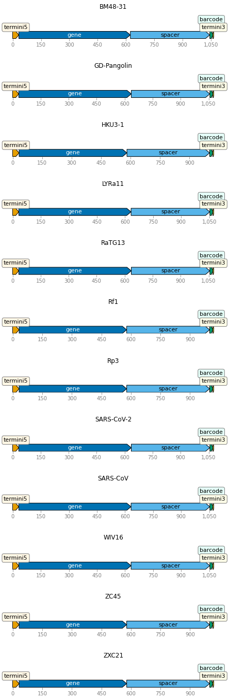


Write out the specs used to parse the features (these are the same specs provided as `feature_parse_specs` when initializing `targets`, but with defaults filled in):


```python
print(targets.feature_parse_specs('yaml'))
```

    SARS-CoV-2: &id001
      query_clip5: 4
      query_clip3: 4
      termini5:
        filter:
          clip5: 4
          mutation_nt_count: 1
          mutation_op_count: null
          clip3: 0
        return: []
      gene:
        filter:
          mutation_nt_count: 45
          mutation_op_count: null
          clip5: 0
          clip3: 0
        return:
        - mutations
        - accuracy
      spacer:
        filter:
          mutation_nt_count: 1
          mutation_op_count: null
          clip5: 0
          clip3: 0
        return: []
      barcode:
        filter:
          mutation_nt_count: 0
          mutation_op_count: null
          clip5: 0
          clip3: 0
        return:
        - sequence
        - accuracy
      termini3:
        filter:
          clip3: 4
          mutation_nt_count: 1
          mutation_op_count: null
          clip5: 0
        return: []
    BM48-31: *id001
    GD-Pangolin: *id001
    HKU3-1: *id001
    LYRa11: *id001
    RaTG13: *id001
    Rf1: *id001
    Rp3: *id001
    SARS-CoV: *id001
    WIV16: *id001
    ZC45: *id001
    ZXC21: *id001
    


## CCS stats for PacBio runs
Read data frame with information on PacBio runs:


```python
pacbio_runs = (
    pd.read_csv(config['pacbio_runs'], dtype=str)
    .drop(columns=['subreads'])
    .assign(name=lambda x: x['library'] + '_' + x['run'],
            fastq=lambda x: config['ccs_dir'] + '/' + x['name'] + '_ccs.fastq.gz'
            )
    )

# we only have report files on the Hutch server, not for SRA download
if config['seqdata_source'] == 'HutchServer':
    pacbio_runs = (
        pacbio_runs
        .assign(report=lambda x: config['ccs_dir'] + '/' + x['name'] + '_report.txt')
        )
    report_col = 'report'
elif config['seqdata_source'] == 'SRA':
    report_col = None
else:
    raise ValueError(f"invalid `seqdata_source` {config['seqdata_source']}")

display(HTML(pacbio_runs.to_html(index=False)))
```


<table border="1" class="dataframe">
  <thead>
    <tr style="text-align: right;">
      <th>library</th>
      <th>run</th>
      <th>name</th>
      <th>fastq</th>
      <th>report</th>
    </tr>
  </thead>
  <tbody>
    <tr>
      <td>lib1</td>
      <td>200415_A</td>
      <td>lib1_200415_A</td>
      <td>results/ccs/lib1_200415_A_ccs.fastq.gz</td>
      <td>results/ccs/lib1_200415_A_report.txt</td>
    </tr>
    <tr>
      <td>lib1</td>
      <td>200415_B</td>
      <td>lib1_200415_B</td>
      <td>results/ccs/lib1_200415_B_ccs.fastq.gz</td>
      <td>results/ccs/lib1_200415_B_report.txt</td>
    </tr>
    <tr>
      <td>lib2</td>
      <td>200415_A</td>
      <td>lib2_200415_A</td>
      <td>results/ccs/lib2_200415_A_ccs.fastq.gz</td>
      <td>results/ccs/lib2_200415_A_report.txt</td>
    </tr>
    <tr>
      <td>lib2</td>
      <td>200415_B</td>
      <td>lib2_200415_B</td>
      <td>results/ccs/lib2_200415_B_ccs.fastq.gz</td>
      <td>results/ccs/lib2_200415_B_report.txt</td>
    </tr>
  </tbody>
</table>


Create an object that summarizes the `ccs` runs:


```python
ccs_summaries = alignparse.ccs.Summaries(pacbio_runs,
                                         report_col=report_col,
                                         ncpus=config['max_cpus'],
                                         )
```

If available, plot statistics on the number of ZMWs for each run:


```python
if ccs_summaries.has_zmw_stats():
    p = ccs_summaries.plot_zmw_stats()
    p = p + theme(panel_grid_major_x=element_blank())  # no vertical grid lines
    _ = p.draw()
else:
    print('No ZMW stats available.')
```


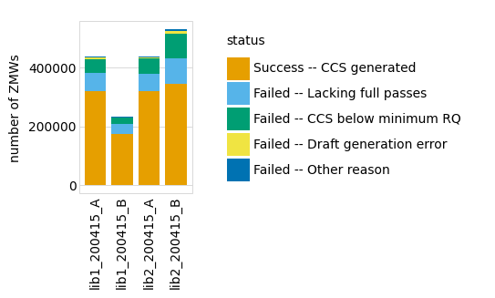


Plot statistics on generated CCSs: their length, number of subread passes, and accuracy (as reported by the `ccs` program):


```python
for variable in ['length', 'passes', 'accuracy']:
    if ccs_summaries.has_stat(variable):
        p = ccs_summaries.plot_ccs_stats(variable, maxcol=7, bins=25)
        p = p + theme(panel_grid_major_x=element_blank())  # no vertical grid lines
        _ = p.draw()
    else:
        print(f"No {variable} statistics available.")
```


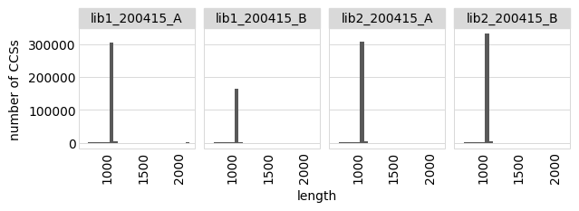


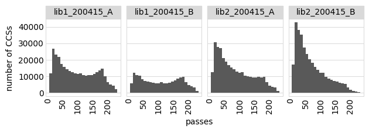


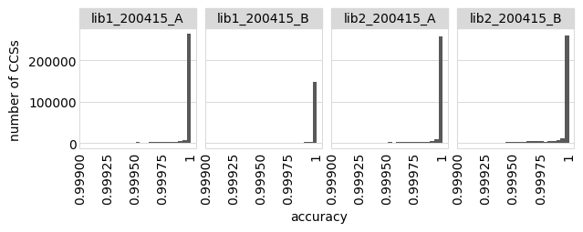


## Align CCSs to amplicons
We now align the CCSs to the amplicon and parse features from the resulting alignments using the specs above.

First, we initialize an `alignparse.minimap2.Mapper` to align the reads to SAM files:


```python
mapper = alignparse.minimap2.Mapper(alignparse.minimap2.OPTIONS_CODON_DMS)

print(f"Using `minimap2` {mapper.version} with these options:\n" +
      ' '.join(mapper.options))
```

    Using `minimap2` 2.17-r941 with these options:
    -A2 -B4 -O12 -E2 --end-bonus=13 --secondary=no --cs


Next, we use `Targets.align_and_parse` to create the alignments and parse them:


```python
readstats, aligned, filtered = targets.align_and_parse(
        df=pacbio_runs,
        mapper=mapper,
        outdir=config['process_ccs_dir'],
        name_col='run',
        group_cols=['name', 'library'],
        queryfile_col='fastq',
        overwrite=True,
        ncpus=config['max_cpus'],
        )
```

First, examine the read stats from the alignment / parsing, both extracting alignment target name and getting stats aggregated by target:


```python
readstats = (
    readstats
    .assign(category_all_targets=lambda x: x['category'].str.split().str[0],
            target=lambda x: x['category'].str.split(None, 1).str[1],
            valid=lambda x: x['category_all_targets'] == 'aligned')
    )
```

Now plot the read stats by run (combining all targets and libraries within a run):


```python
ncol = 7
p = (
    ggplot(readstats
           .groupby(['name', 'category_all_targets', 'valid'])
           .aggregate({'count': 'sum'})
           .reset_index(),
           aes('category_all_targets', 'count', fill='valid')) +
    geom_bar(stat='identity') +
    facet_wrap('~ name', ncol=ncol) +
    theme(axis_text_x=element_text(angle=90),
          figure_size=(1.85 * min(ncol, len(pacbio_runs)),
                       2 * math.ceil(len(pacbio_runs) / ncol)),
          panel_grid_major_x=element_blank(),
          legend_position='none',
          ) +
    scale_fill_manual(values=CBPALETTE)
    )
_ = p.draw()
```


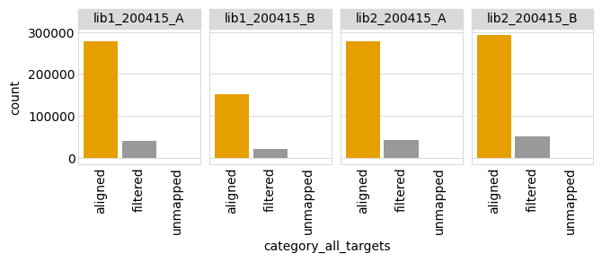


And the read stats by library (combining all targets and runs within a library):


```python
p = (
    ggplot(readstats
           .groupby(['library', 'category_all_targets', 'valid'])
           .aggregate({'count': 'sum'})
           .reset_index(), 
           aes('category_all_targets', 'count', fill='valid')) +
    geom_bar(stat='identity') +
    facet_wrap('~ library', nrow=1) +
    theme(axis_text_x=element_text(angle=90),
          figure_size=(1.5 * pacbio_runs['library'].nunique(), 2),
          panel_grid_major_x=element_blank(),
          legend_position='none',
          ) +
    scale_fill_manual(values=CBPALETTE)
    )
_ = p.draw()
```


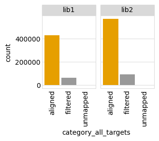


And the number of reads by target (combining all libraries and runs for a target):


```python
p = (
    ggplot(readstats
           .groupby(['target'])
           .aggregate({'count': 'sum'})
           .reset_index(), 
           aes('target', 'count')) +
    geom_point(stat='identity', size=3) +
    theme(axis_text_x=element_text(angle=90),
          figure_size=(0.3 * readstats['target'].nunique(), 2),
          panel_grid_major_x=element_blank(),
          ) +
    scale_y_log10(name='number of reads')
    )
_ = p.draw()
```


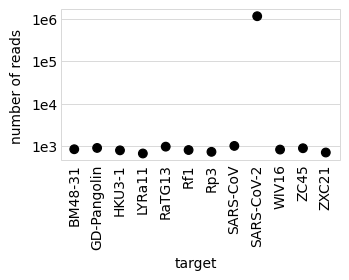


And read stats by target (combining all libraries and runs for a target):


```python
p = (
    ggplot(readstats
           .groupby(['target', 'valid'])
           .aggregate({'count': 'sum'})
           .reset_index()
           .assign(total=lambda x: x.groupby('target')['count'].transform('sum'),
                   frac=lambda x: x['count'] / x['total'],
                   ), 
           aes('target', 'frac', fill='valid')) +
    geom_bar(stat='identity') +
    theme(axis_text_x=element_text(angle=90),
          figure_size=(0.5 * readstats['target'].nunique(), 2),
          panel_grid_major_x=element_blank(),
          ) +
    scale_fill_manual(values=CBPALETTE)
    )
_ = p.draw()
```


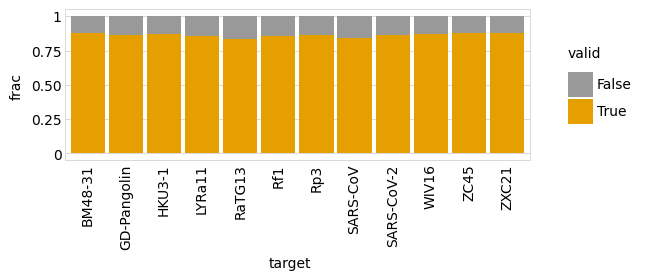


Now let's see **why** we filtered the reads.
First, we do some transformations on the `filtered` dict returned by `Targets.align_and_parse`.
Then we count up the number of CCSs filtered for each reason, and group together "unusual" reasons that represent less than some fraction of all filtering.
For now, we group together all targets to the stats represent all targets combined:


```python
other_cutoff = 0.02  # group as "other" reasons with <= this frac

filtered_df = (
    pd.concat(df.assign(target=target) for target, df in filtered.items())
    .groupby(['library', 'name', 'run', 'filter_reason'])
    .size()
    .rename('count')
    .reset_index()
    .assign(tot_reason_frac=lambda x: (x.groupby('filter_reason')['count']
                                       .transform('sum')) / x['count'].sum(),
            filter_reason=lambda x: numpy.where(x['tot_reason_frac'] > other_cutoff,
                                                x['filter_reason'],
                                                'other')
            )
    )
```

Now plot the filtering reason for all runs:


```python
ncol = 7
nreasons = filtered_df['filter_reason'].nunique()

p = (
    ggplot(filtered_df, aes('filter_reason', 'count')) +
    geom_bar(stat='identity') +
    facet_wrap('~ name', ncol=ncol) +
    theme(axis_text_x=element_text(angle=90),
          figure_size=(0.25 * nreasons * min(ncol, len(pacbio_runs)),
                       2 * math.ceil(len(pacbio_runs) / ncol)),
          panel_grid_major_x=element_blank(),
          )
    )
_ = p.draw()
```


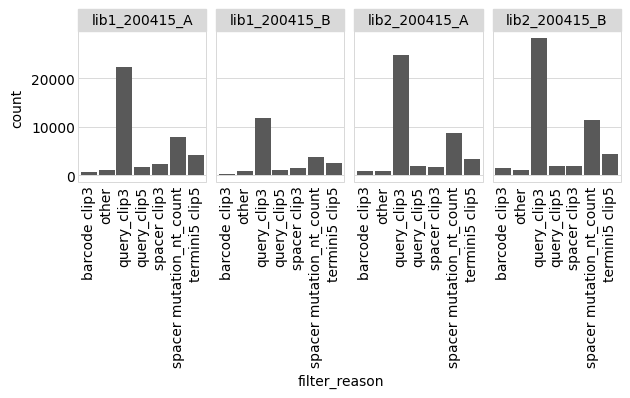


Now make a similar plot to above, but combine all the runs for each library:


```python
p = (
    ggplot(filtered_df
           .groupby(['library', 'filter_reason'])
           .aggregate({'count': 'sum'})
           .reset_index(),
           aes('filter_reason', 'count')) +
    geom_bar(stat='identity') +
    facet_wrap('~ library', nrow=1) +
    theme(axis_text_x=element_text(angle=90),
          figure_size=(0.3 * nreasons * pacbio_runs['library'].nunique(), 2),
          panel_grid_major_x=element_blank(),
          )
    )
_ = p.draw()
```


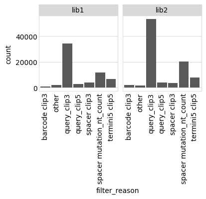


Finally, we take the successfully parsed alignments and read them into a data frame, keeping track of the target that each CCS aligns to.
We also drop the pieces of information we won't use going forward, and rename a few columns:


```python
aligned_df = (
    pd.concat(df.assign(target=target) for target, df in aligned.items())
    .drop(columns=['query_clip5', 'query_clip3', 'run','name'])
    .rename(columns={'barcode_sequence': 'barcode'})
    )

print(f"First few lines of information on the parsed alignments:")
display(HTML(aligned_df.head().to_html(index=False)))
```

    First few lines of information on the parsed alignments:


<table border="1" class="dataframe">
  <thead>
    <tr style="text-align: right;">
      <th>library</th>
      <th>query_name</th>
      <th>gene_mutations</th>
      <th>gene_accuracy</th>
      <th>barcode</th>
      <th>barcode_accuracy</th>
      <th>target</th>
    </tr>
  </thead>
  <tbody>
    <tr>
      <td>lib1</td>
      <td>m54228_200414_185350/4391490/ccs</td>
      <td></td>
      <td>1.0</td>
      <td>ATTTCCATCAAATTAA</td>
      <td>1.0</td>
      <td>BM48-31</td>
    </tr>
    <tr>
      <td>lib1</td>
      <td>m54228_200414_185350/5243143/ccs</td>
      <td></td>
      <td>1.0</td>
      <td>GCGCTGTACCCTCTGG</td>
      <td>1.0</td>
      <td>BM48-31</td>
    </tr>
    <tr>
      <td>lib1</td>
      <td>m54228_200414_185350/5243413/ccs</td>
      <td></td>
      <td>1.0</td>
      <td>TTCAATTAAGTCCGCC</td>
      <td>1.0</td>
      <td>BM48-31</td>
    </tr>
    <tr>
      <td>lib1</td>
      <td>m54228_200414_185350/5505876/ccs</td>
      <td></td>
      <td>1.0</td>
      <td>GTTTCACTGTGATATA</td>
      <td>1.0</td>
      <td>BM48-31</td>
    </tr>
    <tr>
      <td>lib1</td>
      <td>m54228_200414_185350/5636186/ccs</td>
      <td>T355C</td>
      <td>1.0</td>
      <td>CAGCTAATACTTCTCC</td>
      <td>1.0</td>
      <td>BM48-31</td>
    </tr>
  </tbody>
</table>


## Write valid CCSs

Write the processed CCSs to a file:


```python
aligned_df.to_csv(config['processed_ccs_file'], index=False)

print("Barcodes and mutations for valid processed CCSs "
      f"have been written to {config['processed_ccs_file']}.")
```

    Barcodes and mutations for valid processed CCSs have been written to results/process_ccs/processed_ccs.csv.


In the next notebook, we analyze these processed CCSs to build the variants.
