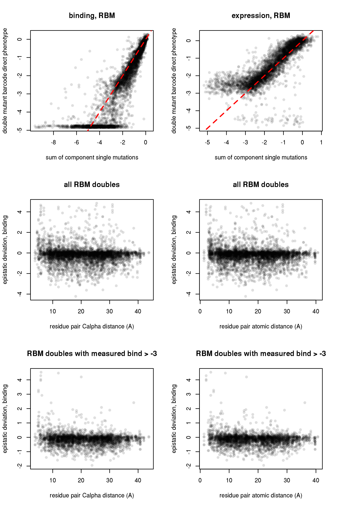
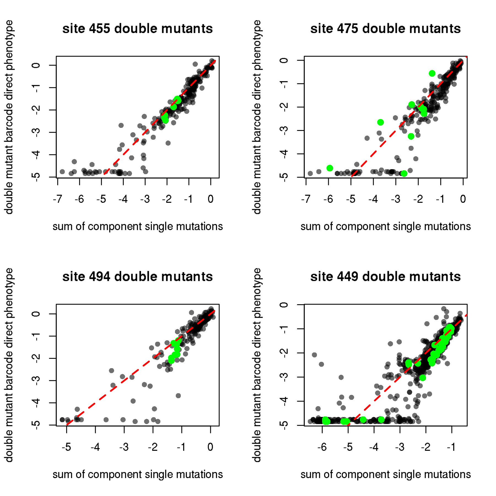

Relationship between DMS data and sarbecovirus RBD natural diversity
================
Tyler Starr
5/18/2020

This notebook analyzes the mutational tolerance of residues within
epitopes of different monoclonal antibodies

## Setup

``` r
require("knitr")
knitr::opts_chunk$set(echo = T)
knitr::opts_chunk$set(dev.args = list(png = list(type = "cairo")))

#list of packages to install/load
packages = c("yaml","data.table","tidyverse","gridExtra","bio3d")
#install any packages not already installed
installed_packages <- packages %in% rownames(installed.packages())
if(any(installed_packages == F)){
  install.packages(packages[!installed_packages])
}
#load packages
invisible(lapply(packages, library, character.only=T))

#read in config file
config <- read_yaml("config.yaml")

#read in file giving concordance between RBD numbering and SARS-CoV-2 Spike numbering
RBD_sites <- data.table(read.csv(file="data/RBD_sites.csv",stringsAsFactors=F))

#make output directory
if(!file.exists(config$sarbecovirus_diversity_dir)){
  dir.create(file.path(config$sarbecovirus_diversity_dir))
}
```

Session info for reproducing environment:

``` r
sessionInfo()
```

    ## R version 3.6.1 (2019-07-05)
    ## Platform: x86_64-pc-linux-gnu (64-bit)
    ## Running under: Ubuntu 14.04.5 LTS
    ## 
    ## Matrix products: default
    ## BLAS/LAPACK: /app/easybuild/software/OpenBLAS/0.2.18-GCC-5.4.0-2.26-LAPACK-3.6.1/lib/libopenblas_prescottp-r0.2.18.so
    ## 
    ## locale:
    ##  [1] LC_CTYPE=en_US.UTF-8       LC_NUMERIC=C              
    ##  [3] LC_TIME=en_US.UTF-8        LC_COLLATE=en_US.UTF-8    
    ##  [5] LC_MONETARY=en_US.UTF-8    LC_MESSAGES=en_US.UTF-8   
    ##  [7] LC_PAPER=en_US.UTF-8       LC_NAME=C                 
    ##  [9] LC_ADDRESS=C               LC_TELEPHONE=C            
    ## [11] LC_MEASUREMENT=en_US.UTF-8 LC_IDENTIFICATION=C       
    ## 
    ## attached base packages:
    ## [1] stats     graphics  grDevices utils     datasets  methods   base     
    ## 
    ## other attached packages:
    ##  [1] bio3d_2.3-4       gridExtra_2.3     forcats_0.4.0    
    ##  [4] stringr_1.4.0     dplyr_0.8.3       purrr_0.3.2      
    ##  [7] readr_1.3.1       tidyr_0.8.3       tibble_2.1.3     
    ## [10] ggplot2_3.2.0     tidyverse_1.2.1   data.table_1.12.2
    ## [13] yaml_2.2.0        knitr_1.23       
    ## 
    ## loaded via a namespace (and not attached):
    ##  [1] Rcpp_1.0.1       cellranger_1.1.0 pillar_1.4.2     compiler_3.6.1  
    ##  [5] tools_3.6.1      digest_0.6.20    lubridate_1.7.4  jsonlite_1.6    
    ##  [9] evaluate_0.14    nlme_3.1-140     gtable_0.3.0     lattice_0.20-38 
    ## [13] pkgconfig_2.0.2  rlang_0.4.0      cli_1.1.0        rstudioapi_0.10 
    ## [17] parallel_3.6.1   haven_2.1.1      xfun_0.7         withr_2.1.2     
    ## [21] xml2_1.2.0       httr_1.4.0       hms_0.4.2        generics_0.0.2  
    ## [25] grid_3.6.1       tidyselect_0.2.5 glue_1.3.1       R6_2.4.0        
    ## [29] readxl_1.3.1     rmarkdown_1.13   modelr_0.1.4     magrittr_1.5    
    ## [33] backports_1.1.4  scales_1.0.0     htmltools_0.3.6  rvest_0.3.4     
    ## [37] assertthat_0.2.1 colorspace_1.4-1 stringi_1.4.3    lazyeval_0.2.2  
    ## [41] munsell_0.5.0    broom_0.5.2      crayon_1.3.4

Read in tables of variant effects on binding and expression for single
mutations to the SARS-CoV-2 RBD and for homolog RBDs.

``` r
homolog_measurements <- data.table(read.csv(file=config$homolog_effects_file,stringsAsFactors = F))
mutants <- data.table(read.csv(file=config$single_mut_effects_file,stringsAsFactors = F))

#rename mutants site indices to prevent shared names with RBD_sites, simplifying some downstream calculations that cross-index these tables
setnames(mutants, "site_RBD", "RBD_site");setnames(mutants, "site_SARS2", "SARS2_site")

#add color column to homologs, by clade
homolog_measurements$clade_color <- as.character(NA); homolog_measurements[clade=="Clade 1",clade_color := "#EF4136"]; homolog_measurements[clade=="Clade 2",clade_color := "#009444"]; homolog_measurements[clade=="Clade 3",clade_color := "#EE2A7B"]; homolog_measurements[clade=="SARS-CoV-2",clade_color := "#2E3192"]

#add mean, max, min mut effects per site annotations
RBD_sites[,mean_bind := mean(mutants[SARS2_site==site_SARS2 & wildtype != mutant & mutant != "*",bind_avg],na.rm=T),by=site_SARS2]
RBD_sites[,max_bind := max(mutants[SARS2_site==site_SARS2 & wildtype != mutant & mutant != "*",bind_avg],na.rm=T),by=site_SARS2]
RBD_sites[,min_bind := min(mutants[SARS2_site==site_SARS2 & wildtype != mutant & mutant != "*",bind_avg],na.rm=T),by=site_SARS2]

RBD_sites[,mean_expr := mean(mutants[SARS2_site==site_SARS2 & wildtype != mutant & mutant != "*",expr_avg],na.rm=T),by=site_SARS2]
RBD_sites[,max_expr := max(mutants[SARS2_site==site_SARS2 & wildtype != mutant & mutant != "*",expr_avg],na.rm=T),by=site_SARS2]
RBD_sites[,min_expr := min(mutants[SARS2_site==site_SARS2 & wildtype != mutant & mutant != "*",expr_avg],na.rm=T),by=site_SARS2]
```

## Analysis of sarbecovirus RBD amino acid diversity

Read in an alignment of sarbecovirus RBD sequences. Many of these
sequences are so-called “Clade 2” sequences, which have not been shown
to bind human or any other ACE2 – so whether they evolve under
constraint for ACE2-binding is unclear (and even if so, bat ACE2 is also
under elevated positive selection, so even if binding bat ACE2s, these
viruses could have quite odd specificities\!). Therefore, we consider
the entire sarbecovirus alignment, and one restricted to the SARS-CoV-2
and SARS-CoV-1 clade sequences \[this alignment is only 12 sequences :(
\]. The full alignment is probably relevant to mutational constraint on
expression (since we see that the Clade 2 and 3 sequencs in our homolog
panel still have the same expression range as the ACE2-binding
variants), while the restricted alignment is probably more relevant to
mutational constraint on binding (since the Clade 2 and 3 sequencs in
our homolog panel had no detectable binding to huACE2.)

Within each of these alignments, we compute the entropy of the alignment
column (and the related value effective amino acids, (N<sub>eff</sub>),
and compare this value to the average effect of mutations at the site
from our DMS data for binding and expression.


How do the effects of individual amino acid differences among these
homologs compare to the overall DFE? How does this differ among clades?
We iterate through our aligned sequences, and compile the amino acid
differences observed between SARS-CoV-2 and sequences within each clade.
We then look at the distribution of effects of these mutations on
binding and expression within each clade, and compare it to the overall
DFE for mutational effects on binding and expression.

Overall, we see that the amino acid variants that accumulated in each
sarbecovirus clade are less deleterious for binding and expression than
the overall DFE, suggesting that overall, the amino acid variation
sampled in nature is subjected to somoe purifying selection relative to
the overall DFE for these phenotypes (or other phenotypes that correlate
with these measurements). I am a bit surprised to see that the amino
acid variants sampled in Clades 2 and 3 are not skewed toward
deleterious amino acids more than we see here\! Since these have not
been shown to bind ACE2s, it is unclear whether they are operating under
the same selective constraint as sequences in Clade 1 and the SARS-CoV-2
clade. It is important to note that this analysis is *not* taking into
account two large deletions in the RBM loops that are present in these
Clade 2+3 sequences, which may explain their reduced affinity for human
ACE2.


Let’s make the same plots, but focusing only on residues within the RBM.
We do have strong expectation that the core RBD is evolving under
consistent constraints in all of these viral isolates, because we think
the primary constraint on the core RBD is basic thermodynamic stabilitiy
(at least as far as is captured in our assay – we do not take into
account quaternary contacts or immune selection). In contrast, the RBM
mediates receptor contact, and so if there is variation in receptor
usage (or at the very least, variation in bat versus e.g. human ACE2s),
differences in selective pressure leading to different amino acid usage
across these sarbecovirus clades may be more apparent in the RBM.

Indeed, perhaps more aligned with what I expected to see above, among
RBM mutations (excluding indels which we are not incorporating), Clade 2
sequences (unclear for Clade 3?) may appear to fix more amino acid
mutations that we predict to be deleterious for binding human ACE2.


Also, let’s output a table of amino acid variant seen in the SARS-CoV-2
clade and Clade 1 that have large effects on binding – let’s look at
mutations with \< -0.5 binding effect in the SARS-CoV-2 clade, and \< -1
in Clade 1. Tables are sorted by homolog (so, the same amino acid can
show up multiple times in the table if found in \>1 homolog).

We can see below that within the SARS-Cov-2 clade, two amino acids found
in RaTG13 have deleterious effects on binding. RaTG13 is a bat virus and
*does* have reduced human ACE2 affinity in our assay, so these amino
acid differences may contribute to that difference.

| mutation | bind\_lib1 | bind\_lib2 | bind\_avg | expr\_avg | clade      | homolog                            |
| :------- | ---------: | ---------: | --------: | --------: | :--------- | :--------------------------------- |
| R403T    |     \-0.67 |     \-0.71 |    \-0.69 |    \-0.99 | cladeSARS2 | RaTG13\_MN996532                   |
| Y449F    |     \-1.01 |     \-1.15 |    \-1.08 |    \-0.03 | cladeSARS2 | RaTG13\_MN996532                   |
| N501D    |     \-2.40 |     \-2.44 |    \-2.42 |      0.08 | cladeSARS2 | RaTG13\_MN996532                   |
| Y505H    |     \-0.67 |     \-0.76 |    \-0.71 |      0.16 | cladeSARS2 | RaTG13\_MN996532                   |
| E484V    |     \-0.63 |     \-0.68 |    \-0.65 |    \-0.05 | cladeSARS2 | Pangolin\_GX-P2V\_EPI\_ISL\_410542 |
| Q493E    |     \-0.56 |     \-0.57 |    \-0.56 |    \-0.02 | cladeSARS2 | Pangolin\_GX-P2V\_EPI\_ISL\_410542 |

As seen in the table below, in Clade 1, sequences including SARS-CoV-1
have some amino acid variants that are deleterious in SARS-CoV-2. We can
dig in further to see whether these deleterious SARS-CoV-1 states are
truly shifted preferences, versus just offset by other affinity gains at
the interface. (And, future DMS in SARS-CoV-1 RBM could address this\!)
L455 and S494 are “key adaptations” in SARS-CoV-1 (Y442 and D480),
according to studies by e.g. Fang Li – so, should be a lot of prior
structural work we can look at to better understand what other
RBM/interface residues might be impacting amino acid preferences at
these sites between SARS-CoV-1 and 2.

| mutation | bind\_lib1 | bind\_lib2 | bind\_avg | expr\_avg | clade  | homolog                |
| :------- | ---------: | ---------: | --------: | --------: | :----- | :--------------------- |
| L455Y    |     \-1.48 |     \-1.52 |    \-1.50 |    \-0.10 | clade1 | SARS\_Urbani\_AY278741 |
| A475P    |     \-1.52 |     \-1.72 |    \-1.62 |    \-1.39 | clade1 | SARS\_Urbani\_AY278741 |
| S494D    |     \-0.96 |     \-1.23 |    \-1.10 |    \-0.61 | clade1 | SARS\_Urbani\_AY278741 |
| A475P    |     \-1.52 |     \-1.72 |    \-1.62 |    \-1.39 | clade1 | WIV1\_KF367457         |
| S494D    |     \-0.96 |     \-1.23 |    \-1.10 |    \-0.61 | clade1 | WIV1\_KF367457         |
| A475P    |     \-1.52 |     \-1.72 |    \-1.62 |    \-1.39 | clade1 | WIV16\_KT444582        |
| S494D    |     \-0.96 |     \-1.23 |    \-1.10 |    \-0.61 | clade1 | WIV16\_KT444582        |
| Y449F    |     \-1.01 |     \-1.15 |    \-1.08 |    \-0.03 | clade1 | LYRa11\_KF569996       |
| A475P    |     \-1.52 |     \-1.72 |    \-1.62 |    \-1.39 | clade1 | LYRa11\_KF569996       |
| S494D    |     \-0.96 |     \-1.23 |    \-1.10 |    \-0.61 | clade1 | LYRa11\_KF569996       |
| A475P    |     \-1.52 |     \-1.72 |    \-1.62 |    \-1.39 | clade1 | Rs7327\_KY417151       |
| S494D    |     \-0.96 |     \-1.23 |    \-1.10 |    \-0.61 | clade1 | Rs7327\_KY417151       |
| A475P    |     \-1.52 |     \-1.72 |    \-1.62 |    \-1.39 | clade1 | Rs4231\_KY417146       |
| A475P    |     \-1.52 |     \-1.72 |    \-1.62 |    \-1.39 | clade1 | RsSHC014\_KC881005     |
| A475P    |     \-1.52 |     \-1.72 |    \-1.62 |    \-1.39 | clade1 | Rs4084\_KY417144       |

## Predicting (or failing to predict) homolog affinities from single mutant effect measurements

How well can we predict homolog affinities for human ACE2 based on our
individual mutational measurements? Try it three ways: 1) summing
mutational effects across all RBD positions, 2) just RBM positions, 3)
just ACE2 contact positions. (Expectation is: predictions of RaTG13 and
pangolin affinity might be decent, but clade1 and more distant sequences
will be bad). To give at least some semblence of uncertainty in our
predictions, I calculate the standard error of each single mutant effect
in our dataset as just the SEM from the two replicate measurements – I
then propagate the SEM for the addition of the values.

``` r
mutants[,bind_SEM := sd(c(bind_lib1,bind_lib2))/sqrt(2),by=mutation]
mutants[,expr_SEM := sd(c(expr_lib1,expr_lib2))/sqrt(2),by=mutation]

homolog_measurements$alignment_name <- c("SARS-CoV-2_MN908947","Pangolin_GD-consensus_EPI_ISL_410544-Lam2020_supplement","RaTG13_MN996532","SARS_Urbani_AY278741","WIV16_KT444582",
                                         "LYRa11_KF569996","ZC45_MG772933","ZXC21_MG772934","HKU3-1_DQ022305","Rf1_DQ412042","Rp3_DQ071615","BM48-31_NC014470")

for(i in 1:nrow(homolog_measurements)){
  subs <- c()
  for(j in 1:ncol(alignment$ali)){
    if(!(alignment$ali[which(alignment$id==homolog_measurements[i,alignment_name]),j] %in% c("-","X")) & alignment$ali[1,j] != alignment$ali[which(alignment$id==homolog_measurements[i,alignment_name]),j]){
      subs <- c(subs,paste(alignment$ali[1,j],j,alignment$ali[which(alignment$id==homolog_measurements[i,alignment_name]),j],sep=""))
    }
  }
  homolog_measurements$n_diff[i] <- length(subs)
  homolog_measurements$sum_bind[i] <- sum(mutants[mutation_RBD %in% subs,bind_avg])
  homolog_measurements$SEM_sum_bind[i] <- sqrt(sum(mutants[mutation_RBD %in% subs,bind_SEM]^2))
  homolog_measurements$sum_expr[i] <- sum(mutants[mutation_RBD %in% subs,expr_avg])
  homolog_measurements$SEM_sum_expr[i] <- sqrt(sum(mutants[mutation_RBD %in% subs,expr_SEM]^2))
}

for(i in 1:nrow(homolog_measurements)){
  subs <- c()
  for(j in RBD_sites[RBM==T,site_RBD]){
    if(!(alignment$ali[which(alignment$id==homolog_measurements[i,alignment_name]),j] %in% c("-","X")) & alignment$ali[1,j] != alignment$ali[which(alignment$id==homolog_measurements[i,alignment_name]),j]){
      subs <- c(subs,paste(alignment$ali[1,j],j,alignment$ali[which(alignment$id==homolog_measurements[i,alignment_name]),j],sep=""))
    }
  }
  homolog_measurements$n_diff_RBM[i] <- length(subs)
  homolog_measurements$sum_bind_RBM[i] <- sum(mutants[mutation_RBD %in% subs,bind_avg])
  homolog_measurements$SEM_sum_bind_RBM[i] <- sqrt(sum(mutants[mutation_RBD %in% subs,bind_SEM]^2))
  homolog_measurements$sum_expr_RBM[i] <- sum(mutants[mutation_RBD %in% subs,expr_avg])
  homolog_measurements$SEM_sum_expr_RBM[i] <- sqrt(sum(mutants[mutation_RBD %in% subs,expr_SEM]^2))
}

for(i in 1:nrow(homolog_measurements)){
  subs <- c()
  for(j in RBD_sites[SARS2_ACE2_contact==T | SARS1_ACE2_contact==T,site_RBD]){
    if(!(alignment$ali[which(alignment$id==homolog_measurements[i,alignment_name]),j] %in% c("-","X")) & alignment$ali[1,j] != alignment$ali[which(alignment$id==homolog_measurements[i,alignment_name]),j]){
      subs <- c(subs,paste(alignment$ali[1,j],j,alignment$ali[which(alignment$id==homolog_measurements[i,alignment_name]),j],sep=""))
    }
  }
  homolog_measurements$n_diff_contact[i] <- length(subs)
  homolog_measurements$sum_bind_contact[i] <- sum(mutants[mutation_RBD %in% subs,bind_avg])
  homolog_measurements$SEM_sum_bind_contact[i] <- sqrt(sum(mutants[mutation_RBD %in% subs,bind_SEM]^2))
  homolog_measurements$sum_expr_contact[i] <- sum(mutants[mutation_RBD %in% subs,expr_avg])
  homolog_measurements$SEM_sum_expr_contact[i] <- sqrt(sum(mutants[mutation_RBD %in% subs,expr_SEM]^2))
}

kable(homolog_measurements[,.(homolog,bind_lib1,bind_lib2,bind_avg,n_diff,sum_bind,sum_expr,n_diff_RBM,sum_bind_RBM,sum_expr_RBM,n_diff_contact,sum_bind_contact,sum_expr_contact)])
```

| homolog     | bind\_lib1 | bind\_lib2 | bind\_avg | n\_diff | sum\_bind | sum\_expr | n\_diff\_RBM | sum\_bind\_RBM | sum\_expr\_RBM | n\_diff\_contact | sum\_bind\_contact | sum\_expr\_contact |
| :---------- | ---------: | ---------: | --------: | ------: | --------: | --------: | -----------: | -------------: | -------------: | ---------------: | -----------------: | -----------------: |
| SARS-CoV-2  |   \-0.0090 |   \-0.0067 |  \-0.0079 |       0 |      0.00 |      0.00 |            0 |           0.00 |           0.00 |                0 |               0.00 |               0.00 |
| GD-Pangolin |     0.0741 |     0.1337 |    0.1039 |       6 |      0.06 |      0.24 |            1 |           0.30 |           0.16 |                2 |               0.13 |               0.24 |
| RaTG13      |   \-2.1698 |   \-2.2849 |  \-2.2274 |      21 |    \-5.31 |    \-1.76 |           17 |         \-4.57 |         \-0.86 |                7 |             \-4.36 |             \-1.02 |
| SARS-CoV-1  |   \-0.2099 |   \-0.2898 |  \-0.2498 |      51 |    \-8.58 |    \-7.04 |           35 |         \-7.97 |         \-7.76 |               11 |             \-4.14 |             \-3.18 |
| WIV16       |   \-0.0174 |   \-0.0544 |  \-0.0359 |      46 |    \-7.73 |    \-6.81 |           33 |         \-7.13 |         \-7.64 |                9 |             \-3.05 |             \-2.41 |
| LYRa11      |   \-0.4724 |   \-0.5535 |  \-0.5129 |      49 |    \-8.58 |    \-6.52 |           34 |         \-7.97 |         \-7.07 |               10 |             \-4.14 |             \-2.49 |
| ZC45        |   \-4.7507 |   \-4.8264 |  \-4.7886 |      55 |   \-26.89 |   \-12.62 |           32 |        \-23.46 |         \-8.01 |               12 |            \-12.57 |             \-0.49 |
| ZXC21       |   \-4.7339 |   \-4.8346 |  \-4.7842 |      55 |   \-26.02 |   \-12.43 |           32 |        \-22.59 |         \-7.82 |               12 |            \-12.57 |             \-0.49 |
| HKU3-1      |   \-4.7088 |   \-4.7966 |  \-4.7527 |      54 |   \-25.85 |   \-12.27 |           31 |        \-23.18 |         \-8.08 |               12 |            \-13.37 |             \-0.61 |
| Rf1         |   \-4.7358 |   \-4.8070 |  \-4.7714 |      53 |   \-27.08 |   \-12.83 |           31 |        \-23.72 |         \-8.33 |               12 |            \-12.57 |             \-0.49 |
| Rp3         |   \-4.7356 |   \-4.8281 |  \-4.7818 |      53 |   \-24.33 |   \-12.29 |           30 |        \-21.66 |         \-8.10 |               11 |            \-11.06 |             \-0.33 |
| BM48-31     |   \-4.7525 |   \-4.8290 |  \-4.7908 |      56 |    \-9.18 |    \-7.22 |           36 |         \-7.72 |         \-5.13 |               11 |             \-6.32 |             \-0.14 |

Below, we plot the sum of binding and expression effects versus the
number of mutations present in a genotype for RBM residues. Once again,
this does not take into account deletions within RBM loops present in
Clade2 and Clade3 sequences. (Rationale for using RBM instead of whole
RBD, is that Letko et al. showed RBM is the minimal region whose chimera
is sufficient to confer a clade 2 or 3 sequence ACE2-mediated entry –
that is, putting the Clade 1 consensus RBM onto a clade 2 or 3 core RBD
is sufficient to allow ACE2-mediated cellular entry)

As we probably expected, we can see that the number of differences is a
primary determinant of how “deleterious” a sequence is predicted to be –
both for binding and expression – which probably more than anything else
reflects epistasis and shifting preferences in the more distant
backgrounds. So, it might be that these predictions work ok for within
the SARS-CoV-2 clade where the number of differences is small – for
example, within the SARS-CoV-2 clade GD Pangolin is correctly predicted
to have high affinity while RaTG13 is correctly predicted to have lower
affinity. But in other clades, the number of differences is just too
large for the sum to be relevant. However, maybe within other clades,
the *relative* binding predicted for one e.g. clade 1 sequence versus
another predicted is useful? E.g. in Clade 1, we do predict that WIV16
has higher affinity than SARS-CoV-1 or LYRa11, though we don’t also
successfully predict that SARS-CoV-1 has higher affinity than LYRa11.

Last, the placement of BM48-31 is quite odd\! This says that (besides
its deletion), the amino acid states its sampling aren’t really any less
compatible with huACE2 binding than those sampled in Clade 1? Honestly
kind of surprising. But, if we internally also normalize by the sum of
expression effects, BM48-31 is also predicted to have higher
expression-per-mutation than the Clade1 sequences, which perhaps impacts
its interpretation. But overall, this perhaps suggests that BM48-31 is
“closer” to ACE2 utilization than Clade 2 sequences. (e.g., maybe it
uses ACE2 in bats??)

Here are plots relating sum of mutational effects on binding and
expression to each other, to number of differences, and actual binding,
for all RBM differences. Points are colored by clade: purple (blue?) is
SARS-CoV-2 clade sequences, orange (red?) is Clade 1 (SARS-CoV-1 clade),
green is Clade 2 (deletions, have not been seen to use ACE2), magenta is
clade 3 (Bulgaria and Kenya isolates) (sorry my descriptions of colors
are probably wrong :/ let me know if the color scheme is hideous, I’ve
been known to pick terrible colors in the past – these are the colors I
included in our phylogeny figure):


And the same plots, for only ACE2-contact residue positions:


(What does it look like when we add in the other Clade 1/2/3 sequences
that we did not measure, but see where they fall on the predicted
binding versus expression plots? Particularly GX Pangolin)

Overall, my intpretation from this table/figures, is that our mutational
effects are perhaps useful for predictions of things very similiar to
our focal background (e.g. GD Pangolin, circulating strains), but that
because of epistasis, mutational preferences are quite different in
other sarbecovirus clades, which complicates prediction of ability of
unseen RBDs to bind ACE2. (This perhaps can mentally be loosely
accounted for by taking into account the total number of amino acid
differences and also their effect on expression, but that’s a lot of
weirdness to normalize for so overall definitely not a direction to
push.) These are probably not the figures we’ll want to use to
communicate this, although I do think this is an interestning conclusion
to communicate (that preferences have shifted between SARS-CoV-2 and -1)

## Epistasis in library double mutants and relation to natural diversity patterns

*Note* though I do see some structurally interesting epistasis when
analyzing double mutant barcodes compared to the effects of their
component single mutations, I didn’t really see anything interesting
below as it relates to the goal I intended toward with putting this
anlaysis in this script. Therefore, I’ve moved the “structurally
relevant” component of this script to the structure\_function notebook,
where it might be elaborated in that context. I keep the code here
related to what I tried w.r.t. natural diversity in case I decide to
come back to it, but this will probably eventually be eliminated.

Do we see certain positions enriched for epistatic deviations in our
(sparse) sampling of double mutants? How do these positions map to the
positions we see varying in Clade1 versus SARS-CoV-2 clade sequences?
(This analysis might make more sense ported over to structure\_function,
esp if it doesn’t end up linking up with natural diversity patterns)

First, we take our barcode measurements for double mutants, and add to
the data table the component single mutation effect scores.

``` r
#read in per-bc func scores
bc_bind <- data.table(read.csv(file=config$global_epistasis_binding_file,stringsAsFactors = F))[,.(library, target, barcode, variant_call_support, avgcount, log10Ka, delta_log10Ka, log10SE, response, baseline, nMSR, variant_class, aa_substitutions, n_aa_substitutions)]
bc_expr <- data.table(read.csv(file=config$global_epistasis_expr_file,stringsAsFactors = F))[,.(library, target, barcode, variant_call_support, total_count, ML_meanF, delta_ML_meanF, var_ML_meanF, variant_class, aa_substitutions, n_aa_substitutions)]

bc_dbl <- merge(bc_bind[n_aa_substitutions==2 & variant_class == ">1 nonsynonymous",], bc_expr[n_aa_substitutions==2 & variant_class == ">1 nonsynonymous",], sort=F)

#make columns breaking up the two substitutions
bc_dbl[,mut1 := strsplit(aa_substitutions, split=" ")[[1]][1], by=c("library","barcode")]
bc_dbl[,mut2 := strsplit(aa_substitutions, split=" ")[[1]][2], by=c("library","barcode")]

#change mutations to be Spike numbering from RBD numbering
bc_dbl[,mut1 := mutants[mutation_RBD==mut1,mutation],by=c("library","barcode")]
bc_dbl[,mut2 := mutants[mutation_RBD==mut2,mutation],by=c("library","barcode")]

#pull single mutant effects into table
bc_dbl[,c("mut1_bind","mut2_bind") := list(mutants[mutation==mut1,bind_avg],mutants[mutation==mut2,bind_avg]),by=c("library","barcode")]
bc_dbl[,c("mut1_expr","mut2_expr") := list(mutants[mutation==mut1,expr_avg],mutants[mutation==mut2,expr_avg]),by=c("library","barcode")]
```

Next, let’s take a look at the distribution of these double mutant
binding phenotypes, and their relation to the component single
mutational effects. We can see that for many double mutant barcodes, the
sum of component singles predicts the double mutant phenotype quite
nicely, both fo binding and even for expression. Let’s focus on the
binding phenotypes, as they are better correlated and have less weird
shape components (e.g. the censoring is a much tighter/defined boundary,
compared to the loose scatter boundary in expression, and we don’t have
those annoying false-negative observed phenotypes like we do with
expression, since these are weeded out by the RBD+ sort). The green
lines on the binding plot describe the positive epistasis cutoffs we use
in the next section.


We are primarily interested in *positive* epistasis (that is, observed
double mutants that bind better than predicted from the component single
mutations), and we probably don’t care about positive epistasis if the
double mutant is still severely deleterious. Therefore, let’s check out
double mutant combinations whose observed binding phenotype is \> -2
that exhibit positive epistasis in which the double mutant binds with
delta log<sub>10</sub>(*K*<sub>A,app</sub>) of at least 1 units stronger
than predicted from the component singles. (So, the difference in
observed - predicted binding is \>1). These are points in the plot above
in the upper-left quadrant defined by the dashed green lines.

    ##      avgcount  mut1  mut2 mut1_bind mut2_bind delta_log10Ka epistasis_bind
    ##   1:    73.32 G416P N422L     -4.40     -4.80         -0.76           8.44
    ##   2:    28.23 F429P G431C     -4.47     -2.77         -0.71           6.53
    ##   3:   169.37 F429P G431C     -4.47     -2.77         -0.81           6.43
    ##   4:    10.78 G416V F515K     -4.60     -1.46         -0.36           5.70
    ##   5:    16.44 C432R N437M     -4.80     -1.62         -1.29           5.13
    ##  ---                                                                      
    ## 167:    85.99 N334R R355F      0.00     -3.01         -1.99           1.02
    ## 168:    61.67 P412H D428N     -2.32      0.01         -1.30           1.01
    ## 169:     6.71 F429L N437K     -0.69     -0.78         -0.46           1.01
    ## 170:    10.42 D389W N437V     -0.25     -1.46         -0.70           1.01
    ## 171:    58.82 N422G K458S     -2.48     -0.04         -1.51           1.01
    ##      mut1_expr mut2_expr delta_ML_meanF
    ##   1:     -2.68     -2.54          -1.18
    ##   2:     -2.93     -2.65          -2.09
    ##   3:     -2.93     -2.65          -1.86
    ##   4:     -1.91     -3.07          -1.25
    ##   5:     -3.19     -2.02          -2.77
    ##  ---                                   
    ## 167:     -0.12     -2.56          -2.54
    ## 168:     -2.73      0.18          -2.18
    ## 169:     -2.17     -1.31          -2.17
    ## 170:     -0.77     -2.08          -2.42
    ## 171:     -2.56     -0.05          -2.33

Let’s see if there’s an enrichment of positive epistasis among close
contact positions. We use bio3d to return all pairwise distances between
RBD residues, and populate our table with the contact distance for the
residue pair mutated in each double mutant. We then look at the
relationship between epistasis scores and pairwise distance, for all
scores, and for those where the observed double mutant delta
log<sub>10</sub>(*K*<sub>A,app</sub>) is \> -3 (to avoid weirdness with
censored/boundary observations).

``` r
#ouput residue numbers for the mutant pair
bc_dbl[,c("site1","site2") := list(paste(strsplit(mut1,split="")[[1]][2:4],collapse=""),paste(strsplit(mut2,split="")[[1]][2:4],collapse="")),by=c("library","barcode")]

#read in RBD structure
pdb <- read.pdb(file="data/structures/ACE2-bound/6m0j.pdb")
```

    ##    PDB has ALT records, taking A only, rm.alt=TRUE

``` r
pdb_atoms <- pdb$atom

#make data frame giving pairwise distances -- either Calpha distances, or closest atomic distances
pdb_dists <- expand.grid(site1=RBD_sites$site_SARS2,site2=RBD_sites$site_SARS2)
pdb_dists <- pdb_dists[order(pdb_dists$site1, pdb_dists$site2),]
pdb_dists <- pdb_dists[pdb_dists$site1 < pdb_dists$site2,]

calc.dist <- function(x1,y1,z1,x2,y2,z2){ #function to calculate 3D distance from xyz coordinates
  return(sqrt((x2-x1)^2+(y2-y1)^2+(z2-z1)^2))
}

for(i in 1:nrow(pdb_dists)){
  if(pdb_dists[i,"site1"] %in% unique(pdb_atoms[pdb_atoms$chain=="E" & pdb_atoms$type=="ATOM","resno"]) & pdb_dists[i,"site2"] %in% unique(pdb_atoms[pdb_atoms$chain=="E" & pdb_atoms$type=="ATOM","resno"])){
    atoms1 <- pdb_atoms[pdb_atoms$chain=="E" & pdb_atoms$resno==pdb_dists[i,"site1"],]
    atoms2 <- pdb_atoms[pdb_atoms$chain=="E" & pdb_atoms$resno==pdb_dists[i,"site2"],]
    if(nrow(atoms1)>0 & nrow(atoms2)>0){
      pdb_dists$CA_dist[i] <- calc.dist(atoms1[atoms1$elety=="CA","x"],atoms1[atoms1$elety=="CA","y"],atoms1[atoms1$elety=="CA","z"],
                                        atoms2[atoms2$elety=="CA","x"],atoms2[atoms2$elety=="CA","y"],atoms2[atoms2$elety=="CA","z"])
      all_dists <- c()
      for(i1 in 1:nrow(atoms1)){for(i2 in 1:nrow(atoms2)){
        all_dists <- c(all_dists,calc.dist(atoms1[i1,"x"],atoms1[i1,"y"],atoms1[i1,"z"],atoms2[i2,"x"],atoms2[i2,"y"],atoms2[i2,"z"]))}}
      pdb_dists$min_dist[i] <- min(all_dists)
    }else{pdb_dists$CA_dist[i] <- NA;pdb_dists$min_dist[i] <- NA}
  }else{pdb_dists$CA_dist[i] <- NA;pdb_dists$min_dist[i] <- NA}
}
pdb_dists <- data.table(pdb_dists)

#add distances to dbl mut dataframe
bc_dbl$CA_dist <- sapply(1:nrow(bc_dbl), function(x) return(pdb_dists[site1==bc_dbl[x,site1] & site2==bc_dbl[x,site2],CA_dist]))
bc_dbl$min_dist <- sapply(1:nrow(bc_dbl), function(x) return(pdb_dists[site1==bc_dbl[x,site1] & site2==bc_dbl[x,site2],min_dist]))
```

We can see that plenty of positive epistatic pairs are distributed quite
far in the structure, suggesting nonspecific effects (or noise). But
plenty, including some we saw in the tables above, are at close 3D
contact\!


Next, let’s subset the double mutant info for just the RBM residues, to
touch on the observation above that Clade 1 sequences frequently have
wildtype RBM states that are poorly tolerated in the SARS-CoV-2
background.



Let’s look at the RBM residue pairs with high positive epistasis scores.
We can see that many of the positive epistatic interactions surround the
cysteines at positions 480 and 488 which form a key disulfide that
stabilizes one of the lateral loops of the RBM. We can see that double
cysteine mutants are less deleterious than expected by their single
mutations, as we’d expect (knocking out the second cysteine when the
other is already gone is not going to incur the same binding cost as the
initial breaking of this disulfide). Another cool thing to see is that
positive epistasis also emerges by knockout of one cysteine, followed by
knock-in of a cysteine at a *different* position in this loop, e.g Q474C
or S477C.

    ##     avgcount  mut1  mut2   CA_dist mut1_bind mut2_bind delta_log10Ka
    ##  1:    84.57 R454S P491V  5.903585     -4.32     -1.77         -1.56
    ##  2:    42.10 N437K F497S 11.986635     -0.78     -4.80         -1.11
    ##  3:    21.94 C480G C488E  5.792605     -3.44     -3.57         -2.72
    ##  4:    20.08 R454P P479N 20.032977     -4.80     -0.05         -0.65
    ##  5:    58.73 C480F C488N  5.792605     -3.84     -3.09         -2.90
    ##  6:   132.91 C480N C488A  5.792605     -3.47     -2.97         -2.49
    ##  7:    40.30 Q474C C488W  4.988688     -1.18     -4.61         -2.51
    ##  8:    62.06 Q474C C488W  4.988688     -1.18     -4.61         -2.63
    ##  9:   121.86 Q474C C480F  6.205382     -1.18     -3.84         -2.10
    ## 10:    49.13 N481S G502K 38.468930     -0.04     -4.16         -1.79
    ## 11:    21.56 E471S C480Y  9.434544     -0.04     -3.55         -1.19
    ## 12:    18.50 R457P N501V 27.142307     -3.97      0.15         -1.74
    ## 13:    17.34 N437F L452R 17.047688     -4.24      0.02         -2.29
    ## 14:    67.82 S443N G485M 30.037069     -2.18     -0.28         -0.57
    ## 15:    10.13 L452K C488V 18.362515      0.09     -4.55         -2.60
    ## 16:   102.02 S477C C488E  9.665739     -0.44     -3.57         -2.19
    ## 17:    29.49 Y449S G496F  5.166731     -1.25     -2.12         -1.62
    ## 18:    50.91 L452K C488L 18.362515      0.09     -4.34         -2.52
    ## 19:    55.52 R457W V503A 27.013439     -4.11     -0.06         -2.46
    ## 20:    58.01 N450P G496E  8.309008     -1.56     -2.33         -2.21
    ## 21:    39.35 L452R P491I 10.166328      0.02     -3.99         -2.32
    ## 22:    18.94 G482Y C488H  8.844148     -0.20     -3.61         -2.18
    ## 23:    12.56 Q493V T500L 20.074323      0.05     -1.52          0.12
    ## 24:     9.44 Y453V N487S 19.324245     -0.11     -1.51         -0.08
    ## 25:    46.14 Y449E G496T  5.166731     -1.57     -1.46         -1.54
    ## 26:    60.64 Q474Y C488T  4.988688     -0.65     -3.34         -2.54
    ## 27:    11.48 L452K C488L 18.362515      0.09     -4.34         -2.81
    ## 28:    33.88 S443K G496R  7.875540     -2.12     -1.63         -2.36
    ## 29:    48.49 Q493V T500L 20.074323      0.05     -1.52         -0.08
    ## 30:   150.99 S443N G447V  6.378280     -2.18     -1.52         -2.32
    ## 31:    10.71 G447K I472H 24.739352     -1.54     -0.37         -0.55
    ## 32:    29.91 T478S C488S  8.565873     -0.01     -2.84         -1.54
    ## 33:    47.33 S459A Y495G 21.728495     -0.03     -3.93         -2.69
    ## 34:    84.99 S443C Q498K  4.900981     -1.36     -2.26         -2.37
    ## 35:    30.58 N437F N501T 12.194206     -4.24      0.10         -2.91
    ## 36:    33.27 Y453L P491H  8.723932     -0.17     -3.76         -2.72
    ## 37:   259.79 N437L Q506L  7.262572     -2.15     -1.46         -2.41
    ## 38:    42.71 Q474N Y505T 28.180539     -0.04     -3.46         -2.33
    ## 39:   539.12 Y449G P479S 28.577192     -1.28     -0.03         -0.17
    ## 40:    17.97 I472D Q498W 27.347854     -2.09      0.07         -0.94
    ## 41:    30.03 Y449S G496N  5.166731     -1.25     -0.35         -0.53
    ## 42:    61.73 C480E Q493A 17.654930     -3.59      0.13         -2.39
    ## 43:    49.77 A475P N487E  4.827436     -1.62     -2.06         -2.65
    ## 44:    49.23 R457E Y505W 22.476851     -2.78      0.13         -1.62
    ##     avgcount  mut1  mut2   CA_dist mut1_bind mut2_bind delta_log10Ka
    ##     epistasis_bind mut1_expr mut2_expr delta_ML_meanF
    ##  1:           4.53     -2.49     -2.34          -2.19
    ##  2:           4.47     -1.31     -2.05          -1.48
    ##  3:           4.29     -1.26     -1.19          -0.41
    ##  4:           4.20     -2.63     -0.23          -3.22
    ##  5:           4.03     -1.81     -1.01          -1.21
    ##  6:           3.95     -1.18     -1.30          -0.65
    ##  7:           3.28     -1.10     -1.51          -0.66
    ##  8:           3.16     -1.10     -1.51          -1.18
    ##  9:           2.92     -1.10     -1.81          -0.54
    ## 10:           2.41     -0.16      0.24          -0.30
    ## 11:           2.40     -0.22     -1.56          -0.60
    ## 12:           2.08     -2.48     -0.19          -2.93
    ## 13:           1.93     -2.45      0.32          -2.47
    ## 14:           1.89     -0.19     -0.56          -0.78
    ## 15:           1.86      0.58     -1.72          -0.40
    ## 16:           1.82     -0.40     -1.19          -0.96
    ## 17:           1.75      0.12     -0.32           0.08
    ## 18:           1.73      0.58     -1.63          -0.56
    ## 19:           1.71     -2.54     -0.10          -2.47
    ## 20:           1.68     -0.14      0.02          -0.01
    ## 21:           1.65      0.32     -2.46          -2.63
    ## 22:           1.63     -0.96     -1.59          -2.50
    ## 23:           1.59     -0.10     -0.29          -0.01
    ## 24:           1.54     -1.00     -0.20             NA
    ## 25:           1.49      0.12      0.12           0.04
    ## 26:           1.45     -1.50     -1.34          -1.13
    ## 27:           1.44      0.58     -1.63             NA
    ## 28:           1.39     -1.42      0.13          -0.72
    ## 29:           1.39     -0.10     -0.29           0.00
    ## 30:           1.38     -0.19     -0.44          -0.28
    ## 31:           1.36     -0.29     -0.91             NA
    ## 32:           1.31     -0.09     -1.15          -0.88
    ## 33:           1.27     -0.10     -1.85          -2.18
    ## 34:           1.25     -0.36      0.05          -0.07
    ## 35:           1.23     -2.45     -0.25          -2.49
    ## 36:           1.21     -1.37     -2.33          -2.32
    ## 37:           1.20     -2.04     -1.81          -2.43
    ## 38:           1.17     -0.18     -0.02          -0.39
    ## 39:           1.14      0.06     -0.20          -0.05
    ## 40:           1.08     -0.90     -0.41          -1.02
    ## 41:           1.07      0.12      0.04           0.18
    ## 42:           1.07     -0.99      0.06          -0.51
    ## 43:           1.03     -1.39     -0.01          -0.86
    ## 44:           1.03     -2.26     -0.04          -2.92
    ##     epistasis_bind mut1_expr mut2_expr delta_ML_meanF

Which positions exhibit epistasis with the RBM sites for which we see
states fixed in Clade 1 that are deleterious individually in SARS-CoV-2
(mutations L455Y, A475P, S494D, and less interestingly Y449F)? Let’s
look at plots involving each of these sites, showing measured versus
predicted binding phenotypes. In these plots, all double mutants
involving a site are shown, and double mutants involving our mutation
‘of interest’ are shown in green.


We don’t really see any epistasis with the mutation L455Y in particular,
but we do have a couple potential positive epistatic points involving
site 455. The double mutant that sticks out with actual binding near
zero with predicted binding near -1, is double mutant G413R L455Q, which
has low titration average count (5.93), so not very reliable. Therefore,
I don’t think our double mutants give us much insight into specific
epistatic modulations of this amino acid

For site 475, we seem to have substantial variation involving the focal
A475P mutation in particular. Below, we output the double mutant
barcodes bearing this mutation. We can see believable positive epistasis
between A475P and N487E (close contact) and N501Y (separate lateral
edges of the RBM). We also see positive epistasis between other A475
substitutions: A475II/C480C (loss of disulfide), A475L/N487V,
A475S/N487Y. N487 does *not* differ between SARS-CoV-2 and SARS-CoV-1,
but many positions in this loop do differ – so, it seems more than
likely that large scale contextual differences in loop identities and
conformation explain this A475P incompatibility.

``` r
#table sorted by positive epistasis score for position 475
bc_dbl[(site1 == 475 | site2 == 475) & delta_log10Ka > -4, .(avgcount,mut1,mut2,CA_dist,mut1_bind,mut2_bind,delta_log10Ka,epistasis_bind,mut1_expr,mut2_expr,delta_ML_meanF)][order(epistasis_bind,decreasing=T),]
```

    ##      avgcount  mut1  mut2   CA_dist mut1_bind mut2_bind delta_log10Ka
    ##   1:    49.77 A475P N487E  4.827436     -1.62     -2.06         -2.65
    ##   2:   215.25 A475I C480Q  9.138900     -0.48     -3.80         -3.33
    ##   3:   115.08 A475P N501Y 30.641634     -1.62      0.24         -0.56
    ##   4:    97.33 A475L N487V  4.827436     -1.27     -2.47         -3.11
    ##   5:    95.06 G416R A475G 18.533549     -2.89     -0.13         -2.46
    ##  ---                                                                 
    ## 204:    28.00 A475C F490E 10.513735     -0.66     -0.12         -1.76
    ## 205:    12.31 F347T A475E 30.426531     -1.08     -0.48         -2.61
    ## 206:    26.91 A344P A475L 36.950734     -0.74     -1.27         -3.20
    ## 207:   110.52 A475C P491S 10.323853     -0.66     -0.57         -2.51
    ## 208:    62.14 P426R A475Y 27.827195     -0.63     -1.69         -3.76
    ##      epistasis_bind mut1_expr mut2_expr delta_ML_meanF
    ##   1:           1.03     -1.39     -0.01          -0.86
    ##   2:           0.95     -0.27     -1.01          -1.06
    ##   3:           0.82     -1.39     -0.14          -0.93
    ##   4:           0.63     -0.31     -1.64          -2.19
    ##   5:           0.56     -2.75     -0.14          -2.63
    ##  ---                                                  
    ## 204:          -0.98     -0.36     -0.18          -0.58
    ## 205:          -1.05     -2.29     -0.21             NA
    ## 206:          -1.19     -2.98     -0.31          -3.32
    ## 207:          -1.28     -0.36     -1.49          -1.72
    ## 208:          -1.44     -2.33     -0.44          -2.63

``` r
#table sorted by positive epistasis score for mutation A475P
bc_dbl[(mut1 == "A475P" | mut2 == "A475P"), .(avgcount,mut1,mut2,CA_dist,mut1_bind,mut2_bind,delta_log10Ka,epistasis_bind,mut1_expr,mut2_expr,delta_ML_meanF)][order(epistasis_bind,decreasing=T),]
```

    ##     avgcount  mut1  mut2   CA_dist mut1_bind mut2_bind delta_log10Ka
    ##  1:     7.61 R454S A475P 14.550366     -4.32     -1.62         -4.61
    ##  2:    49.77 A475P N487E  4.827436     -1.62     -2.06         -2.65
    ##  3:   115.08 A475P N501Y 30.641634     -1.62      0.24         -0.56
    ##  4:    33.42 W436K A475P 35.178076     -0.67     -1.62         -1.89
    ##  5:    31.65 S443A A475P 31.447278     -0.27     -1.62         -1.99
    ##  6:    60.59 E340L A475P 40.066991     -0.21     -1.62         -2.07
    ##  7:    94.22 N388T A475P 48.395954     -0.14     -1.62         -2.09
    ##  8:   120.13 G339P A475P 42.366417     -0.14     -1.62         -2.11
    ##  9:    86.85 D428Q A475P 32.959632     -0.12     -1.62         -2.28
    ## 10:    95.28 C336Y A475P 45.125949     -0.70     -1.62         -3.25
    ## 11:    22.14 L368R A475P 43.989172     -1.01     -1.62         -4.84
    ## 12:     2.29 D442A A475P 31.651622     -2.80     -1.62            NA
    ##     epistasis_bind mut1_expr mut2_expr delta_ML_meanF
    ##  1:           1.33     -2.49     -1.39          -2.52
    ##  2:           1.03     -1.39     -0.01          -0.86
    ##  3:           0.82     -1.39     -0.14          -0.93
    ##  4:           0.40     -2.46     -1.39          -2.59
    ##  5:          -0.10     -0.07     -1.39          -0.95
    ##  6:          -0.24     -0.87     -1.39          -2.04
    ##  7:          -0.33     -0.52     -1.39          -1.75
    ##  8:          -0.35     -0.52     -1.39          -1.38
    ##  9:          -0.54     -0.73     -1.39          -1.76
    ## 10:          -0.93     -1.60     -1.39          -2.36
    ## 11:          -2.21     -2.12     -1.39          -1.95
    ## 12:             NA     -2.36     -1.39             NA

For site 494, we see some specific *negative* epistasis involving the
focal S494D mutation. We output below the double barcodes bearing this
mutation. None of these secondary mutations are direct contacts or have
an obvious link to S494, though some are close to each other? Weird.

``` r
#table sorted by positive epistasis score for position 475
bc_dbl[(site1 == 494 | site2 == 494) & delta_log10Ka > -4, .(avgcount,mut1,mut2,CA_dist,mut1_bind,mut2_bind,delta_log10Ka,epistasis_bind,mut1_expr,mut2_expr,delta_ML_meanF)][order(epistasis_bind,decreasing=T),]
```

    ##      avgcount  mut1  mut2   CA_dist mut1_bind mut2_bind delta_log10Ka
    ##   1:    75.98 R457V S494K 15.534977     -3.49      0.05         -2.55
    ##   2:    18.80 E484L S494K 15.756448     -0.71      0.05          0.06
    ##   3:    57.52 Y449P S494I  5.684464     -1.41     -0.64         -1.53
    ##   4:    22.52 S494H L513T 25.589821      0.06     -1.90         -1.36
    ##   5:    67.04 S349E S494P  9.393234     -1.15      0.00         -0.80
    ##  ---                                                                 
    ## 167:    56.02 V401M S494L 11.563594     -0.64     -0.35         -2.07
    ## 168:    22.22 W436A S494I 20.020429     -0.75     -0.64         -2.49
    ## 169:    32.83 V395P S494E 30.065576     -2.03     -0.07         -3.25
    ## 170:    63.21 D442H S494Y 12.840812     -2.59     -0.10         -3.92
    ## 171:    18.76 R457M S494Y 15.534977     -1.02     -0.10         -3.68
    ##      epistasis_bind mut1_expr mut2_expr delta_ML_meanF
    ##   1:           0.89     -2.53     -0.03          -2.42
    ##   2:           0.72     -0.20     -0.03          -0.02
    ##   3:           0.52      0.07     -0.96          -0.63
    ##   4:           0.48     -0.17     -3.04          -3.14
    ##   5:           0.35     -2.13     -0.02          -1.92
    ##  ---                                                  
    ## 167:          -1.08     -2.19     -1.02          -2.63
    ## 168:          -1.10     -2.70     -0.96          -2.62
    ## 169:          -1.15     -2.84     -0.36          -2.85
    ## 170:          -1.23     -2.31     -0.44          -2.62
    ## 171:          -2.56     -2.52     -0.44          -2.72

``` r
#table sorted by positive epistasis score for mutation A475P
bc_dbl[(mut1 == "S494D" | mut2 == "S494D"), .(avgcount,mut1,mut2,CA_dist,mut1_bind,mut2_bind,delta_log10Ka,epistasis_bind,mut1_expr,mut2_expr,delta_ML_meanF)][order(epistasis_bind,decreasing=T),]
```

    ##    avgcount  mut1  mut2  CA_dist mut1_bind mut2_bind delta_log10Ka
    ## 1:   106.19 V445E S494D 15.66746     -0.18      -1.1         -1.32
    ## 2:   124.47 T470N S494D 13.15875     -0.02      -1.1         -1.20
    ## 3:    29.09 G413R S494D 25.18315     -0.08      -1.1         -1.36
    ## 4:    28.58 P479L S494D 24.00659     -0.06      -1.1         -1.57
    ## 5:    34.51 E471Y S494D 15.72638     -0.14      -1.1         -1.84
    ## 6:    23.26 D420T S494D 17.03331     -0.26      -1.1         -1.98
    ## 7:   176.83 S469A S494D 15.07219     -0.06      -1.1         -1.82
    ## 8:    58.93 V382A S494D 35.62133     -0.26      -1.1         -2.10
    ##    epistasis_bind mut1_expr mut2_expr delta_ML_meanF
    ## 1:          -0.04      0.06     -0.61           0.00
    ## 2:          -0.08     -0.18     -0.61          -0.68
    ## 3:          -0.18     -0.13     -0.61          -0.77
    ## 4:          -0.41     -0.35     -0.61          -0.61
    ## 5:          -0.60     -0.82     -0.61          -1.54
    ## 6:          -0.62     -1.18     -0.61          -2.50
    ## 7:          -0.66     -0.66     -0.61          -1.86
    ## 8:          -0.74     -1.39     -0.61          -1.35

``` r
#table sorted by positive epistasis score for position 475
bc_dbl[(site1 == 449 | site2 == 449) & delta_log10Ka > -4, .(avgcount,mut1,mut2,CA_dist,mut1_bind,mut2_bind,delta_log10Ka,epistasis_bind,mut1_expr,mut2_expr,delta_ML_meanF)][order(epistasis_bind,decreasing=T),]
```

    ##      avgcount  mut1  mut2   CA_dist mut1_bind mut2_bind delta_log10Ka
    ##   1:    32.20 Y423R Y449L 19.562311     -4.79     -1.51         -2.08
    ##   2:    23.29 L425S Y449L 25.698436     -4.52     -1.51         -2.47
    ##   3:    47.83 D442G Y449E  9.273776     -3.70     -1.57         -3.01
    ##   4:    29.49 Y449S G496F  5.166731     -1.25     -2.12         -1.62
    ##   5:    46.14 Y449E G496T  5.166731     -1.57     -1.46         -1.54
    ##  ---                                                                 
    ## 727:   201.08 Y449H V503I 17.281341     -1.22      0.05         -2.44
    ## 728:    38.61 P426F Y449R 29.291133     -1.60     -0.69         -3.77
    ## 729:    22.61 K424V Y449L 23.131129     -0.89     -1.51         -3.94
    ## 730:    48.30 Y449R D467F 19.586744     -0.69     -1.36         -3.78
    ## 731:    17.71 F347R Y449R 12.896672     -1.17     -0.69         -3.70
    ##      epistasis_bind mut1_expr mut2_expr delta_ML_meanF
    ##   1:           4.22     -2.84     -0.30          -2.52
    ##   2:           3.56     -2.82     -0.30          -2.54
    ##   3:           2.26     -2.22      0.12          -1.26
    ##   4:           1.75      0.12     -0.32           0.08
    ##   5:           1.49      0.12      0.12           0.04
    ##  ---                                                  
    ## 727:          -1.27      0.12     -0.05          -2.04
    ## 728:          -1.48     -2.90     -0.02          -2.98
    ## 729:          -1.54     -2.37     -0.30          -2.69
    ## 730:          -1.73     -0.02     -2.85          -2.69
    ## 731:          -1.84     -2.47     -0.02          -2.30

``` r
#table sorted by positive epistasis score for mutation A475P
bc_dbl[(mut1 == "Y449F" | mut2 == "Y449F"), .(avgcount,mut1,mut2,CA_dist,mut1_bind,mut2_bind,delta_log10Ka,epistasis_bind,mut1_expr,mut2_expr,delta_ML_meanF)][order(epistasis_bind,decreasing=T),]
```

    ##     avgcount  mut1  mut2   CA_dist mut1_bind mut2_bind delta_log10Ka
    ##  1:    48.19 Y449F V511G 20.577271     -1.08     -4.80         -4.76
    ##  2:    22.14 F400S Y449F 14.286790     -4.80     -1.08         -4.84
    ##  3:    31.67 I410W Y449F 21.675576     -4.79     -1.08         -4.84
    ##  4:   169.55 I418P Y449F 17.226070     -4.73     -1.08         -4.84
    ##  5:    75.96 Y449F Y505P 13.243047     -1.08     -4.09         -4.84
    ##  6:   452.95 Y449F N487G 24.017714     -1.08     -1.59         -2.40
    ##  7:     6.65 Y449F R457P 20.920713     -1.08     -3.97         -4.84
    ##  8:    94.84 Y449F P491T 15.412031     -1.08     -1.58         -2.48
    ##  9:    75.19 T415G Y449F 24.333470     -0.02     -1.08         -0.94
    ## 10:   107.39 Y449F S530D        NA     -1.08     -0.01         -0.95
    ## 11:    71.69 Y449F T531M        NA     -1.08     -0.01         -0.95
    ## 12:    83.56 Y449F N481K 26.204065     -1.08      0.01         -0.93
    ## 13:   169.18 L335Y Y449F 34.569430     -0.02     -1.08         -0.97
    ## 14:   108.95 Y449F K458L 24.640466     -1.08     -0.12         -1.07
    ## 15:    16.68 I332N Y449F        NA      0.00     -1.08         -0.96
    ## 16:   185.25 Y449F L518P 40.707487     -1.08     -0.09         -1.06
    ## 17:    28.01 S383T Y449F 36.487658      0.06     -1.08         -0.99
    ## 18:    33.84 T345F Y449F 15.797092     -0.58     -1.08         -1.67
    ## 19:    93.22 E340Q Y449F 23.181671     -0.05     -1.08         -1.15
    ## 20:    89.98 Y449F Q474V 24.198838     -1.08     -0.28         -1.40
    ## 21:   109.29 Y449F Q474S 24.198838     -1.08     -0.13         -1.26
    ## 22:    94.89 V367M Y449F 32.676126      0.04     -1.08         -1.12
    ## 23:    86.85 N437T Y449F 16.914922     -1.23     -1.08         -2.43
    ## 24:     8.78 I434T Y449F 23.096619     -0.36     -1.08         -1.57
    ## 25:    30.51 G413C Y449F 29.057164     -0.06     -1.08         -1.31
    ## 26:   336.71 Y449F S459C 25.577542     -1.08     -0.14         -1.44
    ## 27:    93.14 A435T Y449F 20.098761     -0.17     -1.08         -1.54
    ## 28:    35.65 Y449F C488T 21.764577     -1.08     -3.34         -4.76
    ## 29:   214.71 K417Q Y449F 17.969595     -0.62     -1.08         -2.04
    ## 30:    20.89 W436F Y449F 19.211786     -0.39     -1.08         -1.82
    ## 31:    67.30 Y449F N481P 26.204065     -1.08     -0.29         -1.75
    ## 32:   165.22 A419C Y449F 20.945531     -0.27     -1.08         -1.74
    ## 33:   269.58 L390P Y449F 40.428123     -0.43     -1.08         -1.91
    ## 34:    42.19 A363K Y449F 34.149890     -0.54     -1.08         -2.05
    ## 35:   348.49 Y365P Y449F 32.834497     -0.38     -1.08         -1.89
    ## 36:    86.80 K417V Y449F 17.969595     -0.32     -1.08         -1.84
    ## 37:    90.56 Y365R Y449F 32.834497     -0.61     -1.08         -2.14
    ## 38:    66.67 Y449F Y495F  5.812763     -1.08     -0.50         -2.04
    ## 39:   105.63 C432L Y449F 28.065489     -0.73     -1.08         -2.28
    ## 40:    49.66 C361G Y449F 36.015026     -0.72     -1.08         -2.27
    ## 41:    67.36 Y449F Y495F  5.812763     -1.08     -0.50         -2.08
    ## 42:   127.20 C361I Y449F 36.015026     -0.66     -1.08         -2.28
    ## 43:    95.25 A411D Y449F 25.460821     -0.69     -1.08         -2.31
    ## 44:    14.09 Y421A Y449F 19.102228     -0.68     -1.08         -2.42
    ## 45:    24.74 F338E Y449F 26.558460     -1.04     -1.08         -3.03
    ## 46:    19.40 Y449F N487P 24.017714     -1.08     -2.64         -4.76
    ## 47:    38.13 S349L Y449F 10.439217     -1.91     -1.08            NA
    ## 48:     8.15 F400L Y449F 14.286790     -1.61     -1.08            NA
    ## 49:     2.13 I418S Y449F 17.226070     -3.48     -1.08            NA
    ## 50:    11.52 I418S Y449F 17.226070     -3.48     -1.08            NA
    ## 51:     1.74 Y449F N481D 26.204065     -1.08     -0.07            NA
    ## 52:     0.00 Y449F N481D 26.204065     -1.08     -0.07            NA
    ## 53:     3.86 Y449F P463V 26.732737     -1.08     -0.60            NA
    ## 54:    16.51 C379N Y449F 30.740980     -3.32     -1.08            NA
    ## 55:     1.84 Y449F E484W 19.583519     -1.08     -0.78            NA
    ## 56:     3.04 Y449F Y508P 14.215103     -1.08     -4.68            NA
    ## 57:    12.29 I410W Y449F 21.675576     -4.79     -1.08            NA
    ##     avgcount  mut1  mut2   CA_dist mut1_bind mut2_bind delta_log10Ka
    ##     epistasis_bind mut1_expr mut2_expr delta_ML_meanF
    ##  1:           1.12     -0.03     -3.06          -2.79
    ##  2:           1.04     -2.73     -0.03          -2.39
    ##  3:           1.03     -2.79     -0.03          -2.77
    ##  4:           0.97     -2.80     -0.03          -2.64
    ##  5:           0.33     -0.03     -1.09          -0.48
    ##  6:           0.27     -0.03      0.10          -0.16
    ##  7:           0.21     -0.03     -2.48          -2.09
    ##  8:           0.18     -0.03     -1.64          -1.47
    ##  9:           0.16     -0.61     -0.03          -0.63
    ## 10:           0.14     -0.03     -0.05           0.06
    ## 11:           0.14     -0.03      0.00           0.11
    ## 12:           0.14     -0.03     -0.11          -0.08
    ## 13:           0.13     -0.12     -0.03           0.02
    ## 14:           0.13     -0.03     -0.59          -0.51
    ## 15:           0.12      0.05     -0.03          -0.31
    ## 16:           0.11     -0.03     -0.09          -0.05
    ## 17:           0.03     -0.06     -0.03           0.28
    ## 18:          -0.01     -3.01     -0.03          -1.65
    ## 19:          -0.02     -0.50     -0.03          -0.28
    ## 20:          -0.04     -0.03     -0.97          -0.40
    ## 21:          -0.05     -0.03     -0.26          -0.12
    ## 22:          -0.08      0.21     -0.03           0.15
    ## 23:          -0.12     -2.11     -0.03          -1.78
    ## 24:          -0.13     -1.76     -0.03             NA
    ## 25:          -0.17     -0.36     -0.03          -0.31
    ## 26:          -0.22     -0.03     -0.25          -0.15
    ## 27:          -0.29     -0.73     -0.03          -0.59
    ## 28:          -0.34     -0.03     -1.34          -0.91
    ## 29:          -0.34     -0.05     -0.03          -0.03
    ## 30:          -0.35     -1.38     -0.03          -1.72
    ## 31:          -0.38     -0.03     -0.95          -0.56
    ## 32:          -0.39     -1.29     -0.03          -0.78
    ## 33:          -0.40     -1.25     -0.03          -1.09
    ## 34:          -0.43     -1.60     -0.03          -1.56
    ## 35:          -0.43     -1.00     -0.03          -0.95
    ## 36:          -0.44      0.65     -0.03           0.07
    ## 37:          -0.45     -1.50     -0.03          -1.43
    ## 38:          -0.46     -0.03     -1.75          -1.60
    ## 39:          -0.47     -2.13     -0.03          -2.21
    ## 40:          -0.47     -1.35     -0.03          -1.12
    ## 41:          -0.50     -0.03     -1.75          -1.25
    ## 42:          -0.54     -1.04     -0.03          -1.06
    ## 43:          -0.54     -2.02     -0.03          -1.84
    ## 44:          -0.66     -1.75     -0.03          -1.32
    ## 45:          -0.91     -2.13     -0.03          -2.38
    ## 46:          -1.04     -0.03     -1.34             NA
    ## 47:             NA     -2.58     -0.03          -2.53
    ## 48:             NA     -2.71     -0.03          -2.64
    ## 49:             NA     -2.70     -0.03             NA
    ## 50:             NA     -2.70     -0.03          -3.01
    ## 51:             NA     -0.03     -0.08          -4.71
    ## 52:             NA     -0.03     -0.08          -3.87
    ## 53:             NA     -0.03     -1.58          -1.53
    ## 54:             NA     -2.95     -0.03          -2.73
    ## 55:             NA     -0.03     -0.77             NA
    ## 56:             NA     -0.03     -2.67          -3.36
    ## 57:             NA     -2.79     -0.03          -2.49
    ##     epistasis_bind mut1_expr mut2_expr delta_ML_meanF
