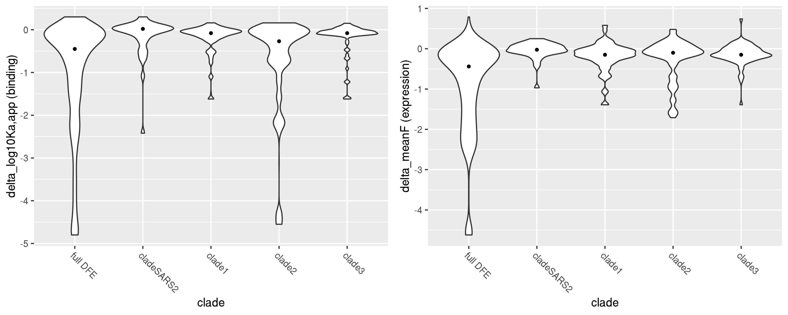
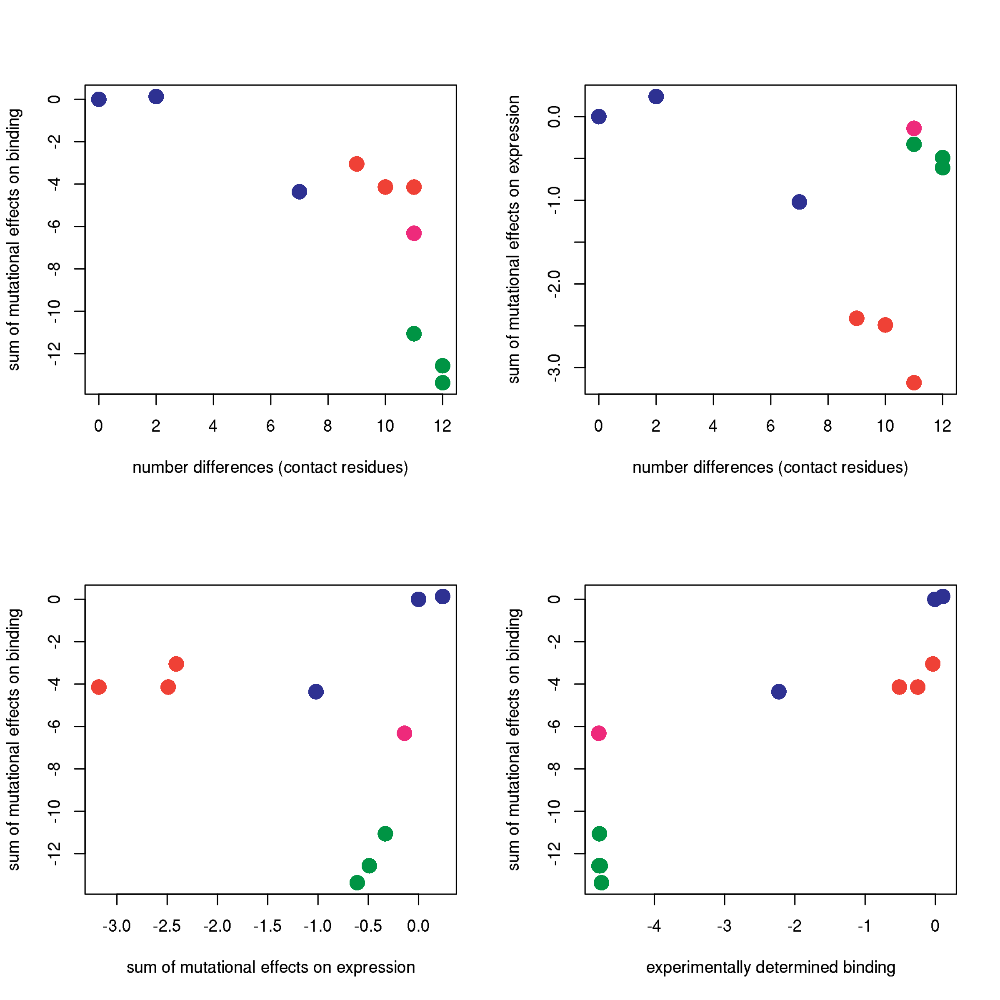

Relationship between DMS data and sarbecovirus RBD natural diversity
================
Tyler Starr
5/18/2020

This notebook analyzes the mutational tolerance of residues within
epitopes of different monoclonal antibodies

## Setup

``` r
require("knitr")
knitr::opts_chunk$set(echo = T)
knitr::opts_chunk$set(dev.args = list(png = list(type = "cairo")))

#list of packages to install/load
packages = c("yaml","data.table","tidyverse","gridExtra","bio3d")
#install any packages not already installed
installed_packages <- packages %in% rownames(installed.packages())
if(any(installed_packages == F)){
  install.packages(packages[!installed_packages])
}
#load packages
invisible(lapply(packages, library, character.only=T))

#read in config file
config <- read_yaml("config.yaml")

#read in file giving concordance between RBD numbering and SARS-CoV-2 Spike numbering
RBD_sites <- data.table(read.csv(file="data/RBD_sites.csv",stringsAsFactors=F))

#make output directory
if(!file.exists(config$sarbecovirus_diversity_dir)){
  dir.create(file.path(config$sarbecovirus_diversity_dir))
}
```

Session info for reproducing environment:

``` r
sessionInfo()
```

    ## R version 3.6.1 (2019-07-05)
    ## Platform: x86_64-pc-linux-gnu (64-bit)
    ## Running under: Ubuntu 14.04.5 LTS
    ## 
    ## Matrix products: default
    ## BLAS/LAPACK: /app/easybuild/software/OpenBLAS/0.2.18-GCC-5.4.0-2.26-LAPACK-3.6.1/lib/libopenblas_prescottp-r0.2.18.so
    ## 
    ## locale:
    ##  [1] LC_CTYPE=en_US.UTF-8       LC_NUMERIC=C              
    ##  [3] LC_TIME=en_US.UTF-8        LC_COLLATE=en_US.UTF-8    
    ##  [5] LC_MONETARY=en_US.UTF-8    LC_MESSAGES=en_US.UTF-8   
    ##  [7] LC_PAPER=en_US.UTF-8       LC_NAME=C                 
    ##  [9] LC_ADDRESS=C               LC_TELEPHONE=C            
    ## [11] LC_MEASUREMENT=en_US.UTF-8 LC_IDENTIFICATION=C       
    ## 
    ## attached base packages:
    ## [1] stats     graphics  grDevices utils     datasets  methods   base     
    ## 
    ## other attached packages:
    ##  [1] bio3d_2.3-4       gridExtra_2.3     forcats_0.4.0    
    ##  [4] stringr_1.4.0     dplyr_0.8.3       purrr_0.3.2      
    ##  [7] readr_1.3.1       tidyr_0.8.3       tibble_2.1.3     
    ## [10] ggplot2_3.2.0     tidyverse_1.2.1   data.table_1.12.2
    ## [13] yaml_2.2.0        knitr_1.23       
    ## 
    ## loaded via a namespace (and not attached):
    ##  [1] Rcpp_1.0.1       cellranger_1.1.0 pillar_1.4.2     compiler_3.6.1  
    ##  [5] tools_3.6.1      digest_0.6.20    lubridate_1.7.4  jsonlite_1.6    
    ##  [9] evaluate_0.14    nlme_3.1-140     gtable_0.3.0     lattice_0.20-38 
    ## [13] pkgconfig_2.0.2  rlang_0.4.0      cli_1.1.0        rstudioapi_0.10 
    ## [17] parallel_3.6.1   haven_2.1.1      xfun_0.7         withr_2.1.2     
    ## [21] xml2_1.2.0       httr_1.4.0       hms_0.4.2        generics_0.0.2  
    ## [25] grid_3.6.1       tidyselect_0.2.5 glue_1.3.1       R6_2.4.0        
    ## [29] readxl_1.3.1     rmarkdown_1.13   modelr_0.1.4     magrittr_1.5    
    ## [33] backports_1.1.4  scales_1.0.0     htmltools_0.3.6  rvest_0.3.4     
    ## [37] assertthat_0.2.1 colorspace_1.4-1 stringi_1.4.3    lazyeval_0.2.2  
    ## [41] munsell_0.5.0    broom_0.5.2      crayon_1.3.4

Read in tables of variant effects on binding and expression for single
mutations to the SARS-CoV-2 RBD and for homolog RBDs.

``` r
homolog_measurements <- data.table(read.csv(file=config$homolog_effects_file,stringsAsFactors = F))
mutants <- data.table(read.csv(file=config$single_mut_effects_file,stringsAsFactors = F))

#rename mutants site indices to prevent shared names with RBD_sites, simplifying some downstream calculations that cross-index these tables
setnames(mutants, "site_RBD", "RBD_site");setnames(mutants, "site_SARS2", "SARS2_site")

#add color column to homologs, by clade
homolog_measurements$clade_color <- as.character(NA); homolog_measurements[clade=="Clade 1",clade_color := "#EF4136"]; homolog_measurements[clade=="Clade 2",clade_color := "#009444"]; homolog_measurements[clade=="Clade 3",clade_color := "#EE2A7B"]; homolog_measurements[clade=="SARS-CoV-2",clade_color := "#2E3192"]

#add mean, max, min mut effects per site annotations
RBD_sites[,mean_bind := mean(mutants[SARS2_site==site_SARS2 & wildtype != mutant & mutant != "*",bind_avg],na.rm=T),by=site_SARS2]
RBD_sites[,max_bind := max(mutants[SARS2_site==site_SARS2 & wildtype != mutant & mutant != "*",bind_avg],na.rm=T),by=site_SARS2]
RBD_sites[,min_bind := min(mutants[SARS2_site==site_SARS2 & wildtype != mutant & mutant != "*",bind_avg],na.rm=T),by=site_SARS2]

RBD_sites[,mean_expr := mean(mutants[SARS2_site==site_SARS2 & wildtype != mutant & mutant != "*",expr_avg],na.rm=T),by=site_SARS2]
RBD_sites[,max_expr := max(mutants[SARS2_site==site_SARS2 & wildtype != mutant & mutant != "*",expr_avg],na.rm=T),by=site_SARS2]
RBD_sites[,min_expr := min(mutants[SARS2_site==site_SARS2 & wildtype != mutant & mutant != "*",expr_avg],na.rm=T),by=site_SARS2]
```

## Analysis of sarbecovirus RBD amino acid diversity

Read in an alignment of sarbecovirus RBD sequences. Many of these
sequences are so-called “Clade 2” sequences, which have not been shown
to bind human or any other ACE2 – so whether they evolve under
constraint for ACE2-binding is unclear (and even if so, bat ACE2 is also
under elevated positive selection, so even if binding bat ACE2s, these
viruses could have quite odd specificities\!). Therefore, we consider
the entire sarbecovirus alignment, and one restricted to the SARS-CoV-2
and SARS-CoV-1 clade sequences \[this alignment is only 12 sequences :(
\]. The full alignment is probably relevant to mutational constraint on
expression (since we see that the Clade 2 and 3 sequencs in our homolog
panel still have the same expression range as the ACE2-binding
variants), while the restricted alignment is probably more relevant to
mutational constraint on binding (since the Clade 2 and 3 sequencs in
our homolog panel had no detectable binding to huACE2.)

Within each of these alignments, we compute the entropy of the alignment
column (and the related value effective amino acids, (N<sub>eff</sub>),
and compare this value to the average effect of mutations at the site
from our DMS data for binding and expression.


How do the effects of individual amino acid differences among these
homologs compare to the overall DFE? How does this differ among clades?
We iterate through our aligned sequences, and compile the amino acid
differences observed between SARS-CoV-2 and sequences within each clade.
We then look at the distribution of effects of these mutations on
binding and expression within each clade, and compare it to the overall
DFE for mutational effects on binding and expression.

Overall, we see that the amino acid variants that accumulated in each
sarbecovirus clade are less deleterious for binding and expression than
the overall DFE, suggesting that overall, the amino acid variation
sampled in nature is subjected to somoe purifying selection relative to
the overall DFE for these phenotypes (or other phenotypes that correlate
with these measurements). I am a bit surprised to see that the amino
acid variants sampled in Clades 2 and 3 are not skewed toward
deleterious amino acids more than we see here\! Since these have not
been shown to bind ACE2s, it is unclear whether they are operating under
the same selective constraint as sequences in Clade 1 and the SARS-CoV-2
clade. It is important to note that this analysis is *not* taking into
account two large deletions in the RBM loops that are present in these
Clade 2+3 sequences, which may explain their reduced affinity for human
ACE2.


Let’s make the same plots, but focusing only on residues within the RBM.
We do have strong expectation that the core RBD is evolving under
consistent constraints in all of these viral isolates, because we think
the primary constraint on the core RBD is basic thermodynamic stabilitiy
(at least as far as is captured in our assay – we do not take into
account quaternary contacts or immune selection). In contrast, the RBM
mediates receptor contact, and so if there is variation in receptor
usage (or at the very least, variation in bat versus e.g. human ACE2s),
differences in selective pressure leading to different amino acid usage
across these sarbecovirus clades may be more apparent in the RBM.

Indeed, perhaps more aligned with what I expected to see above, among
RBM mutations (excluding indels which we are not incorporating), Clade 2
sequences (unclear for Clade 3?) may appear to fix more amino acid
mutations that we predict to be deleterious for binding human ACE2.



Also, let’s output a table of amino acid variant seen in the SARS-CoV-2
clade and Clade 1 that have large effects on binding – let’s look at
mutations with \< -0.5 binding effect in the SARS-CoV-2 clade, and \<1
in Clade 1. Tables are sorted by homolog (so, the same amino acid can
show up multiple times in the table if found in \>1 homolog).

We can see that within the SARS-Cov-2 clade, two amino acids found in
RaTG13 have deleterious effects on binding. RaTG13 is a bat virus and
*does* have reduced human ACE2 affinity in our assay, so these amino
acid differences may contribute to that difference.

``` r
kable(mutants_temp[clade %in% c("cladeSARS2") & bind_avg < -0.5,.(mutation,bind_lib1,bind_lib2,bind_avg,expr_avg,clade,homolog)])
```

| mutation    |  bind\_lib1 |   bind\_lib2 |   bind\_avg |  expr\_avg | clade         | homolog                                                                                                                                                                                                                                                                                                                                                                                                                                                                                                                                                              |
| :---------- | ----------: | -----------: | ----------: | ---------: | :------------ | :------------------------------------------------------------------------------------------------------------------------------------------------------------------------------------------------------------------------------------------------------------------------------------------------------------------------------------------------------------------------------------------------------------------------------------------------------------------------------------------------------------------------------------------------------------------- |
| R403T       |      \-0.67 |       \-0.71 |      \-0.69 |     \-0.99 | cladeSARS2    | RaTG13\_MN996532                                                                                                                                                                                                                                                                                                                                                                                                                                                                                                                                                     |
| Y449F       |      \-1.01 |       \-1.15 |      \-1.08 |     \-0.03 | cladeSARS2    | RaTG13\_MN996532                                                                                                                                                                                                                                                                                                                                                                                                                                                                                                                                                     |
| N501D       |      \-2.40 |       \-2.44 |      \-2.42 |       0.08 | cladeSARS2    | RaTG13\_MN996532                                                                                                                                                                                                                                                                                                                                                                                                                                                                                                                                                     |
| Y505H       |      \-0.67 |       \-0.76 |      \-0.71 |       0.16 | cladeSARS2    | RaTG13\_MN996532                                                                                                                                                                                                                                                                                                                                                                                                                                                                                                                                                     |
| E484V       |      \-0.63 |       \-0.68 |      \-0.65 |     \-0.05 | cladeSARS2    | Pangolin\_GX-P2V\_EPI\_ISL\_410542                                                                                                                                                                                                                                                                                                                                                                                                                                                                                                                                   |
| Q493E       |      \-0.56 |       \-0.57 |      \-0.56 |     \-0.02 | cladeSARS2    | Pangolin\_GX-P2V\_EPI\_ISL\_410542                                                                                                                                                                                                                                                                                                                                                                                                                                                                                                                                   |
| In Clade 1, | even SARS-C | oV-1 has som | e amino aci | d variants | that are dele | terious in SARS-CoV-2. We can dig in further to see whether these deleterious SARS-CoV-1 states are truly shifted preferences, versus just offset by other affinity gains at the interface. (And, future DMS in SARS-CoV-1 RBM could address this\!) L455 and S494 are “key adaptations” in SARS-CoV-1 (Y442 and D480), according to studies by e.g. Fang Li – so, should be a lot of prior structural work we can look at to better understand what other RBM/interface residues might be impacting amino acid preferences at these sites between SARS-CoV-1 and 2. |

``` r
kable(mutants_temp[clade %in% c("clade1") & bind_avg < -1,.(mutation,bind_lib1,bind_lib2,bind_avg,expr_avg,clade,homolog)])
```

| mutation | bind\_lib1 | bind\_lib2 | bind\_avg | expr\_avg | clade  | homolog                |
| :------- | ---------: | ---------: | --------: | --------: | :----- | :--------------------- |
| L455Y    |     \-1.48 |     \-1.52 |    \-1.50 |    \-0.10 | clade1 | SARS\_Urbani\_AY278741 |
| A475P    |     \-1.52 |     \-1.72 |    \-1.62 |    \-1.39 | clade1 | SARS\_Urbani\_AY278741 |
| S494D    |     \-0.96 |     \-1.23 |    \-1.10 |    \-0.61 | clade1 | SARS\_Urbani\_AY278741 |
| A475P    |     \-1.52 |     \-1.72 |    \-1.62 |    \-1.39 | clade1 | WIV1\_KF367457         |
| S494D    |     \-0.96 |     \-1.23 |    \-1.10 |    \-0.61 | clade1 | WIV1\_KF367457         |
| A475P    |     \-1.52 |     \-1.72 |    \-1.62 |    \-1.39 | clade1 | WIV16\_KT444582        |
| S494D    |     \-0.96 |     \-1.23 |    \-1.10 |    \-0.61 | clade1 | WIV16\_KT444582        |
| Y449F    |     \-1.01 |     \-1.15 |    \-1.08 |    \-0.03 | clade1 | LYRa11\_KF569996       |
| A475P    |     \-1.52 |     \-1.72 |    \-1.62 |    \-1.39 | clade1 | LYRa11\_KF569996       |
| S494D    |     \-0.96 |     \-1.23 |    \-1.10 |    \-0.61 | clade1 | LYRa11\_KF569996       |
| A475P    |     \-1.52 |     \-1.72 |    \-1.62 |    \-1.39 | clade1 | Rs7327\_KY417151       |
| S494D    |     \-0.96 |     \-1.23 |    \-1.10 |    \-0.61 | clade1 | Rs7327\_KY417151       |
| A475P    |     \-1.52 |     \-1.72 |    \-1.62 |    \-1.39 | clade1 | Rs4231\_KY417146       |
| A475P    |     \-1.52 |     \-1.72 |    \-1.62 |    \-1.39 | clade1 | RsSHC014\_KC881005     |
| A475P    |     \-1.52 |     \-1.72 |    \-1.62 |    \-1.39 | clade1 | Rs4084\_KY417144       |

How well can we predict homolog affinities for human ACE2 based on our
individual mutational measurements? Try it three ways: 1) summing
mutational effects across all RBD positions, 2) just RBM positions, 3)
just ACE2 contact positions. (Expectation is: predictions of RaTG13 and
pangolin affinity might be decent, but clade1 and more distant sequences
will be bad). To give at least some semblence of uncertainty in our
predictions, I calculate the standard error of each single mutant effect
in our dataset as just the SEM from the two replicate measurements – I
then propagate the SEM for the addition of the values.

``` r
mutants[,bind_SEM := sd(c(bind_lib1,bind_lib2))/sqrt(2),by=mutation]
mutants[,expr_SEM := sd(c(expr_lib1,expr_lib2))/sqrt(2),by=mutation]

homolog_measurements$alignment_name <- c("SARS-CoV-2_MN908947","Pangolin_GD-consensus_EPI_ISL_410544-Lam2020_supplement","RaTG13_MN996532","SARS_Urbani_AY278741","WIV16_KT444582",
                                         "LYRa11_KF569996","ZC45_MG772933","ZXC21_MG772934","HKU3-1_DQ022305","Rf1_DQ412042","Rp3_DQ071615","BM48-31_NC014470")

for(i in 1:nrow(homolog_measurements)){
  subs <- c()
  for(j in 1:ncol(alignment$ali)){
    if(!(alignment$ali[which(alignment$id==homolog_measurements[i,alignment_name]),j] %in% c("-","X")) & alignment$ali[1,j] != alignment$ali[which(alignment$id==homolog_measurements[i,alignment_name]),j]){
      subs <- c(subs,paste(alignment$ali[1,j],j,alignment$ali[which(alignment$id==homolog_measurements[i,alignment_name]),j],sep=""))
    }
  }
  homolog_measurements$n_diff[i] <- length(subs)
  homolog_measurements$sum_bind[i] <- sum(mutants[mutation_RBD %in% subs,bind_avg])
  homolog_measurements$SEM_sum_bind[i] <- sqrt(sum(mutants[mutation_RBD %in% subs,bind_SEM]^2))
  homolog_measurements$sum_expr[i] <- sum(mutants[mutation_RBD %in% subs,expr_avg])
  homolog_measurements$SEM_sum_expr[i] <- sqrt(sum(mutants[mutation_RBD %in% subs,expr_SEM]^2))
}

for(i in 1:nrow(homolog_measurements)){
  subs <- c()
  for(j in RBD_sites[RBM==T,site_RBD]){
    if(!(alignment$ali[which(alignment$id==homolog_measurements[i,alignment_name]),j] %in% c("-","X")) & alignment$ali[1,j] != alignment$ali[which(alignment$id==homolog_measurements[i,alignment_name]),j]){
      subs <- c(subs,paste(alignment$ali[1,j],j,alignment$ali[which(alignment$id==homolog_measurements[i,alignment_name]),j],sep=""))
    }
  }
  homolog_measurements$n_diff_RBM[i] <- length(subs)
  homolog_measurements$sum_bind_RBM[i] <- sum(mutants[mutation_RBD %in% subs,bind_avg])
  homolog_measurements$SEM_sum_bind_RBM[i] <- sqrt(sum(mutants[mutation_RBD %in% subs,bind_SEM]^2))
  homolog_measurements$sum_expr_RBM[i] <- sum(mutants[mutation_RBD %in% subs,expr_avg])
  homolog_measurements$SEM_sum_expr_RBM[i] <- sqrt(sum(mutants[mutation_RBD %in% subs,expr_SEM]^2))
}

for(i in 1:nrow(homolog_measurements)){
  subs <- c()
  for(j in RBD_sites[SARS2_ACE2_contact==T | SARS1_ACE2_contact==T,site_RBD]){
    if(!(alignment$ali[which(alignment$id==homolog_measurements[i,alignment_name]),j] %in% c("-","X")) & alignment$ali[1,j] != alignment$ali[which(alignment$id==homolog_measurements[i,alignment_name]),j]){
      subs <- c(subs,paste(alignment$ali[1,j],j,alignment$ali[which(alignment$id==homolog_measurements[i,alignment_name]),j],sep=""))
    }
  }
  homolog_measurements$n_diff_contact[i] <- length(subs)
  homolog_measurements$sum_bind_contact[i] <- sum(mutants[mutation_RBD %in% subs,bind_avg])
  homolog_measurements$SEM_sum_bind_contact[i] <- sqrt(sum(mutants[mutation_RBD %in% subs,bind_SEM]^2))
  homolog_measurements$sum_expr_contact[i] <- sum(mutants[mutation_RBD %in% subs,expr_avg])
  homolog_measurements$SEM_sum_expr_contact[i] <- sqrt(sum(mutants[mutation_RBD %in% subs,expr_SEM]^2))
}

kable(homolog_measurements[,.(homolog,bind_lib1,bind_lib2,bind_avg,n_diff,sum_bind,sum_expr,n_diff_RBM,sum_bind_RBM,sum_expr_RBM,n_diff_contact,sum_bind_contact,sum_expr_contact)])
```

| homolog     | bind\_lib1 | bind\_lib2 | bind\_avg | n\_diff | sum\_bind | sum\_expr | n\_diff\_RBM | sum\_bind\_RBM | sum\_expr\_RBM | n\_diff\_contact | sum\_bind\_contact | sum\_expr\_contact |
| :---------- | ---------: | ---------: | --------: | ------: | --------: | --------: | -----------: | -------------: | -------------: | ---------------: | -----------------: | -----------------: |
| SARS-CoV-2  |   \-0.0090 |   \-0.0067 |  \-0.0079 |       0 |      0.00 |      0.00 |            0 |           0.00 |           0.00 |                0 |               0.00 |               0.00 |
| GD-Pangolin |     0.0741 |     0.1337 |    0.1039 |       6 |      0.06 |      0.24 |            1 |           0.30 |           0.16 |                2 |               0.13 |               0.24 |
| RaTG13      |   \-2.1698 |   \-2.2849 |  \-2.2274 |      21 |    \-5.31 |    \-1.76 |           17 |         \-4.57 |         \-0.86 |                7 |             \-4.36 |             \-1.02 |
| SARS-CoV-1  |   \-0.2099 |   \-0.2898 |  \-0.2498 |      51 |    \-8.58 |    \-7.04 |           35 |         \-7.97 |         \-7.76 |               11 |             \-4.14 |             \-3.18 |
| WIV16       |   \-0.0174 |   \-0.0544 |  \-0.0359 |      46 |    \-7.73 |    \-6.81 |           33 |         \-7.13 |         \-7.64 |                9 |             \-3.05 |             \-2.41 |
| LYRa11      |   \-0.4724 |   \-0.5535 |  \-0.5129 |      49 |    \-8.58 |    \-6.52 |           34 |         \-7.97 |         \-7.07 |               10 |             \-4.14 |             \-2.49 |
| ZC45        |   \-4.7507 |   \-4.8264 |  \-4.7886 |      55 |   \-26.89 |   \-12.62 |           32 |        \-23.46 |         \-8.01 |               12 |            \-12.57 |             \-0.49 |
| ZXC21       |   \-4.7339 |   \-4.8346 |  \-4.7842 |      55 |   \-26.02 |   \-12.43 |           32 |        \-22.59 |         \-7.82 |               12 |            \-12.57 |             \-0.49 |
| HKU3-1      |   \-4.7088 |   \-4.7966 |  \-4.7527 |      54 |   \-25.85 |   \-12.27 |           31 |        \-23.18 |         \-8.08 |               12 |            \-13.37 |             \-0.61 |
| Rf1         |   \-4.7358 |   \-4.8070 |  \-4.7714 |      53 |   \-27.08 |   \-12.83 |           31 |        \-23.72 |         \-8.33 |               12 |            \-12.57 |             \-0.49 |
| Rp3         |   \-4.7356 |   \-4.8281 |  \-4.7818 |      53 |   \-24.33 |   \-12.29 |           30 |        \-21.66 |         \-8.10 |               11 |            \-11.06 |             \-0.33 |
| BM48-31     |   \-4.7525 |   \-4.8290 |  \-4.7908 |      56 |    \-9.18 |    \-7.22 |           36 |         \-7.72 |         \-5.13 |               11 |             \-6.32 |             \-0.14 |

Below, we plot the sum of binding and expression effects versus the
number of mutations present in a genotype for RBM residues. Once again,
this does not take into account deletions within RBM loops present in
Clade2 and Clade3 sequences. (Rationale for using RBM instead of whole
RBD, is that Letko et al. showed RBM is the minimal region whose chimera
is sufficient to confer a clade 2 or 3 sequence ACE2-mediated entry –
that is, putting the Clade 1 consensus RBM onto a clade 2 or 3 core RBD
is sufficient to allow ACE2-mediated cellular entry)

As we probably expected, we can see that the number of differences is a
primary determinant of how “deleterious” a sequence is predicted to be –
both for binding and expression – which probably more than anything else
reflects epistasis and shifting preferences in the more distant
backgrounds. So, it might be that these predictions work ok for within
the SARS-CoV-2 clade where the number of differences is small, but in
other clades, the number is just too large. However, maybe within other
clades, the *relative* binding predicted from the simple sum of
mutational effects is useful? E.g. in Clade 1, we do predict that WIV16
has higher affinity than SARS-CoV-1 or LYRa11, though we don’t also
successfully predict that SARS-CoV-1 has higher affinity than LYRa11.
And within the SARS-CoV-2 clade, GD Pangolin is correctly predicted to
have high affinity while RaTG13 is correctly predicted to have lower
affinity.

Last, the placement of BM48-31 is quite odd\! This says that (besides
its deletion), the amino acid states its sampling aren’t really any less
compatible with huACE2 binding than those sampled in Clade 1? Honestly
kind of surprising. But, if we internally also normalize by the sum of
expression effects, BM48-31 is also predicted to have higher
expression-per-mutation than the Clade1 sequences, which perhaps impacts
its interpretation. But overall, this perhaps suggests that BM48-31 is
“closer” to ACE2 utilization than Clade 2 sequences. (e.g., maybe it
uses ACE2 in bats??)

Here are plots relating sum of mutational effects on binding and
expression to each other, to number of differences, and actual binding,
for all RBM differences:


And the same plots, for only ACE2-contact residue positions:


Overall, my intpretation from this table/figures, is that our mutational
effects are perhaps useful for predictions of things very similiar to
our focal background (e.g. GD Pangolin, circulating strains), but that
because of epistasis, mutational preferences are quite different in
other sarbecovirus clades, which complicates prediction of ability of
unseen RBDs to bind ACE2. (This perhaps can mentally be loosely
accounted for by taking into account the total number of amino acid
differences and also their effect on expression, but that’s a lot of
weirdness to normalize for so overall definitely not a direction to
push.) These are probably not the figures we’ll want to use to
communicate this, although I do think this is an interestning conclusion
to communicate (that preferences have shifted between SARS-CoV-2 and -1)
