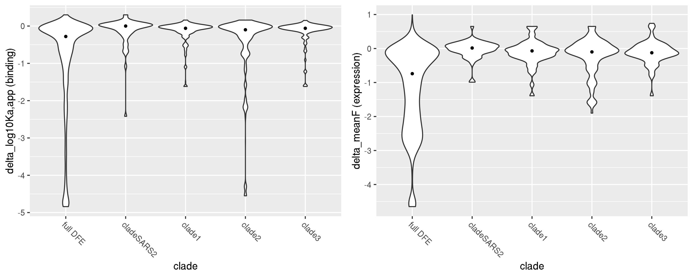
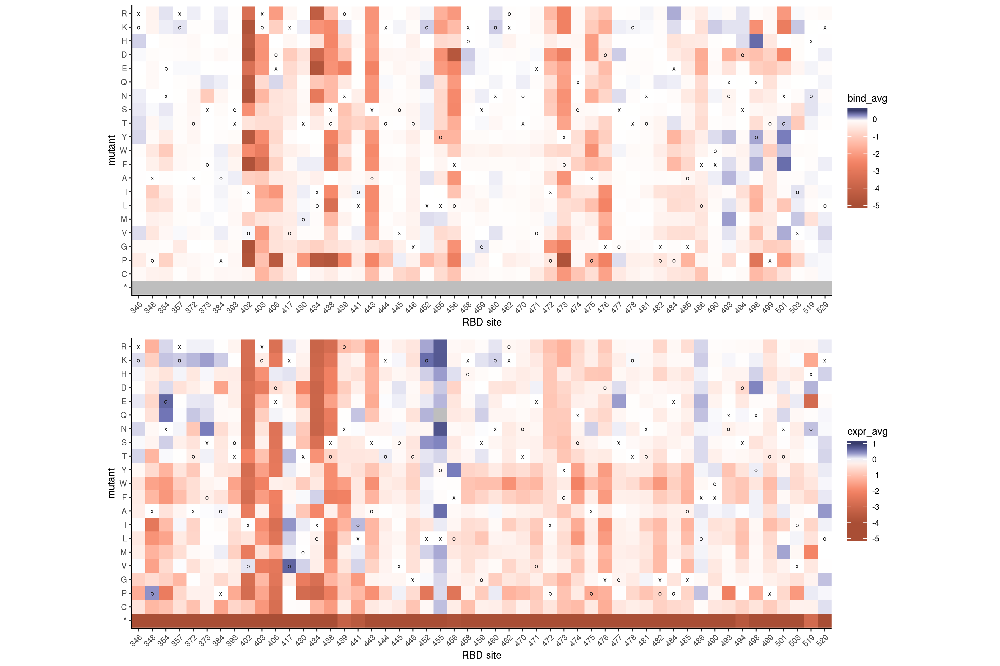
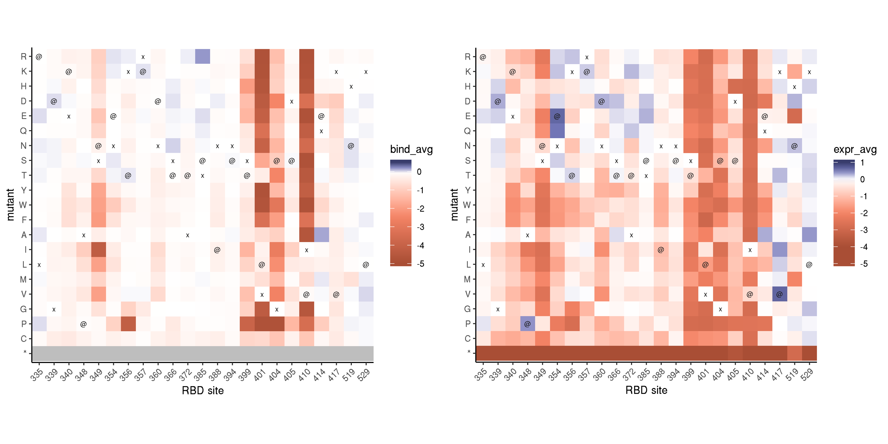
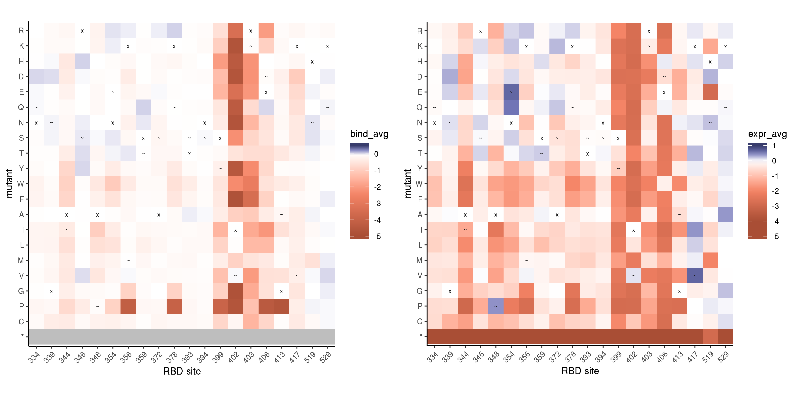
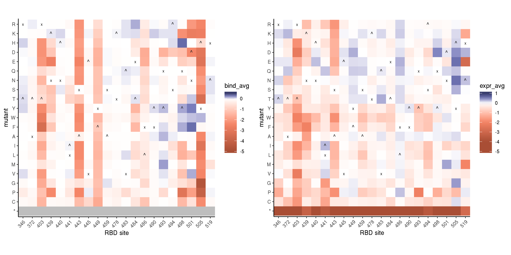
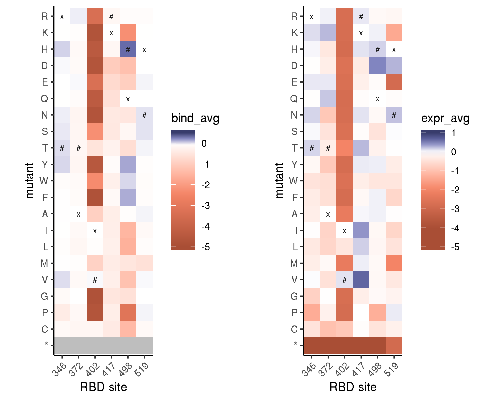
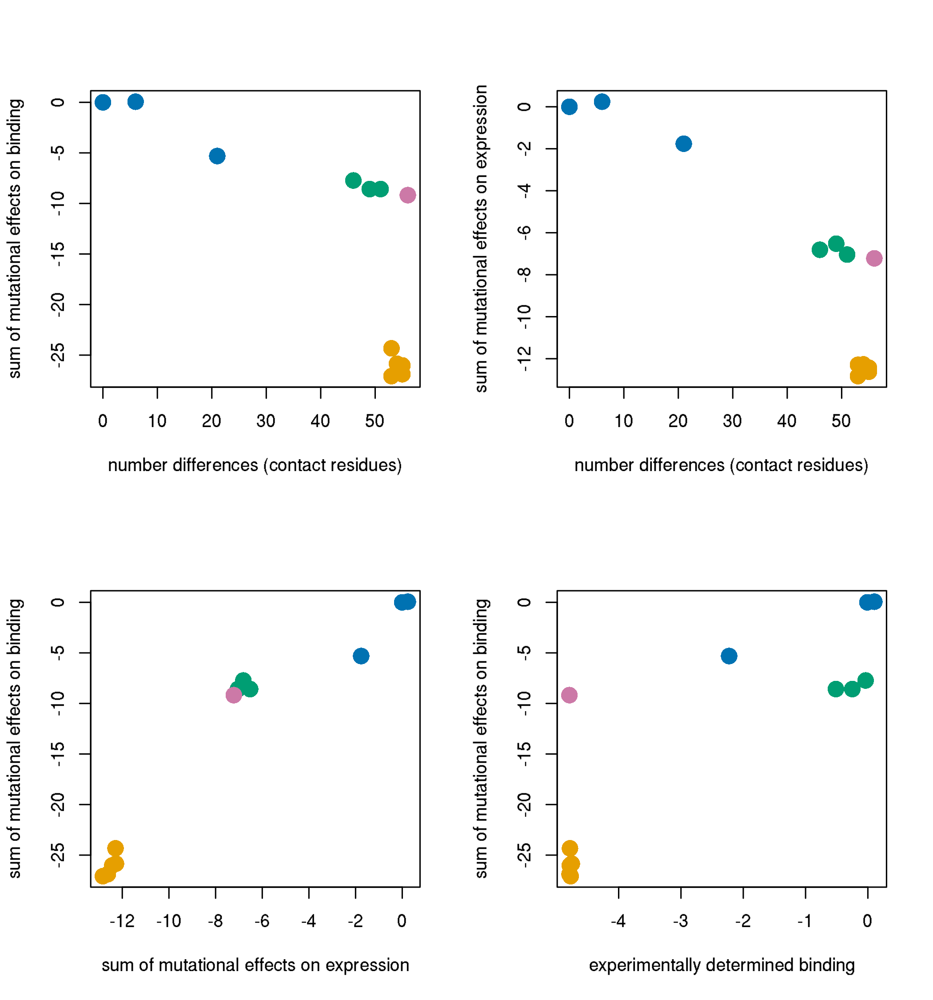
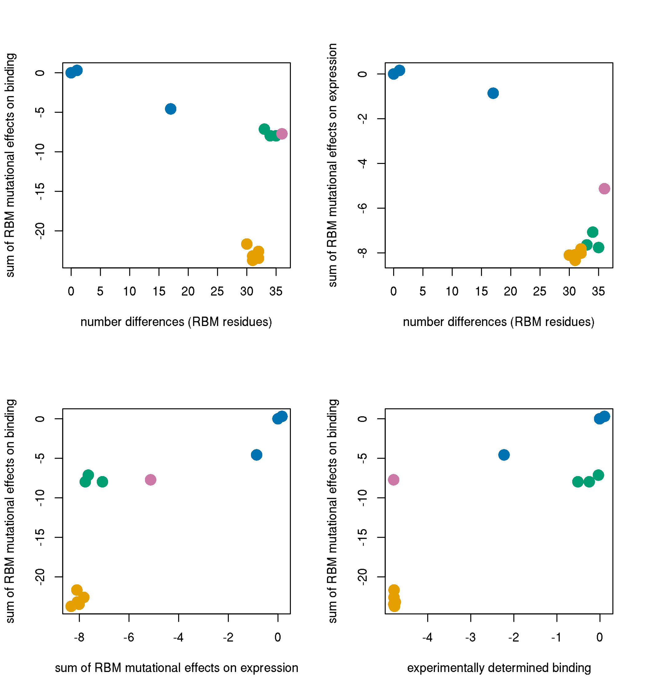

Relationship between DMS data and sarbecovirus RBD natural diversity
================
Tyler Starr
5/18/2020

  - [Setup](#setup)
  - [Relationship between DMS mutational tolerance and natural sequence
    diversity](#relationship-between-dms-mutational-tolerance-and-natural-sequence-diversity)
  - [Shifting mutational preferences across sarbecovirus
    clades](#shifting-mutational-preferences-across-sarbecovirus-clades)
  - [Sequence and functional variation within the SARS-CoV-2
    clade](#sequence-and-functional-variation-within-the-sars-cov-2-clade)
  - [Predicting (or failing to predict) homolog affinities from single
    mutant effect
    measurements](#predicting-or-failing-to-predict-homolog-affinities-from-single-mutant-effect-measurements)

This notebook analyzes DMS meausurements in relation to natural sequence
diversity in a broader alignment of sarbecovirus RBDs.

## Setup

``` r
require("knitr")
knitr::opts_chunk$set(echo = T)
knitr::opts_chunk$set(dev.args = list(png = list(type = "cairo")))

#list of packages to install/load
packages = c("yaml","data.table","tidyverse","gridExtra","bio3d")
#install any packages not already installed
installed_packages <- packages %in% rownames(installed.packages())
if(any(installed_packages == F)){
  install.packages(packages[!installed_packages])
}
#load packages
invisible(lapply(packages, library, character.only=T))

#read in config file
config <- read_yaml("config.yaml")

#read in file giving concordance between RBD numbering and SARS-CoV-2 Spike numbering
RBD_sites <- data.table(read.csv(file="data/RBD_sites.csv",stringsAsFactors=F))

#make output directory
if(!file.exists(config$sarbecovirus_diversity_dir)){
  dir.create(file.path(config$sarbecovirus_diversity_dir))
}
```

Session info for reproducing environment:

``` r
sessionInfo()
```

    ## R version 3.6.1 (2019-07-05)
    ## Platform: x86_64-pc-linux-gnu (64-bit)
    ## Running under: Ubuntu 14.04.6 LTS
    ## 
    ## Matrix products: default
    ## BLAS/LAPACK: /app/easybuild/software/OpenBLAS/0.2.18-GCC-5.4.0-2.26-LAPACK-3.6.1/lib/libopenblas_prescottp-r0.2.18.so
    ## 
    ## locale:
    ##  [1] LC_CTYPE=en_US.UTF-8       LC_NUMERIC=C              
    ##  [3] LC_TIME=en_US.UTF-8        LC_COLLATE=en_US.UTF-8    
    ##  [5] LC_MONETARY=en_US.UTF-8    LC_MESSAGES=en_US.UTF-8   
    ##  [7] LC_PAPER=en_US.UTF-8       LC_NAME=C                 
    ##  [9] LC_ADDRESS=C               LC_TELEPHONE=C            
    ## [11] LC_MEASUREMENT=en_US.UTF-8 LC_IDENTIFICATION=C       
    ## 
    ## attached base packages:
    ## [1] stats     graphics  grDevices utils     datasets  methods   base     
    ## 
    ## other attached packages:
    ##  [1] bio3d_2.3-4       gridExtra_2.3     forcats_0.4.0    
    ##  [4] stringr_1.4.0     dplyr_0.8.3       purrr_0.3.2      
    ##  [7] readr_1.3.1       tidyr_0.8.3       tibble_2.1.3     
    ## [10] ggplot2_3.2.0     tidyverse_1.2.1   data.table_1.12.2
    ## [13] yaml_2.2.0        knitr_1.23       
    ## 
    ## loaded via a namespace (and not attached):
    ##  [1] Rcpp_1.0.1       cellranger_1.1.0 pillar_1.4.2     compiler_3.6.1  
    ##  [5] tools_3.6.1      digest_0.6.20    lubridate_1.7.4  jsonlite_1.6    
    ##  [9] evaluate_0.14    nlme_3.1-140     gtable_0.3.0     lattice_0.20-38 
    ## [13] pkgconfig_2.0.2  rlang_0.4.0      cli_1.1.0        rstudioapi_0.10 
    ## [17] parallel_3.6.1   haven_2.1.1      xfun_0.7         withr_2.1.2     
    ## [21] xml2_1.2.0       httr_1.4.0       hms_0.4.2        generics_0.0.2  
    ## [25] grid_3.6.1       tidyselect_0.2.5 glue_1.3.1       R6_2.4.0        
    ## [29] readxl_1.3.1     rmarkdown_1.13   modelr_0.1.4     magrittr_1.5    
    ## [33] backports_1.1.4  scales_1.0.0     htmltools_0.3.6  rvest_0.3.4     
    ## [37] assertthat_0.2.1 colorspace_1.4-1 stringi_1.4.3    lazyeval_0.2.2  
    ## [41] munsell_0.5.0    broom_0.5.2      crayon_1.3.4

Read in tables of variant effects on binding and expression for single
mutations to the SARS-CoV-2 RBD and for homolog RBDs.

``` r
homolog_measurements <- data.table(read.csv(file=config$homolog_effects_file,stringsAsFactors = F))
mutants <- data.table(read.csv(file=config$single_mut_effects_file,stringsAsFactors = F))

#rename mutants site indices to prevent shared names with RBD_sites, simplifying some downstream calculations that cross-index these tables
setnames(mutants, "site_RBD", "RBD_site");setnames(mutants, "site_SARS2", "SARS2_site")

#add color column to homologs, by clade
cbPalette <- c("#999999", "#E69F00", "#56B4E9", "#009E73", "#F0E442", "#0072B2", "#D55E00", "#CC79A7")
homolog_measurements$clade_color <- as.character(NA); homolog_measurements[clade=="Clade 1",clade_color := cbPalette[4]]; homolog_measurements[clade=="Clade 2",clade_color := cbPalette[2]]; homolog_measurements[clade=="Clade 3",clade_color := cbPalette[8]]; homolog_measurements[clade=="SARS-CoV-2",clade_color := cbPalette[6]]
#add plottiing character to homolog_measurements, by clade
homolog_measurements$clade_pch <- as.numeric(NA); homolog_measurements[clade=="Clade 1",clade_pch := 15]; homolog_measurements[clade=="Clade 2",clade_pch := 17]; homolog_measurements[clade=="Clade 3",clade_pch := 18]; homolog_measurements[clade=="SARS-CoV-2",clade_pch  := 16]

#add mean, max, min mut effects per site annotations
RBD_sites[,mean_bind := mean(mutants[SARS2_site==site_SARS2 & wildtype != mutant & mutant != "*",bind_avg],na.rm=T),by=site_SARS2]
RBD_sites[,max_bind := max(mutants[SARS2_site==site_SARS2 & wildtype != mutant & mutant != "*",bind_avg],na.rm=T),by=site_SARS2]
RBD_sites[,min_bind := min(mutants[SARS2_site==site_SARS2 & wildtype != mutant & mutant != "*",bind_avg],na.rm=T),by=site_SARS2]

RBD_sites[,mean_expr := mean(mutants[SARS2_site==site_SARS2 & wildtype != mutant & mutant != "*",expr_avg],na.rm=T),by=site_SARS2]
RBD_sites[,max_expr := max(mutants[SARS2_site==site_SARS2 & wildtype != mutant & mutant != "*",expr_avg],na.rm=T),by=site_SARS2]
RBD_sites[,min_expr := min(mutants[SARS2_site==site_SARS2 & wildtype != mutant & mutant != "*",expr_avg],na.rm=T),by=site_SARS2]
```

## Relationship between DMS mutational tolerance and natural sequence diversity

We compare our measurements of mutational tolerance to natural diversity
from our alignment of sarbecovirus RBD sequences, whose curation and
alignment is described in the `data/alignments` subdirectory. Many of
these sequences are so-called “Clade 2” sequences, which have not been
shown to bind human or any other ACE2 – so whether they evolve under
constraint for ACE2-binding is unclear. Therefore, we consider the
entire sarbecovirus RBD alignment, and one restricted to the SARS-CoV-2
and SARS-CoV-1 clade sequences (which consists of just 12 RBD
sequences). The full alignment is probably relevant to mutational
constraint on expression (since we see that the Clade 2 and 3 sequencs
in our homolog panel still have the same expression range as the
ACE2-binding variants), while the restricted alignment is probably more
relevant to mutational constraint on ACE2 binding (since the Clade 2 and
3 sequences in our homolog panel had no detectable binding to huACE2.)

Within each of these alignments, we compute the entropy of the alignment
column (and the related effective number amino acids N<sub>eff</sub>),
and compare this value to the average effect of mutations at the site
from our DMS data for binding and expression. We can see the sites where
we observe considerable mutational constraint exhibit reduced amino acid
diversity across the sarbecovirus clade and the ACE2-restricted clades
in particular.

``` r
alignment <- read.fasta(file='data/alignments/RBDs_aligned.fasta')
#remove columns that is gap in the SARS-CoV-2 sequence (only one is a single A insertion in the BM48-31 sequence)
alignment$ali <- alignment$ali[,which(alignment$ali[1,]!="-")]

#get indices for alignment rows which correspond to sequences from each of the sarbecovirus 'clades'
clade1 <- which(alignment$id %in% c("SARS_Urbani_AY278741","WIV1_KF367457","WIV16_KT444582","LYRa11_KF569996",
                                    "Rs7327_KY417151","Rs4231_KY417146","RsSHC014_KC881005","Rs4084_KY417144"))

cladeSARS2 <- which(alignment$id %in% c("SARS-CoV-2_MN908947","Pangolin_GD-consensus_EPI_ISL_410544-Lam2020_supplement",
                                        "RaTG13_MN996532","Pangolin_GX-P2V_EPI_ISL_410542"))

clade2 <- which(alignment$id %in% c("As6526_KY417142","Rs4237_KY417147","Rs4081_KY417143","Rp3_DQ071615","Shaanxi2011_JX993987","279-2005_DQ648857",
                                    "Yunnan2011_JX993988","YN2013_KJ473816","Rf4092_KY417145","ZXC21_MG772934","ZC45_MG772933","JL2012_KJ473811",
                                    "Rf1_DQ412042","HeB2013_KJ473812","273-2005_DQ648856","RmYN02_EPI_ISL_412977","Rs4247_KY417148","HKU3-13_GQ153548",
                                    "HKU3-1_DQ022305","GX2013_KJ473815","Longquan-140_KF294457","HKU3-8_GQ153543","HuB2013_KJ473814"))

clade3 <- which(alignment$id %in% c("BM48-31_NC014470","BtKY72_KY352407"))

#make a second alignment which is only the clade 1 and sars-cov-2 clade sequences, where ACE2-binding is present
alignment_restricted <- alignment;alignment_restricted$ali <- alignment$ali[c(clade1,cladeSARS2),]; alignment_restricted$id <- alignment$id[c(clade1,cladeSARS2)]

entropy <- entropy(alignment)$H
entropy_restricted <- entropy(alignment_restricted)$H
RBD_sites$entropy <- entropy
RBD_sites$Neff <- exp(entropy)
RBD_sites$entropy_restricted <- entropy_restricted
RBD_sites$Neff_restricted <- exp(entropy_restricted)

#plot mean effect on binding and expression versus Neff and restricted alignment set Neff
par(mfrow=c(2,2))
plot(RBD_sites$Neff,RBD_sites$mean_bind,pch=16,col="#00000067",ylab="site mean effect of mutation on binding",xlab="site N_eff, full sarbecovirus alignment")
plot(RBD_sites$Neff,RBD_sites$mean_expr,pch=16,col="#00000067",ylab="site mean effect of mutation on expression",xlab="site N_eff, full sarbecovirus alignment")
plot(RBD_sites$Neff_restricted,RBD_sites$mean_bind,pch=16,col="#00000067",ylab="site mean effect of mutation on binding",xlab="site N_eff, SARS-CoV-1 and -2 clades")
plot(RBD_sites$Neff_restricted,RBD_sites$mean_expr,pch=16,col="#00000067",ylab="site mean effect of mutation on expression",xlab="site N_eff, SARS-CoV-1 and -2 clades")
```


## Shifting mutational preferences across sarbecovirus clades

How do the effects of individual amino acid differences among
sarbecovirus homologs compare to the overall DFE? And how does this
differ among clades? Below, we show the distribution of effects of amino
acid differences found among sarbecovirus RBDs in each clade when that
state is introduced into SARS-CoV-2. We show these distributions for all
RBD sites (top), and for sites in the receptor binding motif (RBM) in
particular (bottom).

Overall, we see that the amino acid variants that accumulated in each
sarbecovirus clade are less deleterious for binding and expression than
the overall DFE, suggesting that overall, the amino acid variation
sampled in nature is subjected to some degree of purifying selection for
phenotypes that correlate with our measured phenotypes – this is
particularly true for the expression phenotypes, and I imagine that the
skewing in Clade2 is primarily a function of shifting amino acid
preferences due to the large degree of divergence of these branches (see
the relatively longer branch to this clade on our RBD phylogeny). I am
actually a bit surprised to see that the amino acid states sampled in
Clades 2 and 3 are not skewed toward more deleterious binding effects in
the SARS-CoV-2 background. Since these have not been shown to bind
ACE2s, it is unclear whether they are operating under the same selective
constraint as sequences in Clade 1 and the SARS-CoV-2 clade – however,
we can see more skew in Clade 2 when we focus on the RBM in particular
in the lower left plot, which is where the direct determinants of
ACE2-binding reside. It is important to note that this analysis is *not*
taking into account two large deletions in the RBM loops that are
present in these Clade 2+3 sequences, which may also contribute to their
reduced affinity for human ACE2.



Given that ACE2-binding is restricted to Clade 1 and the SARS-CoV-2
clade, let’s first focus on amino acid differences found among Clade 1
sequences (and SARS-CoV-1 in particular) and their effects in the
SARS-CoV-2 background. Below are heatmaps illustrating mutational
effects on binding and expression at all positions that differ in amino
acid identity between SARS-CoV-1 and -2, with the “x” indicator marking
the SARS-CoV-2 wildtype state, and the “o” indicator marking SARS-CoV-1
wildtype. The positions of all of the variable amino acids between these
virus RBDs is shown in `dms-view`
[here](https://dms-view.github.io/?pdb-url=https%3A%2F%2Fraw.githubusercontent.com%2Fdms-view%2FSARS-CoV-2%2Fmaster%2Fdata%2FSpike%2FBloomLab2020%2F6m0j.pdb&markdown-url=https%3A%2F%2Fraw.githubusercontent.com%2Fdms-view%2FSARS-CoV-2%2Fmaster%2Fdata%2FSpike%2FBloomLab2020%2FBloomLab_rbd.md&data-url=https%3A%2F%2Fraw.githubusercontent.com%2Fdms-view%2FSARS-CoV-2%2Fmaster%2Fdata%2FSpike%2FBloomLab2020%2Fresults%2FBloomLab2020_rbd.csv&condition=natural+frequencies&site_metric=site_entropy&mutation_metric=mut_frequency&selected_sites=346%2C348%2C354%2C357%2C372%2C373%2C384%2C393%2C402%2C403%2C406%2C417%2C430%2C434%2C438%2C439%2C441%2C443%2C444%2C445%2C446%2C452%2C455%2C456%2C458%2C459%2C460%2C462%2C470%2C471%2C472%2C473%2C474%2C475%2C476%2C477%2C478%2C481%2C482%2C484%2C485%2C486%2C490%2C493%2C494%2C498%2C499%2C501%2C503%2C519%2C529),
where you can see that *many* amino acid differences accumulated in the
RBM and at ACE2 contact positions between these lineages.

Overall, amino acids found in SARS-CoV-1 do not have *huge* negative
effects if introduced into the SARS-CoV-2 background – but there are
moderate affinity defects when introducing SARS-CoV-1 wildtype states
with mutations K417V, L455V, II472P, A475P, G476D, G482P, F486L, and
S494D, along with slight expression defects caused by S438T and N439R.
These negative-effect SARS-CoV-1 mutations are highlighted in `dms-view`
[here](https://dms-view.github.io/?pdb-url=https%3A%2F%2Fraw.githubusercontent.com%2Fdms-view%2FSARS-CoV-2%2Fmaster%2Fdata%2FSpike%2FBloomLab2020%2F6m0j.pdb&markdown-url=https%3A%2F%2Fraw.githubusercontent.com%2Fdms-view%2FSARS-CoV-2%2Fmaster%2Fdata%2FSpike%2FBloomLab2020%2FBloomLab_rbd.md&data-url=https%3A%2F%2Fraw.githubusercontent.com%2Fdms-view%2FSARS-CoV-2%2Fmaster%2Fdata%2FSpike%2FBloomLab2020%2Fresults%2FBloomLab2020_rbd.csv&condition=natural+frequencies&site_metric=site_entropy&mutation_metric=mut_frequency&selected_sites=417%2C455%2C472%2C475%2C476%2C482%2C486%2C494),
where we can see that they cluster in two parts of the RBM – the lateral
loop containing the RBM disulfide, and the medial portion of the RBM
loop.

On the other hand, many mutations to SARS-CoV-1 amino acid identities
seem to have *positive* effects on binding and expression. Most notably
for expression, are mutations N354E, R357K (mild), K417V (discussed
above, also in context of binding/expression trade-off), and L452K, and
for binding, beneficial effects are also seen for N460K, Q498V (quite
substantial positive effect, direct interface residue), N501T (also
quite substantial, interface, site of key adaptation in SARS-CoV-1),
V503I, and H519N. These positions are highlighted on the structure
[here](https://dms-view.github.io/?pdb-url=https%3A%2F%2Fraw.githubusercontent.com%2Fdms-view%2FSARS-CoV-2%2Fmaster%2Fdata%2FSpike%2FBloomLab2020%2F6m0j.pdb&markdown-url=https%3A%2F%2Fraw.githubusercontent.com%2Fdms-view%2FSARS-CoV-2%2Fmaster%2Fdata%2FSpike%2FBloomLab2020%2FBloomLab_rbd.md&data-url=https%3A%2F%2Fraw.githubusercontent.com%2Fdms-view%2FSARS-CoV-2%2Fmaster%2Fdata%2FSpike%2FBloomLab2020%2Fresults%2FBloomLab2020_rbd.csv&condition=natural+frequencies&site_metric=site_entropy&mutation_metric=mut_frequency&selected_sites=354%2C357%2C417%2C452%2C460%2C498%2C501%2C503%2C519),
where we can see that many are distant from the ACE2 interface
(primarily the expression-enhancing mutations). Interestingly, the
beneficial *binding* SARS-CoV-1 residues are on the *other* lateral end
of the RBM compared to the detrimental swaps highlighted above.
Therefore, it seems like, of the interface differences between
SARS-CoV-1 and -2, one “edge” of the RBM saddle could be better
optimized for ACE2-binding by mutating to the SARS-CoV-1 states, while
the middle and the other edge are not able to be swapped. As we will
begin to see later on, the SARS-CoV-1 affinity is *not* predicted by the
sum of effects of these contact mutations, which would predict a
substantially worse affinity. Therefore, this observation about the
deleterious SARS-CoV-1 swaps in the SARS-CoV-2 background is likely a
reflection of epistasis among the many RBM differences that separate
these two molecules (as opposed to drifting determinants of affinity –
i.e. both molecules endow similar affinity, but through different sets
of contacts in different regions of the interface). I am, however, a bit
surprised to see that there are affinity-enhancing swaps to SARS-CoV-1
identities, in light of the fact that SARS-CoV-2 has repeatedly been
demonstrated to have overall tighter ACE2-binding affinity than
SARS-CoV-1.



Let’s output a table of all Clade 1 amino acid variants that have
moderately large detrimental effects in the SARS-CoV-2 background. This
focuses the observations made from the heatmap above, and shows their
broader context in Clade 1 isolate sequences. Of note, Y455 and D494 are
“key adaptations” in SARS-CoV-1 (Y442 and D480), according to studies by
e.g. Fang Li – so, should be a lot of prior structural work we can look
at to better understand what other RBM/interface residues might be
impacting amino acid preferences at these sites between SARS-CoV-1 and
2. (And perhaps suggests a future mutational scan in the SARS-CoV RBM
would illustrate lots of shifting preferences\!)

| mutation | bind\_lib1 | bind\_lib2 | bind\_avg | expr\_avg | clade  | homolog                |
| :------- | ---------: | ---------: | --------: | --------: | :----- | :--------------------- |
| L455Y    |     \-1.48 |     \-1.52 |    \-1.50 |    \-0.10 | clade1 | SARS\_Urbani\_AY278741 |
| A475P    |     \-1.52 |     \-1.72 |    \-1.62 |    \-1.39 | clade1 | SARS\_Urbani\_AY278741 |
| S494D    |     \-0.96 |     \-1.23 |    \-1.10 |    \-0.61 | clade1 | SARS\_Urbani\_AY278741 |
| A475P    |     \-1.52 |     \-1.72 |    \-1.62 |    \-1.39 | clade1 | WIV1\_KF367457         |
| S494D    |     \-0.96 |     \-1.23 |    \-1.10 |    \-0.61 | clade1 | WIV1\_KF367457         |
| A475P    |     \-1.52 |     \-1.72 |    \-1.62 |    \-1.39 | clade1 | WIV16\_KT444582        |
| S494D    |     \-0.96 |     \-1.23 |    \-1.10 |    \-0.61 | clade1 | WIV16\_KT444582        |
| Y449F    |     \-1.01 |     \-1.15 |    \-1.08 |    \-0.03 | clade1 | LYRa11\_KF569996       |
| A475P    |     \-1.52 |     \-1.72 |    \-1.62 |    \-1.39 | clade1 | LYRa11\_KF569996       |
| S494D    |     \-0.96 |     \-1.23 |    \-1.10 |    \-0.61 | clade1 | LYRa11\_KF569996       |
| A475P    |     \-1.52 |     \-1.72 |    \-1.62 |    \-1.39 | clade1 | Rs7327\_KY417151       |
| S494D    |     \-0.96 |     \-1.23 |    \-1.10 |    \-0.61 | clade1 | Rs7327\_KY417151       |
| A475P    |     \-1.52 |     \-1.72 |    \-1.62 |    \-1.39 | clade1 | Rs4231\_KY417146       |
| A475P    |     \-1.52 |     \-1.72 |    \-1.62 |    \-1.39 | clade1 | RsSHC014\_KC881005     |
| A475P    |     \-1.52 |     \-1.72 |    \-1.62 |    \-1.39 | clade1 | Rs4084\_KY417144       |

Clade 2 sequences do not bind ACE2, so effects of amino acid variation
on binding (and perhaps, more generally, variation within the RBM) is
quite confounded in this clade. However, we may be able to identify
shifting determinants of stability within the core RBD.
[Here](https://dms-view.github.io/?pdb-url=https%3A%2F%2Fraw.githubusercontent.com%2Fdms-view%2FSARS-CoV-2%2Fmaster%2Fdata%2FSpike%2FBloomLab2020%2F6m0j.pdb&markdown-url=https%3A%2F%2Fraw.githubusercontent.com%2Fdms-view%2FSARS-CoV-2%2Fmaster%2Fdata%2FSpike%2FBloomLab2020%2FBloomLab_rbd.md&data-url=https%3A%2F%2Fraw.githubusercontent.com%2Fdms-view%2FSARS-CoV-2%2Fmaster%2Fdata%2FSpike%2FBloomLab2020%2Fresults%2FBloomLab2020_rbd.csv&condition=natural+frequencies&site_metric=site_entropy&mutation_metric=mut_frequency&selected_sites=335%2C339%2C340%2C348%2C349%2C354%2C356%2C357%2C360%2C366%2C372%2C385%2C388%2C394%2C399%2C401%2C404%2C405%2C410%2C414%2C417%2C438%2C439%2C440%2C441%2C443%2C444%2C445%2C452%2C455%2C456%2C459%2C460%2C468%2C470%2C484%2C485%2C486%2C488%2C489%2C490%2C491%2C493%2C494%2C496%2C498%2C500%2C501%2C502%2C504%2C507%2C508%2C519%2C529)
is a `dms-view` illustrating *all* amino acid differences between HKU3-1
and SARS-CoV-2 (excluding gap positions in HKU3-1 within the RBM).
Below, we output a heatmap for *core RBD* positions only (seen in
`dms-view`
[here](https://dms-view.github.io/?pdb-url=https%3A%2F%2Fraw.githubusercontent.com%2Fdms-view%2FSARS-CoV-2%2Fmaster%2Fdata%2FSpike%2FBloomLab2020%2F6m0j.pdb&markdown-url=https%3A%2F%2Fraw.githubusercontent.com%2Fdms-view%2FSARS-CoV-2%2Fmaster%2Fdata%2FSpike%2FBloomLab2020%2FBloomLab_rbd.md&data-url=https%3A%2F%2Fraw.githubusercontent.com%2Fdms-view%2FSARS-CoV-2%2Fmaster%2Fdata%2FSpike%2FBloomLab2020%2Fresults%2FBloomLab2020_rbd.csv&condition=natural+frequencies&site_metric=site_entropy&mutation_metric=mut_frequency&selected_sites=335%2C339%2C340%2C348%2C349%2C354%2C356%2C357%2C360%2C366%2C372%2C385%2C388%2C394%2C399%2C401%2C404%2C405%2C410%2C414%2C417%2C519%2C529)),
that differ in identity between SARS-CoV-2 (“x” indicator) and HKU3-1
(“@” indicator).

The heatmap for expression is probably most interesting. We can see that
at mnay positions, HKU3-1 has amino acid states that would enhance RBD
stability in the SARS-CoV-2 background, including mutations G339D,
A348P, N354E, K356T, R357K, N360D, K417V (seen before), H519N. These
positions are visualized
[here](https://dms-view.github.io/?pdb-url=https%3A%2F%2Fraw.githubusercontent.com%2Fdms-view%2FSARS-CoV-2%2Fmaster%2Fdata%2FSpike%2FBloomLab2020%2F6m0j.pdb&markdown-url=https%3A%2F%2Fraw.githubusercontent.com%2Fdms-view%2FSARS-CoV-2%2Fmaster%2Fdata%2FSpike%2FBloomLab2020%2FBloomLab_rbd.md&data-url=https%3A%2F%2Fraw.githubusercontent.com%2Fdms-view%2FSARS-CoV-2%2Fmaster%2Fdata%2FSpike%2FBloomLab2020%2Fresults%2FBloomLab2020_rbd.csv&condition=natural+frequencies&site_metric=site_entropy&mutation_metric=mut_frequency&selected_sites=339%2C348%2C354%2C356%2C357%2C360%2C417),
where we can see that they primarily align along one surface of the core
RBD. In contrast, there is a cluster of positions where the HKU3-1 amino
acid decreases stability in SARS-CoV-2, including N388I, S399T, V401L,
G404S, D405S, and I410V, visualized
[here](https://dms-view.github.io/?pdb-url=https%3A%2F%2Fraw.githubusercontent.com%2Fdms-view%2FSARS-CoV-2%2Fmaster%2Fdata%2FSpike%2FBloomLab2020%2F6m0j.pdb&markdown-url=https%3A%2F%2Fraw.githubusercontent.com%2Fdms-view%2FSARS-CoV-2%2Fmaster%2Fdata%2FSpike%2FBloomLab2020%2FBloomLab_rbd.md&data-url=https%3A%2F%2Fraw.githubusercontent.com%2Fdms-view%2FSARS-CoV-2%2Fmaster%2Fdata%2FSpike%2FBloomLab2020%2Fresults%2FBloomLab2020_rbd.csv&condition=natural+frequencies&site_metric=site_entropy&mutation_metric=mut_frequency&selected_sites=388%2C399%2C401%2C404%2C405%2C410).
These positions are in the ‘top-center’ of the core RBD, near the
internal contact interface with the RBM – so, given the extreme
divergence in RBM structure and function, it makes sense that the core
RBD positions that border these divergent RBMs would exhibit shifted
amino acid preferences in these two backgrounds.



At risk of getting exhausting, we might as well look at patterns of
mutational differences between SARS-CoV-2 and BM48-31, for completeness.
Below are heatmaps illustrating positions that differ between SARS-CoV-2
(“x”) and BM48-31 (“\~”). What’s interesting here to me, is that BM48-31
differs from SARS-CoV-2 at many of the exact same positions as HKU3-1,
but with a different pattern – it has expression-enhancing amino acids
at many of the same sites as HKU3-1, but at the positions where HKU3-1
has detrimental amino acids with respsect to SARS-CoV-2 expression,
BM48-31 seems to sample less dramatically destabilizing amino acids. To
me, this suggests that, although Clades 2 and 3 are simliar at face
value (both have RBM deletions, even in overlapping regions, and neither
binds human ACE2), there are genetic differences between them that could
be meaningful (we see more of this below). The BM48-31 RBD, though not
binding to human ACE2, has more of the genetic features in place that
could support evolution of ACE2 binding. In contrast, Clade 2 has gone a
bit “off the rails” in its lineage-specific evolution, as seen by its
long branch separating it from the rest of the sarbecovirus clade, which
correspond with dramatically changed amino acid preferences. It would be
really interesting to see if “forward” evolution of ACE2 binding is
easier to achieve in a background like BM48-31 compared to Clade 2
sequencs – one result from Letko et al. 2020 in
[Figure 4](https://www.nature.com/articles/s41564-020-0688-y/figures/4)
suggests this might be the case (at least for SARS-CoV-like mechanisms
of ACE2 utilization) – they made chimeras of the SARS-CoV-1 RBM
transplanted onto Clade 2 and 3 core RBD, and saw the Clade 3 core RBD
supported higher cellular infectivity. This is highly consistent with
what I’m seeing here, that Clade 2 sequences have undergone more
dramatic evolutionary shifts in amino acid preferences from the rest of
the sarbecovirus clades.



## Sequence and functional variation within the SARS-CoV-2 clade

Although few sequences have been isolated from the SARS-CoV-2 clade, we
uncovered functional diversity, with GD-Pangolin exhibiting slightly
enhanced ACE2-binding affinity, and RaTG13 exhibiting strongly reduced
affinity. Let’s take a look at the amino acid variation among these
strains and the effects of these mutations in SARS-CoV-2.

First, we illustrate heatmaps for positions that differ between RaTG13
and SARS-CoV-2. The “x” indicator continues to mark the SARS-CoV-2
state, with “^” indicating the RaTG13 state. The main thing to note, is
that site 501 seems to explain a large degree of difference between
RaTG13 and SARS-CoV-2 affinity. We can do preliminary “by eye” parsimony
reconstructions of the ancestral RaTG13+SARS-CoV2 state, which suggests
that the N501D substitution is a derived state in the RaTG13 lineage
(so, not as I first thought, a pointer toward adaptation on the lineage
toward SARS-CoV-2). Site 501 was a key site of adaptation between civet-
and human-adapted strains in SARS-CoV-1, so it’s interesting to see it
cropping up again here, regardless of the polarization of the change
(and different amino acid states than the S/T SARS-CoV-1 stuff).
Mutations to the RaTG13 amino acid are also mildly deleterious w.r.t.
binding for R403T (GD-Pangolin has R, GX-Pangolin K), Y449F (GD-Pangolin
has Y, GX-Pangolin Y), F486L (GD-Pangolin has F, GX-Pangolin L…), and
Y505H (GD-Pangolin has Y, GX-Pangolin Y). So, from parsimony, it does
seem most of these ‘deleterious’ amino acids are *derived* substitutions
on the RaTG13 lineage, instead of reflecting ‘adaptive’ changes on the
SARS-CoV-2 ancestral lineage.



Last, let’s look at heatmaps for positions that differ between the
GD-Pangolin and SARS-CoV-2 RBDs. We can see that 3 of the 6 differences
are predicted to enhance SARS-CoV-2 affinity (2 of these also enhance
expression, and 2 binding-neutral mutations also enhance expression),
likely explaining the observed enhanced GD-Pangolin affinity. These six
sites are visualized on the structure in `dms-view`
[here](https://dms-view.github.io/?pdb-url=https%3A%2F%2Fraw.githubusercontent.com%2Fdms-view%2FSARS-CoV-2%2Fmaster%2Fdata%2FSpike%2FBloomLab2020%2F6m0j.pdb&markdown-url=https%3A%2F%2Fraw.githubusercontent.com%2Fdms-view%2FSARS-CoV-2%2Fmaster%2Fdata%2FSpike%2FBloomLab2020%2FBloomLab_rbd.md&data-url=https%3A%2F%2Fraw.githubusercontent.com%2Fdms-view%2FSARS-CoV-2%2Fmaster%2Fdata%2FSpike%2FBloomLab2020%2Fresults%2FBloomLab2020_rbd.csv&condition=natural+frequencies&site_metric=site_entropy&mutation_metric=mut_frequency&selected_sites=346%2C372%2C402%2C417%2C498%2C519).



## Predicting (or failing to predict) homolog affinities from single mutant effect measurements

One indicator of the extent of epistasis/shifting preferences, is to
compare homolog phenotypes to that predicted by the addition of single
mutation effects as measured in the focal SARS-CoV-2 background. We try
this in three ways: 1) summing mutational effects across all RBD
positions, 2) just RBM positions, 3) just ACE2 contact positions.
Expectation is: predictions of RaTG13 and pangolin affinity might be
decent, but Clade 1 and more distant sequences will be bad. (We can also
propagate the n=2 SEM for these additions, in case useful.) The table
below gives the number of differences between the sequence and
SARS-CoV-2 in each of the query classes. It then compares the
experimentally measured binding and expression scores to those predicted
by summing the mutational effects of individual differences in these
three categories.

We can see that the relative predictions for RaTG13 and GD-Pangolin are
correct, though the magnitude of affinity decrease in RaTG13 is
over-predicted. For Clade 1 sequences, we can see that the overall
magnitude of affinity decrease is severely over-predicted – but among
the Clade 1 sequences, the relative affinity order isn’t terrible. That
is, we do predict that WIV16 has higher affinity than SARS-CoV-1 or
LYRa11, though we incorrectly predict that SARS-CoV-1 has the same
affinity as LYRa11 (across all three categories, which is surprising. I
actually validated these sums are correct because this looked weird to
me\!). Clade 2 sequences are predicted to have universally terrible
binding, as we’d expect. And surprisingly, BM48-31 is not predicted to
have terrible binding. I interpret this to mean, as alluded to in a
section above, that although neither Clade 2 RBDs nor BM48-31 bind ACE2,
BM48-31 is genetically “closer” to ACE2-binding, insofar as, it has
fewer amino acid differences that are measured as being highly
incompatible with ACE2-binding. (Alternative is that BM48-31 is less
distinct from SARS-CoV-2 at the level of shifted amino acid preference,
so its fixed states aren’t interpreted as being as incompatible as those
in Clade 2 – this is consistent with the observation that BM48-31 is
predicted to be better expressing than Clade 2 sequences, as well,
reflecting overall less divergent amino acid preferences.) Either of
these scenarios are consistent with the result I liinked above from
Letko et al. 2020 in
[Figure 4](https://www.nature.com/articles/s41564-020-0688-y/figures/4),
in which Clade 3 core RBD + Clade 1 RBM chimeras function better than
Clade 2 core RBD + Clade 1 RBM chimeras.

| homolog     | \# RBD diff | \# RBM diff | \# contact diff | measured binding | predicted binding, RBD | predicted binding, RBM | predicted binding, contact | measured expression | predicted expression, all RBD | predicted expression, RBM | predicted expression, contact |
| :---------- | ----------: | ----------: | --------------: | ---------------: | ---------------------: | ---------------------: | -------------------------: | ------------------: | ----------------------------: | ------------------------: | ----------------------------: |
| SARS-CoV-2  |           0 |           0 |               0 |         \-0.0079 |                   0.00 |                   0.00 |                       0.00 |              0.0032 |                          0.00 |                      0.00 |                          0.00 |
| GD-Pangolin |           6 |           1 |               2 |           0.1039 |                   0.06 |                   0.30 |                       0.13 |              0.1798 |                          0.24 |                      0.16 |                          0.24 |
| RaTG13      |          21 |          17 |               7 |         \-2.2274 |                 \-5.31 |                 \-4.57 |                     \-4.36 |              0.0688 |                        \-1.76 |                    \-0.86 |                        \-1.02 |
| SARS-CoV-1  |          51 |          35 |              11 |         \-0.2498 |                 \-8.58 |                 \-7.97 |                     \-4.14 |              0.1180 |                        \-7.04 |                    \-7.76 |                        \-3.18 |
| WIV16       |          46 |          33 |               9 |         \-0.0359 |                 \-7.73 |                 \-7.13 |                     \-3.05 |              0.1383 |                        \-6.81 |                    \-7.64 |                        \-2.41 |
| LYRa11      |          49 |          34 |              10 |         \-0.5129 |                 \-8.58 |                 \-7.97 |                     \-4.14 |              0.1462 |                        \-6.52 |                    \-7.07 |                        \-2.49 |
| ZC45        |          55 |          32 |              12 |         \-4.7886 |                \-26.89 |                \-23.46 |                    \-12.57 |              0.1059 |                       \-12.62 |                    \-8.01 |                        \-0.49 |
| ZXC21       |          55 |          32 |              12 |         \-4.7842 |                \-26.02 |                \-22.59 |                    \-12.57 |              0.1258 |                       \-12.43 |                    \-7.82 |                        \-0.49 |
| HKU3-1      |          54 |          31 |              12 |         \-4.7527 |                \-25.85 |                \-23.18 |                    \-13.37 |              0.1326 |                       \-12.27 |                    \-8.08 |                        \-0.61 |
| Rf1         |          53 |          31 |              12 |         \-4.7714 |                \-27.08 |                \-23.72 |                    \-12.57 |              0.1300 |                       \-12.83 |                    \-8.33 |                        \-0.49 |
| Rp3         |          53 |          30 |              11 |         \-4.7818 |                \-24.33 |                \-21.66 |                    \-11.06 |              0.1613 |                       \-12.29 |                    \-8.10 |                        \-0.33 |
| BM48-31     |          56 |          36 |              11 |         \-4.7908 |                 \-9.18 |                 \-7.72 |                     \-6.32 |              0.1458 |                        \-7.22 |                    \-5.13 |                        \-0.14 |

To visualize the trends in this table, I plot the sum of binding and
expression effects versus the number of mutations present in a genotype
for all RBD residues. Once again, this does not take into account
additional deleterious effects of deletions within RBM loops present in
Clade2 and Clade3 sequences. We then plot the sum of mutational effects
on binding versus expression, which could potentially “normalize” out
the extent of shifting preferences, because all variants express
similarly well. Finally, we plot the actual measured binding versus
predicted by summing mutational effects. Points are colored by clade:
purple (blue?) is SARS-CoV-2 clade sequences, orange (red?) is Clade 1
(SARS-CoV-1 clade), green is Clade 2 (deletions, have not been seen to
use ACE2), magenta is clade 3 (Bulgaria and Kenya isolates). (Sorry my
descriptions of colors are probably wrong :/ let me know if the color
scheme is hideous, I’ve been known to pick terrible colors in the past –
these are the colors I included in our phylogeny figure so we should
update all of these ASAP if needed.)

The first trend this shows is that the number of differences is a
primary determinant of how “deleterious” a sequence is predicted to be –
both for binding and expression – which probably reflects epistasis and
shifting preferences in the more distant backgrounds as discussed above.
So, it might be that these predictions work ok for within the SARS-CoV-2
clade where the number of differences is relatively small – but in other
clades, the number of differences is just too large for the sum to be
relevant because of shifted effects. However, maybe within these other
clades, the *relative* binding predicted for one e.g. clade 1 sequence
versus another predicted is useful.



And the same plots, for RBM residues. These plots are perhaps more
relevant for binding phenotypes only (i.e. the lower-right plot),
whereas whole RBD is probably more informative when trying to mentally
account for shifting preferences as indicated by shifts in the predicted
expression of an RBD.



Overall, my intpretation from this table/figures, is that our mutational
effects are perhaps useful for predictions of things very similiar to
our focal background (e.g. GD Pangolin, circulating strains), but that
because of epistasis, mutational preferences are quite different in
other sarbecovirus clades, which complicates prediction of ability of
unseen RBDs to bind ACE2. (This perhaps can mentally be loosely
accounted for by taking into account the total number of amino acid
differences and also their effect on expression, but that’s a lot of
weirdness to normalize for so overall definitely not a direction to
push.) These are not the figures we’ll want to use to communicate this,
although I do think this is an interestning conclusion to communicate
(that preferences have shifted between SARS-CoV-2 and -1), so we should
think about how to wrap up this preliminary analysis into something that
can be effectively communicated.
