Derive final single mutation functional scores from global epistasis
fits
================
Tyler Starr
5/11/2020

This notebook reads in the coefficients from the global epistasis fits
for binding and expression. We assess correlations between models and
directly measured single mutants to decide on which models to use moving
forward. We then consolidate our final mutant function scores data
table. (Finally, it generates some basic summary figures, including
distributions of mutational effects and summaries of the phenotypes of
the sarbecovirus homolog RBDs, and validates these measurements with
comparisons to isogenic and literature reported functional
measurements.) (Parentheticla stuff still work in progress, so you won’t
see all of this completed here, yet\!)

``` r
require("knitr")
knitr::opts_chunk$set(echo = T)
knitr::opts_chunk$set(dev.args = list(png = list(type = "cairo")))

#list of packages to install/load
packages = c("yaml","data.table","tidyverse")
#install any packages not already installed
installed_packages <- packages %in% rownames(installed.packages())
if(any(installed_packages == F)){
  install.packages(packages[!installed_packages])
}
#load packages
invisible(lapply(packages, library, character.only=T))

#read in config file
config <- read_yaml("config.yaml")

#read in file giving concordance between RBD numbering and SARS-CoV-2 Spike numbering
RBD_sites <- read.csv(file="data/RBD_sites.csv",stringsAsFactors=F)

#make output directory
if(!file.exists(config$single_mut_effects_dir)){
 dir.create(file.path(config$single_mut_effects_dir))
}
```

Session info for reproducing environment:

``` r
sessionInfo()
```

    ## R version 3.6.1 (2019-07-05)
    ## Platform: x86_64-pc-linux-gnu (64-bit)
    ## Running under: Ubuntu 14.04.5 LTS
    ## 
    ## Matrix products: default
    ## BLAS/LAPACK: /app/easybuild/software/OpenBLAS/0.2.18-GCC-5.4.0-2.26-LAPACK-3.6.1/lib/libopenblas_prescottp-r0.2.18.so
    ## 
    ## locale:
    ##  [1] LC_CTYPE=en_US.UTF-8       LC_NUMERIC=C              
    ##  [3] LC_TIME=en_US.UTF-8        LC_COLLATE=en_US.UTF-8    
    ##  [5] LC_MONETARY=en_US.UTF-8    LC_MESSAGES=en_US.UTF-8   
    ##  [7] LC_PAPER=en_US.UTF-8       LC_NAME=C                 
    ##  [9] LC_ADDRESS=C               LC_TELEPHONE=C            
    ## [11] LC_MEASUREMENT=en_US.UTF-8 LC_IDENTIFICATION=C       
    ## 
    ## attached base packages:
    ## [1] stats     graphics  grDevices utils     datasets  methods   base     
    ## 
    ## other attached packages:
    ##  [1] forcats_0.4.0     stringr_1.4.0     dplyr_0.8.3      
    ##  [4] purrr_0.3.2       readr_1.3.1       tidyr_0.8.3      
    ##  [7] tibble_2.1.3      ggplot2_3.2.0     tidyverse_1.2.1  
    ## [10] data.table_1.12.2 yaml_2.2.0        knitr_1.23       
    ## 
    ## loaded via a namespace (and not attached):
    ##  [1] Rcpp_1.0.1       cellranger_1.1.0 pillar_1.4.2     compiler_3.6.1  
    ##  [5] tools_3.6.1      digest_0.6.20    lubridate_1.7.4  jsonlite_1.6    
    ##  [9] evaluate_0.14    nlme_3.1-140     gtable_0.3.0     lattice_0.20-38 
    ## [13] pkgconfig_2.0.2  rlang_0.4.0      cli_1.1.0        rstudioapi_0.10 
    ## [17] haven_2.1.1      xfun_0.7         withr_2.1.2      xml2_1.2.0      
    ## [21] httr_1.4.0       hms_0.4.2        generics_0.0.2   grid_3.6.1      
    ## [25] tidyselect_0.2.5 glue_1.3.1       R6_2.4.0         readxl_1.3.1    
    ## [29] rmarkdown_1.13   modelr_0.1.4     magrittr_1.5     backports_1.1.4 
    ## [33] scales_1.0.0     htmltools_0.3.6  rvest_0.3.4      assertthat_0.2.1
    ## [37] colorspace_1.4-1 stringi_1.4.3    lazyeval_0.2.2   munsell_0.5.0   
    ## [41] broom_0.5.2      crayon_1.3.4

## Setup

Read in tables of per-barcode measured and predicted phenotypes. With
these, we can reproduce the plots from the global epistasis notebooks.

``` r
bc_bind <- data.table(read.csv(file=config$global_epistasis_binding_file,stringsAsFactors = F))
bc_expr <- data.table(read.csv(file=config$global_epistasis_expr_file,stringsAsFactors = F))

#can reproduce figures from global epistasis notebooks, e.g.:
plot(bc_bind[library=="lib1",latent_phenotype_Cauchy_1],bc_bind[library=="lib1",log10Ka],pch=16,col="#00000005",xlab="global epistasis latent phenotype",ylab="Tite-seq log10(Ka)")
points(bc_bind[library=="lib1",latent_phenotype_Cauchy_1][order(bc_bind[library=="lib1",latent_phenotype_Cauchy_1])],bc_bind[library=="lib1",predicted_phenotype_Cauchy_1][order(bc_bind[library=="lib1",latent_phenotype_Cauchy_1])],type="l",col="red",lwd=3)
```

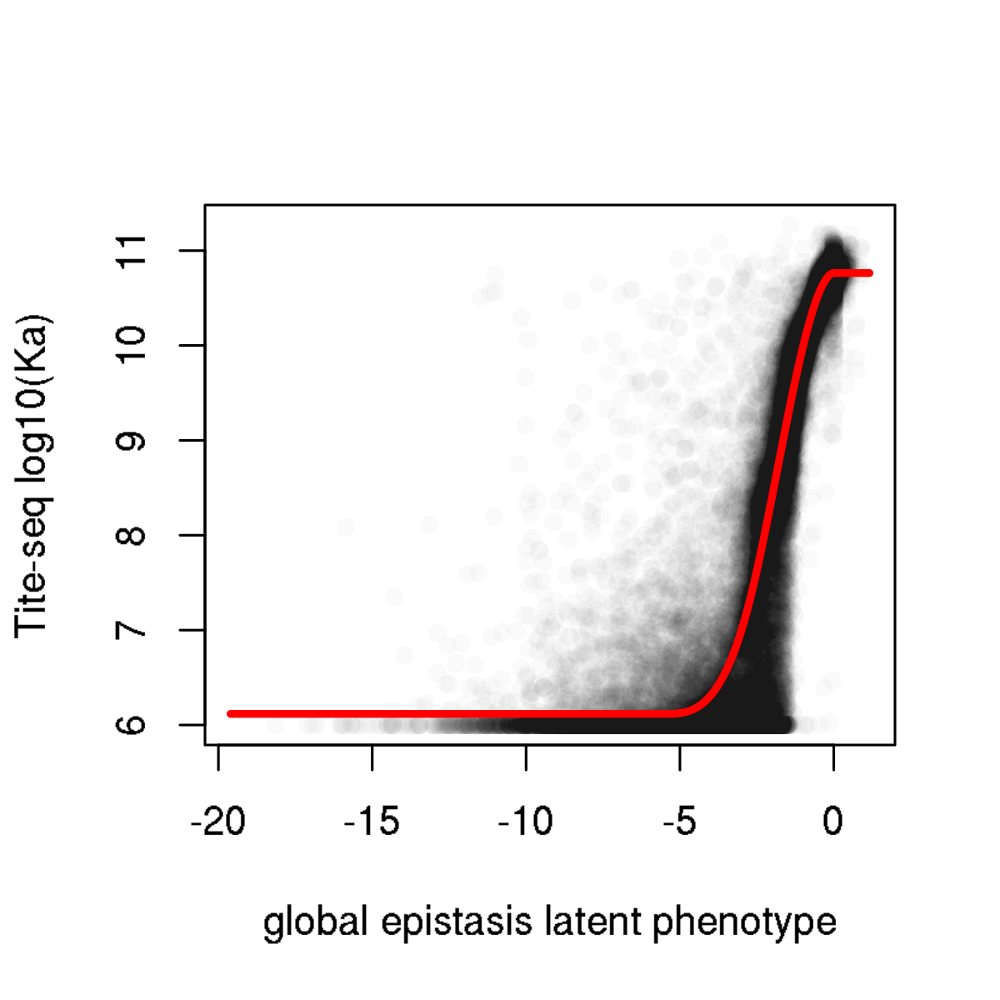

We also read in all parameters from global epistasis models, and
collapse down to individual tables reporting the lib1, lib2, and joint
model inferred effects.

``` r
#open and merge together Cauchy likelihood, binding models
betas_bind_observed_Cauchy <- merge(read.csv('results/global_epistasis_binding/Cauchy-predicted-effects_binding_1.csv',stringsAsFactors=F),
                                    read.csv('results/global_epistasis_binding/Cauchy-predicted-effects_binding_2.csv',stringsAsFactors=F),
                                    by=c("site","mutation","wildtype","mutant"),all=T,sort=T,suffixes=c("_lib1","_lib2"));
betas_bind_observed_Cauchy <- merge(betas_bind_observed_Cauchy,
                                    read.csv('results/global_epistasis_binding/Cauchy-predicted-effects_binding_joint.csv',stringsAsFactors=F),
                                    by=c("site","mutation","wildtype","mutant"),all=T);names(betas_bind_observed_Cauchy)[which(names(betas_bind_observed_Cauchy)=="effect")] <- "effect_joint"

betas_bind_latent_Cauchy <- merge(read.csv('results/global_epistasis_binding/Cauchy-latent-effects_binding_1.csv',stringsAsFactors=F),
                                    read.csv('results/global_epistasis_binding/Cauchy-latent-effects_binding_2.csv',stringsAsFactors=F),
                                    by=c("site","mutation","wildtype","mutant"),all=T,sort=T,suffixes=c("_lib1","_lib2"));
betas_bind_latent_Cauchy <- merge(betas_bind_latent_Cauchy,
                                    read.csv('results/global_epistasis_binding/Cauchy-latent-effects_binding_joint.csv',stringsAsFactors=F),
                                    by=c("site","mutation","wildtype","mutant"),all=T);names(betas_bind_latent_Cauchy)[which(names(betas_bind_latent_Cauchy)=="effect")] <- "effect_joint"

betas_bind_nonepistatic_Cauchy <- merge(read.csv('results/global_epistasis_binding/nonepistatic-Cauchy-predicted-effects_binding_1.csv',stringsAsFactors=F),
                                        read.csv('results/global_epistasis_binding/nonepistatic-Cauchy-predicted-effects_binding_2.csv',stringsAsFactors=F),
                                        by=c("site","mutation","wildtype","mutant"),all=T,sort=T,suffixes=c("_lib1","_lib2"));
betas_bind_nonepistatic_Cauchy <- merge(betas_bind_nonepistatic_Cauchy,
                                    read.csv('results/global_epistasis_binding/nonepistatic-Cauchy-predicted-effects_binding_joint.csv',stringsAsFactors=F),
                                    by=c("site","mutation","wildtype","mutant"),all=T);names(betas_bind_nonepistatic_Cauchy)[which(names(betas_bind_nonepistatic_Cauchy)=="effect")] <- "effect_joint"

#open and merge together Gaussian likelihood, binding models
betas_bind_observed_Gaussian <- merge(read.csv('results/global_epistasis_binding/Gaussian-predicted-effects_binding_1.csv',stringsAsFactors=F),
                                    read.csv('results/global_epistasis_binding/Gaussian-predicted-effects_binding_2.csv',stringsAsFactors=F),
                                    by=c("site","mutation","wildtype","mutant"),all=T,sort=T,suffixes=c("_lib1","_lib2"));
betas_bind_observed_Gaussian <- merge(betas_bind_observed_Gaussian,
                                    read.csv('results/global_epistasis_binding/Gaussian-predicted-effects_binding_joint.csv',stringsAsFactors=F),
                                    by=c("site","mutation","wildtype","mutant"),all=T);names(betas_bind_observed_Gaussian)[which(names(betas_bind_observed_Gaussian)=="effect")] <- "effect_joint"

betas_bind_latent_Gaussian <- merge(read.csv('results/global_epistasis_binding/Gaussian-latent-effects_binding_1.csv',stringsAsFactors=F),
                                    read.csv('results/global_epistasis_binding/Gaussian-latent-effects_binding_2.csv',stringsAsFactors=F),
                                    by=c("site","mutation","wildtype","mutant"),all=T,sort=T,suffixes=c("_lib1","_lib2"));
betas_bind_latent_Gaussian <- merge(betas_bind_latent_Gaussian,
                                    read.csv('results/global_epistasis_binding/Gaussian-latent-effects_binding_joint.csv',stringsAsFactors=F),
                                    by=c("site","mutation","wildtype","mutant"),all=T);names(betas_bind_latent_Gaussian)[which(names(betas_bind_latent_Gaussian)=="effect")] <- "effect_joint"

betas_bind_nonepistatic_Gaussian <- merge(read.csv('results/global_epistasis_binding/nonepistatic-Gaussian-predicted-effects_binding_1.csv',stringsAsFactors=F),
                                        read.csv('results/global_epistasis_binding/nonepistatic-Gaussian-predicted-effects_binding_2.csv',stringsAsFactors=F),
                                        by=c("site","mutation","wildtype","mutant"),all=T,sort=T,suffixes=c("_lib1","_lib2"));
betas_bind_nonepistatic_Gaussian <- merge(betas_bind_nonepistatic_Gaussian,
                                    read.csv('results/global_epistasis_binding/nonepistatic-Gaussian-predicted-effects_binding_joint.csv',stringsAsFactors=F),
                                    by=c("site","mutation","wildtype","mutant"),all=T);names(betas_bind_nonepistatic_Gaussian)[which(names(betas_bind_nonepistatic_Gaussian)=="effect")] <- "effect_joint"


#open and merge together Cauchy likelihood, expression models
betas_expr_observed_Cauchy <- merge(read.csv('results/global_epistasis_expression/Cauchy-predicted-effects_expression_1.csv',stringsAsFactors=F),
                                    read.csv('results/global_epistasis_expression/Cauchy-predicted-effects_expression_2.csv',stringsAsFactors=F),
                                    by=c("site","mutation","wildtype","mutant"),all=T,sort=T,suffixes=c("_lib1","_lib2"));
betas_expr_observed_Cauchy <- merge(betas_expr_observed_Cauchy,
                                    read.csv('results/global_epistasis_expression/Cauchy-predicted-effects_expression_joint.csv',stringsAsFactors=F),
                                    by=c("site","mutation","wildtype","mutant"),all=T);names(betas_expr_observed_Cauchy)[which(names(betas_expr_observed_Cauchy)=="effect")] <- "effect_joint"

betas_expr_latent_Cauchy <- merge(read.csv('results/global_epistasis_expression/Cauchy-latent-effects_expression_1.csv',stringsAsFactors=F),
                                    read.csv('results/global_epistasis_expression/Cauchy-latent-effects_expression_2.csv',stringsAsFactors=F),
                                    by=c("site","mutation","wildtype","mutant"),all=T,sort=T,suffixes=c("_lib1","_lib2"));
betas_expr_latent_Cauchy <- merge(betas_expr_latent_Cauchy,
                                    read.csv('results/global_epistasis_expression/Cauchy-latent-effects_expression_joint.csv',stringsAsFactors=F),
                                    by=c("site","mutation","wildtype","mutant"),all=T);names(betas_expr_latent_Cauchy)[which(names(betas_expr_latent_Cauchy)=="effect")] <- "effect_joint"

betas_expr_nonepistatic_Cauchy <- merge(read.csv('results/global_epistasis_expression/nonepistatic-Cauchy-predicted-effects_expression_1.csv',stringsAsFactors=F),
                                        read.csv('results/global_epistasis_expression/nonepistatic-Cauchy-predicted-effects_expression_2.csv',stringsAsFactors=F),
                                        by=c("site","mutation","wildtype","mutant"),all=T,sort=T,suffixes=c("_lib1","_lib2"));
betas_expr_nonepistatic_Cauchy <- merge(betas_expr_nonepistatic_Cauchy,
                                    read.csv('results/global_epistasis_expression/nonepistatic-Cauchy-predicted-effects_expression_joint.csv',stringsAsFactors=F),
                                    by=c("site","mutation","wildtype","mutant"),all=T);names(betas_expr_nonepistatic_Cauchy)[which(names(betas_expr_nonepistatic_Cauchy)=="effect")] <- "effect_joint"

#open and merge together Gaussian likelihood, expression models
betas_expr_observed_Gaussian <- merge(read.csv('results/global_epistasis_expression/Gaussian-predicted-effects_expression_1.csv',stringsAsFactors=F),
                                    read.csv('results/global_epistasis_expression/Gaussian-predicted-effects_expression_2.csv',stringsAsFactors=F),
                                    by=c("site","mutation","wildtype","mutant"),all=T,sort=T,suffixes=c("_lib1","_lib2"));
betas_expr_observed_Gaussian <- merge(betas_expr_observed_Gaussian,
                                    read.csv('results/global_epistasis_expression/Gaussian-predicted-effects_expression_joint.csv',stringsAsFactors=F),
                                    by=c("site","mutation","wildtype","mutant"),all=T);names(betas_expr_observed_Gaussian)[which(names(betas_expr_observed_Gaussian)=="effect")] <- "effect_joint"

betas_expr_latent_Gaussian <- merge(read.csv('results/global_epistasis_expression/Gaussian-latent-effects_expression_1.csv',stringsAsFactors=F),
                                    read.csv('results/global_epistasis_expression/Gaussian-latent-effects_expression_2.csv',stringsAsFactors=F),
                                    by=c("site","mutation","wildtype","mutant"),all=T,sort=T,suffixes=c("_lib1","_lib2"));
betas_expr_latent_Gaussian <- merge(betas_expr_latent_Gaussian,
                                    read.csv('results/global_epistasis_expression/Gaussian-latent-effects_expression_joint.csv',stringsAsFactors=F),
                                    by=c("site","mutation","wildtype","mutant"),all=T);names(betas_expr_latent_Gaussian)[which(names(betas_expr_latent_Gaussian)=="effect")] <- "effect_joint"

betas_expr_nonepistatic_Gaussian <- merge(read.csv('results/global_epistasis_expression/nonepistatic-Gaussian-predicted-effects_expression_1.csv',stringsAsFactors=F),
                                        read.csv('results/global_epistasis_expression/nonepistatic-Gaussian-predicted-effects_expression_2.csv',stringsAsFactors=F),
                                        by=c("site","mutation","wildtype","mutant"),all=T,sort=T,suffixes=c("_lib1","_lib2"));
betas_expr_nonepistatic_Gaussian <- merge(betas_expr_nonepistatic_Gaussian,
                                    read.csv('results/global_epistasis_expression/nonepistatic-Gaussian-predicted-effects_expression_joint.csv',stringsAsFactors=F),
                                    by=c("site","mutation","wildtype","mutant"),all=T);names(betas_expr_nonepistatic_Gaussian)[which(names(betas_expr_nonepistatic_Gaussian)=="effect")] <- "effect_joint"
```

## Assessing global epistasis models for binding data

Next, for the global epistasis models built on the binding measurements,
let’s look at the correlation between model coefficients inferred from
lib1 and lib2 binding measurements. We look at the model coefficients
both on the “observed” log<sub>10</sub>(*K*<sub>A,app</sub>) and
underlying “latent” scales, as well as without any global epistasiis
nonlinearity.

``` r
par(mfrow=c(3,2))
#observed "log10Ka" scale
#Cauchy
x <- betas_bind_observed_Cauchy$effect_lib1; y <- betas_bind_observed_Cauchy$effect_lib2; fit <- lm(y~x)
plot(x,y,pch=16,col="#00000067",xlab="lib1 beta (observed scale)",ylab="lib2 beta (observed scale)",main=paste("binding, Cauchy observed, R-squared:",round(summary(fit)$r.squared,digits=3)))

#Gaussian
x <- betas_bind_observed_Gaussian$effect_lib1; y <- betas_bind_observed_Gaussian$effect_lib2; fit <- lm(y~x)
plot(x,y,pch=16,col="#00000067",xlab="lib1 beta (observed scale)",ylab="lib2 beta (observed scale)",main=paste("binding, Gaussian observed, R-squared:",round(summary(fit)$r.squared,digits=3)))

#underlying latent scale
#Cauchy
x <- betas_bind_latent_Cauchy$effect_lib1; y <- betas_bind_latent_Cauchy$effect_lib2; fit <- lm(y~x)
plot(x,y,pch=16,col="#00000067",xlab="lib1 beta (latent scale)",ylab="lib2 beta (latent scale)",main=paste("binding, Cauchy latent, R-squared:",round(summary(fit)$r.squared,digits=3)))

#Gaussian
x <- betas_bind_latent_Gaussian$effect_lib1; y <- betas_bind_latent_Gaussian$effect_lib2; fit <- lm(y~x)
plot(x,y,pch=16,col="#00000067",xlab="lib1 beta (latent scale)",ylab="lib2 beta (latent scale)",main=paste("binding, Gaussian latent, R-squared:",round(summary(fit)$r.squared,digits=3)))

#no nonlinear transform
#Cauchy
x <- betas_bind_nonepistatic_Cauchy$effect_lib1; y <- betas_bind_nonepistatic_Cauchy$effect_lib2; fit <- lm(y~x)
plot(x,y,pch=16,col="#00000067",xlab="lib1 beta (no nonlinearity)",ylab="lib2 beta (no nonlinearity)",main=paste("binding, Cauchy nonepistatic, R-squared:",round(summary(fit)$r.squared,digits=3)))

#Gaussian
x <- betas_bind_nonepistatic_Gaussian$effect_lib1; y <- betas_bind_nonepistatic_Gaussian$effect_lib2; fit <- lm(y~x)
plot(x,y,pch=16,col="#00000067",xlab="lib1 beta (no nonlinearity)",ylab="lib2 beta (no nonlinearity)",main=paste("binding, Gaussian nonepistatic, R-squared:",round(summary(fit)$r.squared,digits=3)))
```

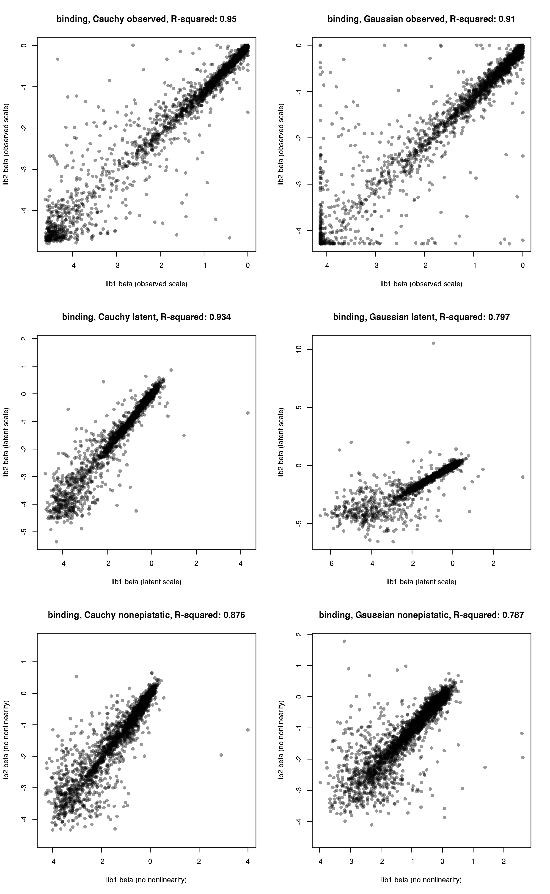
We can see, reassuringly, that our single mutation effect estimates are
better when we incorporate the nonlinearity – this shows that the global
epistasis transform improves this single mutation deconvolution from the
multi-mutants in the library. The Cauchy likelihood models show better
correlation between replicates. This may be in part because the “shape”
of global epistasis differed between libraries in the two Gaussian
likelihood fits.

One interesting observation is that, in the latent space (which at least
from my Ab work, I suspected was also picking up on the *stability*
effects of mutations), there do seem to be a substantial number of
mutations with positive values – but when transformed to the observed
log<sub>10</sub>(*K*<sub>A,app</sub>) scale, these are squashed to zero
from the global epistasis fits. Let’s take a look at what positions
these positive-latent-effect mutations are observed in. The code below
outputs the sites with the largest observed latent-effect mutational
effects in the two library replicates.

These positions are visualized on the ACE2-bound RBD structure
[here](https://dms-view.github.io/?pdb-url=https%3A%2F%2Fraw.githubusercontent.com%2Fdms-view%2FSARS-CoV-2%2Fmaster%2Fdata%2FSpike%2FBloomLab2020%2F6m0j.pdb&markdown-url=https%3A%2F%2Fraw.githubusercontent.com%2Fdms-view%2FSARS-CoV-2%2Fmaster%2Fdata%2FSpike%2FBloomLab2020%2FBloomLab_rbd.md&data-url=https%3A%2F%2Fraw.githubusercontent.com%2Fdms-view%2FSARS-CoV-2%2Fmaster%2Fdata%2FSpike%2FBloomLab2020%2Fresults%2FBloomLab2020_rbd.csv&condition=natural+frequencies&site_metric=site_entropy&mutation_metric=mut_frequency&selected_sites=337%2C358%2C363%2C365%2C367%2C452%2C460%2C493%2C498%2C501%2C518%2C519%2C527).
These mutations fall into two sorts of clusters – some are ACE2-proximal
and may be genuine affinity-mediated positive effects, and others are
ACE2-distal and are more likely stability/expression-mediated. My
hypothesis is that these positive latent-scale mutations are frequently
stabilizing mutations that have a positive latent effect because of
positive effects on binding in destabilized background, but do not cause
further affinity gains in stabilized background like WT. Let’s hold onto
this for a bit and come back to it when we look at our directly measured
single-mutant barcode mutational effects.

``` r
for(i in 1:nrow(betas_bind_latent_Cauchy)){
  betas_bind_latent_Cauchy$site_S[i] <- RBD_sites[RBD_sites$site_RBD==betas_bind_latent_Cauchy$site[i],"site_SARS2"]
}
betas_bind_latent_Cauchy[!is.na(betas_bind_latent_Cauchy$effect_lib1) & !is.na(betas_bind_latent_Cauchy$effect_lib2) & betas_bind_latent_Cauchy$effect_lib1>0.25 & betas_bind_latent_Cauchy$effect_lib2>0.25,c("mutation","site_S")]
```

    ##      mutation site_S
    ## 529     L122K    452
    ## 534     L122Q    452
    ## 535     L122R    452
    ## 709     N130K    460
    ## 1421    Q163A    493
    ## 1438    Q163V    493
    ## 1527    Q168H    498
    ## 1540    Q168Y    498
    ## 1605    N171F    501
    ## 1620    N171Y    501
    ## 1793     A18P    348
    ## 1966    L188G    518
    ## 1983    H189D    519
    ## 2156    P197I    527
    ## 2158    P197L    527
    ## 2159    P197M    527
    ## 2167    P197W    527
    ## 2433     I28F    358
    ## 2553     A33F    363
    ## 2568     A33Y    363
    ## 2607     Y35W    365
    ## 2633     V37F    367
    ## 3346      P7D    337

``` r
unique(betas_bind_latent_Cauchy[!is.na(betas_bind_latent_Cauchy$effect_lib1) & !is.na(betas_bind_latent_Cauchy$effect_lib2) & betas_bind_latent_Cauchy$effect_lib1>0.25 & betas_bind_latent_Cauchy$effect_lib2>0.25,"site_S"])
```

    ##  [1] 452 460 493 498 501 348 518 519 527 358 363 365 367 337

Next, let’s look at mutational effects on binding as inferred directly
in the Tite-seq assay from barcodes carrying only single mutations.
First, let’s look at what fraction of mutations were sampled as sole
mutations on at least one barcode background in each library. (This
differs from what’s reported in the `build_variants.ipynb` notebook, as
we are now quantifying coverage among barcodes *for which we determined
a QC-filtered phenotype*.) We also calculate the total number of
barcodes on which a variant is sampled, and make ecdf plots illustrating
barcode counts among determined phenotypes. The top two plots show, for
pooled libraries, the total number of bcs and the number of
single-mutant barcodes on which each mutation is found. The bottom plots
show something slightly different, related to the mutational effects we
will be taking forward later down in the analysis. This plot shows the
number of barcodes on which each type of measurement that we take forth
is made on – for single-lib mutational measurements in which there is no
direct 1mut bc sampled, we show the cdf for number of (multi-mutant) bcs
on which a mutation was sampled; and for single-lib mutational
measurements in which there is at least one 1mut direct bc sampled, the
cdf of the number of these 1mut barcodes on which the mutation was
sampled.

``` r
#build master "betas" data table that lists *all* mutations, including those that are undetermined in the model outputs
AAs <- c("A","C","D","E","F","G","H","I","K","L","M","N","P","Q","R","S","T","V","W","Y","*")

betas <- data.frame()
for(i in 1:nrow(RBD_sites)){
  to.add <- data.frame(site_RBD=rep(RBD_sites$site_RBD[i],21), site_SARS2=rep(RBD_sites$site_SARS2[i],21), wildtype=rep(RBD_sites$amino_acid_SARS2[i],21), mutant=AAs, mutation=NA, mutation_RBD=NA)
  for(j in 1:nrow(to.add)){
    to.add$mutation[j] <- paste(to.add$wildtype[j],to.add$site_SARS2[j],to.add$mutant[j],sep="")
    to.add$mutation_RBD[j] <- paste(to.add$wildtype[j],to.add$site_RBD[j],to.add$mutant[j],sep="")
  }
  betas <- rbind(betas,to.add)
}
betas$wildtype <- as.character(betas$wildtype); betas$mutant <- as.character(betas$mutant)
betas <- data.table(betas)

bc_bind[,aa_subs_list := list(strsplit(aa_substitutions,split=" ")),by=.(library,barcode)]

#gives total number of barcodes with a determined binding phenotype in each library on which a genotype was sampled (takes a while to compute)
betas[,n_bc_bind_lib1 := sum(unlist(lapply(bc_bind[library=="lib1" & !is.na(log10Ka),aa_subs_list], function(x) mutation_RBD %in% x))),by=mutation]
betas[,n_bc_bind_lib2 := sum(unlist(lapply(bc_bind[library=="lib2" & !is.na(log10Ka),aa_subs_list], function(x) mutation_RBD %in% x))),by=mutation]

for(i in 1:nrow(betas)){
  delta_log10Ka_1 <- bc_bind[aa_substitutions==betas[i,"mutation_RBD"] & library=="lib1",delta_log10Ka]
  delta_log10Ka_2 <- bc_bind[aa_substitutions==betas[i,"mutation_RBD"] & library=="lib2",delta_log10Ka]
  betas$n_bc_1mut_bind_lib1[i] <- sum(!is.na(delta_log10Ka_1)) #gives number of single-mutant barcodes with a phenotype on which a genotype was sampled
  betas$n_bc_1mut_bind_lib2[i] <- sum(!is.na(delta_log10Ka_2))
  betas$bind_lib1_direct[i] <- mean(delta_log10Ka_1,na.rm=T)
  betas$bind_lib2_direct[i] <- mean(delta_log10Ka_2,na.rm=T)
}

par(mfrow=c(2,2))
#output ecdf plots: first, for all mutants, counts across all barcodes and across 1mut barcodes
plot(ecdf(betas[mutant!="*" & wildtype!=mutant,n_bc_bind_lib1+n_bc_bind_lib2]),xlim=c(0,200),verticals=T,pch=NA,col.01line=NA,main=paste("pooled binding scores, median =",median(betas[mutant!="*" & wildtype!=mutant,n_bc_bind_lib1+n_bc_bind_lib2])),xlab="number of barcodes",ylab="fraction mutations found < X times")
abline(v=median(betas[mutant!="*" & wildtype!=mutant,n_bc_bind_lib1+n_bc_bind_lib2]),lty=2);abline(h=0.5,lty=2)

plot(ecdf(betas[mutant!="*" & wildtype!=mutant,n_bc_1mut_bind_lib1+n_bc_1mut_bind_lib2]),verticals=T,pch=NA,col.01line=NA,main=paste("pooled binding scores, 1mut barcodes,\nmedian =",median(betas[mutant!="*" & wildtype!=mutant,n_bc_1mut_bind_lib1+n_bc_1mut_bind_lib2])),xlab="number of single-mutant barcodes",ylab="fraction mutations found < X times",xlim=c(0,25))
abline(v=median(betas[mutant!="*" & wildtype!=mutant,n_bc_1mut_bind_lib1+n_bc_1mut_bind_lib2]),lty=2);abline(h=0.5,lty=2)

#next, output ecdf for all-barcode counts *only for single-lib obs that do not have single-mut barcodes*
plot(ecdf(c(betas[mutant!="*" & wildtype!=mutant & n_bc_1mut_bind_lib1 == 0, n_bc_bind_lib1],betas[mutant!="*" & wildtype!=mutant & n_bc_1mut_bind_lib2 == 0, n_bc_bind_lib2])), xlim=c(0,50), verticals=T,pch=NA, col.01line=NA, main=paste("single-lib, no direct 1mut bc\nmedian =",median(c(betas[mutant!="*" & wildtype!=mutant & n_bc_1mut_bind_lib1 == 0, n_bc_bind_lib1],betas[mutant!="*" & wildtype!=mutant & n_bc_1mut_bind_lib2 == 0, n_bc_bind_lib2]))),xlab="number of barcodes",ylab="fraction mutations found < X times")
abline(v=median(c(betas[mutant!="*" & wildtype!=mutant & n_bc_1mut_bind_lib1 == 0, n_bc_bind_lib1],betas[mutant!="*" & wildtype!=mutant & n_bc_1mut_bind_lib2 == 0, n_bc_bind_lib2])),lty=2);abline(h=0.5,lty=2)

#next, output ecdf for 1mut counts *only for single-lib obs that have at least 1 1mut barcode*
plot(ecdf(c(betas[mutant!="*" & wildtype!=mutant & n_bc_1mut_bind_lib1 > 0, n_bc_1mut_bind_lib1],betas[mutant!="*" & wildtype!=mutant & n_bc_1mut_bind_lib2 > 0, n_bc_1mut_bind_lib2])), xlim=c(0,25), verticals=T,pch=NA, col.01line=NA, main=paste("single-lib, 1mut bc for directly sampled muts\nmedian =",median(c(betas[mutant!="*" & wildtype!=mutant & n_bc_1mut_bind_lib1 > 0, n_bc_1mut_bind_lib1],betas[mutant!="*" & wildtype!=mutant & n_bc_1mut_bind_lib2 > 0, n_bc_1mut_bind_lib2]))),xlab="number of barcodes",ylab="fraction mutations found < X times")
abline(v=median(c(betas[mutant!="*" & wildtype!=mutant & n_bc_1mut_bind_lib1 > 0, n_bc_1mut_bind_lib1],betas[mutant!="*" & wildtype!=mutant & n_bc_1mut_bind_lib2 > 0, n_bc_1mut_bind_lib2])),lty=2);abline(h=0.5,lty=2)
```

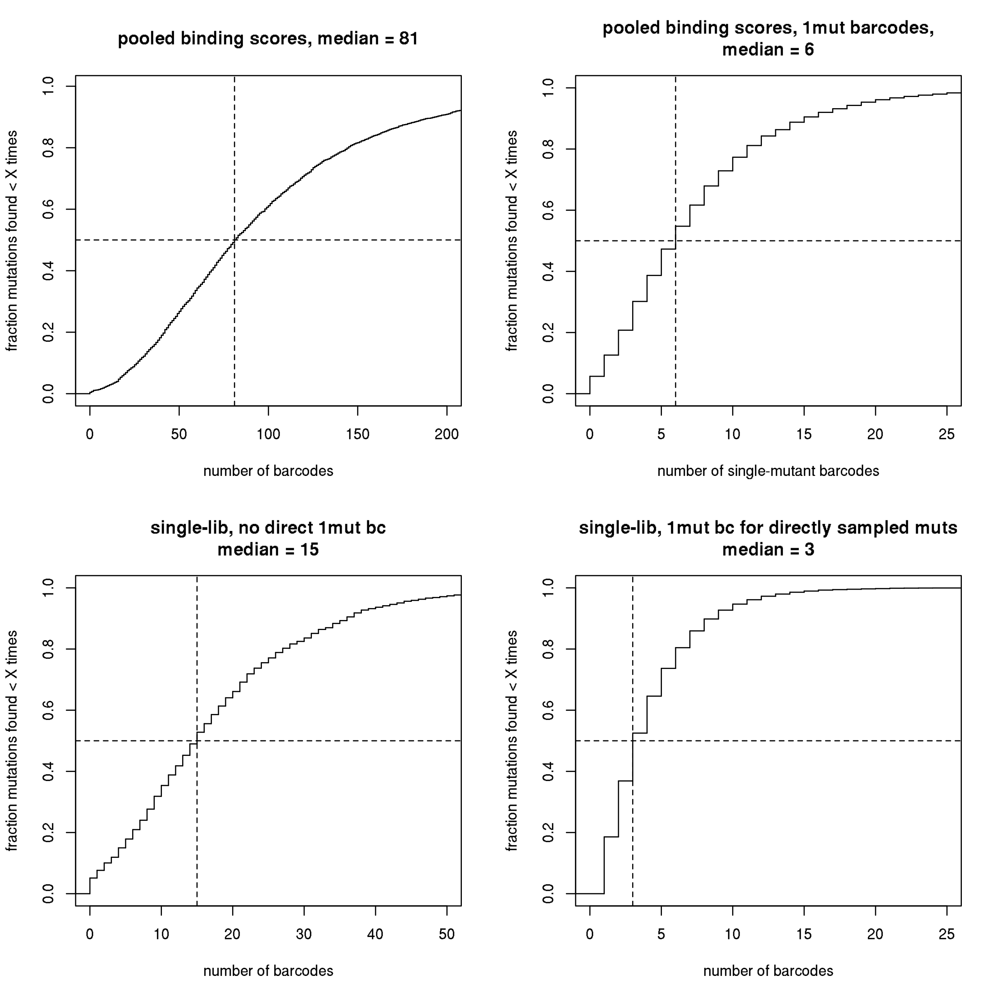

In lib1, we directly measured the effects of 85.73% of mutations *as
sole mutations* on at least one barcode background (a higher percentage
of mutations are sampled more extensively on multiple mutant
backgrounds). In lib2, we directly measured 86.15% of mutations as
singles. Taken together, we directly measured 94.32% of mutations as
singles in at least one of the two libraries, and we directly measured
77.56% of mutations as single mutations in both libraries.

First, let’s look at the correlation between these directly measured
single-mutant effects in the two libraries.

``` r
x <- betas$bind_lib1_direct; y <- betas$bind_lib2_direct; fit <- lm(y~x)
plot(x,y,pch=16,col="#00000067",xlab="lib1 mutational effect from single mut bcs",ylab="lib2 mutational effect from single mut bcs",main=paste("binding, single mut direct measurements\nR-squared:",round(summary(fit)$r.squared,digits=3)))
```

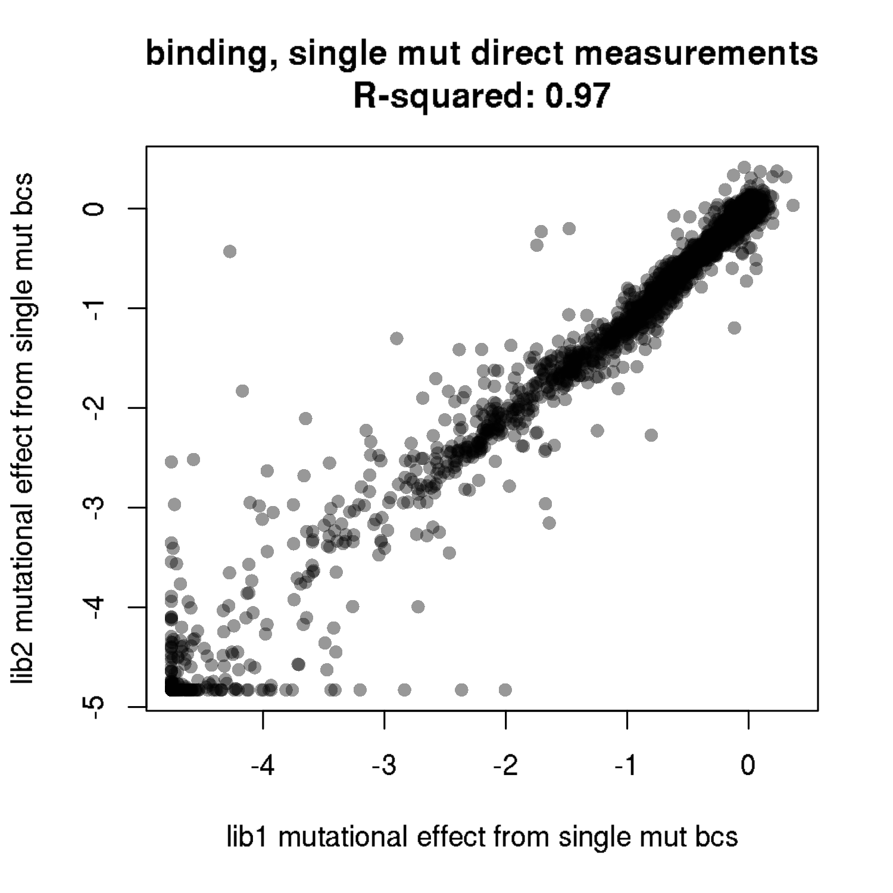
Let’s look at the sites with directly measured beneficial mutations
(output below). As you can see
[here](https://dms-view.github.io/?pdb-url=https%3A%2F%2Fraw.githubusercontent.com%2Fdms-view%2FSARS-CoV-2%2Fmaster%2Fdata%2FSpike%2FBloomLab2020%2F6m0j.pdb&markdown-url=https%3A%2F%2Fraw.githubusercontent.com%2Fdms-view%2FSARS-CoV-2%2Fmaster%2Fdata%2FSpike%2FBloomLab2020%2FBloomLab_rbd.md&data-url=https%3A%2F%2Fraw.githubusercontent.com%2Fdms-view%2FSARS-CoV-2%2Fmaster%2Fdata%2FSpike%2FBloomLab2020%2Fresults%2FBloomLab2020_rbd.csv&condition=natural+frequencies&site_metric=site_entropy&mutation_metric=mut_frequency&selected_sites=367%2C453%2C484%2C498%2C501%2C505%2C528),
five of the seven sites with the strongest directly-measured beneficial
effect are at the ACE2 interface, suggesting these might be valid
affinity-enhancing mutations. This is in contrast to the beneficial
latent-effect measurements we looked at above, which were at a
combination of ACE2-proximal and ACE2-distal sites, seemingly including
both stabiltiy- and affinity-mediated effects. This observation is
consistent with the model that stability-enhancing mutations, by and
large, don’t further improve affinity in the stable wildtype background,
though they may improve affinity in destabilized secondary mutant
backgrounds and therefore acquire positive latent-scale coefficients.

``` r
betas[bind_lib1_direct>0.1 & bind_lib2_direct>0.1,c("mutation","site_SARS2")]
```

    ##    mutation site_SARS2
    ## 1:    V367A        367
    ## 2:    V367W        367
    ## 3:    Y453F        453
    ## 4:    E484R        484
    ## 5:    Q498F        498
    ## 6:    Q498H        498
    ## 7:    N501F        501
    ## 8:    N501V        501
    ## 9:    Y505W        505

``` r
unique(betas[bind_lib1_direct>0.1 & bind_lib2_direct>0.1,site_SARS2])
```

    ## [1] 367 453 484 498 501 505

How do the mutation effect coefficients estimated in global
epistasis/regression models correlate with these direct measurements of
single mutant effects?

The plots below show the average directly measured phenotype for single
mutant barcodes in the two libraries (only showing mutations that were
sampled as singles in *both* libraries), versus the average of the beta
coefficients for the mutation from the lib1 and lib2 model fits (once
again, only showing mutations that were determined in *both* libraries).
Note, these correlations are therefore biased toward the best-coverage
mutants we have, since they are only for mutants that were sampled as
singles in both libraries, which are going to probably be at higher
frequency in general, and therefore are better determined with direct
experiment as well as model decompositions. We will investigate
lower-coverage mutants further below.

``` r
par(mfrow=c(2,2))
#Cauchy, observed
x <- rowMeans(betas_bind_observed_Cauchy[,c("effect_lib1","effect_lib2")]);y <- NULL; for(i in 1:nrow(betas_bind_observed_Cauchy)){y <- c(y, betas[mutation_RBD==betas_bind_observed_Cauchy$mutation[i],mean(c(bind_lib1_direct,bind_lib2_direct))])};fit <- lm(y~x)
plot(x,y,pch=16,col="#00000067",xlab="average lib1&lib2 beta, Cauchy observed",ylab="direct single mut measurement",main=paste("Directly measured vs Cauchy, observed scale.\n R-squared:",round(summary(fit)$r.squared,digits=3)))

#Gaussian, observed
x <- rowMeans(betas_bind_observed_Gaussian[,c("effect_lib1","effect_lib2")]);y <- NULL; for(i in 1:nrow(betas_bind_observed_Gaussian)){y <- c(y, betas[mutation_RBD==betas_bind_observed_Gaussian$mutation[i],mean(c(bind_lib1_direct,bind_lib2_direct))])};fit <- lm(y~x)
plot(x,y,pch=16,col="#00000067",xlab="average lib1&lib2 beta",ylab="direct single mut measurement",main=paste("Directly measured vs Gaussian, observed scale.\n R-squared:",round(summary(fit)$r.squared,digits=3)))

#Cauchy, latent
x <- rowMeans(betas_bind_latent_Cauchy[,c("effect_lib1","effect_lib2")]);y <- NULL; for(i in 1:nrow(betas_bind_latent_Cauchy)){y <- c(y, betas[mutation_RBD==betas_bind_latent_Cauchy$mutation[i],mean(c(bind_lib1_direct,bind_lib2_direct))])};fit <- lm(y~x)
plot(x,y,pch=16,col="#00000067",xlab="average lib1&lib2 beta, Cauchy latent",ylab="direct single mut measurement",main=paste("Directly measured vs Cauchy, latent scale.\n R-squared:",round(summary(fit)$r.squared,digits=3)))

#Gaussian, latent
x <- rowMeans(betas_bind_latent_Gaussian[,c("effect_lib1","effect_lib2")]);y <- NULL; for(i in 1:nrow(betas_bind_latent_Gaussian)){y <- c(y, betas[mutation_RBD==betas_bind_latent_Gaussian$mutation[i],mean(c(bind_lib1_direct,bind_lib2_direct))])};fit <- lm(y~x)
plot(x,y,pch=16,col="#00000067",xlab="average lib1&lib2 beta",ylab="direct single mut measurement",main=paste("Directly measured vs Gaussian, latent scale.\n R-squared:",round(summary(fit)$r.squared,digits=3)))
```

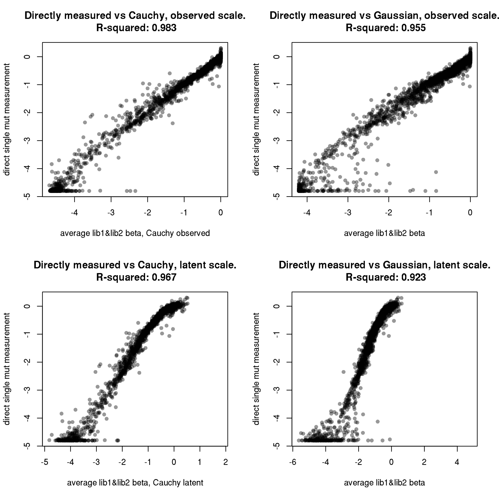

In comparing model coefficients to the directly sampled single mutants,
it *does* seem like the latent-scale beneficial mutations are not
necessarily observed to enhance affinity when measured directly as
single mutations on the wildtype background (see the “bend” near \[0,0\]
in the lower plots). This lends further support to the idea that the
*observed* scale effects are our model coefficients of interest, and
could explain why the global epistasis models fit a threshold at the
wildtype in the nonlinearity, disallowing beneficial latent scale
mutations (which, I hypothesize, are largely stabilizing mutations) from
exhibiting beneficial affinity effects on the stable WT background, as
by and large, the direct measurements of these mutations were \~neutral
on the wildtype background.

(We also inferred *joint* models, where we concatenated all of the
barcode phenotype measurements from the two libraries together before
model fitting – instead of averaging beta coefficients from two fits, we
are therefore just fitting one beta to all of the data simultaneously. I
made plots like above for these joint coefficients, compared to the
average of the two replicate coefficients – in every case these joint
models perform slightly worse than the average coefficient, so I have
removed this code for now.)

The plots above are sort of the “best case” correlation between model
and directly measured variants, as they are constructed for mutations
that are prone to being high-coverage by virtue of being directly
sampled in both libraries. The Cauchy-likelihood observed-scale model
coefficients perform the best above – how do they perform in a more
difficult circumstance (and one that is potentially indicative of their
eventual use), in which it’s “filling in” mutations that were not
directly sampled, which are therefore inherently lower-coverage?

To look at this scenario, we take mutations that are *not* directly
sampled as single mutations in lib1, but are in lib2, and see how well
the lib1 model coefficient correlates with the lib2 direct measurements.
We also do the inverse (plot lib2 coefficients versus lib1-only direct
samples), and plot the two versions concatenated together for better N.

``` r
par(mfrow=c(1,3))
lib1_coef_lib2_direct <- betas[is.na(bind_lib1_direct) & !is.na(bind_lib2_direct) & mutant!=wildtype & mutant!="*",]
lib1_coef_lib2_direct$bind_lib1_beta <- as.numeric(NA)
for(i in 1:nrow(lib1_coef_lib2_direct)){
  lib1_coef_lib2_direct[i,"bind_lib1_beta"] <- betas_bind_observed_Cauchy[betas_bind_observed_Cauchy$mutation==lib1_coef_lib2_direct[i,mutation_RBD],"effect_lib1"]
}
x<-lib1_coef_lib2_direct$bind_lib1_beta; y<-lib1_coef_lib2_direct$bind_lib2_direct; fit<-lm(y~x)
plot(x,y,pch=16,col="#00000067",xlab="lib1 beta coefficient, Cauchy observed",ylab="lib2 direct single mut measurement",main=paste("Directly measured vs Cauchy observed, single-lib-NA\n R-squared:",round(summary(fit)$r.squared,digits=3)))

lib2_coef_lib1_direct <- betas[!is.na(bind_lib1_direct) & is.na(bind_lib2_direct) & mutant!=wildtype & mutant!="*",]
lib2_coef_lib1_direct$bind_lib2_beta <- as.numeric(NA)
for(i in 1:nrow(lib2_coef_lib1_direct)){
  lib2_coef_lib1_direct[i,"bind_lib2_beta"] <- betas_bind_observed_Cauchy[betas_bind_observed_Cauchy$mutation==lib2_coef_lib1_direct[i,mutation_RBD],"effect_lib2"]
}
x<-lib2_coef_lib1_direct$bind_lib2_beta; y<-lib2_coef_lib1_direct$bind_lib1_direct; fit<-lm(y~x)
plot(x,y,pch=16,col="#00000067",xlab="lib2 beta coefficient, Cauchy observed",ylab="lib1 direct single mut measurement",main=paste("Directly measured vs Cauchy observed, single-lib-NA\n R-squared:",round(summary(fit)$r.squared,digits=3)))

x <- c(lib1_coef_lib2_direct$bind_lib1_beta,lib2_coef_lib1_direct$bind_lib2_beta);y<-c(lib1_coef_lib2_direct$bind_lib2_direct, lib2_coef_lib1_direct$bind_lib1_direct);fit<-lm(y~x)
plot(x,y,pch=16,col="#00000067",xlab="libX beta coefficient, Cauchy observed",ylab="libY direct single mut measurement",main=paste("Directly measured vs Cauchy observed, single-lib-NA\n R-squared:",round(summary(fit)$r.squared,digits=3)))
```

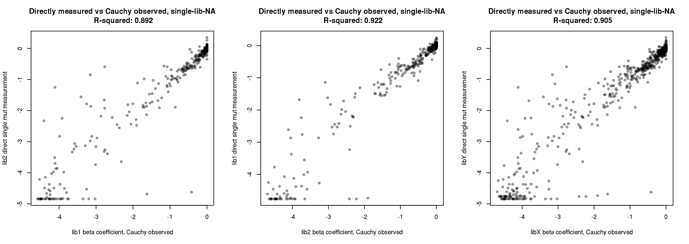

For mutations that are not sampled as single mutants in either library,
we cannot of course compare to any direct measurements, but we can
simply see how well correlated the two replicate model beta coefficients
are. This is shown below, once again with the Cauchy observed scale
coefficients. These are likely to be the worst beta coefficients, and
yet they still correlate quite well.

``` r
lib1_coef_lib2_coef <- betas[is.na(bind_lib1_direct) & is.na(bind_lib2_direct) & mutant!=wildtype & mutant!="*",]
lib1_coef_lib2_coef$bind_lib1_beta <- as.numeric(NA)
lib1_coef_lib2_coef$bind_lib2_beta <- as.numeric(NA)
for(i in 1:nrow(lib1_coef_lib2_coef)){
  if(lib1_coef_lib2_coef$mutation_RBD[i] %in% betas_bind_observed_Cauchy$mutation){
    lib1_coef_lib2_coef[i,"bind_lib1_beta"] <- betas_bind_observed_Cauchy[betas_bind_observed_Cauchy$mutation==lib1_coef_lib2_coef[i,mutation_RBD],"effect_lib1"]
    lib1_coef_lib2_coef[i,"bind_lib2_beta"] <- betas_bind_observed_Cauchy[betas_bind_observed_Cauchy$mutation==lib1_coef_lib2_coef[i,mutation_RBD],"effect_lib2"]
  }else{
    lib1_coef_lib2_coef[i,"bind_lib1_beta"] <- NA
    lib1_coef_lib2_coef[i,"bind_lib2_beta"] <- NA
  }
}
x<-lib1_coef_lib2_coef$bind_lib1_beta; y<-lib1_coef_lib2_coef$bind_lib2_beta; fit<-lm(y~x)
plot(x,y,pch=16,col="#00000067",xlab="lib1 beta coefficient, Cauchy observed",ylab="lib2 beta coefficient, Cauchy observed",main=paste("Model coefs, muts with no direct obs\n R-squared:",round(summary(fit)$r.squared,digits=3)))
```

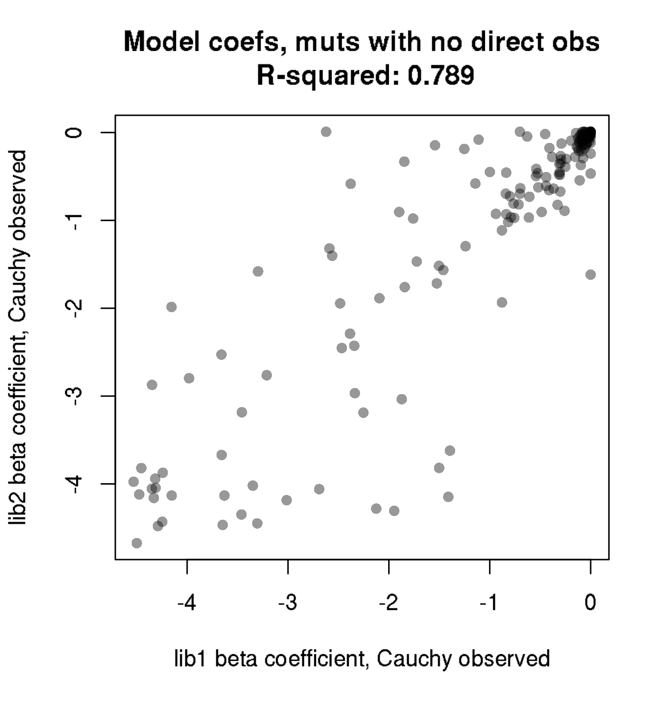

Overall, my intuition from looking at the mutations with positive
latent-scale versus directly measured beneficial effects, along with the
shapes of correlations between latent-scale and direct measurements,
leads me to believe that stability is a large contributor to the
latent-scale effects of mutations. Because of this, and the fact that
stabilizing mutations don’t enhance affinity in the stabilized WT
background, the observed scale nonlinearity censors the beneficial
latent-effect mutations to have no effect (beta = 0) on the WT
background observed-scale. However, this complete censoring of positive
observed-scale coefficients contrasts with our observation from directly
sampled measurements, that there do appear to be *some* true
affinity-enhancing single mutants in the wildtype background.

Taken together, then, my proposal is as follows:

  - For any single mutation that was directly sampled on at least one
    barcode in a replicate, use the directly measured single mutant
    effect from those direct samples for that replicate.
  - For any single mutation that was not directly sampled on at least
    one barcode, use the Cauchy observed-scale global epistasis
    coefficient for that replicate.
  - Then, for each mutation’s ‘final’ effect, we take the average effect
    of its value in the two replicate libraries. Based on the numbers
    output above:
      - For \~78% of single mutants, this average will be computed from
        two directly-measured single mutant effects. This class of
        replicate measurements are described by the correlation above
        with R-squared of \~0.974
      - For about 16% of single mutants, this average will be computed
        from one directly-measured single mutant effect, and one model
        coefficient from a global epistasis model. This class of
        replicate measurements are described by the correlation above
        with R-squared of \~0.876
      - For about 6% of single mutants, this average will be computed
        from two global epistasis model coefficients. This class of
        replicate measurements are described by the correlation above
        with R-squared of \~0.766

The main thing to note again at this point, is that the global epistasis
model coefficients are disallowed from values \>0. Taken together, I
think this behavior is acceptable – positing a beneficial mutational
effect on binding from these modeled coefficients alone, which are less
precisely determined, would be less convincing. So, I think taking a
more conservative approach per the global epistasis model, disallowing
non-direct measurements from being assigned affinity-enhancing effects,
is appropriate.

Here, we add the Cauchy observed-scale model-predicted beta coefficients
to our growing “betas” master data table. We then derive a final lib1
and lib2 mutational effect, which is the directly sampled single mutant
effect if present, or the model coefficient if not. Finallly, we
calculate the final binding effect for a mutation, as the average of the
lib1 and lib2 scores.

``` r
betas[,bind_lib1_coef := betas_bind_observed_Cauchy[betas_bind_observed_Cauchy$mutation==mutation_RBD,"effect_lib1"],by=mutation_RBD]
betas[,bind_lib2_coef := betas_bind_observed_Cauchy[betas_bind_observed_Cauchy$mutation==mutation_RBD,"effect_lib2"],by=mutation_RBD]

betas[,bind_lib1 := bind_lib1_direct]
betas[is.na(bind_lib1),bind_lib1 := bind_lib1_coef]

betas[,bind_lib2 := bind_lib2_direct]
betas[is.na(bind_lib2),bind_lib2 := bind_lib2_coef]

betas[,bind_avg := mean(c(bind_lib1,bind_lib2),na.rm=T),by=mutation]
```

## Assessing global epistasis models for expression data

Next, we will assess the global epistasis models built on the expression
measurements. Let’s first look at the correlation between model
coefficients inferred from lib1 and lib2 expression measurements, both
on the “observed” mean fluorescece and underlying “latent” scales, along
with outputs from models with no global epistasis nonlinear correction.

``` r
par(mfrow=c(3,2))
#observed "mean fluor" scale
#Cauchy
x <- betas_expr_observed_Cauchy$effect_lib1; y <- betas_expr_observed_Cauchy$effect_lib2; fit <- lm(y~x)
plot(x,y,pch=16,col="#00000067",xlab="lib1 beta (observed scale)",ylab="lib2 beta (observed scale)",main=paste("expression, Cauchy observed, R-squared:",round(summary(fit)$r.squared,digits=3)))

#Gaussian
x <- betas_expr_observed_Gaussian$effect_lib1; y <- betas_expr_observed_Gaussian$effect_lib2; fit <- lm(y~x)
plot(x,y,pch=16,col="#00000067",xlab="lib1 beta (observed scale)",ylab="lib2 beta (observed scale)",main=paste("expression, Gaussian observed, R-squared:",round(summary(fit)$r.squared,digits=3)))

#underlying latent scale
#Cauchy
x <- betas_expr_latent_Cauchy$effect_lib1; y <- betas_expr_latent_Cauchy$effect_lib2; fit <- lm(y~x)
plot(x,y,pch=16,col="#00000067",xlab="lib1 beta (latent scale)",ylab="lib2 beta (latent scale)",main=paste("expression, Cauchy latent, R-squared:",round(summary(fit)$r.squared,digits=3)))

#Gaussian
x <- betas_expr_latent_Gaussian$effect_lib1; y <- betas_expr_latent_Gaussian$effect_lib2; fit <- lm(y~x)
plot(x,y,pch=16,col="#00000067",xlab="lib1 beta (latent scale)",ylab="lib2 beta (latent scale)",main=paste("expression, Gaussian latent, R-squared:",round(summary(fit)$r.squared,digits=3)))

#no nonlinear transform
#Cauchy
x <- betas_expr_nonepistatic_Cauchy$effect_lib1; y <- betas_expr_nonepistatic_Cauchy$effect_lib2; fit <- lm(y~x)
plot(x,y,pch=16,col="#00000067",xlab="lib1 beta (no nonlinearity)",ylab="lib2 beta (no nonlinearity)",main=paste("expression, Cauchy nonepistatic, R-squared:",round(summary(fit)$r.squared,digits=3)))

#Gaussian
x <- betas_expr_nonepistatic_Gaussian$effect_lib1; y <- betas_expr_nonepistatic_Gaussian$effect_lib2; fit <- lm(y~x)
plot(x,y,pch=16,col="#00000067",xlab="lib1 beta (no nonlinearity)",ylab="lib2 beta (no nonlinearity)",main=paste("expression, Gaussian nonepistatic, R-squared:",round(summary(fit)$r.squared,digits=3)))
```

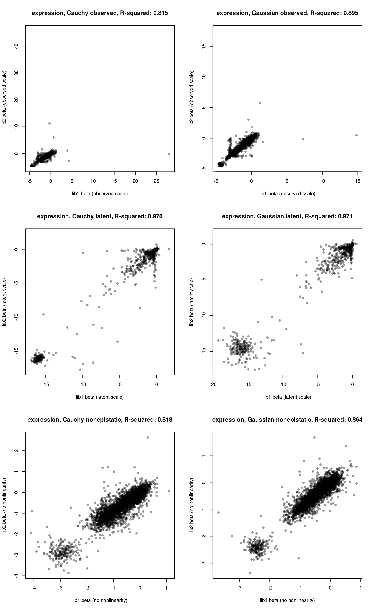
The observed-scale plots show some obvious errant fit points with large
positive predicted effects. Let’s filter these points to be NA in the
library in which they were assigned these large values, and look at
these plots with the filtered data. Also, for better comparison to the
latent-scale phenotypes, we zoom in on the range of the latent scale
excluding the highly deleterious cluster of STOP variants near \[-15,
-15\]. We are *not* removing these points from the correlation
computation, however, but simply want to investigate the correlation by
eye in the region closer to wildtype.

``` r
for(i in 1:nrow(betas_expr_observed_Cauchy)){
  if(!is.na(betas_expr_observed_Cauchy$effect_lib1[i]) & betas_expr_observed_Cauchy$effect_lib1[i] > 1){betas_expr_observed_Cauchy$effect_lib1[i] <- NA}
  if(!is.na(betas_expr_observed_Cauchy$effect_lib2[i]) & betas_expr_observed_Cauchy$effect_lib2[i] > 1){betas_expr_observed_Cauchy$effect_lib2[i] <- NA}
}

for(i in 1:nrow(betas_expr_observed_Gaussian)){
  if(!is.na(betas_expr_observed_Gaussian$effect_lib1[i]) & betas_expr_observed_Gaussian$effect_lib1[i] > 1){betas_expr_observed_Gaussian$effect_lib1[i] <- NA}
  if(!is.na(betas_expr_observed_Gaussian$effect_lib2[i]) & betas_expr_observed_Gaussian$effect_lib2[i] > 1){betas_expr_observed_Gaussian$effect_lib2[i] <- NA}
}

par(mfrow=c(3,2))
#observed "mean fluor" scale
#Cauchy
x <- betas_expr_observed_Cauchy$effect_lib1; y <- betas_expr_observed_Cauchy$effect_lib2; fit <- lm(y~x)
plot(x,y,pch=16,col="#00000067",xlab="lib1 beta (observed scale)",ylab="lib2 beta (observed scale)",main=paste("expression, Cauchy observed, R-squared:",round(summary(fit)$r.squared,digits=3)))

#Gaussian
x <- betas_expr_observed_Gaussian$effect_lib1; y <- betas_expr_observed_Gaussian$effect_lib2; fit <- lm(y~x)
plot(x,y,pch=16,col="#00000067",xlab="lib1 beta (observed scale)",ylab="lib2 beta (observed scale)",main=paste("expression, Gaussian observed, R-squared:",round(summary(fit)$r.squared,digits=3)))

#underlying latent scale
#Cauchy
x <- betas_expr_latent_Cauchy$effect_lib1; y <- betas_expr_latent_Cauchy$effect_lib2; fit <- lm(y~x)
plot(x,y,pch=16,col="#00000067",xlim=c(-2,1),ylim=c(-2,1),xlab="lib1 beta (latent scale)",ylab="lib2 beta (latent scale)",main=paste("expression, Cauchy latent, R-squared:",round(summary(fit)$r.squared,digits=3)))

#Gaussian
x <- betas_expr_latent_Gaussian$effect_lib1; y <- betas_expr_latent_Gaussian$effect_lib2; fit <- lm(y~x)
plot(x,y,pch=16,col="#00000067",xlim=c(-2,1),ylim=c(-2,1),xlab="lib1 beta (latent scale)",ylab="lib2 beta (latent scale)",main=paste("expression, Gaussian latent, R-squared:",round(summary(fit)$r.squared,digits=3)))

#no nonlinear transform
#Cauchy
x <- betas_expr_nonepistatic_Cauchy$effect_lib1; y <- betas_expr_nonepistatic_Cauchy$effect_lib2; fit <- lm(y~x)
plot(x,y,pch=16,col="#00000067",xlab="lib1 beta (no nonlinearity)",ylab="lib2 beta (no nonlinearity)",main=paste("expression, Cauchy nonepistatic, R-squared:",round(summary(fit)$r.squared,digits=3)))

#Gaussian
x <- betas_expr_nonepistatic_Gaussian$effect_lib1; y <- betas_expr_nonepistatic_Gaussian$effect_lib2; fit <- lm(y~x)
plot(x,y,pch=16,col="#00000067",xlab="lib1 beta (no nonlinearity)",ylab="lib2 beta (no nonlinearity)",main=paste("expression, Gaussian nonepistatic, R-squared:",round(summary(fit)$r.squared,digits=3)))
```

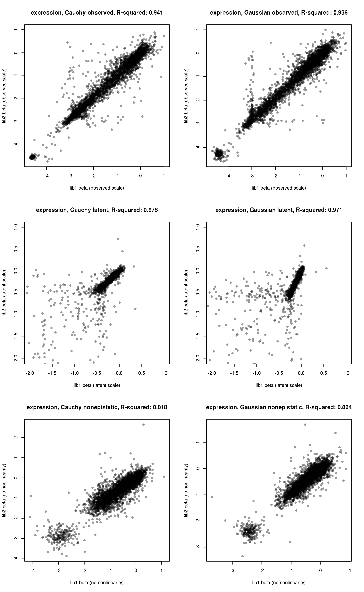
We can see once again that the correlation in estimates of single
mutation effects is better when accounting for nonlinearity in the mean
fluorescence expression metric – this shows that the global epistasis
transform improves this single mutation deconvolution from the
multi-mutants in the library. The steep slope in the nonlinearity fit
between latent and observed scale in the global\_epistasis\_expression
notebook creates a “shrinking” of the scale of latent effects for the
majority of mutations – this probably comes from the fact that the
global epistasis model is set so that the average latent-effect
coefficient is 1, but when there are some mutations (primarily nonsense
mutants) with extremely negative latent-scale effects, it shrinks the
range for the rest of mutations and creates this sharp slope.

In any case, the observed-scale measurements look very well-correlated
between replicates. Finally, on each of these scales, it looks like
there’s quite a large number of mutations with positive expression
effects, which will be interesting to look at later on.

Next, let’s look at directly sampled single-mutant effects on expression
from barcodes carrying just single mutations. We calculate the number of
barcodes each mutation is found on, including single-mutant barcodes and
all barcodes for which expression measurements were fit and kept
post-filtering. We also make cdf plots of the number of barcodes on
which a mutation is sampled.

``` r
#add to master "betas" data table that lists *all* mutations, including those that are undetermined in the model outputs
bc_expr[,aa_subs_list := list(strsplit(aa_substitutions,split=" ")),by=.(library,barcode)]

#gives total number of barcodes with a determined expring phenotype in each library on which a genotype was sampled (takes a while to compute)
betas[,n_bc_expr_lib1 := sum(unlist(lapply(bc_expr[library=="lib1" & !is.na(ML_meanF),aa_subs_list], function(x) mutation_RBD %in% x))),by=mutation]
betas[,n_bc_expr_lib2 := sum(unlist(lapply(bc_expr[library=="lib2" & !is.na(ML_meanF),aa_subs_list], function(x) mutation_RBD %in% x))),by=mutation]

for(i in 1:nrow(betas)){
  delta_meanF_1 <- bc_expr[aa_substitutions==betas[i,"mutation_RBD"] & library=="lib1",delta_ML_meanF]
  delta_meanF_2 <- bc_expr[aa_substitutions==betas[i,"mutation_RBD"] & library=="lib2",delta_ML_meanF]
  betas$n_bc_1mut_expr_lib1[i] <- sum(!is.na(delta_meanF_1)) #gives number of single-mutant barcodes with a phenotype on which a genotype was sampled
  betas$n_bc_1mut_expr_lib2[i] <- sum(!is.na(delta_meanF_2))
  betas$expr_lib1_direct[i] <- mean(delta_meanF_1,na.rm=T)
  betas$expr_lib2_direct[i] <- mean(delta_meanF_2,na.rm=T)
}

par(mfrow=c(1,2))
#output ecdf plots: for all mutants, counts across all barcodes and across 1mut barcodes between the pooled libraries, and separately for each library measurement which is used to average
plot(ecdf(betas[mutant!="*" & wildtype!=mutant,n_bc_expr_lib1+n_bc_expr_lib2]),xlim=c(0,200),verticals=T,pch=NA,col.01line=NA,main=paste("pooled expression scores, median =",median(betas[mutant!="*" & wildtype!=mutant,n_bc_expr_lib1+n_bc_expr_lib2])),xlab="number of barcodes",ylab="fraction mutations found < X times")
abline(v=median(betas[mutant!="*" & wildtype!=mutant,n_bc_expr_lib1+n_bc_expr_lib2]),lty=2);abline(h=0.5,lty=2)

plot(ecdf(betas[mutant!="*" & wildtype!=mutant,n_bc_1mut_expr_lib1+n_bc_1mut_expr_lib2]),verticals=T,pch=NA,col.01line=NA,main=paste("pooled expression scores, 1mut barcodes,\nmedian =",median(betas[mutant!="*" & wildtype!=mutant,n_bc_1mut_expr_lib1+n_bc_1mut_expr_lib2])),xlab="number of single-mutant barcodes",ylab="fraction mutations found < X times",xlim=c(0,25))
abline(v=median(betas[mutant!="*" & wildtype!=mutant,n_bc_1mut_expr_lib1+n_bc_1mut_expr_lib2]),lty=2);abline(h=0.5,lty=2)
```

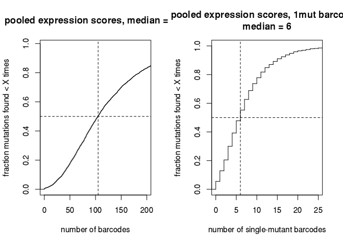<!-- -->

In lib1, we directly measured the effects of 86.12% of mutations *as
sole mutations* on at least one barcode background (a higher percentage
of mutations are sampled more extensively on multiple mutant
backgrounds). In lib2, we directly measured 85.83% of mutations as
singles. Taken together, we directly measured 94.47% of mutations as
singles in at least one of the two libraries, and we directly measured
77.48% of mutations as single mutations in both libraries.

First, let’s look at the correlation between these directly measured
single-mutant effects in the two libraries.

``` r
x <- betas$expr_lib1_direct; y <- betas$expr_lib2_direct; fit <- lm(y~x)
plot(x,y,pch=16,col="#00000067",xlab="lib1 mutational effect from single mut bcs",ylab="lib2 mutational effect from single mut bcs",main=paste("expression, single mut direct measurements\nR-squared:",round(summary(fit)$r.squared,digits=3)))
```

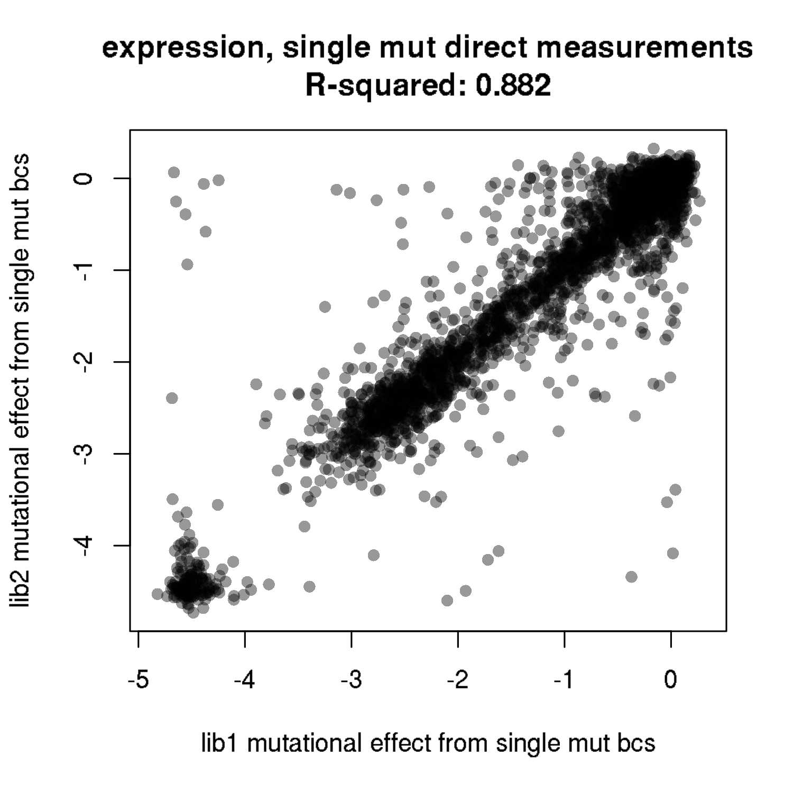
In this case, in contrast to the binding measurements, we do *not* see
better correlation between direct single measurements compared to the
correlation in the model-predicted observed-scale effects. This isn’t
surprising – the expression measurements are conducted without
pre-selecting for properly expressing variants, and we know there are a
small number of barcodes that we ascribe as representing
wildtype/synonymous variants with very low expression (which are
evidently weeded out by the RBD+ pre-sort prior to the binding
measurements). These are presumably plasmids with deleterious mutations
outside of the PacBio sequencing window, or contain some other artifact
– we are able to identify and discard these in the case of wildtype
observations, but for any mutant variant, we cannot distinguish when
this is happening at face value. Therefore, direct single measurements
of expression effects of mutation are likely conflated wiith these types
of additional factors that we cannot identify, whereas the global
epistasis decomposition averages across all backgrounds containing a
mutation, generating improved estimates of mutational effects. We also
believe our binding measurements are inherently higher quality than the
expression measurements for multiple reasons. Taken together, it seems
that for the expression measurements, there may be more justification to
use all model coefficients, instead of the combination of direct and
estimated effects as done with binding.

Next, let’s look at how the global epistasis model coefficients
correlate with these directly measured single-mutant effects. The plots
below show the average directly measured phenotype for single mutant
barcodes in the two libraries (only showing mutations that were sampled
as singles in *both* libraries), versus the average of the beta
coefficients for the mutation from the lib1 and lib2 model fits (once
again, only showing mutations that were determined in *both* libraries).
For the latent scale, we also zoom in the plot view to get better
insight into the relationship between observed and latent effects within
the non-censored window.

``` r
par(mfrow=c(3,2))
#Cauchy, observed
x <- rowMeans(betas_expr_observed_Cauchy[,c("effect_lib1","effect_lib2")]);y <- NULL; for(i in 1:nrow(betas_expr_observed_Cauchy)){y <- c(y, betas[mutation_RBD==betas_expr_observed_Cauchy$mutation[i],mean(c(expr_lib1_direct,expr_lib2_direct))])};fit <- lm(y~x)
plot(x,y,pch=16,col="#00000067",xlab="average lib1&lib2 beta, Cauchy observed",ylab="direct single mut measurement",main=paste("Directly measured vs Cauchy, observed scale.\n expression R-squared:",round(summary(fit)$r.squared,digits=3)))

#Gaussian, observed
x <- rowMeans(betas_expr_observed_Gaussian[,c("effect_lib1","effect_lib2")]);y <- NULL; for(i in 1:nrow(betas_expr_observed_Gaussian)){y <- c(y, betas[mutation_RBD==betas_expr_observed_Gaussian$mutation[i],mean(c(expr_lib1_direct,expr_lib2_direct))])};fit <- lm(y~x)
plot(x,y,pch=16,col="#00000067",xlab="average lib1&lib2 beta",ylab="direct single mut measurement",main=paste("Directly measured vs Gaussian, observed scale.\n expression R-squared:",round(summary(fit)$r.squared,digits=3)))

#Cauchy, latent
x <- rowMeans(betas_expr_latent_Cauchy[,c("effect_lib1","effect_lib2")]);y <- NULL; for(i in 1:nrow(betas_expr_latent_Cauchy)){y <- c(y, betas[mutation_RBD==betas_expr_latent_Cauchy$mutation[i],mean(c(expr_lib1_direct,expr_lib2_direct))])};fit <- lm(y~x)
plot(x,y,pch=16,col="#00000067",xlab="average lib1&lib2 beta, Cauchy latent",ylab="direct single mut measurement",main=paste("Directly measured vs Cauchy, latent scale.\n expression R-squared:",round(summary(fit)$r.squared,digits=3)))

#Gaussian, latent
x <- rowMeans(betas_expr_latent_Gaussian[,c("effect_lib1","effect_lib2")]);y <- NULL; for(i in 1:nrow(betas_expr_latent_Gaussian)){y <- c(y, betas[mutation_RBD==betas_expr_latent_Gaussian$mutation[i],mean(c(expr_lib1_direct,expr_lib2_direct))])};fit <- lm(y~x)
plot(x,y,pch=16,col="#00000067",xlab="average lib1&lib2 beta",ylab="direct single mut measurement",main=paste("Directly measured vs Gaussian, latent scale.\n expression R-squared:",round(summary(fit)$r.squared,digits=3)))

#Cauchy, latent, zoomed in
x <- rowMeans(betas_expr_latent_Cauchy[,c("effect_lib1","effect_lib2")]);y <- NULL; for(i in 1:nrow(betas_expr_latent_Cauchy)){y <- c(y, betas[mutation_RBD==betas_expr_latent_Cauchy$mutation[i],mean(c(expr_lib1_direct,expr_lib2_direct))])};fit <- lm(y~x)
plot(x,y,pch=16,col="#00000067",xlim=c(-1,0.5),ylim=c(-4,1),xlab="average lib1&lib2 beta, Cauchy latent",ylab="direct single mut measurement",main=paste("Directly measured vs Cauchy, zoom latent scale.\n expression R-squared:",round(summary(fit)$r.squared,digits=3)))

#Gaussian, latent, zommed in
x <- rowMeans(betas_expr_latent_Gaussian[,c("effect_lib1","effect_lib2")]);y <- NULL; for(i in 1:nrow(betas_expr_latent_Gaussian)){y <- c(y, betas[mutation_RBD==betas_expr_latent_Gaussian$mutation[i],mean(c(expr_lib1_direct,expr_lib2_direct))])};fit <- lm(y~x)
plot(x,y,pch=16,col="#00000067",xlim=c(-1,0.5),ylim=c(-4,1),xlab="average lib1&lib2 beta",ylab="direct single mut measurement",main=paste("Directly measured vs Gaussian, zoom latent scale.\n expression R-squared:",round(summary(fit)$r.squared,digits=3)))
```

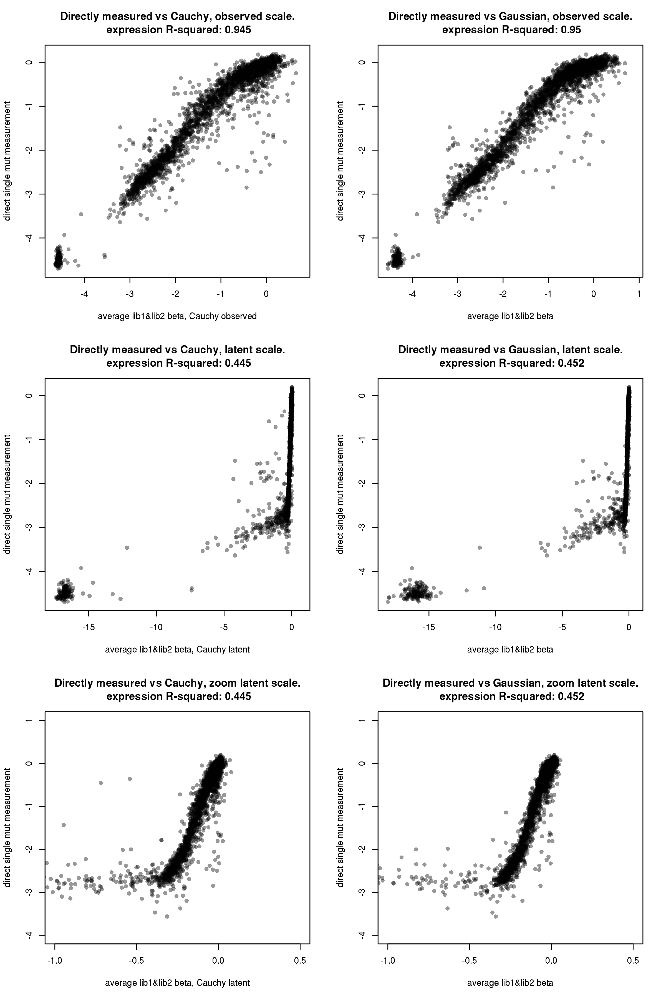

Taken together, the observed-scale global epistasis coefficients appear
to deviate from directly sampled measurements, such that the
observed-scale predictions generate more positive expression effects
than are actually observed in the direct sampling. This could point to
an incorrect/incomplete global nonlinearity correction? I think the
errant negative points could also be contributing (that is, mutations
which the model predicts should have \~neutral effects, but
experimentally were determined to have large deleteirous effects on
expression – we filtered out wildtype/synonymous barcodes of this type,
but we do not have a basis on which to filter out mutant variants since
we can not identify these at face value). It does appear that perhaps
the Cauchy likelihood model is more tolerant of these outliers (it seems
to have more points in this lower-right quadrant, and mathematically, it
should be more tolerant of this type of outlier behavior because of it’s
fatter tails). The Cauchy likelihood does have marginally smaller
R-squared than Gaussian likelihood (perhaps because it *is* more
tolerant of these outliers), but it appears to exhibit less of this
“bending” in the curve versus directly sampled singles, which is
behavior that seems preferred, so we will go ahead with the
Cauchy-likelihood observed-scale measurements as our expression effects
of mutations – and because these correlate better between replicates
than do the directly sampled single-mutant barcodes, in contrast to the
binding phenotypes, we will use *all* coefficients, not a mix of direct
and modeled effects.

``` r
betas[,expr_lib1_coef := betas_expr_observed_Cauchy[betas_expr_observed_Cauchy$mutation==mutation_RBD,"effect_lib1"],by=mutation_RBD]
betas[,expr_lib2_coef := betas_expr_observed_Cauchy[betas_expr_observed_Cauchy$mutation==mutation_RBD,"effect_lib2"],by=mutation_RBD]

betas[,expr_lib1 := expr_lib1_coef]
betas[,expr_lib2 := expr_lib2_coef]

betas[,expr_avg := mean(c(expr_lib1,expr_lib2),na.rm=T),by=mutation]
```

Last, save our estimated single-mutant effects as a csv file. We output
the estimated effects on binding and expression in each library and the
average of the libraries.

``` r
betas %>%
  mutate_if(is.numeric, round, digits=2) %>%
  dplyr::select(site_RBD, site_SARS2, wildtype, mutant, mutation, mutation_RBD,
                bind_lib1, bind_lib2, bind_avg, expr_lib1, expr_lib2, expr_avg) %>%
  write.csv(file=config$single_mut_effects_file, row.names=F)
```

## Output summary of homolog phenotypes

Let’s summarize the binding and expression phenotypes of the homologous
RBD sequences that were spiked into our libraries. We compute the
average and standard error of binding and expression phenotypes relative
to WT SARS-CoV-2 separately in each library, and then calculate the
average binding and expression from the two library measurements. For
binding, our average is the mean
delta-log<sub>10</sub>(*K*<sub>A,app</sub>) relative to SARS-CoV-2
wildtype. For expression, our average is the *median*
delta-mean-fluorescence relative to SARS-CoV-2 wildtype. Because some
homologs have a tail of lowly expressing barcodes (which are presumably
selected out in the RBD+ sort prior to the binding measureements), we
use the median as our average because it is more robust to outliers. The
standard error of a median is higher than the standard error of the mean
by a factor of 1.2533 if the measurement is normally distributed (which
we are only moderately in violation of for some homologs), so we
multiply our per-library standard errors by this factor.

``` r
bc_homologs_bind <- data.table(read.csv(file=config$Titeseq_Kds_homologs_file))

bc_homologs_bind[target=="SARS-CoV",target:="SARS-CoV-1"]

bc_homologs_expr <- data.table(read.csv(file=config$expression_sortseq_homologs_file))

bc_homologs_expr[target=="SARS-CoV",target:="SARS-CoV-1"]

homologs <- data.frame(homolog=factor(c("SARS-CoV-2","GD-Pangolin","RaTG13","SARS-CoV-1","WIV16","LYRa11","ZC45","ZXC21","HKU3-1","Rf1","Rp3","BM48-31"),
                                      levels=c("SARS-CoV-2","GD-Pangolin","RaTG13","SARS-CoV-1","WIV16","LYRa11","ZC45","ZXC21","HKU3-1","Rf1","Rp3","BM48-31")),
                       clade=c("SARS-CoV-2","SARS-CoV-2","SARS-CoV-2","Clade 1","Clade 1","Clade 1","Clade 2", "Clade 2","Clade 2","Clade 2","Clade 2","Clade 3"))

for(i in 1:nrow(homologs)){
  bind_lib1 <- bc_homologs_bind[library=="lib1" & target==as.character(homologs$homolog[i]),delta_log10Ka]
  homologs$bind_lib1[i] <- mean(bind_lib1,na.rm=T)
  homologs$bind_lib1_SE[i] <- sd(bind_lib1,na.rm=T)/sqrt(sum(!is.na(bind_lib1)))
  bind_lib2 <- bc_homologs_bind[library=="lib2" & target==as.character(homologs$homolog[i]),delta_log10Ka]
  homologs$bind_lib2[i] <- mean(bind_lib2,na.rm=T)
  homologs$bind_lib2_SE[i] <- sd(bind_lib2,na.rm=T)/sqrt(sum(!is.na(bind_lib2)))
  homologs$bind_avg[i] <- mean(c(homologs$bind_lib1[i], homologs$bind_lib2[i]))
  expr_lib1 <- bc_homologs_expr[library=="lib1" & target==as.character(homologs$homolog[i]),delta_ML_meanF]
  homologs$expr_lib1[i] <- median(expr_lib1,na.rm=T)
  homologs$expr_lib1_SE[i] <- 1.2533*sd(expr_lib1,na.rm=T)/sqrt(sum(!is.na(expr_lib1))) #assumes normal distribution which is not quite correct, so revisit this if using SE for any hard-core statistics
  expr_lib2 <- bc_homologs_expr[library=="lib2" & target==as.character(homologs$homolog[i]),delta_ML_meanF]
  homologs$expr_lib2[i] <- median(expr_lib2,na.rm=T)
  homologs$expr_lib2_SE[i] <- 1.2533*sd(expr_lib2,na.rm=T)/sqrt(sum(!is.na(expr_lib2)))
  homologs$expr_avg[i] <- mean(c(homologs$expr_lib1[i], homologs$expr_lib2[i]))
}
```

Next, we plot the correlation in homolog phenotypes between the two
replicates. (We should add error bars reflecting 95% CI when get a
chance.) We can see that the binding phenotypes, which span the spectrum
from slightly higher affinity than SARS-CoV-2, to complete loss of
binding, correlate extremely well. The expression phenotypes correlate
quite well, though not as perfectly – this is expected, because the
expression scores are a noisier phenotype, and also these homologs
sample a very narrow near-neutral range, which is inherently more
difficult to get perfect correlation between replicates than if some
RBDs were completely non-expressing.

``` r
par(mfrow=c(1,2))
x <- homologs$bind_lib1; y <- homologs$bind_lib2; fit <- lm(y~x)
plot(x,y,pch=19,xlab="delta_log10Ka, lib1",ylab="delta_log10Ka, lib2",main=paste("homolog binding, R-squared:",round(summary(fit)$r.squared,digits=4)))

x <- homologs$expr_lib1; y <- homologs$expr_lib2; fit <- lm(y~x)
plot(x,y,pch=19,xlab="delta_ML_meanF, lib1",ylab="delta_ML_meanF, lib2",main=paste("homolog expression, R-squared:",round(summary(fit)$r.squared,digits=3)))
```

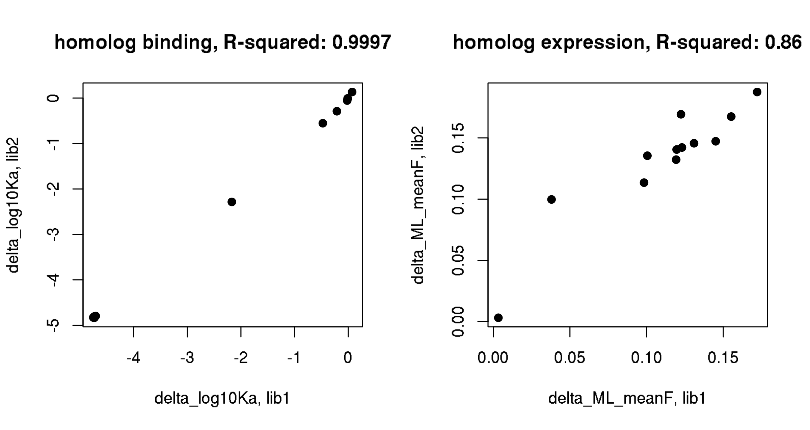

Output the summarized homolog phenotype scores into a table for
downstream analysis and sharing.

``` r
homologs %>%
  mutate_if(is.numeric, round, digits=4) %>%
  write.csv(file=config$homolog_effects_file, row.names=F)
```

## Validation of bulk phenotypes with isogenic experiments

We have conducted two series of isogenic titration assays which can
validate our bulk phenotypes for binding and expression effects. The
first panel of genotypes that we validated in isogenic yeast display
assays are a subset of the homologs panel. The second is a series of
single mutants to SARS-CoV-2. We fit titration curves to these isogenic
experiments, and here we correlate these isogenic binding and expression
phenotypes with those determined in the DMS assays.

First, homolog panel:

Second, single mutants of SARS-CoV-2:

## Relationship between expression and binding fits at a per-barcode level

In theory, titration assays should normalize out expression effects of
mutations, and therefore be less susceptiible to expression-induced
artifacts in binding scores than traditional single-concentration yeast
diisplay assays. We will dig into this a bit more in the
`structure_function.Rmd` notebook for our single-mutant effect
parameters, but the general premise is that in single-concentration
yeast display assays, simple enhancement of surface expression leads to
higher ligand labeling, even if the underlying *K*<sub>D</sub> is
unchanged in the mutant variant. This leads to *uninteresting* simple
correlation between expression and binding in DMS type data. In
contrast, our binding phenotype is determined from a self-contained
titration series for each barcode, the response plateau and baseline of
which can vary as fit parameters. This assay should therefore be less
susceptible to expression artifacts, because global expression changes
can be accounted for with variation in the response parameter –
therefore, any remaining correlation between expression and binding
should be due to actual biological correlation (i.e. mutations that
destabilize the protein will also intrinsically decrease the
thermodynamic affinity). One premise of this argument is that the
response parameter of the titration curve fits correlates with
expression effects.

Below, we generate plots for all barcodes showing the relationship
between the barcode’s response fit value and the expression phenotype
for that barcode.

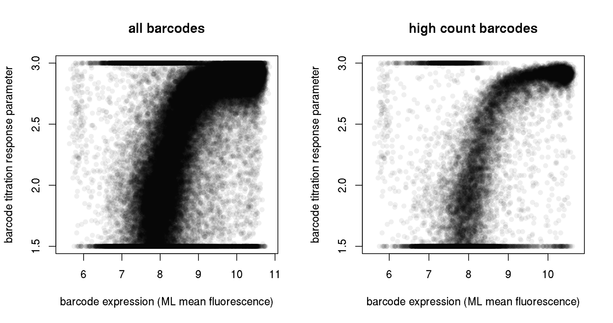
