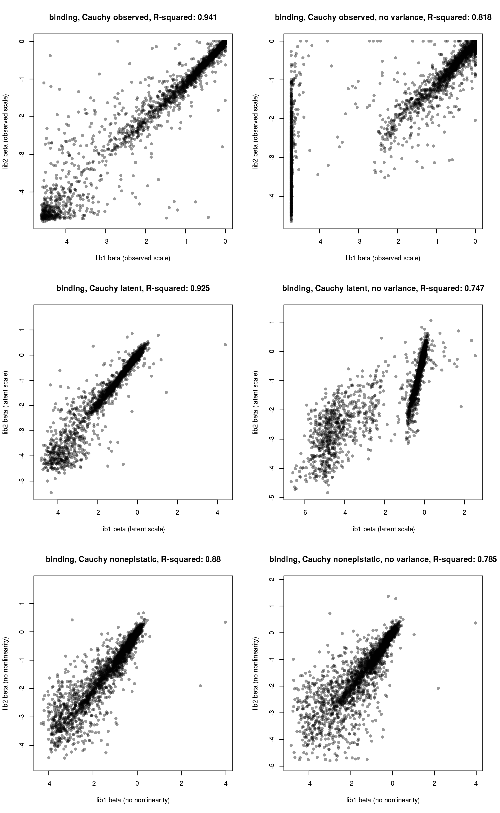
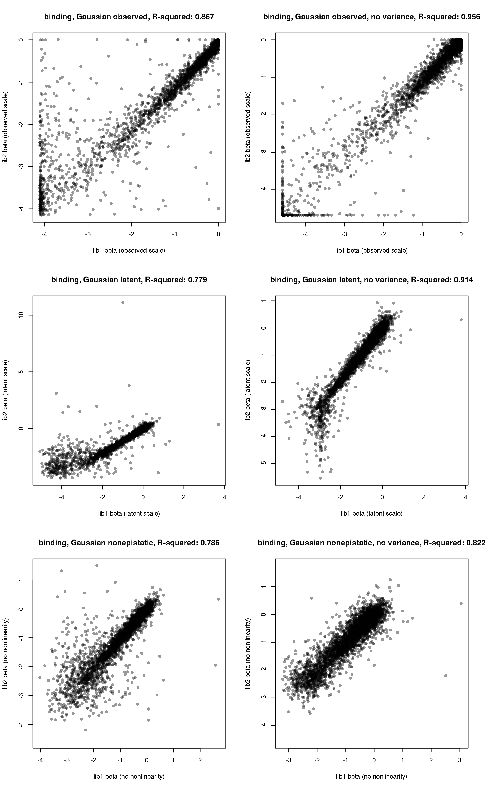
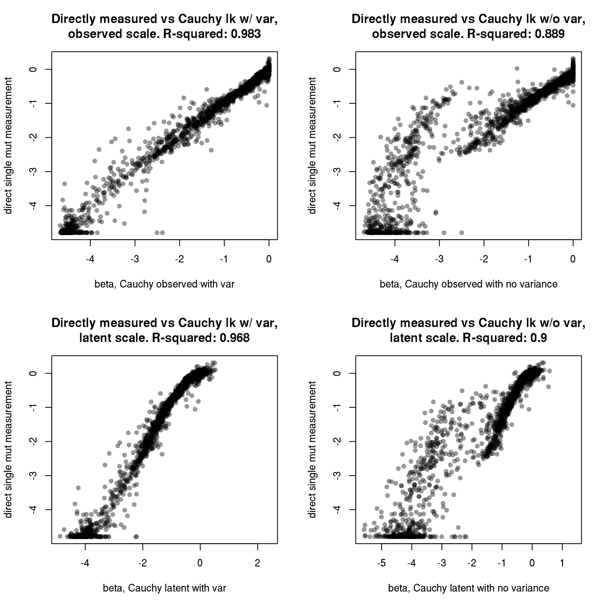
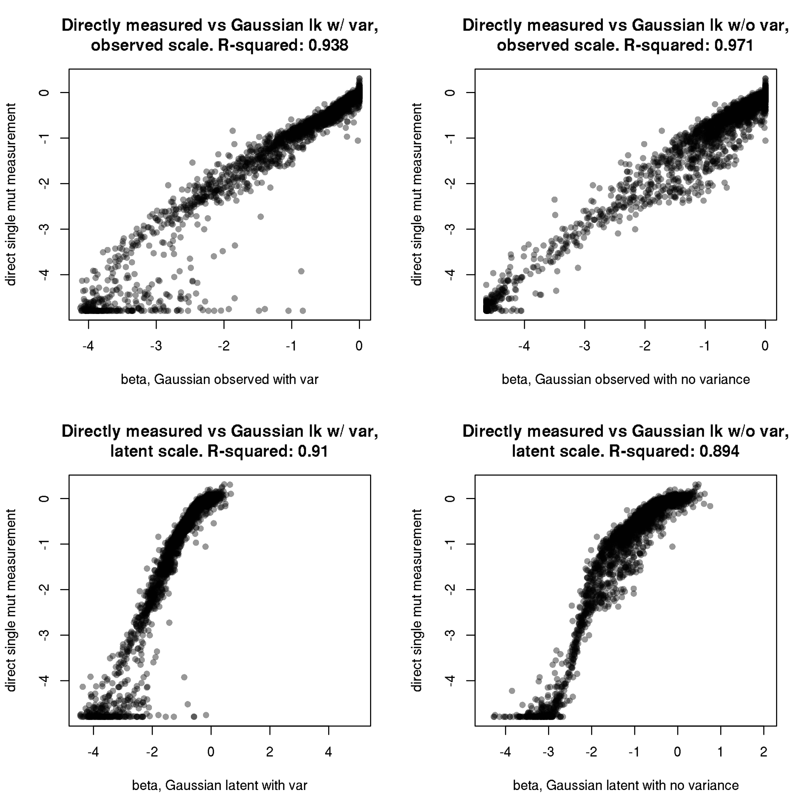
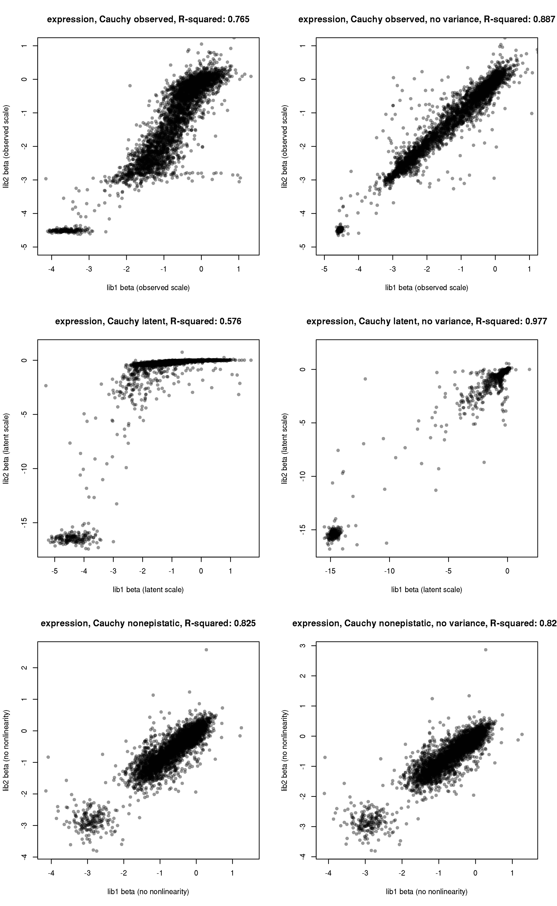
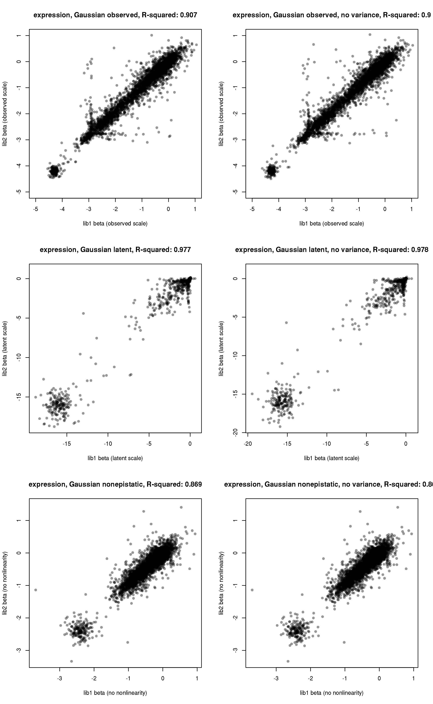
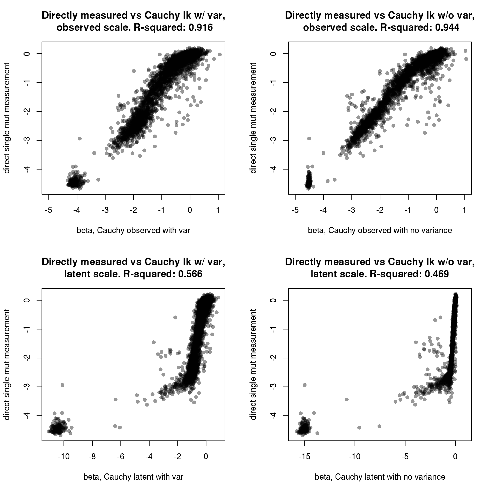
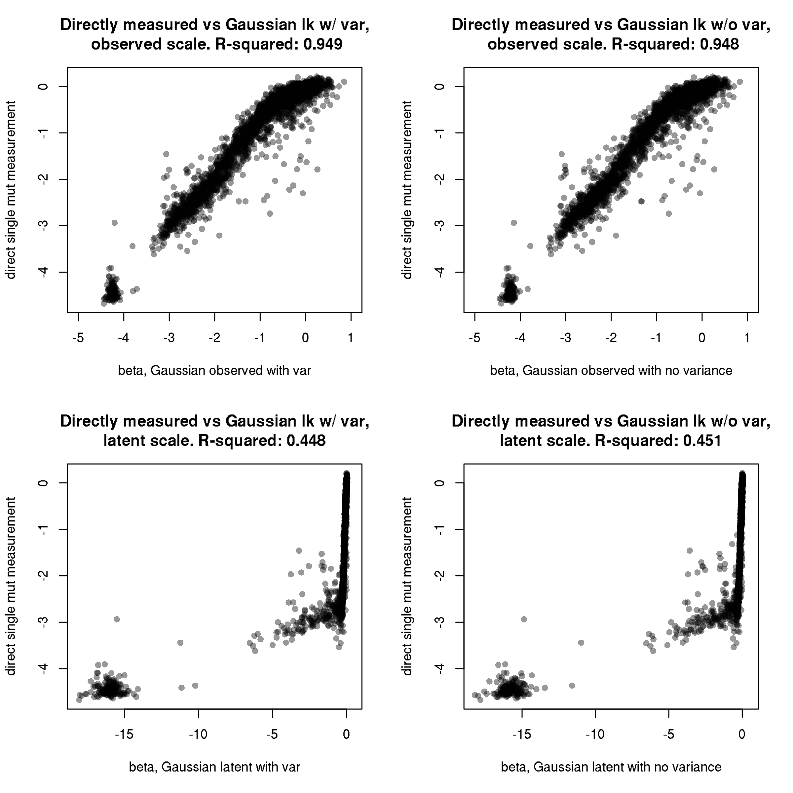

Derive final single mutation functional scores from global epistasis
fits
================
Tyler Starr
5/5/2020

This notebook reads in the coefficients from the global epistasis fits
for binding and expression. It assesses correlations between replicates
and (decides on which models to use moving forward, and consolidates the
final single mutant functional scores. Finally, it generates some basic
summary figures, including distributions of mutational effects and
summaries of the phenotypes of the sarbecovirus homolog RBDs, and
validates these measurements with comparisons to isogenic and literature
reported functional measurements.) (parenthesized stuff to come)

``` r
require("knitr")
knitr::opts_chunk$set(echo = T)
knitr::opts_chunk$set(dev.args = list(png = list(type = "cairo")))

#list of packages to install/load
packages = c("yaml","data.table","tidyverse")
#install any packages not already installed
installed_packages <- packages %in% rownames(installed.packages())
if(any(installed_packages == F)){
  install.packages(packages[!installed_packages])
}
#load packages
invisible(lapply(packages, library, character.only=T))

#read in config file
config <- read_yaml("config.yaml")

#read in file giving concordance between RBD numbering and SARS-CoV-2 Spike numbering
RBD_sites <- read.csv(file="data/RBD_sites.csv",stringsAsFactors=F)

#make output directory
if(!file.exists(config$single_mut_effects_dir)){
 dir.create(file.path(config$single_mut_effects_dir))
}
```

Session info for reproducing environment:

``` r
sessionInfo()
```

    ## R version 3.6.1 (2019-07-05)
    ## Platform: x86_64-pc-linux-gnu (64-bit)
    ## Running under: Ubuntu 14.04.6 LTS
    ## 
    ## Matrix products: default
    ## BLAS/LAPACK: /app/easybuild/software/OpenBLAS/0.2.18-GCC-5.4.0-2.26-LAPACK-3.6.1/lib/libopenblas_prescottp-r0.2.18.so
    ## 
    ## locale:
    ##  [1] LC_CTYPE=en_US.UTF-8       LC_NUMERIC=C              
    ##  [3] LC_TIME=en_US.UTF-8        LC_COLLATE=en_US.UTF-8    
    ##  [5] LC_MONETARY=en_US.UTF-8    LC_MESSAGES=en_US.UTF-8   
    ##  [7] LC_PAPER=en_US.UTF-8       LC_NAME=C                 
    ##  [9] LC_ADDRESS=C               LC_TELEPHONE=C            
    ## [11] LC_MEASUREMENT=en_US.UTF-8 LC_IDENTIFICATION=C       
    ## 
    ## attached base packages:
    ## [1] stats     graphics  grDevices utils     datasets  methods   base     
    ## 
    ## other attached packages:
    ##  [1] forcats_0.4.0     stringr_1.4.0     dplyr_0.8.3      
    ##  [4] purrr_0.3.2       readr_1.3.1       tidyr_0.8.3      
    ##  [7] tibble_2.1.3      ggplot2_3.2.0     tidyverse_1.2.1  
    ## [10] data.table_1.12.2 yaml_2.2.0        knitr_1.23       
    ## 
    ## loaded via a namespace (and not attached):
    ##  [1] Rcpp_1.0.1       cellranger_1.1.0 pillar_1.4.2     compiler_3.6.1  
    ##  [5] tools_3.6.1      digest_0.6.20    lubridate_1.7.4  jsonlite_1.6    
    ##  [9] evaluate_0.14    nlme_3.1-140     gtable_0.3.0     lattice_0.20-38 
    ## [13] pkgconfig_2.0.2  rlang_0.4.0      cli_1.1.0        rstudioapi_0.10 
    ## [17] haven_2.1.1      xfun_0.7         withr_2.1.2      xml2_1.2.0      
    ## [21] httr_1.4.0       hms_0.4.2        generics_0.0.2   grid_3.6.1      
    ## [25] tidyselect_0.2.5 glue_1.3.1       R6_2.4.0         readxl_1.3.1    
    ## [29] rmarkdown_1.13   modelr_0.1.4     magrittr_1.5     backports_1.1.4 
    ## [33] scales_1.0.0     htmltools_0.3.6  rvest_0.3.4      assertthat_0.2.1
    ## [37] colorspace_1.4-1 stringi_1.4.3    lazyeval_0.2.2   munsell_0.5.0   
    ## [41] broom_0.5.2      crayon_1.3.4

## Setup

Read in tables of per-barcode measured and predicted phenotypes. With
these, we can reproduce the plots from the global epistasis notebooks.

``` r
bc_bind <- data.table(read.csv(file=config$global_epistasis_binding_file,stringsAsFactors = F))
bc_expr <- data.table(read.csv(file=config$global_epistasis_expr_file,stringsAsFactors = F))

#can reproduce figures from global epistasis notebooks, e.g.:
plot(bc_bind[library=="lib1",latent_phenotype_Cauchy_1],bc_bind[library=="lib1",log10Ka],pch=16,col="#00000005",xlab="global epistasis latent phenotype",ylab="Tite-seq log10(Ka)")
points(bc_bind[library=="lib1",latent_phenotype_Cauchy_1][order(bc_bind[library=="lib1",latent_phenotype_Cauchy_1])],bc_bind[library=="lib1",predicted_phenotype_Cauchy_1][order(bc_bind[library=="lib1",latent_phenotype_Cauchy_1])],type="l",col="red",lwd=3)
```


\#\# Assessing global epistasis models for binding data

Next, read in coefficients from each binding global episitasis model
fit, and look at the correlation between model coefficients.

First, let’s look at the correlation between the Cauchy likelihood
models, on the “observed” and “latent” scales, and then with no global
epistasis correction. We’ll look both with and without including the
estimates of variance in the likelihood calculations.

``` r
par(mfrow=c(3,2))
#observed "log10Ka" scale
betas_bind_observed_Cauchy <- merge(read.csv('results/global_epistasis_binding/Cauchy-predicted-effects_binding_1.csv',stringsAsFactors=F),
                                    read.csv('results/global_epistasis_binding/Cauchy-predicted-effects_binding_2.csv',stringsAsFactors=F),
                                    by=c("site","mutation","wildtype","mutant"),all=T,sort=T,suffixes=c("_lib1","_lib2"));

x <- betas_bind_observed_Cauchy$effect_lib1; y <- betas_bind_observed_Cauchy$effect_lib2; fit <- lm(y~x)
plot(x,y,pch=16,col="#00000067",xlab="lib1 beta (observed scale)",ylab="lib2 beta (observed scale)",main=paste("binding, Cauchy observed, R-squared:",round(summary(fit)$r.squared,digits=3)))

betas_bind_observed_Cauchy_novar <- merge(read.csv('results/global_epistasis_binding/Cauchy-predicted-effects_binding_1_novar.csv',stringsAsFactors=F),
                                          read.csv('results/global_epistasis_binding/Cauchy-predicted-effects_binding_2_novar.csv',stringsAsFactors=F),
                                          by=c("site","mutation","wildtype","mutant"),all=T,sort=T,suffixes=c("_lib1","_lib2"));

x <- betas_bind_observed_Cauchy_novar$effect_lib1; y <- betas_bind_observed_Cauchy_novar$effect_lib2; fit <- lm(y~x)
plot(x,y,pch=16,col="#00000067",xlab="lib1 beta (observed scale)",ylab="lib2 beta (observed scale)",main=paste("binding, Cauchy observed, no variance, R-squared:",round(summary(fit)$r.squared,digits=3)))

#underlying latent scale
betas_bind_latent_Cauchy <- merge(read.csv('results/global_epistasis_binding/Cauchy-latent-effects_binding_1.csv',stringsAsFactors=F),
                                  read.csv('results/global_epistasis_binding/Cauchy-latent-effects_binding_2.csv',stringsAsFactors=F),
                                  by=c("site","mutation","wildtype","mutant"),all=T,sort=T,suffixes=c("_lib1","_lib2"));

x <- betas_bind_latent_Cauchy$effect_lib1; y <- betas_bind_latent_Cauchy$effect_lib2; fit <- lm(y~x)
plot(x,y,pch=16,col="#00000067",xlab="lib1 beta (latent scale)",ylab="lib2 beta (latent scale)",main=paste("binding, Cauchy latent, R-squared:",round(summary(fit)$r.squared,digits=3)))

betas_bind_latent_Cauchy_novar <- merge(read.csv('results/global_epistasis_binding/Cauchy-latent-effects_binding_1_novar.csv',stringsAsFactors=F),
                                        read.csv('results/global_epistasis_binding/Cauchy-latent-effects_binding_2_novar.csv',stringsAsFactors=F),
                                        by=c("site","mutation","wildtype","mutant"),all=T,sort=T,suffixes=c("_lib1","_lib2"));

x <- betas_bind_latent_Cauchy_novar$effect_lib1; y <- betas_bind_latent_Cauchy_novar$effect_lib2; fit <- lm(y~x)
plot(x,y,pch=16,col="#00000067",xlab="lib1 beta (latent scale)",ylab="lib2 beta (latent scale)",main=paste("binding, Cauchy latent, no variance, R-squared:",round(summary(fit)$r.squared,digits=3)))

#no nonlinear transform
betas_bind_nonepistatic_Cauchy <- merge(read.csv('results/global_epistasis_binding/nonepistatic-Cauchy-predicted-effects_binding_1.csv',stringsAsFactors=F),
                                        read.csv('results/global_epistasis_binding/nonepistatic-Cauchy-predicted-effects_binding_2.csv',stringsAsFactors=F),
                                        by=c("site","mutation","wildtype","mutant"),all=T,sort=T,suffixes=c("_lib1","_lib2"));

x <- betas_bind_nonepistatic_Cauchy$effect_lib1; y <- betas_bind_nonepistatic_Cauchy$effect_lib2; fit <- lm(y~x)
plot(x,y,pch=16,col="#00000067",xlab="lib1 beta (no nonlinearity)",ylab="lib2 beta (no nonlinearity)",main=paste("binding, Cauchy nonepistatic, R-squared:",round(summary(fit)$r.squared,digits=3)))

betas_bind_nonepistatic_Cauchy_novar <- merge(read.csv('results/global_epistasis_binding/nonepistatic-Cauchy-predicted-effects_binding_1_novar.csv',stringsAsFactors=F),
                                              read.csv('results/global_epistasis_binding/nonepistatic-Cauchy-predicted-effects_binding_2_novar.csv',stringsAsFactors=F),
                                              by=c("site","mutation","wildtype","mutant"),all=T,sort=T,suffixes=c("_lib1","_lib2"));

x <- betas_bind_nonepistatic_Cauchy_novar$effect_lib1; y <- betas_bind_nonepistatic_Cauchy_novar$effect_lib2; fit <- lm(y~x)
plot(x,y,pch=16,col="#00000067",xlab="lib1 beta (no nonlinearity)",ylab="lib2 beta (no nonlinearity)",main=paste("binding, Cauchy nonepistatic, no variance, R-squared:",round(summary(fit)$r.squared,digits=3)))
```


We can see, reassuringly, that our single mutation effect estimates are
better when we incorporate the nonlinearity – this shows that the global
epistasis transform improves this single mutation deconvolution from the
multi-mutants in the library. Furthermore, we can see that, at least for
the Cauchy likelihood, keeping things at least somewhat constrained on
the likelihood calculation with variance estimates is important to keep
things from going off the rails\!

One interesting observation is that, in the latent space (which at least
from my Ab work, I suspected was also picking up on the *stability*
effects of mutations), there do seem to be a substantial number of
mutations with positive values – but when transformed to the observed
log10Ka scale, these are squashed to zero. This is something we’ll need
to look into further. (Direct measurements from single mutant barcodes
should help here\!)

Next, let’s repeat these figures for the binding models fit under a
Gaussian likelihood model.

``` r
par(mfrow=c(3,2))
#observed "log10Ka" scale
betas_bind_observed_Gaussian <- merge(read.csv('results/global_epistasis_binding/Gaussian-predicted-effects_binding_1.csv',stringsAsFactors=F),
                                    read.csv('results/global_epistasis_binding/Gaussian-predicted-effects_binding_2.csv',stringsAsFactors=F),
                                    by=c("site","mutation","wildtype","mutant"),all=T,sort=T,suffixes=c("_lib1","_lib2"));

x <- betas_bind_observed_Gaussian$effect_lib1; y <- betas_bind_observed_Gaussian$effect_lib2; fit <- lm(y~x)
plot(x,y,pch=16,col="#00000067",xlab="lib1 beta (observed scale)",ylab="lib2 beta (observed scale)",main=paste("binding, Gaussian observed, R-squared:",round(summary(fit)$r.squared,digits=3)))

betas_bind_observed_Gaussian_novar <- merge(read.csv('results/global_epistasis_binding/Gaussian-predicted-effects_binding_1_novar.csv',stringsAsFactors=F),
                                          read.csv('results/global_epistasis_binding/Gaussian-predicted-effects_binding_2_novar.csv',stringsAsFactors=F),
                                          by=c("site","mutation","wildtype","mutant"),all=T,sort=T,suffixes=c("_lib1","_lib2"));

x <- betas_bind_observed_Gaussian_novar$effect_lib1; y <- betas_bind_observed_Gaussian_novar$effect_lib2; fit <- lm(y~x)
plot(x,y,pch=16,col="#00000067",xlab="lib1 beta (observed scale)",ylab="lib2 beta (observed scale)",main=paste("binding, Gaussian observed, no variance, R-squared:",round(summary(fit)$r.squared,digits=3)))

#underlying latent scale
betas_bind_latent_Gaussian <- merge(read.csv('results/global_epistasis_binding/Gaussian-latent-effects_binding_1.csv',stringsAsFactors=F),
                                  read.csv('results/global_epistasis_binding/Gaussian-latent-effects_binding_2.csv',stringsAsFactors=F),
                                  by=c("site","mutation","wildtype","mutant"),all=T,sort=T,suffixes=c("_lib1","_lib2"));

x <- betas_bind_latent_Gaussian$effect_lib1; y <- betas_bind_latent_Gaussian$effect_lib2; fit <- lm(y~x)
plot(x,y,pch=16,col="#00000067",xlab="lib1 beta (latent scale)",ylab="lib2 beta (latent scale)",main=paste("binding, Gaussian latent, R-squared:",round(summary(fit)$r.squared,digits=3)))

betas_bind_latent_Gaussian_novar <- merge(read.csv('results/global_epistasis_binding/Gaussian-latent-effects_binding_1_novar.csv',stringsAsFactors=F),
                                        read.csv('results/global_epistasis_binding/Gaussian-latent-effects_binding_2_novar.csv',stringsAsFactors=F),
                                        by=c("site","mutation","wildtype","mutant"),all=T,sort=T,suffixes=c("_lib1","_lib2"));

x <- betas_bind_latent_Gaussian_novar$effect_lib1; y <- betas_bind_latent_Gaussian_novar$effect_lib2; fit <- lm(y~x)
plot(x,y,pch=16,col="#00000067",xlab="lib1 beta (latent scale)",ylab="lib2 beta (latent scale)",main=paste("binding, Gaussian latent, no variance, R-squared:",round(summary(fit)$r.squared,digits=3)))

#no nonlinear transform
betas_bind_nonepistatic_Gaussian <- merge(read.csv('results/global_epistasis_binding/nonepistatic-Gaussian-predicted-effects_binding_1.csv',stringsAsFactors=F),
                                        read.csv('results/global_epistasis_binding/nonepistatic-Gaussian-predicted-effects_binding_2.csv',stringsAsFactors=F),
                                        by=c("site","mutation","wildtype","mutant"),all=T,sort=T,suffixes=c("_lib1","_lib2"));

x <- betas_bind_nonepistatic_Gaussian$effect_lib1; y <- betas_bind_nonepistatic_Gaussian$effect_lib2; fit <- lm(y~x)
plot(x,y,pch=16,col="#00000067",xlab="lib1 beta (no nonlinearity)",ylab="lib2 beta (no nonlinearity)",main=paste("binding, Gaussian nonepistatic, R-squared:",round(summary(fit)$r.squared,digits=3)))

betas_bind_nonepistatic_Gaussian_novar <- merge(read.csv('results/global_epistasis_binding/nonepistatic-Gaussian-predicted-effects_binding_1_novar.csv',stringsAsFactors=F),
                                              read.csv('results/global_epistasis_binding/nonepistatic-Gaussian-predicted-effects_binding_2_novar.csv',stringsAsFactors=F),
                                              by=c("site","mutation","wildtype","mutant"),all=T,sort=T,suffixes=c("_lib1","_lib2"));

x <- betas_bind_nonepistatic_Gaussian_novar$effect_lib1; y <- betas_bind_nonepistatic_Gaussian_novar$effect_lib2; fit <- lm(y~x)
plot(x,y,pch=16,col="#00000067",xlab="lib1 beta (no nonlinearity)",ylab="lib2 beta (no nonlinearity)",main=paste("binding, Gaussian nonepistatic, no variance, R-squared:",round(summary(fit)$r.squared,digits=3)))
```


In contrast to the Cauchy likelihood models, with the Gaussian
likelihood models, parameters are estimated more consistently when the
estimated variances are *not* included in the likelihood model. Perhpas
the Cauchy likelihood “needs” some bounds of variance, because its fat
tails otherwise allow it to place observations all over the place –
whereas a Gaussian curve has smaller tails.

It is not immediately obvious to me yet whether to prefer the
Cauchy/variance model compared to the Gaussian/no variance model… The
Gaussian model has slightly higher R<sup>2</sup>, which it looks like
stems from overall higher variation from the 1:1 line, but less points
with extreme variance from the line than is seen in the Cauchy model,
where many points are very tight to the 1:1, but a higher proportion of
points fall far from the line. The Gaussian model may also have more
points at the boundary condition (-4, -4), which could drive the higher
correlation.

We once again see a preponderance of single mutations with positive
effects on the latent scale that are squashed to zero on the observed
log10Ka scale. Let’s look at what positions these are – if they are
largely buried positions away from the interface, I would understand
these to be stabilizing mutations that can compensate for the
deleterious effect on binding of other secondary destabilizing
mutations. If many are contact positions, then I would be suspicious
that the global epistasis model is missing possible affinity-enhancing
mutations with its squashing to maximum values of 0 with the nonlinear
fit.

``` r
for(i in 1:nrow(betas_bind_latent_Gaussian_novar)){
  betas_bind_latent_Gaussian_novar$site_S[i] <- RBD_sites[RBD_sites$site_RBD==betas_bind_latent_Gaussian_novar$site[i],"site_SARS2"]
}
betas_bind_latent_Gaussian_novar[betas_bind_latent_Gaussian_novar$effect_lib1>0.25 & betas_bind_latent_Gaussian_novar$effect_lib2>0.25,c("mutation","site_S")]
```

    ##      mutation site_S
    ## 353      A18P    348
    ## 469      N24K    354
    ## 545      I28F    358
    ## 645      A33F    363
    ## 660      A33Y    363
    ## 690      Y35L    365
    ## 699      Y35W    365
    ## 725      V37F    367
    ## 1043     S53D    383
    ## 2182    N110H    440
    ## 2424    L122K    452
    ## 2429    L122Q    452
    ## 2430    L122R    452
    ## 2440    Y123F    453
    ## 2584    N130K    460
    ## 2927    S147N    477
    ## 3044    V153K    483
    ## 3253    Q163V    493
    ## 3342    Q168H    498
    ## 3355    Q168Y    498
    ## 3400    N171F    501
    ## 3406    N171M    501
    ## 3413    N171V    501
    ## 3415    N171Y    501
    ## 3752    L188T    518
    ## 3837    T193D    523
    ## 3911    P197I    527
    ## 3913    P197L    527
    ## 3914    P197M    527
    ## 3922    P197W    527
    ## 3923    P197Y    527
    ## 3962    K199W    529

``` r
unique(betas_bind_latent_Gaussian_novar[betas_bind_latent_Gaussian_novar$effect_lib1>0.25 & betas_bind_latent_Gaussian_novar$effect_lib2>0.25,"site_S"])
```

    ##  [1] 348 354 358 363 365 367 383 440 452 453 460 477 483 493 498 501 518
    ## [18] 523 527 529

These positions are visualized on the ACE2-bound RBD structure
[here](https://dms-view.github.io/?pdb-url=https%3A%2F%2Fraw.githubusercontent.com%2Fdms-view%2FSARS-CoV-2%2Fmaster%2Fdata%2FSpike%2FBloomLab2020%2F6m0j.pdb&markdown-url=https%3A%2F%2Fraw.githubusercontent.com%2Fdms-view%2FSARS-CoV-2%2Fmaster%2Fdata%2FSpike%2FBloomLab2020%2FBloomLab_rbd.md&data-url=https%3A%2F%2Fraw.githubusercontent.com%2Fdms-view%2FSARS-CoV-2%2Fmaster%2Fdata%2FSpike%2FBloomLab2020%2Fresults%2FBloomLab2020_rbd.csv&condition=natural+frequencies&site_metric=site_entropy&mutation_metric=mut_frequency&selected_sites=348%2C354%2C358%2C363%2C365%2C367%2C383%2C440%2C452%2C453%2C460%2C477%2C483%2C493%2C498%2C501%2C518%2C523%2C527%2C529).
Some of these mutations are distal to the ACE2 contact site and are more
likely stability-mediated effects, *but many are key contact positions*
and I would strongly suspect may represent affinity-enhancing mutations.
Therefore, in contrast to the intution I had with my Ab data (where
there was more nonlinearity in the dynamic range of the affinity
readout, perhaps because of more pervasive folding/affinity-related
effects?), in this case, it might be the latent-scale effects that
represent our key measurements? We’ll come back to this below.

Let’s compare these coefficients from the global epistasis models to
binding phenotypes inferred directly in the Tite-seq assay from barcodes
bearing only single mutations. First, let’s look at what fraction of
mutations were sampled as sole mutations on at least one barcode
background in each library. (This differs from what’s reported in the
`build_variants.ipynb`, as we are now quantifying coverage among
barcodes *for which we determined a QC-filtered phenotype*.)

``` r
betas <- data.table(betas_bind_latent_Gaussian_novar[,c("site","site_S","mutation","wildtype","mutant")])

bc_bind[,aa_subs_list := list(strsplit(aa_substitutions,split=" ")),by=.(library,barcode)]

# #gives total number of barcodes with a determined binding phenotype in each library on which a genotype was sampled
# betas[,n_bc_bind_1 := sum(unlist(lapply(bc_bind[library=="lib1" & !is.na(log10Ka),aa_subs_list], function(x) mutation %in% x))),by=mutation]
# betas[,n_bc_bind_2 := sum(unlist(lapply(bc_bind[library=="lib2" & !is.na(log10Ka),aa_subs_list], function(x) mutation %in% x))),by=mutation]

for(i in 1:nrow(betas)){
  log10Ka_1 <- bc_bind[aa_substitutions==betas[i,"mutation"] & library=="lib1",log10Ka]
  log10Ka_2 <- bc_bind[aa_substitutions==betas[i,"mutation"] & library=="lib2",log10Ka]
  betas$n_bc_1mut_bind_lib1[i] <- sum(!is.na(log10Ka_1)) #gives number of single-mutant barcodes with a phenotype on which a genotype was sampled
  betas$n_bc_1mut_bind_lib2[i] <- sum(!is.na(log10Ka_2))
  betas$bc_1mut_bind_lib1[i] <- mean(log10Ka_1,na.rm=T)-mean(bc_bind[library=="lib1" & variant_class %in% c("wildtype","synonymous"),log10Ka],na.rm=T) #calculate as log10Ka relative to WT, so it's analogous to the beta coefficients which are deltas relative to WT=0
  betas$bc_1mut_bind_lib2[i] <- mean(log10Ka_2,na.rm=T)-mean(bc_bind[library=="lib2" & variant_class %in% c("wildtype","synonymous"),log10Ka],na.rm=T)
}
```

In lib1, we directly measured the effects of 86.14% of mutations *as
sole mutations* on at least one barcode background (a higher percentage
of mutations are sampled more extensively on multiple mutant
backgrounds). In lib2, we directly measured 86.66% of mutations as
singles. Taken together, we directly measured 94.84% of mutations as
singles in at least one of the two libraries, and we directly measured
77.96% of mutations as single mutations in both libraries.

Let’s use these directly measured single mutations to diagnose whether
the latent versus observed scale is a better indicator of the
experimentally observed mutational effects on affinity. We can also
decide whether the Cauchy or Gaussian curve is more faithful to the
direct measurements, which provides perhaps a more rational basis on
which to evalute which likelihood function to use then the raw
R<sup>2</sup> between coefficients from the two libraries.

First, let’s see how well these direct measurements correlate between
libraries.

``` r
x <- betas$bc_1mut_bind_lib1; y <- betas$bc_1mut_bind_lib2; fit <- lm(y~x)
plot(x,y,pch=16,col="#00000067",xlab="lib1 mutational effect from single mut bcs",ylab="lib2 mutational effect from single mut bcs",main=paste("binding, single mut direct measurements\nR-squared:",round(summary(fit)$r.squared,digits=3)))
```


Let’s look at the sites with directly measured beneficial mutations
(output below). As you can see
[here](https://dms-view.github.io/?pdb-url=https%3A%2F%2Fraw.githubusercontent.com%2Fdms-view%2FSARS-CoV-2%2Fmaster%2Fdata%2FSpike%2FBloomLab2020%2F6m0j.pdb&markdown-url=https%3A%2F%2Fraw.githubusercontent.com%2Fdms-view%2FSARS-CoV-2%2Fmaster%2Fdata%2FSpike%2FBloomLab2020%2FBloomLab_rbd.md&data-url=https%3A%2F%2Fraw.githubusercontent.com%2Fdms-view%2FSARS-CoV-2%2Fmaster%2Fdata%2FSpike%2FBloomLab2020%2Fresults%2FBloomLab2020_rbd.csv&condition=natural+frequencies&site_metric=site_entropy&mutation_metric=mut_frequency&selected_sites=367%2C453%2C484%2C498%2C501%2C505),
four of the five of the sites with the strongest beneficial directly
measured mutations are at the ACE2 interface, suggesting these might be
valid affinity-enhancing mutations… and in contrast to the \>0 effects
in the latent space, which seemed to be a combination of contact
residues and residues far away (stabilizing?), these direct measurements
seem to pick up sites more enriched for interface (and therefore,
likely, pure binding effects).

``` r
betas[bc_1mut_bind_lib1>0.1 & bc_1mut_bind_lib2>0.1,c("mutation","site_S")]
```

    ##    mutation site_S
    ## 1:     V37A    367
    ## 2:     V37W    367
    ## 3:    Y123F    453
    ## 4:    E154R    484
    ## 5:    Q168F    498
    ## 6:    Q168H    498
    ## 7:    N171F    501
    ## 8:    N171V    501
    ## 9:    Y175W    505

``` r
unique(betas[bc_1mut_bind_lib1>0.1 & bc_1mut_bind_lib2>0.1,site_S])
```

    ## [1] 367 453 484 498 501 505

How do the different global epistasis beta terms correlate with these
direct measurements?

``` r
par(mfrow=c(2,2))
#Cauchy, with variance, observed
x <- rowMeans(betas_bind_observed_Cauchy[,c("effect_lib1","effect_lib2")])
y <- rowMeans(betas[,.(bc_1mut_bind_lib1,bc_1mut_bind_lib2)]) #keep NA if either library is a missing direct obs
fit <- lm(y~x)
plot(x,y,pch=16,col="#00000067",xlab="beta, Cauchy observed with var",ylab="direct single mut measurement",main=paste("Directly measured vs Cauchy lk w/ var,\nobserved scale. R-squared:",round(summary(fit)$r.squared,digits=3)))

#Cauchy, with no variance, observed
x <- rowMeans(betas_bind_observed_Cauchy_novar[,c("effect_lib1","effect_lib2")])
y <- rowMeans(betas[,.(bc_1mut_bind_lib1,bc_1mut_bind_lib2)]) #keep NA if either library is a missing direct obs
fit <- lm(y~x)
plot(x,y,pch=16,col="#00000067",xlab="beta, Cauchy observed with no variance",ylab="direct single mut measurement",main=paste("Directly measured vs Cauchy lk w/o var,\nobserved scale. R-squared:",round(summary(fit)$r.squared,digits=3)))

#Cauchy, with variance, latent
x <- rowMeans(betas_bind_latent_Cauchy[,c("effect_lib1","effect_lib2")])
y <- rowMeans(betas[,.(bc_1mut_bind_lib1,bc_1mut_bind_lib2)]) #keep NA if either library is a missing direct obs
fit <- lm(y~x)
plot(x,y,pch=16,col="#00000067",xlab="beta, Cauchy latent with var",ylab="direct single mut measurement",main=paste("Directly measured vs Cauchy lk w/ var,\nlatent scale. R-squared:",round(summary(fit)$r.squared,digits=3)))

#Cauchy, with no variance, latent
x <- rowMeans(betas_bind_latent_Cauchy_novar[,c("effect_lib1","effect_lib2")])
y <- rowMeans(betas[,.(bc_1mut_bind_lib1,bc_1mut_bind_lib2)]) #keep NA if either library is a missing direct obs
fit <- lm(y~x)
plot(x,y,pch=16,col="#00000067",xlab="beta, Cauchy latent with no variance",ylab="direct single mut measurement",main=paste("Directly measured vs Cauchy lk w/o var,\nlatent scale. R-squared:",round(summary(fit)$r.squared,digits=3)))
```



``` r
par(mfrow=c(2,2))
#Gaussian, with variance, observed
x <- rowMeans(betas_bind_observed_Gaussian[,c("effect_lib1","effect_lib2")])
y <- rowMeans(betas[,.(bc_1mut_bind_lib1,bc_1mut_bind_lib2)]) #keep NA if either library is a missing direct obs
fit <- lm(y~x)
plot(x,y,pch=16,col="#00000067",xlab="beta, Gaussian observed with var",ylab="direct single mut measurement",main=paste("Directly measured vs Gaussian lk w/ var,\nobserved scale. R-squared:",round(summary(fit)$r.squared,digits=3)))

#Gaussian, with no variance, observed
x <- rowMeans(betas_bind_observed_Gaussian_novar[,c("effect_lib1","effect_lib2")])
y <- rowMeans(betas[,.(bc_1mut_bind_lib1,bc_1mut_bind_lib2)]) #keep NA if either library is a missing direct obs
fit <- lm(y~x)
plot(x,y,pch=16,col="#00000067",xlab="beta, Gaussian observed with no variance",ylab="direct single mut measurement",main=paste("Directly measured vs Gaussian lk w/o var,\nobserved scale. R-squared:",round(summary(fit)$r.squared,digits=3)))

#Gaussian, with variance, latent
x <- rowMeans(betas_bind_latent_Gaussian[,c("effect_lib1","effect_lib2")])
y <- rowMeans(betas[,.(bc_1mut_bind_lib1,bc_1mut_bind_lib2)]) #keep NA if either library is a missing direct obs
fit <- lm(y~x)
plot(x,y,pch=16,col="#00000067",xlab="beta, Gaussian latent with var",ylab="direct single mut measurement",main=paste("Directly measured vs Gaussian lk w/ var,\nlatent scale. R-squared:",round(summary(fit)$r.squared,digits=3)))

#Gaussian, with no variance, latent
x <- rowMeans(betas_bind_latent_Gaussian_novar[,c("effect_lib1","effect_lib2")])
y <- rowMeans(betas[,.(bc_1mut_bind_lib1,bc_1mut_bind_lib2)]) #keep NA if either library is a missing direct obs
fit <- lm(y~x)
plot(x,y,pch=16,col="#00000067",xlab="beta, Gaussian latent with no variance",ylab="direct single mut measurement",main=paste("Directly measured vs Gaussian lk w/o var,\nlatent scale. R-squared:",round(summary(fit)$r.squared,digits=3)))
```



Overall, the Cauchy likelihood models including the estimated variances
appear to most faithfully match the directly measured mutational
effects. Together with the shape of the correlation between beta
coefficients from the two libraries and my intuition about the shapes of
the original global epistasis curves, I am happy moving forward with the
Cauchy likelihood model incorporating estimated variances. The one
sticking point, for me, is that the *observed scale* measurements, as
expected, seem to most directly report on the log10(*K*<sub>A,app</sub>)
scale on which we should keep our reported measurements – however, this
observed scale has a harsh truncation of beneficial mutations, such that
no fit beta has a positive mutational effect on binding. How can we deal
with this issue? Proceed with latent-space effects instead of
observed-scale log10(*K*<sub>A,app</sub>) effects? Fiddle with curve
fits, number of knots in the ispline, better estimates of variance, pool
observations from both libraries for global epistasis fitting … ? Or is
it not a fitting issue but a biological issue? The observation above was
that the directly measured mutations \>0 are primarily contact residues,
while the latent space mutations with effects \>0 are both contact and
ACE2-distal, perhaps stabilizing mutations. If the global epistasis is
trying to weigh two different mechanisms of affinity enhancement – a)
direct affinity enhancement from rare contact mutations, and b)
additive, stability-mediated compensation (which enhances binding via
stability in multi-mutants within a destabilized regime, but does not
enhance binding at WT levels away from the stability threshold) – and
type (b) is more common, this might dominate the nonlinear transform and
therefore suppress the potential for type (a) mutations to be revealed
in the global epistasis coefficients?

## Assessing global epistasis models for expression data

Next, read in coefficients from each expression global episitasis model
fit, and look at the correlation between model coefficients.

First, let’s look at the correlation between the Cauchy likelihood
models, on the “observed” and “latent” scales, and then with no global
epistasis correction. We’ll look both with and without including the
estimates of variance in the likelihood calculations.

``` r
par(mfrow=c(3,2))
#observed "mean fluor"
betas_expr_observed_Cauchy <- merge(read.csv('results/global_epistasis_expression/Cauchy-predicted-effects_expression_1.csv',stringsAsFactors=F),
                                    read.csv('results/global_epistasis_expression/Cauchy-predicted-effects_expression_2.csv',stringsAsFactors=F),
                                    by=c("site","mutation","wildtype","mutant"),all=T,sort=T,suffixes=c("_lib1","_lib2"));

#note, have to chop the y scale in the following plot because a single point is fit with lib2 value of 21
x <- betas_expr_observed_Cauchy$effect_lib1; y <- betas_expr_observed_Cauchy$effect_lib2; fit <- lm(y~x)
plot(x,y,pch=16,col="#00000067",ylim=c(-5,1),xlab="lib1 beta (observed scale)",ylab="lib2 beta (observed scale)",main=paste("expression, Cauchy observed, R-squared:",round(summary(fit)$r.squared,digits=3)))

betas_expr_observed_Cauchy_novar <- merge(read.csv('results/global_epistasis_expression/Cauchy-predicted-effects_expression_1_novar.csv',stringsAsFactors=F),
                                          read.csv('results/global_epistasis_expression/Cauchy-predicted-effects_expression_2_novar.csv',stringsAsFactors=F),
                                          by=c("site","mutation","wildtype","mutant"),all=T,sort=T,suffixes=c("_lib1","_lib2"));

#note, have to chop the x scale in the following plot because a single point is fit with lib12 value of 20
x <- betas_expr_observed_Cauchy_novar$effect_lib1; y <- betas_expr_observed_Cauchy_novar$effect_lib2; fit <- lm(y~x)
plot(x,y,pch=16,col="#00000067",xlim=c(-5,1),ylim=c(-5,1),xlab="lib1 beta (observed scale)",ylab="lib2 beta (observed scale)",main=paste("expression, Cauchy observed, no variance, R-squared:",round(summary(fit)$r.squared,digits=3)))

#underlying latent scale
betas_expr_latent_Cauchy <- merge(read.csv('results/global_epistasis_expression/Cauchy-latent-effects_expression_1.csv',stringsAsFactors=F),
                                  read.csv('results/global_epistasis_expression/Cauchy-latent-effects_expression_2.csv',stringsAsFactors=F),
                                  by=c("site","mutation","wildtype","mutant"),all=T,sort=T,suffixes=c("_lib1","_lib2"));

x <- betas_expr_latent_Cauchy$effect_lib1; y <- betas_expr_latent_Cauchy$effect_lib2; fit <- lm(y~x)
plot(x,y,pch=16,col="#00000067",xlab="lib1 beta (latent scale)",ylab="lib2 beta (latent scale)",main=paste("expression, Cauchy latent, R-squared:",round(summary(fit)$r.squared,digits=3)))

betas_expr_latent_Cauchy_novar <- merge(read.csv('results/global_epistasis_expression/Cauchy-latent-effects_expression_1_novar.csv',stringsAsFactors=F),
                                        read.csv('results/global_epistasis_expression/Cauchy-latent-effects_expression_2_novar.csv',stringsAsFactors=F),
                                        by=c("site","mutation","wildtype","mutant"),all=T,sort=T,suffixes=c("_lib1","_lib2"));

x <- betas_expr_latent_Cauchy_novar$effect_lib1; y <- betas_expr_latent_Cauchy_novar$effect_lib2; fit <- lm(y~x)
plot(x,y,pch=16,col="#00000067",xlab="lib1 beta (latent scale)",ylab="lib2 beta (latent scale)",main=paste("expression, Cauchy latent, no variance, R-squared:",round(summary(fit)$r.squared,digits=3)))

#no nonlinear transform
betas_expr_nonepistatic_Cauchy <- merge(read.csv('results/global_epistasis_expression/nonepistatic-Cauchy-predicted-effects_expression_1.csv',stringsAsFactors=F),
                                        read.csv('results/global_epistasis_expression/nonepistatic-Cauchy-predicted-effects_expression_2.csv',stringsAsFactors=F),
                                        by=c("site","mutation","wildtype","mutant"),all=T,sort=T,suffixes=c("_lib1","_lib2"));

x <- betas_expr_nonepistatic_Cauchy$effect_lib1; y <- betas_expr_nonepistatic_Cauchy$effect_lib2; fit <- lm(y~x)
plot(x,y,pch=16,col="#00000067",xlab="lib1 beta (no nonlinearity)",ylab="lib2 beta (no nonlinearity)",main=paste("expression, Cauchy nonepistatic, R-squared:",round(summary(fit)$r.squared,digits=3)))

betas_expr_nonepistatic_Cauchy_novar <- merge(read.csv('results/global_epistasis_expression/nonepistatic-Cauchy-predicted-effects_expression_1_novar.csv',stringsAsFactors=F),
                                              read.csv('results/global_epistasis_expression/nonepistatic-Cauchy-predicted-effects_expression_2_novar.csv',stringsAsFactors=F),
                                              by=c("site","mutation","wildtype","mutant"),all=T,sort=T,suffixes=c("_lib1","_lib2"));

x <- betas_expr_nonepistatic_Cauchy_novar$effect_lib1; y <- betas_expr_nonepistatic_Cauchy_novar$effect_lib2; fit <- lm(y~x)
plot(x,y,pch=16,col="#00000067",xlab="lib1 beta (no nonlinearity)",ylab="lib2 beta (no nonlinearity)",main=paste("expression, Cauchy nonepistatic, no variance, R-squared:",round(summary(fit)$r.squared,digits=3)))
```


We can see once again that the correlation in estimates of single
mutation effects is better when accounting for nonlinearity in the mean
fluorescence expression metric – this shows that the global epistasis
transform improves this single mutation deconvolution from the
multi-mutants in the library. Based on the no variance plots, it does
seem the Cauchy likelihood models can do a good job fitting these data,
although the big difference in the shape of global epistasis plots from
this data for lib1 and lib2 means they don’t correlate well in the with
variance case.

Note, on the top two plots, a couple of points get assigned absurdly
high “observed scale” effects in one of the libraries (like 20 or more);
I had to cut the axis for visualization (though these points are still
in the correlation), and we will need to do something with these later
on (either figure out how to prevent the global epistasis curves from
throwing points out to such high values, or just removing all points
above some reasonable threshold).

We can also see that the latent-space coefficients correctly pick up on
the fact that stop codon variants are *very consistently* detrimental to
expression, and extends this range beyond the observed mean fluorescence
scale. This latent scale, however, produces other weird shapes in the
correlation plots.

Finally, on each of these scales, it looks like there’s quite a large
number of mutations with positive expression effects. We will look more
at these in a bit.

Next, let’s repeat these figures for the expression models fit under a
Gaussian likelihood model.

``` r
par(mfrow=c(3,2))
#observed "log10Ka" scale
betas_expr_observed_Gaussian <- merge(read.csv('results/global_epistasis_expression/Gaussian-predicted-effects_expression_1.csv',stringsAsFactors=F),
                                    read.csv('results/global_epistasis_expression/Gaussian-predicted-effects_expression_2.csv',stringsAsFactors=F),
                                    by=c("site","mutation","wildtype","mutant"),all=T,sort=T,suffixes=c("_lib1","_lib2"));

x <- betas_expr_observed_Gaussian$effect_lib1; y <- betas_expr_observed_Gaussian$effect_lib2; fit <- lm(y~x)
plot(x,y,pch=16,col="#00000067",xlim=c(-5,1),ylim=c(-5,1),xlab="lib1 beta (observed scale)",ylab="lib2 beta (observed scale)",main=paste("expression, Gaussian observed, R-squared:",round(summary(fit)$r.squared,digits=3)))

betas_expr_observed_Gaussian_novar <- merge(read.csv('results/global_epistasis_expression/Gaussian-predicted-effects_expression_1_novar.csv',stringsAsFactors=F),
                                          read.csv('results/global_epistasis_expression/Gaussian-predicted-effects_expression_2_novar.csv',stringsAsFactors=F),
                                          by=c("site","mutation","wildtype","mutant"),all=T,sort=T,suffixes=c("_lib1","_lib2"));

x <- betas_expr_observed_Gaussian_novar$effect_lib1; y <- betas_expr_observed_Gaussian_novar$effect_lib2; fit <- lm(y~x)
plot(x,y,pch=16,col="#00000067",xlim=c(-5,1),ylim=c(-5,1),xlab="lib1 beta (observed scale)",ylab="lib2 beta (observed scale)",main=paste("expression, Gaussian observed, no variance, R-squared:",round(summary(fit)$r.squared,digits=3)))

#underlying latent scale
betas_expr_latent_Gaussian <- merge(read.csv('results/global_epistasis_expression/Gaussian-latent-effects_expression_1.csv',stringsAsFactors=F),
                                  read.csv('results/global_epistasis_expression/Gaussian-latent-effects_expression_2.csv',stringsAsFactors=F),
                                  by=c("site","mutation","wildtype","mutant"),all=T,sort=T,suffixes=c("_lib1","_lib2"));

x <- betas_expr_latent_Gaussian$effect_lib1; y <- betas_expr_latent_Gaussian$effect_lib2; fit <- lm(y~x)
plot(x,y,pch=16,col="#00000067",xlab="lib1 beta (latent scale)",ylab="lib2 beta (latent scale)",main=paste("expression, Gaussian latent, R-squared:",round(summary(fit)$r.squared,digits=3)))

betas_expr_latent_Gaussian_novar <- merge(read.csv('results/global_epistasis_expression/Gaussian-latent-effects_expression_1_novar.csv',stringsAsFactors=F),
                                        read.csv('results/global_epistasis_expression/Gaussian-latent-effects_expression_2_novar.csv',stringsAsFactors=F),
                                        by=c("site","mutation","wildtype","mutant"),all=T,sort=T,suffixes=c("_lib1","_lib2"));

x <- betas_expr_latent_Gaussian_novar$effect_lib1; y <- betas_expr_latent_Gaussian_novar$effect_lib2; fit <- lm(y~x)
plot(x,y,pch=16,col="#00000067",xlab="lib1 beta (latent scale)",ylab="lib2 beta (latent scale)",main=paste("expression, Gaussian latent, no variance, R-squared:",round(summary(fit)$r.squared,digits=3)))

#no nonlinear transform
betas_expr_nonepistatic_Gaussian <- merge(read.csv('results/global_epistasis_expression/nonepistatic-Gaussian-predicted-effects_expression_1.csv',stringsAsFactors=F),
                                        read.csv('results/global_epistasis_expression/nonepistatic-Gaussian-predicted-effects_expression_2.csv',stringsAsFactors=F),
                                        by=c("site","mutation","wildtype","mutant"),all=T,sort=T,suffixes=c("_lib1","_lib2"));

x <- betas_expr_nonepistatic_Gaussian$effect_lib1; y <- betas_expr_nonepistatic_Gaussian$effect_lib2; fit <- lm(y~x)
plot(x,y,pch=16,col="#00000067",xlab="lib1 beta (no nonlinearity)",ylab="lib2 beta (no nonlinearity)",main=paste("expression, Gaussian nonepistatic, R-squared:",round(summary(fit)$r.squared,digits=3)))

betas_expr_nonepistatic_Gaussian_novar <- merge(read.csv('results/global_epistasis_expression/nonepistatic-Gaussian-predicted-effects_expression_1_novar.csv',stringsAsFactors=F),
                                              read.csv('results/global_epistasis_expression/nonepistatic-Gaussian-predicted-effects_expression_2_novar.csv',stringsAsFactors=F),
                                              by=c("site","mutation","wildtype","mutant"),all=T,sort=T,suffixes=c("_lib1","_lib2"));

x <- betas_expr_nonepistatic_Gaussian_novar$effect_lib1; y <- betas_expr_nonepistatic_Gaussian_novar$effect_lib2; fit <- lm(y~x)
plot(x,y,pch=16,col="#00000067",xlab="lib1 beta (no nonlinearity)",ylab="lib2 beta (no nonlinearity)",main=paste("expression, Gaussian nonepistatic, no variance, R-squared:",round(summary(fit)$r.squared,digits=3)))
```


Again, we had two points fall way outside the main plots on the observed
scale which we removed from the visualization. These plots look similar
to the Cauchy no variance plots (and probably the with variance plot, if
the two shapes hadn’t diverged in those lib fits). They perhaps
correlate slightly better.

Let’s compare these coefficients from the global epistasis models to
expression phenotypes inferred directly in the Sort-seq assay from
barcodes bearing only single mutations. First, let’s look at what
fraction of mutations were sampled as sole mutations on at least one
barcode background in each library. (This differs from what’s reported
in the `build_variants.ipynb`, as we are now quantifying coverage among
barcodes *for which we determined a QC-filtered phenotype*.)

``` r
betas_expr <- data.table(betas_expr_latent_Gaussian_novar[,c("site","mutation","wildtype","mutant")])

for(i in 1:nrow(betas_expr)){
  betas_expr$site_S[i] <- RBD_sites[RBD_sites$site_RBD==betas_expr$site[i],"site_SARS2"]
}

bc_expr[,aa_subs_list := list(strsplit(aa_substitutions,split=" ")),by=.(library,barcode)]

# #gives total number of barcodes with a determined expression phenotype in each library on which a genotype was sampled
# betas_expr[,n_bc_expr_1 := sum(unlist(lapply(bc_expr[library=="lib1" & !is.na(ML_meanF),aa_subs_list], function(x) mutation %in% x))),by=mutation]
# betas_expr[,n_bc_expr_2 := sum(unlist(lapply(bc_expr[library=="lib2" & !is.na(ML_meanF),aa_subs_list], function(x) mutation %in% x))),by=mutation]

for(i in 1:nrow(betas_expr)){
  meanF_1 <- bc_expr[aa_substitutions==betas_expr[i,"mutation"] & library=="lib1",ML_meanF]
  meanF_2 <- bc_expr[aa_substitutions==betas_expr[i,"mutation"] & library=="lib2",ML_meanF]
  betas_expr$n_bc_1mut_expr_lib1[i] <- sum(!is.na(meanF_1)) #gives number of single-mutant barcodes with a phenotype on which a genotype was sampled
  betas_expr$n_bc_1mut_expr_lib2[i] <- sum(!is.na(meanF_2))
  betas_expr$bc_1mut_expr_lib1[i] <- mean(meanF_1,na.rm=T)-median(bc_expr[library=="lib1" & variant_class %in% c("wildtype","synonymous"),ML_meanF],na.rm=T) #calculate as meanF relative to WT, so it's analogous to the beta coefficients which are deltas relative to WT=0
  betas_expr$bc_1mut_expr_lib2[i] <- mean(meanF_2,na.rm=T)-median(bc_expr[library=="lib2" & variant_class %in% c("wildtype","synonymous"),ML_meanF],na.rm=T)
}
```

In lib1, we directly measured the effects of 87.34% of mutations *as
sole mutations* on at least one barcode background (a higher percentage
of mutations are sampled more extensively on multiple mutant
backgrounds). In lib2, we directly measured 87.69% of mutations as
singles. Taken together, we directly measured 95.45% of mutations as
singles in at least one of the two libraries, and we directly measured
79.57% of mutations as single mutations in both libraries.

Let’s use these directly measured single mutations to diagnose whether
to use latent versus observed scales, and more directly, whether the
Cauchy or Gaussian likeliihood models are more faithful to the direct
measurements.

First, let’s see how well these direct measurements correlate between
libraries.

``` r
x <- betas_expr$bc_1mut_expr_lib1; y <- betas_expr$bc_1mut_expr_lib2; fit <- lm(y~x)
plot(x,y,pch=16,col="#00000067",xlab="lib1 mutational effect from single mut bcs",ylab="lib2 mutational effect from single mut bcs",main=paste("expression, single mut direct measurements\nR-squared:",round(summary(fit)$r.squared,digits=3)))
```


Let’s look at the sites with directly measured beneficial mutations on
expression (output below). As you can see
[here](https://dms-view.github.io/?pdb-url=https%3A%2F%2Fraw.githubusercontent.com%2Fdms-view%2FSARS-CoV-2%2Fmaster%2Fdata%2FSpike%2FBloomLab2020%2F6m0j.pdb&markdown-url=https%3A%2F%2Fraw.githubusercontent.com%2Fdms-view%2FSARS-CoV-2%2Fmaster%2Fdata%2FSpike%2FBloomLab2020%2FBloomLab_rbd.md&data-url=https%3A%2F%2Fraw.githubusercontent.com%2Fdms-view%2FSARS-CoV-2%2Fmaster%2Fdata%2FSpike%2FBloomLab2020%2Fresults%2FBloomLab2020_rbd.csv&condition=natural+frequencies&site_metric=site_entropy&mutation_metric=mut_frequency&selected_sites=346%2C348%2C356%2C358%2C359%2C362%2C366%2C367%2C369%2C384%2C477%2C486%2C500%2C508%2C518%2C527%2C529),
most of these sites are away from the ACE2 contact loop, instead within
the core RBD folded domain. Some of these are to frequent or consensus
residues, but some are at otherwise conserved sites. It could be that
these positions are constrained in nature if they make additional
contacts in the full Spike trimer, but this would suggest that there may
be stabilizing mutations for e.g. RBD immunogens, where isolated RBD
stability is of interest. It is worth noting that the beneficial
mutations in these direct measurements seem to be smaller/lower effect
than suggested in the global epistasis fits above, which we will want to
look into.

``` r
betas_expr[bc_1mut_expr_lib1>0.1 & bc_1mut_expr_lib2>0.1,c("mutation","site_S")]
```

    ##     mutation site_S
    ##  1:     R16N    346
    ##  2:     A18P    348
    ##  3:     K26R    356
    ##  4:     I28L    358
    ##  5:     I28Y    358
    ##  6:     S29H    359
    ##  7:     V32M    362
    ##  8:     S36D    366
    ##  9:     V37M    367
    ## 10:     Y39M    369
    ## 11:     Y39V    369
    ## 12:     P54K    384
    ## 13:    S147D    477
    ## 14:    F156E    486
    ## 15:    F156Q    486
    ## 16:    T170Q    500
    ## 17:    Y178H    508
    ## 18:    L188S    518
    ## 19:    P197A    527
    ## 20:    K199T    529

``` r
unique(betas_expr[bc_1mut_expr_lib1>0.1 & bc_1mut_expr_lib2>0.1,site_S])
```

    ##  [1] 346 348 356 358 359 362 366 367 369 384 477 486 500 508 518 527 529

How do the different global epistasis beta terms correlate with these
direct expression measurements?

``` r
par(mfrow=c(2,2))
#Cauchy, with variance, observed
x <- rowMeans(betas_expr_observed_Cauchy[,c("effect_lib1","effect_lib2")])
y <- rowMeans(betas_expr[,.(bc_1mut_expr_lib1,bc_1mut_expr_lib2)]) #keep NA if either library is a missing direct obs
fit <- lm(y~x)
plot(x,y,pch=16,col="#00000067",xlim=c(-5,1),xlab="beta, Cauchy observed with var",ylab="direct single mut measurement",main=paste("Directly measured vs Cauchy lk w/ var,\n observed scale. R-squared:",round(summary(fit)$r.squared,digits=3)))

#Cauchy, with no variance, observed
x <- rowMeans(betas_expr_observed_Cauchy_novar[,c("effect_lib1","effect_lib2")])
y <- rowMeans(betas_expr[,.(bc_1mut_expr_lib1,bc_1mut_expr_lib2)]) #keep NA if either library is a missing direct obs
fit <- lm(y~x)
plot(x,y,pch=16,col="#00000067",xlim=c(-5,1),xlab="beta, Cauchy observed with no variance",ylab="direct single mut measurement",main=paste("Directly measured vs Cauchy lk w/o var,\n observed scale. R-squared:",round(summary(fit)$r.squared,digits=3)))

#Cauchy, with variance, latent
x <- rowMeans(betas_expr_latent_Cauchy[,c("effect_lib1","effect_lib2")])
y <- rowMeans(betas_expr[,.(bc_1mut_expr_lib1,bc_1mut_expr_lib2)]) #keep NA if either library is a missing direct obs
fit <- lm(y~x)
plot(x,y,pch=16,col="#00000067",xlab="beta, Cauchy latent with var",ylab="direct single mut measurement",main=paste("Directly measured vs Cauchy lk w/ var,\nlatent scale. R-squared:",round(summary(fit)$r.squared,digits=3)))

#Cauchy, with no variance, latent
x <- rowMeans(betas_expr_latent_Cauchy_novar[,c("effect_lib1","effect_lib2")])
y <- rowMeans(betas_expr[,.(bc_1mut_expr_lib1,bc_1mut_expr_lib2)]) #keep NA if either library is a missing direct obs
fit <- lm(y~x)
plot(x,y,pch=16,col="#00000067",xlab="beta, Cauchy latent with no variance",ylab="direct single mut measurement",main=paste("Directly measured vs Cauchy lk w/o var,\nlatent scale. R-squared:",round(summary(fit)$r.squared,digits=3)))
```



``` r
par(mfrow=c(2,2))
#Gaussian, with variance, observed
x <- rowMeans(betas_expr_observed_Gaussian[,c("effect_lib1","effect_lib2")])
y <- rowMeans(betas_expr[,.(bc_1mut_expr_lib1,bc_1mut_expr_lib2)]) #keep NA if either library is a missing direct obs
fit <- lm(y~x)
plot(x,y,pch=16,col="#00000067",xlim=c(-5,1),xlab="beta, Gaussian observed with var",ylab="direct single mut measurement",main=paste("Directly measured vs Gaussian lk w/ var,\n observed scale. R-squared:",round(summary(fit)$r.squared,digits=3)))

#Gaussian, with no variance, observed
x <- rowMeans(betas_expr_observed_Gaussian_novar[,c("effect_lib1","effect_lib2")])
y <- rowMeans(betas_expr[,.(bc_1mut_expr_lib1,bc_1mut_expr_lib2)]) #keep NA if either library is a missing direct obs
fit <- lm(y~x)
plot(x,y,pch=16,col="#00000067",xlim=c(-5,1),xlab="beta, Gaussian observed with no variance",ylab="direct single mut measurement",main=paste("Directly measured vs Gaussian lk w/o var,\n observed scale. R-squared:",round(summary(fit)$r.squared,digits=3)))

#Gaussian, with variance, latent
x <- rowMeans(betas_expr_latent_Gaussian[,c("effect_lib1","effect_lib2")])
y <- rowMeans(betas_expr[,.(bc_1mut_expr_lib1,bc_1mut_expr_lib2)]) #keep NA if either library is a missing direct obs
fit <- lm(y~x)
plot(x,y,pch=16,col="#00000067",xlab="beta, Gaussian latent with var",ylab="direct single mut measurement",main=paste("Directly measured vs Gaussian lk w/ var,\nlatent scale. R-squared:",round(summary(fit)$r.squared,digits=3)))

#Gaussian, with no variance, latent
x <- rowMeans(betas_expr_latent_Gaussian_novar[,c("effect_lib1","effect_lib2")])
y <- rowMeans(betas_expr[,.(bc_1mut_expr_lib1,bc_1mut_expr_lib2)]) #keep NA if either library is a missing direct obs
fit <- lm(y~x)
plot(x,y,pch=16,col="#00000067",xlab="beta, Gaussian latent with no variance",ylab="direct single mut measurement",main=paste("Directly measured vs Gaussian lk w/o var,\nlatent scale. R-squared:",round(summary(fit)$r.squared,digits=3)))
```


Overall, not exactly sure which set of phenotypes to go with – or why
the Cauchy likelihood model with empirical variances has its deviant
behavior. It does seem like we want to consider expression on the
*latent* scale, which successfully infers the fact that stop codon
variants are even more deleterious with respect to stability/expression
than we are able to measure given our limited fluorescence detection
window. On top of that, maybe the Gaussian likelihood w/ variance models
look the best, but no strong pull either way for me.
