Structure function analysis of mutational effects
================
Tyler Starr
5/11/2020

  - [Setup](#setup)
  - [General structural constraints on RBD affinity and
    stability](#general-structural-constraints-on-rbd-affinity-and-stability)
  - [Distribution of functional effects of
    mutation](#distribution-of-functional-effects-of-mutation)
  - [Exploratory heatmaps](#exploratory-heatmaps)
  - [Validation mutants](#validation-mutants)
  - [Epistasis in library double
    mutants](#epistasis-in-library-double-mutants)

This notebook analyzes our single mutant effects on binding and
expression in light of structural features of the RBD.

``` r
require("knitr")
knitr::opts_chunk$set(echo = T)
knitr::opts_chunk$set(dev.args = list(png = list(type = "cairo")))

#list of packages to install/load
packages = c("yaml","data.table","tidyverse","bio3d","gridExtra","egg","ggridges")
#install any packages not already installed
installed_packages <- packages %in% rownames(installed.packages())
if(any(installed_packages == F)){
  install.packages(packages[!installed_packages])
}
#load packages
invisible(lapply(packages, library, character.only=T))

#read in config file
config <- read_yaml("config.yaml")

#read in file giving concordance between RBD numbering and SARS-CoV-2 Spike numbering
RBD_sites <- data.table(read.csv(file="data/RBD_sites.csv",stringsAsFactors=F))

#make output directories
if(!file.exists(config$structure_function_dir)){
  dir.create(file.path(config$structure_function_dir))
}
```

Session info for reproducing environment:

``` r
sessionInfo()
```

    ## R version 3.6.1 (2019-07-05)
    ## Platform: x86_64-pc-linux-gnu (64-bit)
    ## Running under: Ubuntu 14.04.6 LTS
    ## 
    ## Matrix products: default
    ## BLAS/LAPACK: /app/easybuild/software/OpenBLAS/0.2.18-GCC-5.4.0-2.26-LAPACK-3.6.1/lib/libopenblas_prescottp-r0.2.18.so
    ## 
    ## locale:
    ##  [1] LC_CTYPE=en_US.UTF-8       LC_NUMERIC=C              
    ##  [3] LC_TIME=en_US.UTF-8        LC_COLLATE=en_US.UTF-8    
    ##  [5] LC_MONETARY=en_US.UTF-8    LC_MESSAGES=en_US.UTF-8   
    ##  [7] LC_PAPER=en_US.UTF-8       LC_NAME=C                 
    ##  [9] LC_ADDRESS=C               LC_TELEPHONE=C            
    ## [11] LC_MEASUREMENT=en_US.UTF-8 LC_IDENTIFICATION=C       
    ## 
    ## attached base packages:
    ## [1] stats     graphics  grDevices utils     datasets  methods   base     
    ## 
    ## other attached packages:
    ##  [1] ggridges_0.5.1    egg_0.4.5         gridExtra_2.3    
    ##  [4] bio3d_2.3-4       forcats_0.4.0     stringr_1.4.0    
    ##  [7] dplyr_0.8.3       purrr_0.3.2       readr_1.3.1      
    ## [10] tidyr_0.8.3       tibble_2.1.3      ggplot2_3.2.0    
    ## [13] tidyverse_1.2.1   data.table_1.12.2 yaml_2.2.0       
    ## [16] knitr_1.23       
    ## 
    ## loaded via a namespace (and not attached):
    ##  [1] tidyselect_0.2.5 xfun_0.7         haven_2.1.1      lattice_0.20-38 
    ##  [5] colorspace_1.4-1 generics_0.0.2   htmltools_0.3.6  rlang_0.4.0     
    ##  [9] pillar_1.4.2     glue_1.3.1       withr_2.1.2      modelr_0.1.4    
    ## [13] readxl_1.3.1     plyr_1.8.4       munsell_0.5.0    gtable_0.3.0    
    ## [17] cellranger_1.1.0 rvest_0.3.4      evaluate_0.14    parallel_3.6.1  
    ## [21] broom_0.5.2      Rcpp_1.0.1       scales_1.0.0     backports_1.1.4 
    ## [25] jsonlite_1.6     hms_0.4.2        digest_0.6.20    stringi_1.4.3   
    ## [29] grid_3.6.1       cli_1.1.0        tools_3.6.1      magrittr_1.5    
    ## [33] lazyeval_0.2.2   crayon_1.3.4     pkgconfig_2.0.2  xml2_1.2.0      
    ## [37] lubridate_1.7.4  assertthat_0.2.1 rmarkdown_1.13   httr_1.4.0      
    ## [41] rstudioapi_0.10  R6_2.4.0         nlme_3.1-140     compiler_3.6.1

## Setup

Read in tables of variant effects on binding and expression, for single
mutations to the SARS-CoV-2 RBD and for a panel of homolog RBDs from the
sarbecovirus clade.

``` r
homologs <- data.table(read.csv(file=config$homolog_effects_file,stringsAsFactors = F))
mutants <- data.table(read.csv(file=config$single_mut_effects_file,stringsAsFactors = F))

#rename mutants site indices to prevent shared names with RBD_sites, simplifying some downstream calculations that cross-index these tables
setnames(mutants, "site_RBD", "RBD_site");setnames(mutants, "site_SARS2", "SARS2_site")

#add color column to homologs, by clade
cbPalette <- c("#999999", "#E69F00", "#56B4E9", "#009E73", "#F0E442", "#0072B2", "#D55E00", "#CC79A7")
homologs$clade_color <- as.character(NA); homologs[clade=="Clade 1",clade_color := cbPalette[4]]; homologs[clade=="Clade 2",clade_color := cbPalette[2]]; homologs[clade=="Clade 3",clade_color := cbPalette[8]]; homologs[clade=="SARS-CoV-2",clade_color := cbPalette[6]]
#add plotting character to homologs, by clade
homologs$clade_pch <- as.numeric(NA); homologs[clade=="Clade 1",clade_pch := 15]; homologs[clade=="Clade 2",clade_pch := 17]; homologs[clade=="Clade 3",clade_pch := 18]; homologs[clade=="SARS-CoV-2",clade_pch  := 16]
```

## General structural constraints on RBD affinity and stability

Let’s investigate how the RBD structure influences mutational effects on
expression and binding. First, we compute the *mean* effect of mutations
on binding and expression for each RBD site, as well as the best (max)
and worst (min) mutational effects on these two measurements (excluding
nonsense and synonymous mutants). To me, the mean captures overall
constraint on a position, but min and max can add some extra context –
in particular the max effect (the “best” mutation that can be
introduced) can distinguish between two positions with a strong negative
*average* effect of mutations, though one position might tolerate *some*
amino acid mutations without defect, while another might not tolerate
*any* of the possible 19 amino acids. Particularly when thinking about
antibody epitopes, this max parameter might be a useful indicator of
extreme constraint on some positions (since “escape” from an antibody
only requires that at least one amino acid mutation is tolerated, not
the average of all 19).

``` r
RBD_sites[,mean_bind := mean(mutants[SARS2_site==site_SARS2 & wildtype != mutant & mutant != "*",bind_avg],na.rm=T),by=site_SARS2]
RBD_sites[,max_bind := max(mutants[SARS2_site==site_SARS2 & wildtype != mutant & mutant != "*",bind_avg],na.rm=T),by=site_SARS2]
RBD_sites[,min_bind := min(mutants[SARS2_site==site_SARS2 & wildtype != mutant & mutant != "*",bind_avg],na.rm=T),by=site_SARS2]

RBD_sites[,mean_expr := mean(mutants[SARS2_site==site_SARS2 & wildtype != mutant & mutant != "*",expr_avg],na.rm=T),by=site_SARS2]
RBD_sites[,max_expr := max(mutants[SARS2_site==site_SARS2 & wildtype != mutant & mutant != "*",expr_avg],na.rm=T),by=site_SARS2]
RBD_sites[,min_expr := min(mutants[SARS2_site==site_SARS2 & wildtype != mutant & mutant != "*",expr_avg],na.rm=T),by=site_SARS2]
```

First, let’s see how mutational effects on binding and expression
correlate at the level of individual mutations and at the site-level
mean effects of mutation. We can see below that for many mutations and
sites, mutational effects on expression and binding are related,
indicating that stability is a generic constraint on mutational effects
on ACE2-binding. However, there are a handful of positions that deviate
from this pattern, being tolerant to mutation with respect to expression
despite being quite sensitive to mutation with respect to binding.
Below, we output the sites of these mutations, which we can visualize on
the ACE2-bound RBD structure using `dms-view`, linked [here for
sites](https://dms-view.github.io/?pdb-url=https%3A%2F%2Fraw.githubusercontent.com%2Fdms-view%2FSARS-CoV-2%2Fmaster%2Fdata%2FSpike%2FBloomLab2020%2F6m0j.pdb&markdown-url=https%3A%2F%2Fraw.githubusercontent.com%2Fdms-view%2FSARS-CoV-2%2Fmaster%2Fdata%2FSpike%2FBloomLab2020%2FBloomLab_rbd.md&data-url=https%3A%2F%2Fraw.githubusercontent.com%2Fdms-view%2FSARS-CoV-2%2Fmaster%2Fdata%2FSpike%2FBloomLab2020%2Fresults%2FBloomLab2020_rbd.csv&condition=natural+frequencies&site_metric=site_entropy&mutation_metric=mut_frequency&selected_sites=447%2C449%2C456%2C473%2C476%2C487%2C489%2C496%2C500%2C502%2C505)
and [here for
mutations](https://dms-view.github.io/?pdb-url=https%3A%2F%2Fraw.githubusercontent.com%2Fdms-view%2FSARS-CoV-2%2Fmaster%2Fdata%2FSpike%2FBloomLab2020%2F6m0j.pdb&markdown-url=https%3A%2F%2Fraw.githubusercontent.com%2Fdms-view%2FSARS-CoV-2%2Fmaster%2Fdata%2FSpike%2FBloomLab2020%2FBloomLab_rbd.md&data-url=https%3A%2F%2Fraw.githubusercontent.com%2Fdms-view%2FSARS-CoV-2%2Fmaster%2Fdata%2FSpike%2FBloomLab2020%2Fresults%2FBloomLab2020_rbd.csv&condition=natural+frequencies&site_metric=site_entropy&mutation_metric=mut_frequency&selected_sites=443%2C455%2C456%2C475%2C487%2C489%2C496%2C498%2C500%2C501%2C502%2C505)
that fall in this binding-specific defective class. We can see that
these sites exhibiting binding-specific mutational sensitivity are at
the ACE2-contact interface, or in the case of one mutation (S443N),
perhaps second shell posititions that are still ACE2-proximal. This is
consistent with these positions having binding constraints independent
of stability because of their direct interaction with ACE2.

``` r
par(mfrow=c(1,2))
plot(RBD_sites$mean_expr,RBD_sites$mean_bind,pch=16,col="#00000080",xlab="mean mutational effect on expression",ylab="mean mutational effect on binding",main="binding versus expression effects,\naverage per site")

plot(mutants$expr_avg,mutants$bind_avg,pch=16,col="#00000080",xlab="mutational effect on expression",ylab="mutational effect on binding",main="binding versus expression effects,\nper mutant")
```


``` r
invisible(dev.print(pdf, paste(config$structure_function_dir,"/correlation_expression_v_binding.pdf",sep="")))

#output sites and mutations with seemingly binding-specific detrimental effects
RBD_sites[mean_expr > -1 & mean_bind < -1,site_SARS2]
```

    ##  [1] 443 447 449 456 473 475 476 487 489 496 500 502 505

``` r
mutants[expr_avg > -0.5 & bind_avg < -2,mutation]
```

    ##  [1] "S443N" "L455D" "L455E" "F456A" "F456E" "F456G" "F456N" "F456Q"
    ##  [9] "F456R" "F456S" "A475D" "N487C" "N487E" "N487K" "N487L" "N487M"
    ## [17] "N487Q" "N487R" "Y489A" "Y489C" "Y489E" "Y489I" "Y489K" "Y489L"
    ## [25] "Y489N" "Y489P" "Y489Q" "Y489R" "Y489S" "Y489T" "Y489V" "G496D"
    ## [33] "G496E" "G496F" "Q498K" "T500I" "N501D" "N501K" "N501R" "G502A"
    ## [41] "G502C" "G502D" "G502E" "G502F" "G502H" "G502I" "G502K" "G502L"
    ## [49] "G502M" "G502N" "G502P" "G502Q" "G502R" "G502S" "G502T" "G502V"
    ## [57] "G502W" "G502Y" "Y505A" "Y505C" "Y505D" "Y505E" "Y505G" "Y505I"
    ## [65] "Y505K" "Y505L" "Y505M" "Y505Q" "Y505R" "Y505S" "Y505T" "Y505V"

The relative solvent accessibility (RSA) of an amino acid residue is
known to be a dominant factor influencing its tolerance to mutation.
Let’s see how RSA of a position is related to its mutational
sensitivity for binding. We use RSA in two different structural contexts
– the free RBD structure, and the RBD structure when complexed with
ACE2. We can see that mutational sensitivity of a position with respect
to binding is better described by RSA in the ACE2-bound RBD complex.
This explains our observation above – some positions are mutationally
sensitive, because they are buried in the isolated RBD, and so mutations
destabilize the core fold and thereby hamper binding, while others are
mutationally sensitive not because they are buried in the core fold and
are sensitive to destabilizing mutations, but because they are buried at
the ACE2 interface. These two factors combine to explain our overall
observed patterns of mutational tolerance.

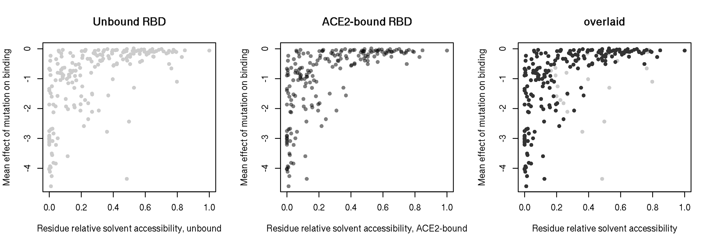

Next, we want to investigate how mutational tolerance differs between
the core alpha+beta RBD fold versus the ‘Receptor Binding Motif’ (RBM)
loops. In particular, I want to test the hypothesis that the core RBD is
more constrained with regards to mutational effects on expression, while
the RBM is constrained with regards to ACE2-binding. We plot
distributions of mutational effects within the core RBD versus in the
RBM, for binding and expression phenotypes. As we hypothesized,
mutations in the RBM tend to have a more detrimental effect on direct
binding affinity (P-value 4.5313778^{-12}, median mutation effect -0.53
in the RBM, -0.26 in the core RBD). In contrast, mutations in the core
RBD tend to have a more detrimental effect on expression (\~stability)
(P-value 2.7778591^{-31}, median mutation effect -0.44 in the RBM, -1.01
in the core RBD)

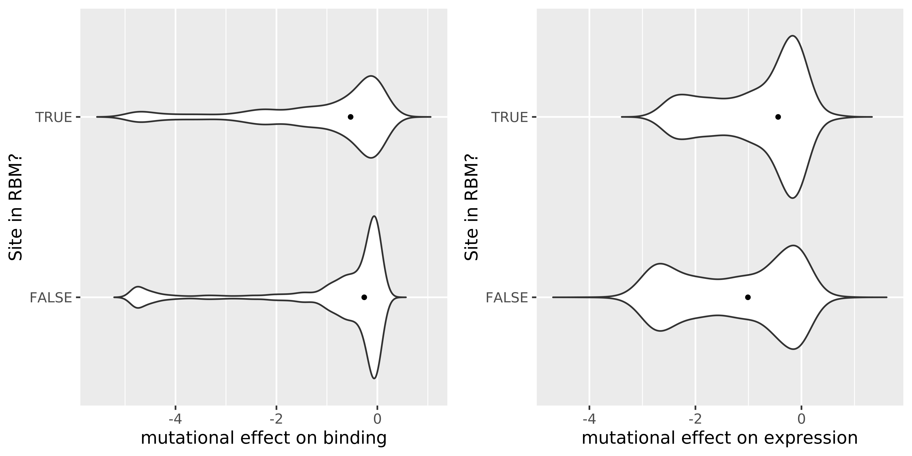

To further visualize site-wise mutational sensitivity on the 3D
structure, let’s output `.pdb` files for the ACE2-bound RBD structure in
which we replace the B factor column with metrics of interest for each
site: 1) the mean effect of mutation on binding, 2) the mean effect of
mutation on expression, 3) the max effect of any mutation on binding,
and 4) the max effect of any mutation on expression. In PyMol, we can
then visualize spheres at each Calpha, colored by spectrum from low
(red, mean effect equal to or less than -2) to high (white, mean effect
equal to or greater than 0) for each metric by manually executing the
following commands in a PyMol session in which one of the output `pdb`
files is opened:

    hide all; show cartoon
    color warmpink, chain A; color gray60, chain E
    set sphere_scale, 0.6
    create RBD_CA, chain E and name ca
    hide cartoon, RBD_CA; show spheres, RBD_CA
    spectrum b, red white, RBD_CA, minimum=-2, maximum=0

To create a surface representation of the RBD colored by mutational
tolerance, execute the following commands in a PyMol session with one of
these output `pdb` files loaded:

    create RBD, chain E
    hide all; show cartoon, chain A; color warmpink, chain A
    show surface, RBD; spectrum b, red white, RBD, minimum=-2, maximum=0

Sets of commands to create more elaborate structural alignments and
views are given in the `~/structural_views/` subdirectory, e.g. the
`surface_constraint_commands.txt` series of commands which, when
executed from a PyMol session hosted within that subdirectory loads in
various RBD structures bound to ACE2, mAbs, and full Spike, and colors
the RBD surface by mutational constraint.

``` r
pdb <- read.pdb(file="data/structures/ACE2-bound/6m0j.pdb")
```

    ##    PDB has ALT records, taking A only, rm.alt=TRUE

``` r
#color by mean effect on binding
pdb_mean_bind <- pdb
pdb_mean_bind$atom$b <- NA
for(i in 1:nrow(pdb_mean_bind$atom)){
  res <- pdb_mean_bind$atom$resno[i]
  chain <- pdb_mean_bind$atom$chain[i]
  mean_bind <- RBD_sites[site_SARS2==res & chain_6M0J==chain & !is.na(chain_6M0J),mean_bind]
  if(length(mean_bind)>0){pdb_mean_bind$atom$b[i] <- mean_bind}else{pdb_mean_bind$atom$b[i] <- 0}
}
#save pdb
write.pdb(pdb=pdb_mean_bind,file=paste(config$structure_function_dir,"/6m0j_b-factor-mean-bind.pdb",sep=""), b = pdb_mean_bind$atom$b)

#color by max effect on binding
pdb_max_bind <- pdb
pdb_max_bind$atom$b <- NA
for(i in 1:nrow(pdb_max_bind$atom)){
  res <- pdb_max_bind$atom$resno[i]
  chain <- pdb_max_bind$atom$chain[i]
  max_bind <- RBD_sites[site_SARS2==res & chain_6M0J==chain & !is.na(chain_6M0J),max_bind]
  if(length(max_bind)>0){pdb_max_bind$atom$b[i] <- max_bind}else{pdb_max_bind$atom$b[i] <- 0}
}
#save pdb
write.pdb(pdb=pdb_max_bind,file=paste(config$structure_function_dir,"/6m0j_b-factor-max-bind.pdb",sep=""), b = pdb_max_bind$atom$b)

#color by mean effect on expression
pdb_mean_expr <- pdb
pdb_mean_expr$atom$b <- NA
for(i in 1:nrow(pdb_mean_expr$atom)){
  res <- pdb_mean_expr$atom$resno[i]
  chain <- pdb_mean_expr$atom$chain[i]
  mean_expr <- RBD_sites[site_SARS2==res & chain_6M0J==chain & !is.na(chain_6M0J),mean_expr]
  if(length(mean_expr)>0){pdb_mean_expr$atom$b[i] <- mean_expr}else{pdb_mean_expr$atom$b[i] <- 0}
}
#save pdb
write.pdb(pdb=pdb_mean_expr,file=paste(config$structure_function_dir,"/6m0j_b-factor-mean-expr.pdb",sep=""), b = pdb_mean_expr$atom$b)

#color by max effect on expression
pdb_max_expr <- pdb
pdb_max_expr$atom$b <- NA
for(i in 1:nrow(pdb_max_expr$atom)){
  res <- pdb_max_expr$atom$resno[i]
  chain <- pdb_max_expr$atom$chain[i]
  max_expr <- RBD_sites[site_SARS2==res & chain_6M0J==chain & !is.na(chain_6M0J),max_expr]
  if(length(max_expr)>0){pdb_max_expr$atom$b[i] <- max_expr}else{pdb_max_expr$atom$b[i] <- 0}
}
#save pdb
write.pdb(pdb=pdb_max_expr,file=paste(config$structure_function_dir,"/6m0j_b-factor-max-expr.pdb",sep=""), b = pdb_max_expr$atom$b)
```

## Distribution of functional effects of mutation

Let’s look at the distribution of single-mutant effects on our two
phenotypes, and compare the fraction of mutations that are within the
window defined by known functional RBD homologs for these two
phenotypes.

For the binding plot on the left, the intermediate blue point on the
x-scale is RaTG13, which *can* promote huACE2-mediated cell entry in an
in vitro cellular infection assay (though less efficiently than
SARS-CoV-2) according to [Shang et
al. 2020](https://www.nature.com/articles/s41586-020-2179-y/figures/3),
though whether this is sufficient to enable efficient viral replication
in more complex models is uncertain. For the cluster of homologs near 0,
the farthest-left point is LYRa11, which according to [Letko et
al. 2020](https://www.nature.com/articles/s41564-020-0688-y/figures/1)
can also promote huACE2-mediated cellular entry, though less efficiently
than SARS-CoV-1 and other bat CoV isolates such as WIV1/16 (identical
RBDs). Therefore, these two points define a window of affinites that can
at least support in vitro cellular infection – but in reality, the
window of possible “neutrality” with regards to actual human infectivity
is perhaps better set by the remaining four points with delta
log<sub>10</sub>(*K*<sub>A,app</sub>) values \~ 0 – these four points
are the RBDs from SARS-CoV-1, WIV1/16, SARS-CoV-2, and GD-Pangolin RBDs,
in that rank-order. Taken together, we identify 1732 single mutants
(45.55%) whose affinity effects are within a neutral window that
potentially enables huACE2-mediated infectivity (SARS-CoV-1 cutoff), and
3188 single mutants (83.85%) whose affinity is potentially sufficient to
enable huACE2-mediated in vitro cellular infectivity (RaTG13 cutoff).
Taken together, this suggests a quite large sequence space of RBD
diversity that is consistent with huACE2 binding and entry. (Though, of
course, our isolated RBD-only affinity measurements may have more
complex constraints in the context of full-Spike trimer.)

For expression, our range set by homologs may be improperly aligned to
the SARS-CoV-2 range – since the SARS-CoV-2 wildtype sequences went
through the mutagenesis protocol, they could have acquired mutations
outside the sequenced region that impact expression. This is evident in
the fact that some very small fraction of wildtype barcodes are
non-expressing. We removed these non-expressing wildtype barcodes for
calculating mean wildtype expression compared to the homologs, which did
not go through the mutagenesis scheme. So, it is unclear whether this
should still impact the relationship between our SARS-CoV-2 wt
expression and the homologs. However, we cannot account for this effect
in our library mutants, where we cannot easily determine which barcodes
are nonexpressing due to outside mutatioins versus the amino acid
variant. Therefore, these artefactually low expression barcodes are
still present in the SARS-CoV-2 mutant variants, which might supress the
scale by 0.1 or 0.2 log-MFI units relative to the homologs. I think this
is all ok since we’re not reading as far into these expression effects,
but it does complicate direct comparison of the mutant DFE versus
homologs. Perhaps we could shift the entire DFE by the same log-MFI
value by which the wildtype value shifted when we eliminated the
artefactual low-expression measurements? But I don’t like this either,
because only a fraction of the mutant genotypes should be affected by
this. Our expression values all come from the global epistasis model,
which at least in theory should be able to partially able to deal with
these outliers while not suffering huge decreases in the mean estimate
of mutational effects on expression, because the Cauchy likelihood model
does allow rare errant outliers without large loss in
likelihoood/shifting of the mean parameter. Anyway, SARS-CoV-2 is
therefore our lowest ascribed expression homolog, and we calculate that
436 single mutants (11.48%) of mutants have expression as high or higher
than SARS-CoV-2.

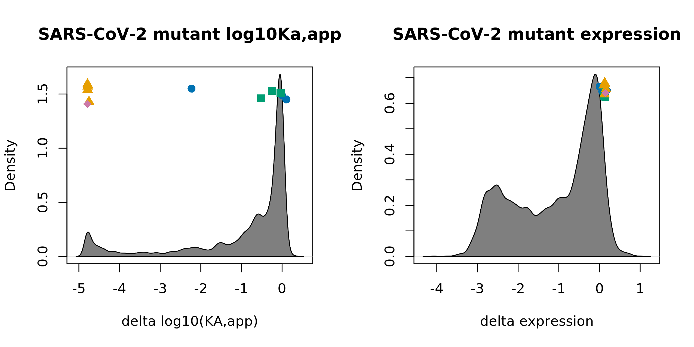

To have plots like above but compared to distribution of wt/syn, which
are collapsed to a single zero point estimate in these plots, we need to
go back to the barcode-level measurements themselves. We do that below,
generating “joyplots”.

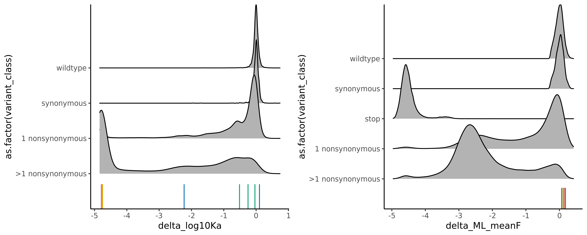

## Exploratory heatmaps

Next, let’s make heatmaps of per-amino acid mutational effects on
binding and expression. We first make these heatmaps for all mutations
at all sites, colored by delta log<sub>10</sub>(*K*<sub>A,app</sub>).
Above each set of binding values are heatmaps showing relative solvent
accessibility (RSA) in the bound and unbound RBD states, as well as a
binary indicator for ACE2 contact residues. The “x” in the heatmap marks
the wildtype SARS-CoV-2 state, and “o” marks the SARS-CoV-1 state at
positions where they differ.

(I am more of a, get the figure 90% of the way there via the code, and
just do the final alignment in Illustrator – so, I would imagine
“squashing” together the three related heatmaps a bit more to one
another to make the folding over in sequence from first three rows to
second three rows more apparent, get rid of the redundant scales, etc.
But I will wait until we have polished figures and analyses before
spending time on that since it’s manual\!)

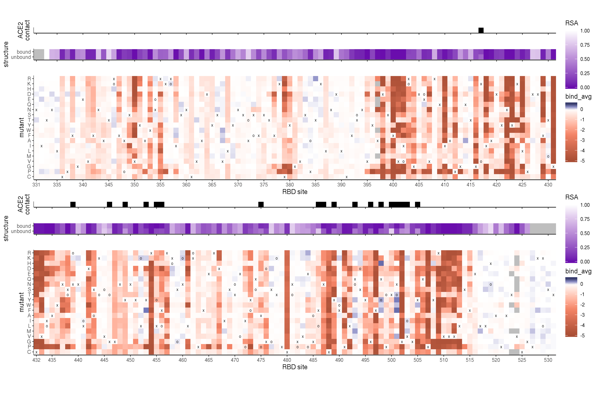

And next, the same heat map, colored by delta mean fluorescence
(expression). I altered the scale such that anything less than -4 gets
the darkest red color – the lowest missense mutant score is -4.07, only
nonsense mutants push the scale down to -5, so this helps the relative
red scale be better calibrated between the binding and expression
measurements w.r.t. single missense mutations. (once again, happy for
thoughts.). Obviously if these are shown side by side with the binding
values, we can remove the redundant RSA and contact plots:

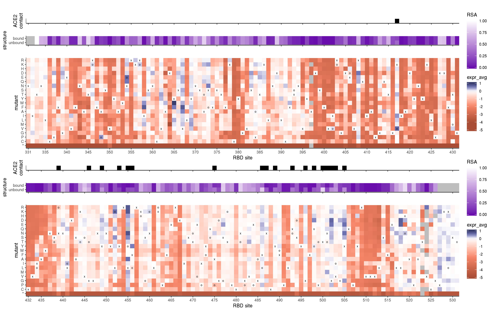

Also, next to these single-mutant effect heatmaps in a composite paper
figure, it might be useful to have heatmaps illustrating the homolog
phenotype scores. I only am so skilled at managing single-plot layouts,
so I construct these heatmaps separately below.

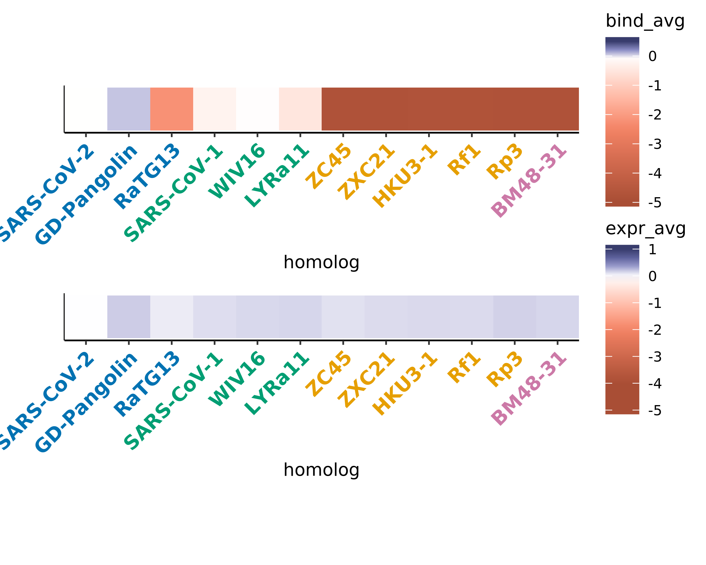

Though I think these “overall” heatmap(s) will serve well in the paper,
I think for some of the sub-observations we want to make, it helps to
zoom in particular groupings of columns in the heatmap. I do so through
the following series of interpretative summaries, and I imagine if we
want to focus on any of these points, we could have a supplementary
figure which shows these zoomed in heatmaps that highlight the relevant
points that come out from this overall heatmap.

First, let’s visualize heatmaps of paired cysteines that form
disulfides. The following heatmaps reorder sites by cysteine pair. (I
would love to add a line at the top grouping the paired cysteines, or
create a small gap between each pair of columns, but I am gg-inept and
so this will do for now.)

We can see that cysteines within a disulfide pair have similiar
sensitivities to mutation and even similar biochemical preferences, but
there are differing patterns of sensitivity for binding and expression.
Disulfide pair 4 is the most sensitive to mutation with respect to
binding, whereas it only is moderately important for expression – this
is the disulfide pair within the RBM loop that stabilizes regions of the
ACE2 interface, consistent with its exacerbated importance for binding
versus expression. The remaining three disulfides are in the core RBD
domain, and show similar sensitivities for expression and binding – pair
3 is tolerant to mutation (and may even support replacement with polar
amino acids), pair 1 is moderately sensitive, and pair 2 is most
sensitive – though hydrophobic mutations have noticeably decreased
deleterious effect for binding, which is interesting to see.

This trend is consistent with a series of Cys-\>Ala mutations made in
SARS-CoV-2 RBD in [Wong et
al. JBC 2004](https://www.jbc.org/content/279/5/3197.short) (I report
the numbers converted to SARS-CoV-2 numbering): mutations at SARS-CoV-1
RBD positions 379 and 432 severely impaired expression, mutations at
361, 480, and 488 had only mild effects on expression but strongly
decreased ACE2-binding, and mutations at 336 and 391 had little effect
on expression or binding (this is in 331-524 RBD construct, so lacking
cysteine 525).

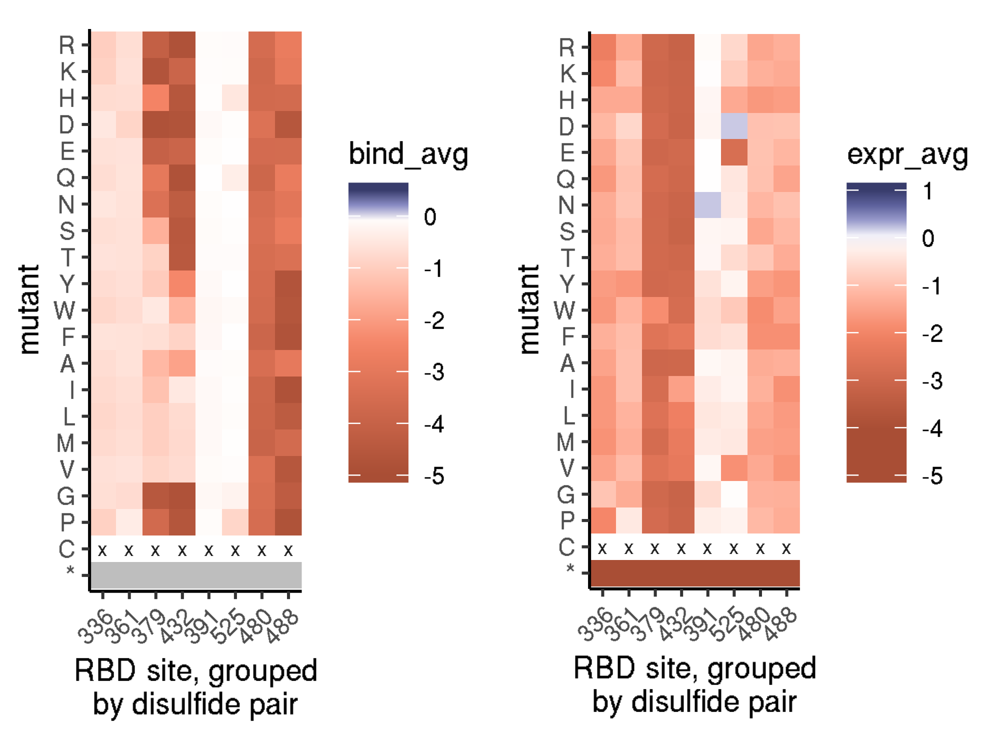

Next, let’s look at the N-linked glycosylation sites. In particular, we
look at mutational effects at NLGS motifs consisting of N331 and T333,
and N343 and T345, as well as N370 and A372, which in SARS-CoV-1 is an
NST NLGS motif. A prior paper, [Chen et
al. 2014](https://www.tandfonline.com/doi/full/10.4161/hv.27464),
showed that in SARS-CoV-1 RBD produced in Pichia yeast, yields were
lowered when progressively knocking out each of these glycans,
suggesting they are important for expression. (They didn’t do individual
knockouts, it seems.) Finally, on the righthand side, we look at the
effects of mutations i+2 from surface asparagines, to see whether
potential glycan knockins (mutations to S or T) have any interesting
effects.

As expected the two NLGS in the SARS-CoV-2 RBD are important for
stability. We can see that mutations to the focal asparagine or the N+2
threonine are universally deleterious with regards to expression, with
the exception of T-\>S mutations which retain the NLGS. Overall, the
N343 glycan appears more important to RBD stability than the N331
glycan. Re-introducing the SARS-CoV-1 NLGS at site 370 has just a mildly
deleterious effect on expression. None of these three glycan mutants
have major impacts on binding, consistent with their distance from the
ACE2-interface.

At other non-glycosylated asparagines, I don’t see many strong effects
when introducing putative NLGS motifs with an i+2 mutation to S/T.
Glycosylation of N354, N360, N448, N450, N481, and N487 may have mildly
beneficial effects on expression, and glycosylation may be \~neutral or
tolerated with only minor detrimental effects with regards to expression
at sites 388, 394, 437, 439, 460, and 501. These sites are [visualized
on the RBD
structure](https://dms-view.github.io/?pdb-url=https%3A%2F%2Fraw.githubusercontent.com%2Fdms-view%2FSARS-CoV-2%2Fmaster%2Fdata%2FSpike%2FBloomLab2020%2F6m0j.pdb&markdown-url=https%3A%2F%2Fraw.githubusercontent.com%2Fdms-view%2FSARS-CoV-2%2Fmaster%2Fdata%2FSpike%2FBloomLab2020%2FBloomLab_rbd.md&data-url=https%3A%2F%2Fraw.githubusercontent.com%2Fdms-view%2FSARS-CoV-2%2Fmaster%2Fdata%2FSpike%2FBloomLab2020%2Fresults%2FBloomLab2020_rbd.csv&condition=natural+frequencies&site_metric=site_entropy&mutation_metric=mut_frequency&selected_sites=354%2C360%2C388%2C394%2C437%2C439%2C448%2C450%2C460%2C481%2C487%2C501),
illustrating that quite a few surfaces on the RBD could potentially be
masked with glycan introductions, including different portions of the
RBM if wanting to target different epitopes with vaccine immunogens or
probes for isolating mAbs for particular epitope surfaces.

In contrast to novel glycans that could be tolerated in an engineered
RBD construct with respect to stability/expression, we can see that
introduction of an NLGS to N501 with mutation of site 503 to T or S may
have a detrimental effect on binding, consistent with this interface
residue making key ACE2-interactions (site 501 is one of the “key
contacts” from the SARS-CoV-1 literature). Knockin of a possible N439
NLGS (via T/S mutations at site 441) also has a mild deleterious effect
on affinity, specific to the T/S mutations at this i+2 position; site
439 is sort of “second shell” from the ACE2 interface, but close enough
to imagine a glycan could impact affinity. There are other positions
where i+2 S/T mutations have large deleterious effects on binding
affinity (putatively glycosylating N422 (sort of buried, so might not
actually be glycosylated) and N487 (interface\!)), but other amino acid
mutations at these positions also have strong deleterious effects, so it
is hard to know whether the effect of the T/S mutants stems from the
addition of a glycan, or loss of the wildtype amino acid at this i+2
residue independent of the glycan effect.

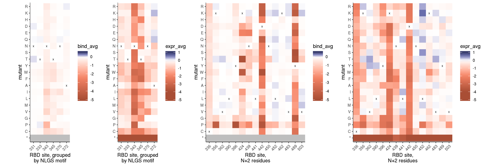

Next, let’s look at expression and binding effects for annotated contact
residues. Below, we are looking at the 19 residues that form ACE2
contacts in the SARS-CoV-2 (6m0j) or SARS-CoV-1 (2ajf) ACE2-bound RBD
crystal structures, where we annotated a residue as a contact if it
contains non-hydrogen atoms within 4 Angstroms of ACE2. 14 residues were
annotated as contacts in both structures, 3 contacts (417, 446, 475) are
unique to the SARS-CoV-2 structure, and 2 (439, 503) are unique to
SARS-CoV-1. We indicate the wildtype SARS-CoV-2 and -1 amino acids with
an “x” and “o”, respectively. We also add site 494, which although not a
direct contact, is on the ACE2-contacting interface of the RBM, and is
considered one of the sites of “key adaptation” from the SARS-CoV-1
literature.

Putting this reduced display of binding and expression next to each
other is really interesting, as it highlights some potential
binding-expression tradeoffs at positions 417, 449, 455, 486, 502, and
505, which are visualized in `dms-view`
[here](https://dms-view.github.io/?pdb-url=https%3A%2F%2Fraw.githubusercontent.com%2Fdms-view%2FSARS-CoV-2%2Fmaster%2Fdata%2FSpike%2FBloomLab2020%2F6m0j.pdb&markdown-url=https%3A%2F%2Fraw.githubusercontent.com%2Fdms-view%2FSARS-CoV-2%2Fmaster%2Fdata%2FSpike%2FBloomLab2020%2FBloomLab_rbd.md&data-url=https%3A%2F%2Fraw.githubusercontent.com%2Fdms-view%2FSARS-CoV-2%2Fmaster%2Fdata%2FSpike%2FBloomLab2020%2Fresults%2FBloomLab2020_rbd.csv&condition=natural+frequencies&site_metric=site_entropy&mutation_metric=mut_frequency&selected_sites=417%2C449%2C455%2C486%2C502%2C505).

For four of these residues (449, 455, 486, 505), binding prefers the
wildtype hydrophobic state, though this exposed hydrophobic amino acid
is evidently detrimental to expression, as polar amino acid mutations
improve expression. Site 417 is the opposite, consistent with its more
buried position a bit further from ACE2 – for expression, keeping this
amino acid hydrophobic would be preferred, but mutations to K or R can
enhance affinity, presumably because their long side chains can snorkel
out and make contact with ACE2 interface. Finally, site 502 is a
glycine, which accomodates the ACE2 loop bearing the critical K31
“hotspot” residue, which would clash sterically if mutating site 502
to any amino acid with a side chain, even though most polar side chains
at this position would improve exression. These positions are generally
solvent-accessible even in the full-Spike trimer RBD “down”
conformation, but if we want to follow up on this we should really look
more into whether full Spike trimer would ameliorate any of these
potential detrimental expression effects of surface-exposed hydrophobic
residues.

Within this heatmap is specific information about the “key” contact
sites that are often discussed in the literature. These sites primarily
came from observations about amino acid changes relating civet- and
human-adapted SARS-CoV-1 sequences, and other experimental evolution and
structural studies in the SARS-CoV-1 side of the tree. These sites are
455, 486, 493, 494, 501. May be worth extra glances when looking at
these exploratory data, though other positions may be more important
here in the SARS-CoV-2 side of the tree.

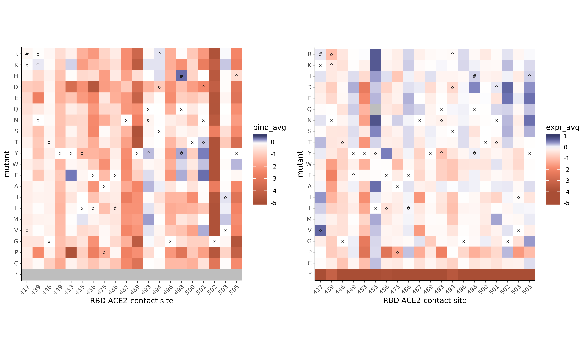

To better represent these contact residue differences among these three
CoV isolates and SARS-CoV-2, let’s make a more focused plot on interface
residues, showing the average effect of the 19 mutations at that site
and the effect of the mutation to the homolog state, faceted by the
different homolog backgrounds.

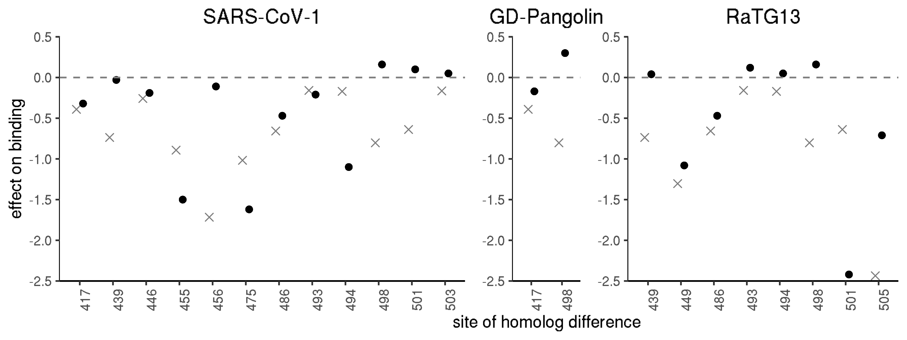

## Validation mutants

Based on gazing at heatmaps (from this notebook and in the
`sarbecovirus_diversity` notebook), preliminary analysis of circulating
SARS-CoV-2 RBD mutants, and structures and prior literature, I have
proposed the following validation mutants. As you can see, several
positions are prioritized in these panels – sites 455, and 501 are
positions of interest from prior literature on SARS-CoV-1 adaptation;
site 502 is the second most constrained position w.r.t. to binding in
our dataset and exhibits binding/stability tradeoffs, with the most
sensitive position (G431) being more constrained by stability/expression
effects rather than binding itself per se. Site 498 exhibits lots of
differences amongst the relevant strains I’ve been looking at
(SARS-CoV-2 versus -1, RaTG13, GD-Pangolin) and has large variation in
functional effects of mutation, and so is clearly a position of interest
for our data. All of these positions are in the RBM and direct or
near-direct ACE2 contact positions. Other mutations were selected
because they have been sampled at higher rates than other SARS-CoV-2
mutant variants (N439K, V367F, T478I, V483A), and C432D was selected to
investigate how core RBD stability effects manifest in pseudovirus
phenotypes in a full Spike context.

Taken together, I would propose to validate the following ten mutations
in isogenic yeast display experiments:

| mutation | RBD\_site | bind\_lib1 | bind\_lib2 | bind\_avg | expr\_lib1 | expr\_lib2 | expr\_avg | SARS1\_indicator | RaTG13\_indicator | GDPangolin\_indicator |
| :------- | --------: | ---------: | ---------: | --------: | ---------: | ---------: | --------: | :--------------- | :---------------- | :-------------------- |
| V367F    |        37 |       0.02 |       0.13 |      0.07 |         NA |       0.74 |      0.74 |                  |                   |                       |
| N439K    |       109 |       0.11 |     \-0.02 |      0.04 |     \-0.33 |     \-0.36 |    \-0.35 |                  | ^                 |                       |
| T478I    |       148 |     \-0.05 |     \-0.02 |    \-0.04 |     \-0.14 |     \-0.18 |    \-0.16 |                  |                   |                       |
| V483A    |       153 |       0.00 |     \-0.05 |    \-0.03 |       0.01 |       0.17 |      0.09 |                  |                   |                       |
| Q498H    |       168 |       0.30 |       0.31 |      0.30 |       0.15 |       0.16 |      0.16 |                  |                   | \#                    |
| Q498Y    |       168 |       0.01 |       0.30 |      0.16 |       0.19 |     \-0.07 |      0.06 | o                | ^                 |                       |
| N501D    |       171 |     \-2.40 |     \-2.44 |    \-2.42 |       0.09 |       0.07 |      0.08 |                  | ^                 |                       |
| N501F    |       171 |       0.22 |       0.36 |      0.29 |     \-0.03 |     \-0.16 |    \-0.10 |                  |                   |                       |
| N501T    |       171 |     \-0.14 |       0.33 |      0.10 |     \-0.35 |     \-0.16 |    \-0.25 | o                |                   |                       |
| G502D    |       172 |     \-4.29 |     \-4.03 |    \-4.16 |       0.62 |       0.66 |      0.64 |                  |                   |                       |

For pseudovirus growth assays, I would propose to validate the following
seven mutations:

| mutation | RBD\_site | bind\_lib1 | bind\_lib2 | bind\_avg | expr\_lib1 | expr\_lib2 | expr\_avg | SARS1\_indicator | RaTG13\_indicator | GDPangolin\_indicator |
| :------- | --------: | ---------: | ---------: | --------: | ---------: | ---------: | --------: | :--------------- | :---------------- | :-------------------- |
| C432D    |       102 |     \-4.57 |     \-4.84 |    \-4.71 |     \-3.27 |     \-3.02 |    \-3.14 |                  |                   |                       |
| N439K    |       109 |       0.11 |     \-0.02 |      0.04 |     \-0.33 |     \-0.36 |    \-0.35 |                  | ^                 |                       |
| L455Y    |       125 |     \-1.48 |     \-1.52 |    \-1.50 |     \-0.16 |     \-0.03 |    \-0.10 | o                |                   |                       |
| Q498Y    |       168 |       0.01 |       0.30 |      0.16 |       0.19 |     \-0.07 |      0.06 | o                | ^                 |                       |
| N501D    |       171 |     \-2.40 |     \-2.44 |    \-2.42 |       0.09 |       0.07 |      0.08 |                  | ^                 |                       |
| N501F    |       171 |       0.22 |       0.36 |      0.29 |     \-0.03 |     \-0.16 |    \-0.10 |                  |                   |                       |
| G502D    |       172 |     \-4.29 |     \-4.03 |    \-4.16 |       0.62 |       0.66 |      0.64 |                  |                   |                       |

## Epistasis in library double mutants

Do we see evidence for specific epistasis between pairs of mutations
found in our (sparse sampling) of double mutants?

First, we take our barcode measurements for double mutants, and add to
the data table the component single mutation effect scores.

``` r
#read in per-bc func scores
bc_bind <- data.table(read.csv(file=config$global_epistasis_binding_file,stringsAsFactors = F))[,.(library, target, barcode, variant_call_support, avgcount, log10Ka, delta_log10Ka, log10SE, response, baseline, nMSR, variant_class, aa_substitutions, n_aa_substitutions)]
bc_expr <- data.table(read.csv(file=config$global_epistasis_expr_file,stringsAsFactors = F))[,.(library, target, barcode, variant_call_support, total_count, ML_meanF, delta_ML_meanF, var_ML_meanF, variant_class, aa_substitutions, n_aa_substitutions)]

bc_dbl <- merge(bc_bind[n_aa_substitutions==2 & variant_class == ">1 nonsynonymous",], bc_expr[n_aa_substitutions==2 & variant_class == ">1 nonsynonymous",], sort=F)

#make columns breaking up the two substitutions
bc_dbl[,mut1 := strsplit(aa_substitutions, split=" ")[[1]][1], by=c("library","barcode")]
bc_dbl[,mut2 := strsplit(aa_substitutions, split=" ")[[1]][2], by=c("library","barcode")]

#change mutations to be Spike numbering from RBD numbering
bc_dbl[,mut1 := mutants[mutation_RBD==mut1,mutation],by=c("library","barcode")]
bc_dbl[,mut2 := mutants[mutation_RBD==mut2,mutation],by=c("library","barcode")]

#pull single mutant effects into table
bc_dbl[,c("mut1_bind","mut2_bind") := list(mutants[mutation==mut1,bind_avg],mutants[mutation==mut2,bind_avg]),by=c("library","barcode")]
bc_dbl[,c("mut1_expr","mut2_expr") := list(mutants[mutation==mut1,expr_avg],mutants[mutation==mut2,expr_avg]),by=c("library","barcode")]
```

Next, let’s take a look at the distribution of these double mutant
binding phenotypes, and their relation to the component single
mutational effects. We can see that for many double mutant barcodes, the
sum of component singles predicts the double mutant phenotype quite
nicely, both for binding and even for expression. Let’s focus on the
binding phenotypes, as they are better correlated and have less weird
shape components (e.g. the censoring is a much tighter/defined boundary,
compared to the loose scatter boundary in expression, and we don’t have
those annoying false-negative observed phenotypes like we do with
expression, since these are weeded out by the RBD+ sort). The green
lines on the binding plot describe the positive epistasis cutoffs we use
in the next section.


We might be primarily interested in *positive* epistasis (that is,
observed double mutants that bind better than predicted from the
component single mutations), and we probably don’t care about positive
epistasis if the double mutant is still severely deleterious. Therefore,
let’s check out double mutant combinations whose observed binding
phenotype is \> -2 that exhibit positive epistasis in which the double
mutant binds with delta log<sub>10</sub>(*K*<sub>A,app</sub>) of at
least 1 units stronger than predicted from the component singles. (So,
the difference in observed - predicted binding is \>1). These are points
in the plot above in the upper-left quadrant defined by the dashed green
lines.

We see many of these positive epistatic interactions involve prolines
and cysteines (e.g. G416P/N422L), which may exhibit epistasis because
these larger structural changes engineered by proline and cysteine
changes can dramatically alter nearby amino acid preferences. We also
see some simple epistatic interactions, such as R355L/D398M (which we
actually see in \>1 barcode, even), which correspond to a salt bridge
interaction, where losing one is deleterious, but substituting both to
aliphatic residues compensates this deleterious effect. We also see some
interactions between mutations in the RBM and at the ACE2 interface,
such as R454S+P491V, and N437K/F497S.

| avgcount | mut1  | mut2  | mut1\_bind | mut2\_bind | delta\_log10Ka | epistasis\_bind | mut1\_expr | mut2\_expr | delta\_ML\_meanF |
| -------: | :---- | :---- | ---------: | ---------: | -------------: | --------------: | ---------: | ---------: | ---------------: |
|    73.32 | G416P | N422L |     \-4.40 |     \-4.80 |         \-0.76 |            8.44 |     \-2.68 |     \-2.54 |           \-1.18 |
|    28.23 | F429P | G431C |     \-4.47 |     \-2.77 |         \-0.71 |            6.53 |     \-2.93 |     \-2.65 |           \-2.09 |
|   169.37 | F429P | G431C |     \-4.47 |     \-2.77 |         \-0.81 |            6.43 |     \-2.93 |     \-2.65 |           \-1.86 |
|    10.78 | G416V | F515K |     \-4.60 |     \-1.46 |         \-0.36 |            5.70 |     \-1.91 |     \-3.07 |           \-1.25 |
|    16.44 | C432R | N437M |     \-4.80 |     \-1.62 |         \-1.29 |            5.13 |     \-3.19 |     \-2.02 |           \-2.77 |
|     5.32 | L387Q | P507L |     \-0.53 |     \-4.80 |         \-0.23 |            5.10 |     \-1.55 |     \-1.83 |           \-4.47 |
|    56.79 | C432L | R454V |     \-0.73 |     \-4.77 |         \-0.75 |            4.75 |     \-2.13 |     \-2.27 |           \-2.28 |
|    25.35 | R355L | D398M |     \-4.33 |     \-1.39 |         \-1.11 |            4.61 |     \-2.45 |     \-2.47 |           \-2.19 |
|     8.33 | V433D | K458Q |     \-4.77 |       0.00 |         \-0.19 |            4.58 |     \-3.10 |     \-0.28 |           \-3.22 |
|    84.57 | R454S | P491V |     \-4.32 |     \-1.77 |         \-1.56 |            4.53 |     \-2.49 |     \-2.34 |           \-2.19 |
|     6.01 | N422Y | Y473I |     \-4.62 |     \-1.23 |         \-1.34 |            4.51 |     \-2.43 |     \-0.44 |           \-4.65 |
|    42.10 | N437K | F497S |     \-0.78 |     \-4.80 |         \-1.11 |            4.47 |     \-1.31 |     \-2.05 |           \-1.48 |
|    27.06 | T430M | G431R |       0.03 |     \-4.79 |         \-0.35 |            4.41 |     \-0.01 |     \-2.95 |           \-2.76 |
|    20.08 | R454P | P479N |     \-4.80 |     \-0.05 |         \-0.65 |            4.20 |     \-2.63 |     \-0.23 |           \-3.22 |
|    18.87 | T385N | V433R |       0.01 |     \-4.48 |         \-0.28 |            4.19 |       0.03 |     \-3.12 |           \-3.21 |
|    42.44 | R355L | D398M |     \-4.33 |     \-1.39 |         \-1.54 |            4.18 |     \-2.45 |     \-2.47 |           \-2.16 |
|     6.39 | P337L | F429R |     \-0.27 |     \-4.49 |         \-0.58 |            4.18 |     \-0.95 |     \-2.92 |           \-4.55 |
|     8.83 | V350R | N487D |     \-4.80 |     \-1.08 |         \-1.75 |            4.13 |     \-2.59 |       0.07 |           \-4.60 |
|     5.80 | A435P | G476N |     \-4.18 |     \-0.84 |         \-0.91 |            4.11 |     \-3.01 |     \-0.48 |           \-4.53 |
|    59.46 | I358A | I410R |     \-0.70 |     \-4.80 |         \-1.49 |            4.01 |     \-1.44 |     \-2.84 |           \-2.37 |
|     9.51 | F400Y | F429N |     \-0.90 |     \-4.74 |         \-1.72 |            3.92 |     \-2.50 |     \-2.93 |           \-2.67 |
|   116.01 | S366Y | G413P |     \-0.23 |     \-4.65 |         \-0.97 |            3.91 |     \-1.29 |     \-2.72 |           \-3.34 |
|    24.44 | V433Q | T500S |     \-4.80 |     \-0.32 |         \-1.32 |            3.80 |     \-3.11 |       0.00 |           \-2.81 |
|    46.64 | C379Y | D398I |     \-1.05 |     \-3.38 |         \-0.68 |            3.75 |     \-2.95 |     \-2.60 |           \-2.83 |
|    25.80 | N343V | C488Y |     \-0.82 |     \-4.69 |         \-1.86 |            3.65 |     \-3.11 |     \-1.72 |           \-3.36 |
|    61.88 | S375H | L425Q |     \-0.13 |     \-4.79 |         \-1.29 |            3.63 |     \-0.34 |     \-2.84 |           \-2.49 |
|    53.32 | A363S | G431M |     \-0.19 |     \-4.61 |         \-1.19 |            3.61 |     \-0.89 |     \-2.70 |           \-2.79 |
|    28.36 | V350D | S459A |     \-4.80 |     \-0.03 |         \-1.23 |            3.60 |     \-2.21 |     \-0.10 |           \-1.77 |
|     6.37 | N370D | R457V |     \-0.04 |     \-3.49 |           0.02 |            3.55 |     \-0.15 |     \-2.53 |           \-4.57 |
|    15.53 | F400D | F490W |     \-4.80 |     \-0.05 |         \-1.30 |            3.55 |     \-2.59 |     \-0.03 |           \-4.52 |
|    69.21 | K378C | C480W |     \-0.14 |     \-3.62 |         \-0.31 |            3.45 |     \-0.71 |     \-1.86 |           \-2.61 |
|    27.17 | A372D | V433W |     \-0.10 |     \-4.74 |         \-1.46 |            3.38 |     \-0.28 |     \-2.90 |           \-3.12 |
|    40.11 | V433R | K444M |     \-4.48 |     \-0.04 |         \-1.17 |            3.35 |     \-3.12 |     \-0.24 |           \-3.24 |
|    63.97 | S375D | V433K |     \-0.04 |     \-4.79 |         \-1.55 |            3.28 |     \-0.08 |     \-3.15 |           \-3.04 |
|     7.90 | R408H | I434D |     \-0.06 |     \-3.68 |         \-0.49 |            3.25 |       0.02 |     \-3.11 |           \-2.22 |
|    36.69 | P412F | A435T |     \-3.87 |     \-0.17 |         \-0.80 |            3.24 |     \-2.86 |     \-0.73 |           \-2.72 |
|    23.32 | Y396P | I472V |     \-4.80 |     \-0.38 |         \-1.95 |            3.23 |     \-2.52 |     \-0.12 |           \-2.38 |
|    51.83 | F464S | V511R |     \-0.18 |     \-4.80 |         \-1.76 |            3.22 |     \-0.75 |     \-3.00 |           \-2.74 |
|    56.62 | T376K | L513R |     \-0.08 |     \-4.60 |         \-1.46 |            3.22 |     \-0.61 |     \-3.47 |           \-3.39 |
|     5.03 | K386L | L425H |     \-0.07 |     \-4.80 |         \-1.69 |            3.18 |     \-0.40 |     \-2.86 |           \-3.71 |
|   180.78 | N422L | S514V |     \-4.80 |     \-0.03 |         \-1.76 |            3.07 |     \-2.54 |       0.05 |           \-2.13 |
|    30.06 | S383F | N437Y |     \-0.14 |     \-3.62 |         \-0.73 |            3.03 |     \-1.06 |     \-2.34 |           \-2.19 |
|    25.82 | A348P | F377D |     \-0.06 |     \-4.01 |         \-1.08 |            2.99 |       0.40 |     \-2.75 |           \-2.96 |
|    14.78 | V433K | T531L |     \-4.79 |       0.01 |         \-1.80 |            2.98 |     \-3.15 |       0.00 |           \-3.17 |
|     5.49 | F429W | V433K |     \-0.11 |     \-4.79 |         \-1.96 |            2.94 |     \-0.29 |     \-3.15 |           \-3.53 |
|    98.64 | V401G | S459N |     \-4.32 |       0.03 |         \-1.39 |            2.90 |     \-2.81 |       0.01 |           \-2.81 |
|    88.49 | V367F | F429S |       0.07 |     \-4.79 |         \-1.85 |            2.87 |       0.74 |     \-2.90 |           \-2.46 |
|    44.34 | S371K | I410T |     \-0.13 |     \-4.48 |         \-1.84 |            2.77 |     \-0.86 |     \-2.76 |           \-3.30 |
|   109.48 | C391R | G416P |     \-0.07 |     \-4.40 |         \-1.73 |            2.74 |     \-0.07 |     \-2.68 |           \-2.52 |
|    86.88 | Y365W | A435P |     \-0.01 |     \-4.18 |         \-1.46 |            2.73 |       0.99 |     \-3.01 |           \-2.66 |
|    10.15 | R357K | F429T |       0.05 |     \-3.32 |         \-0.57 |            2.70 |       0.18 |     \-2.89 |           \-2.84 |
|    19.33 | C379H | N440L |     \-2.50 |     \-0.07 |           0.12 |            2.69 |     \-2.96 |     \-0.13 |           \-2.37 |
|    40.10 | T376H | V510S |     \-0.02 |     \-4.42 |         \-1.83 |            2.61 |       0.06 |     \-2.99 |           \-2.78 |
|    13.48 | A344P | S443P |     \-0.74 |     \-2.46 |         \-0.72 |            2.48 |     \-2.98 |     \-1.79 |           \-4.64 |
|    41.14 | N388K | I434N |     \-0.14 |     \-2.93 |         \-0.61 |            2.46 |     \-0.26 |     \-3.15 |           \-3.27 |
|    49.13 | N481S | G502K |     \-0.04 |     \-4.16 |         \-1.79 |            2.41 |     \-0.16 |       0.24 |           \-0.30 |
|    21.56 | E471S | C480Y |     \-0.04 |     \-3.55 |         \-1.19 |            2.40 |     \-0.22 |     \-1.56 |           \-0.60 |
|    41.71 | L425P | Q498R |     \-3.46 |     \-0.06 |         \-1.16 |            2.36 |     \-2.73 |     \-0.10 |           \-2.66 |
|     9.10 | S349G | R403E |     \-0.59 |     \-2.11 |         \-0.35 |            2.35 |     \-2.08 |     \-1.31 |           \-2.51 |
|     7.31 | G339Q | P412N |     \-0.05 |     \-3.32 |         \-1.08 |            2.29 |       0.00 |     \-2.68 |           \-4.31 |
|    33.44 | F429A | H519D |     \-3.83 |       0.00 |         \-1.57 |            2.26 |     \-2.86 |       0.27 |           \-2.81 |
|    19.30 | N388M | L492A |     \-0.07 |     \-4.06 |         \-1.89 |            2.24 |     \-0.51 |     \-2.22 |           \-1.98 |
|     9.79 | G431C | P527W |     \-2.77 |     \-0.20 |         \-0.79 |            2.18 |     \-2.65 |       0.19 |               NA |
|    18.50 | R457P | N501V |     \-3.97 |       0.15 |         \-1.74 |            2.08 |     \-2.48 |     \-0.19 |           \-2.93 |
|    35.70 | Y365L | A419E |       0.00 |     \-3.75 |         \-1.68 |            2.07 |       0.30 |     \-2.58 |           \-1.84 |
|    16.05 | C391A | F429T |     \-0.08 |     \-3.32 |         \-1.44 |            1.96 |     \-0.12 |     \-2.89 |           \-2.65 |
|   136.27 | V341W | Y423L |     \-0.47 |     \-3.11 |         \-1.65 |            1.93 |     \-1.18 |     \-2.59 |           \-2.56 |
|    56.37 | F429T | T478R |     \-3.32 |     \-0.04 |         \-1.46 |            1.90 |     \-2.89 |     \-0.09 |           \-2.99 |
|    67.82 | S443N | G485M |     \-2.18 |     \-0.28 |         \-0.57 |            1.89 |     \-0.19 |     \-0.56 |           \-0.78 |
|    32.43 | R355F | L452K |     \-3.01 |       0.09 |         \-1.07 |            1.85 |     \-2.56 |       0.58 |           \-2.18 |
|    21.07 | K417V | L425A |     \-0.32 |     \-3.04 |         \-1.52 |            1.84 |       0.65 |     \-2.80 |           \-2.85 |
|    19.81 | A435R | F490Y |     \-2.76 |       0.06 |         \-0.86 |            1.84 |     \-2.82 |       0.10 |           \-2.74 |
|    11.13 | K417T | L425A |     \-0.26 |     \-3.04 |         \-1.53 |            1.77 |       0.25 |     \-2.80 |           \-2.73 |
|    29.49 | Y449S | G496F |     \-1.25 |     \-2.12 |         \-1.62 |            1.75 |       0.12 |     \-0.32 |             0.08 |
|     6.31 | L335E | Q506R |       0.06 |     \-1.62 |           0.19 |            1.75 |       0.11 |     \-1.88 |               NA |
|    71.67 | V350M | N450E |     \-3.54 |     \-0.11 |         \-1.94 |            1.71 |     \-2.54 |       0.15 |           \-2.42 |
|    26.02 | D398I | E484P |     \-3.38 |     \-0.28 |         \-1.98 |            1.68 |     \-2.60 |     \-0.02 |           \-2.94 |
|    40.84 | S373C | N437W |     \-0.07 |     \-2.96 |         \-1.35 |            1.68 |     \-0.24 |     \-2.24 |           \-2.19 |
|     7.20 | V341G | Y365V |     \-1.06 |     \-0.11 |           0.50 |            1.67 |     \-2.30 |       0.01 |           \-1.74 |
|    51.30 | I434N | P527A |     \-2.93 |       0.02 |         \-1.24 |            1.67 |     \-3.15 |       0.25 |           \-2.89 |
|    17.00 | R355F | F464K |     \-3.01 |     \-0.51 |         \-1.85 |            1.67 |     \-2.56 |     \-1.71 |           \-2.80 |
|    16.59 | G416R | N460Q |     \-2.89 |       0.02 |         \-1.22 |            1.65 |     \-2.75 |     \-0.15 |           \-2.70 |
|    16.29 | Y351R | S371D |     \-2.97 |       0.01 |         \-1.33 |            1.63 |     \-2.64 |     \-0.09 |           \-3.45 |
|    70.02 | G416R | F464Y |     \-2.89 |     \-0.04 |         \-1.31 |            1.62 |     \-2.75 |       0.19 |           \-2.68 |
|    60.61 | G416L | S514V |     \-3.20 |     \-0.03 |         \-1.64 |            1.59 |     \-1.89 |       0.05 |           \-2.16 |
|    12.56 | Q493V | T500L |       0.05 |     \-1.52 |           0.12 |            1.59 |     \-0.10 |     \-0.29 |           \-0.01 |
|     7.56 | G446V | L513E |     \-0.27 |     \-2.52 |         \-1.21 |            1.58 |     \-0.48 |     \-3.53 |           \-3.23 |
|     9.37 | Y380M | D420L |     \-1.07 |     \-0.18 |           0.32 |            1.57 |     \-2.74 |     \-1.18 |               NA |
|    47.16 | N422G | P527V |     \-2.48 |       0.04 |         \-0.87 |            1.57 |     \-2.56 |       0.16 |           \-2.14 |
|    42.56 | S373P | L513A |     \-0.08 |     \-3.14 |         \-1.67 |            1.55 |     \-0.22 |     \-2.92 |           \-2.88 |
|    40.39 | A419D | P527M |     \-3.23 |       0.11 |         \-1.57 |            1.55 |     \-2.53 |       0.21 |           \-2.65 |
|    17.99 | N334E | C379N |       0.01 |     \-3.32 |         \-1.76 |            1.55 |     \-0.05 |     \-2.95 |           \-3.13 |
|    11.14 | Y380L | W436S |     \-1.53 |     \-0.66 |         \-0.64 |            1.55 |     \-2.69 |     \-2.48 |           \-2.91 |
|     9.44 | Y453V | N487S |     \-0.11 |     \-1.51 |         \-0.08 |            1.54 |     \-1.00 |     \-0.20 |               NA |
|    14.86 | C379H | Y508H |     \-2.50 |       0.07 |         \-0.90 |            1.53 |     \-2.96 |       0.14 |           \-2.93 |
|    54.07 | S373R | Y380D |     \-0.01 |     \-3.05 |         \-1.53 |            1.53 |       0.05 |     \-2.84 |           \-2.85 |
|    32.99 | G416R | F486P |     \-2.89 |     \-0.18 |         \-1.55 |            1.52 |     \-2.75 |       0.22 |           \-2.77 |
|     9.51 | Y421E | T531L |     \-2.08 |       0.01 |         \-0.55 |            1.52 |     \-2.23 |       0.00 |           \-3.20 |
|    25.29 | C379N | F392W |     \-3.32 |       0.02 |         \-1.78 |            1.52 |     \-2.95 |       0.26 |           \-2.77 |
|    20.51 | G339L | W353L |     \-0.22 |     \-2.15 |         \-0.86 |            1.51 |     \-0.54 |     \-2.62 |           \-1.89 |
|    56.03 | F347D | P527A |     \-3.13 |       0.02 |         \-1.60 |            1.51 |     \-1.66 |       0.25 |           \-2.17 |
|    17.22 | F338R | N439Y |     \-1.66 |     \-1.20 |         \-1.36 |            1.50 |     \-2.60 |     \-0.36 |           \-1.62 |
|    46.14 | Y449E | G496T |     \-1.57 |     \-1.46 |         \-1.54 |            1.49 |       0.12 |       0.12 |             0.04 |
|   128.59 | Y396E | Y473T |     \-0.52 |     \-1.85 |         \-0.89 |            1.48 |     \-1.78 |     \-0.93 |           \-2.29 |
|    26.71 | F392R | L461A |     \-0.40 |     \-1.00 |           0.08 |            1.48 |     \-1.39 |     \-2.29 |           \-2.59 |
|    33.86 | W353T | T531S |     \-2.75 |       0.01 |         \-1.27 |            1.47 |     \-2.13 |       0.02 |           \-3.19 |
|    13.66 | Q414W | G447W |     \-0.80 |     \-1.74 |         \-1.07 |            1.47 |     \-1.93 |     \-1.94 |           \-2.63 |
|     5.87 | A419L | A435I |     \-2.28 |     \-0.75 |         \-1.57 |            1.46 |     \-2.65 |     \-2.12 |           \-2.28 |
|     9.78 | Y380R | K458N |     \-1.34 |     \-0.12 |         \-0.03 |            1.43 |     \-2.84 |     \-0.15 |           \-2.96 |
|    67.94 | G431C | T531A |     \-2.77 |       0.00 |         \-1.37 |            1.40 |     \-2.65 |     \-0.02 |           \-2.62 |
|    35.69 | Y423L | V483T |     \-3.11 |     \-0.17 |         \-1.89 |            1.39 |     \-2.59 |       0.30 |           \-2.44 |
|    48.49 | Q493V | T500L |       0.05 |     \-1.52 |         \-0.08 |            1.39 |     \-0.10 |     \-0.29 |             0.00 |
|    27.64 | Y369L | F429C |       0.05 |     \-3.17 |         \-1.74 |            1.38 |       0.31 |     \-2.85 |           \-2.31 |
|   288.50 | R355V | V367F |     \-2.38 |       0.07 |         \-0.93 |            1.38 |     \-2.34 |       0.74 |           \-1.87 |
|    30.19 | F429C | P521T |     \-3.17 |     \-0.03 |         \-1.83 |            1.37 |     \-2.85 |     \-0.14 |           \-3.35 |
|    10.71 | G447K | I472H |     \-1.54 |     \-0.37 |         \-0.55 |            1.36 |     \-0.29 |     \-0.91 |               NA |
|    16.04 | F490N | L513T |       0.02 |     \-1.90 |         \-0.52 |            1.36 |       0.03 |     \-3.04 |           \-3.18 |
|    16.75 | C336K | N487A |     \-0.93 |     \-1.74 |         \-1.33 |            1.34 |     \-1.93 |     \-0.22 |           \-2.21 |
|    57.27 | V367M | I434N |       0.04 |     \-2.93 |         \-1.57 |            1.32 |       0.21 |     \-3.15 |           \-2.75 |
|    29.91 | T478S | C488S |     \-0.01 |     \-2.84 |         \-1.54 |            1.31 |     \-0.09 |     \-1.15 |           \-0.88 |
|    57.83 | C336F | V511F |     \-0.57 |     \-1.80 |         \-1.07 |            1.30 |     \-1.28 |     \-2.60 |           \-2.82 |
|    43.85 | Y369L | F429C |       0.05 |     \-3.17 |         \-1.83 |            1.29 |       0.31 |     \-2.85 |           \-2.05 |
|     6.27 | Q414M | Y423M |       0.04 |     \-2.77 |         \-1.45 |            1.28 |     \-0.06 |     \-2.67 |           \-3.00 |
|    62.29 | S373Y | F515D |     \-0.01 |     \-2.93 |         \-1.66 |            1.28 |     \-0.06 |     \-2.77 |           \-2.91 |
|   103.31 | G416Y | L513V |     \-2.74 |     \-0.45 |         \-1.92 |            1.27 |     \-2.06 |     \-1.56 |           \-2.25 |
|    13.41 | G416L | C525N |     \-3.20 |     \-0.02 |         \-1.95 |            1.27 |     \-1.89 |     \-0.35 |               NA |
|    48.07 | P337S | N487K |     \-0.10 |     \-2.30 |         \-1.14 |            1.26 |     \-0.23 |     \-0.09 |           \-0.04 |
|    12.67 | P337N | P412D |     \-0.03 |     \-3.12 |         \-1.90 |            1.25 |       0.28 |     \-2.74 |           \-2.81 |
|    21.98 | G416Y | V503Q |     \-2.74 |     \-0.01 |         \-1.51 |            1.24 |     \-2.06 |     \-0.11 |           \-2.22 |
|    26.90 | T385S | D467M |     \-0.01 |     \-2.27 |         \-1.04 |            1.24 |       0.00 |     \-2.75 |           \-2.62 |
|    37.97 | S371L | W436D |     \-0.14 |     \-2.86 |         \-1.77 |            1.23 |     \-0.61 |     \-2.97 |           \-2.70 |
|    78.99 | I358W | Y423L |       0.07 |     \-3.11 |         \-1.82 |            1.22 |       0.41 |     \-2.59 |           \-2.49 |
|   232.80 | V407R | A435M |     \-0.76 |     \-0.67 |         \-0.22 |            1.21 |     \-2.17 |     \-1.73 |           \-0.57 |
|    15.58 | A419W | P527A |     \-2.69 |       0.02 |         \-1.46 |            1.21 |     \-2.84 |       0.25 |           \-2.47 |
|    70.04 | I358F | C432A |       0.10 |     \-1.88 |         \-0.57 |            1.21 |       0.72 |     \-3.01 |           \-1.49 |
|     6.48 | T376N | S399K |     \-0.19 |     \-0.97 |           0.05 |            1.21 |     \-0.70 |     \-2.61 |               NA |
|    62.20 | Y365W | T430P |     \-0.01 |     \-2.11 |         \-0.93 |            1.19 |       0.99 |     \-2.86 |           \-2.01 |
|    10.39 | A363N | A419M |     \-0.43 |     \-1.11 |         \-0.36 |            1.18 |     \-2.44 |     \-2.41 |           \-4.60 |
|    60.58 | F338R | T345L |     \-1.66 |     \-0.25 |         \-0.73 |            1.18 |     \-2.60 |     \-1.23 |           \-2.19 |
|     8.70 | S366F | Y449C |     \-0.23 |     \-1.73 |         \-0.79 |            1.17 |     \-0.63 |     \-0.17 |           \-1.04 |
|     8.97 | N334L | S373N |     \-0.20 |     \-1.06 |         \-0.11 |            1.15 |     \-0.72 |       0.48 |           \-0.18 |
|     8.95 | F486E | T531S |     \-1.63 |       0.01 |         \-0.47 |            1.15 |       0.28 |       0.02 |               NA |
|   539.12 | Y449G | P479S |     \-1.28 |     \-0.03 |         \-0.17 |            1.14 |       0.06 |     \-0.20 |           \-0.05 |
|   135.90 | G339K | N422C |     \-0.11 |     \-2.45 |         \-1.42 |            1.14 |     \-0.23 |     \-2.31 |           \-2.27 |
|    30.41 | K424I | E471R |     \-2.03 |     \-0.12 |         \-1.01 |            1.14 |     \-2.58 |     \-0.53 |           \-2.53 |
|     6.27 | V407G | T531M |     \-2.63 |     \-0.01 |         \-1.50 |            1.14 |     \-2.76 |       0.00 |           \-2.84 |
|    14.53 | W353G | V367G |     \-2.17 |     \-0.04 |         \-1.09 |            1.12 |     \-2.27 |       0.03 |           \-1.93 |
|    11.94 | G416R | P527H |     \-2.89 |     \-0.01 |         \-1.79 |            1.11 |     \-2.75 |       0.07 |               NA |
|    59.88 | T393N | I402S |     \-0.03 |     \-2.26 |         \-1.18 |            1.11 |     \-0.16 |     \-2.68 |           \-2.55 |
|    14.45 | V367Y | L461Q |     \-0.02 |     \-2.11 |         \-1.03 |            1.10 |       0.01 |     \-2.73 |           \-2.44 |
|     5.93 | E340H | G476V |     \-0.27 |     \-1.96 |         \-1.14 |            1.09 |     \-1.09 |     \-1.32 |           \-2.03 |
|    37.64 | V407W | P527A |     \-1.78 |       0.02 |         \-0.67 |            1.09 |     \-2.65 |       0.25 |           \-2.50 |
|    20.74 | Y451D | A520S |     \-2.54 |     \-0.04 |         \-1.50 |            1.08 |     \-2.21 |     \-0.05 |           \-2.23 |
|    17.97 | I472D | Q498W |     \-2.09 |       0.07 |         \-0.94 |            1.08 |     \-0.90 |     \-0.41 |           \-1.02 |
|    62.07 | Y380D | T531H |     \-3.05 |       0.02 |         \-1.95 |            1.08 |     \-2.84 |       0.01 |           \-2.67 |
|    30.03 | Y449S | G496N |     \-1.25 |     \-0.35 |         \-0.53 |            1.07 |       0.12 |       0.04 |             0.18 |
|    98.56 | R355C | P527L |     \-1.88 |       0.04 |         \-0.77 |            1.07 |     \-1.40 |       0.41 |           \-1.74 |
|    48.34 | V362E | S373N |     \-0.05 |     \-1.06 |         \-0.06 |            1.05 |     \-0.14 |       0.48 |             0.17 |
|    29.94 | K424E | N460P |     \-2.56 |     \-0.01 |         \-1.52 |            1.05 |     \-2.68 |       0.07 |           \-2.39 |
|    22.16 | G431C | T531R |     \-2.77 |     \-0.01 |         \-1.73 |            1.05 |     \-2.65 |     \-0.07 |           \-2.79 |
|    20.65 | S349Y | R357V |     \-1.80 |       0.01 |         \-0.75 |            1.04 |     \-2.48 |       0.01 |           \-2.24 |
|    59.00 | P384L | T430P |       0.01 |     \-2.11 |         \-1.06 |            1.04 |     \-0.03 |     \-2.86 |           \-2.74 |
|    14.55 | P426W | E484P |     \-1.77 |     \-0.28 |         \-1.02 |            1.03 |     \-2.89 |     \-0.02 |           \-3.32 |
|    49.23 | R457E | Y505W |     \-2.78 |       0.13 |         \-1.62 |            1.03 |     \-2.26 |     \-0.04 |           \-2.92 |
|     8.24 | A363I | A435R |     \-0.25 |     \-2.76 |         \-1.98 |            1.03 |     \-0.96 |     \-2.82 |           \-3.76 |
|   103.60 | S373N | G413V |     \-1.06 |     \-0.59 |         \-0.63 |            1.02 |       0.48 |     \-1.74 |           \-0.81 |
|    85.99 | N334R | R355F |       0.00 |     \-3.01 |         \-1.99 |            1.02 |     \-0.12 |     \-2.56 |           \-2.54 |
|    61.67 | P412H | D428N |     \-2.32 |       0.01 |         \-1.30 |            1.01 |     \-2.73 |       0.18 |           \-2.18 |
|     6.71 | F429L | N437K |     \-0.69 |     \-0.78 |         \-0.46 |            1.01 |     \-2.17 |     \-1.31 |           \-2.17 |
|    10.42 | D389W | N437V |     \-0.25 |     \-1.46 |         \-0.70 |            1.01 |     \-0.77 |     \-2.08 |           \-2.42 |
|    58.82 | N422G | K458S |     \-2.48 |     \-0.04 |         \-1.51 |            1.01 |     \-2.56 |     \-0.05 |           \-2.33 |

Let’s see if there’s an enrichment of positive epistasis among close
contact positions. We use bio3d to return all pairwise distances between
RBD residues, and populate our table with the contact distance for the
residue pair mutated in each double mutant. We then look at the
relationship between epistasis scores and pairwise distance, for all
scores, and for those where the observed double mutant delta
log<sub>10</sub>(*K*<sub>A,app</sub>) is \> -3 (to avoid weirdness with
censored/boundary observations). (Expectation from prior DMS work is
that negative epistasis is often global and dispersed in terms of
residue pair distance, whereas positive epistasis is enriched for
spatially proximal, specific compensatory interactions.)

``` r
#ouput residue numbers for the mutant pair
bc_dbl[,c("site1","site2") := list(paste(strsplit(mut1,split="")[[1]][2:4],collapse=""),paste(strsplit(mut2,split="")[[1]][2:4],collapse="")),by=c("library","barcode")]

#read in RBD structure
pdb <- read.pdb(file="data/structures/ACE2-bound/6m0j.pdb")
```

    ##    PDB has ALT records, taking A only, rm.alt=TRUE

``` r
pdb_atoms <- pdb$atom

#make data frame giving pairwise distances -- either Calpha distances, or closest atomic distances
pdb_dists <- expand.grid(site1=RBD_sites$site_SARS2,site2=RBD_sites$site_SARS2)
pdb_dists <- pdb_dists[order(pdb_dists$site1, pdb_dists$site2),]
pdb_dists <- pdb_dists[pdb_dists$site1 < pdb_dists$site2,]

calc.dist <- function(x1,y1,z1,x2,y2,z2){ #function to calculate 3D distance from xyz coordinates
  return(sqrt((x2-x1)^2+(y2-y1)^2+(z2-z1)^2))
}

for(i in 1:nrow(pdb_dists)){
  if(pdb_dists[i,"site1"] %in% unique(pdb_atoms[pdb_atoms$chain=="E" & pdb_atoms$type=="ATOM","resno"]) & pdb_dists[i,"site2"] %in% unique(pdb_atoms[pdb_atoms$chain=="E" & pdb_atoms$type=="ATOM","resno"])){
    atoms1 <- pdb_atoms[pdb_atoms$chain=="E" & pdb_atoms$resno==pdb_dists[i,"site1"],]
    atoms2 <- pdb_atoms[pdb_atoms$chain=="E" & pdb_atoms$resno==pdb_dists[i,"site2"],]
    if(nrow(atoms1)>0 & nrow(atoms2)>0){
      pdb_dists$CA_dist[i] <- calc.dist(atoms1[atoms1$elety=="CA","x"],atoms1[atoms1$elety=="CA","y"],atoms1[atoms1$elety=="CA","z"],
                                        atoms2[atoms2$elety=="CA","x"],atoms2[atoms2$elety=="CA","y"],atoms2[atoms2$elety=="CA","z"])
      all_dists <- c()
      for(i1 in 1:nrow(atoms1)){for(i2 in 1:nrow(atoms2)){
        all_dists <- c(all_dists,calc.dist(atoms1[i1,"x"],atoms1[i1,"y"],atoms1[i1,"z"],atoms2[i2,"x"],atoms2[i2,"y"],atoms2[i2,"z"]))}}
      pdb_dists$min_dist[i] <- min(all_dists)
    }else{pdb_dists$CA_dist[i] <- NA;pdb_dists$min_dist[i] <- NA}
  }else{pdb_dists$CA_dist[i] <- NA;pdb_dists$min_dist[i] <- NA}
}
pdb_dists <- data.table(pdb_dists)

#add distances to dbl mut dataframe
bc_dbl$CA_dist <- sapply(1:nrow(bc_dbl), function(x) return(pdb_dists[site1==bc_dbl[x,site1] & site2==bc_dbl[x,site2],CA_dist]))
bc_dbl$min_dist <- sapply(1:nrow(bc_dbl), function(x) return(pdb_dists[site1==bc_dbl[x,site1] & site2==bc_dbl[x,site2],min_dist]))
```

In the plots below, we can see that plenty of positive epistatic pairs
are distributed quite far in the structure, suggesting nonspecific
effects (or noise). But plenty, including some we saw in the tables
above, are at close 3D contact\!

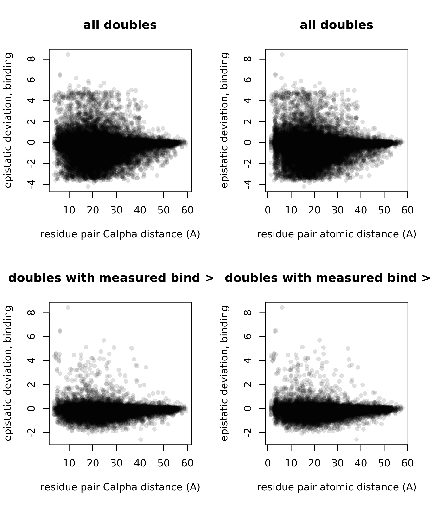

Next, let’s subset the double mutant info for just the RBM residues,
which are focal for ACE2 interaction and also exhibit the most diversity
across RBD evolution.

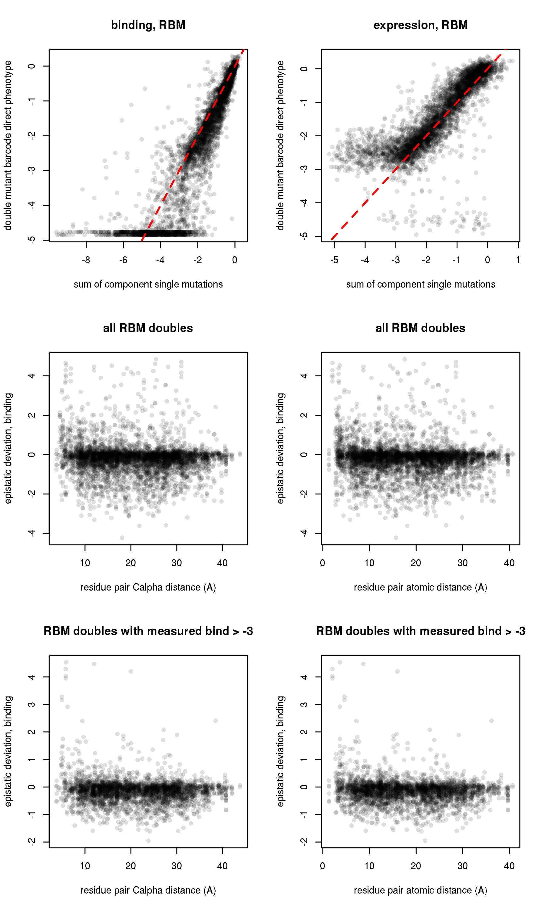

Let’s look at the RBM residue pairs with high positive epistasis scores.
We can see that many of the positive epistatic interactions surround the
cysteines at positions 480 and 488 which form a key disulfide that
stabilizes one of the lateral loops of the RBM. We can see that double
cysteine mutants are less deleterious than expected by their single
mutations, as we’d expect (knocking out the second cysteine when the
other is already gone is not going to incur the same binding cost as the
initial breaking of this disulfide). Another cool thing to see is that
positive epistasis also emerges by knockout of one cysteine, followed by
knock-in of a cysteine at a *different* position in this loop, e.g Q474C
or S477C.

| avgcount | mut1  | mut2  |  CA\_dist | mut1\_bind | mut2\_bind | delta\_log10Ka | epistasis\_bind | mut1\_expr | mut2\_expr | delta\_ML\_meanF |
| -------: | :---- | :---- | --------: | ---------: | ---------: | -------------: | --------------: | ---------: | ---------: | ---------------: |
|    84.57 | R454S | P491V |  5.903585 |     \-4.32 |     \-1.77 |         \-1.56 |            4.53 |     \-2.49 |     \-2.34 |           \-2.19 |
|    42.10 | N437K | F497S | 11.986635 |     \-0.78 |     \-4.80 |         \-1.11 |            4.47 |     \-1.31 |     \-2.05 |           \-1.48 |
|    21.94 | C480G | C488E |  5.792605 |     \-3.44 |     \-3.57 |         \-2.72 |            4.29 |     \-1.26 |     \-1.19 |           \-0.41 |
|    20.08 | R454P | P479N | 20.032977 |     \-4.80 |     \-0.05 |         \-0.65 |            4.20 |     \-2.63 |     \-0.23 |           \-3.22 |
|    58.73 | C480F | C488N |  5.792605 |     \-3.84 |     \-3.09 |         \-2.90 |            4.03 |     \-1.81 |     \-1.01 |           \-1.21 |
|   132.91 | C480N | C488A |  5.792605 |     \-3.47 |     \-2.97 |         \-2.49 |            3.95 |     \-1.18 |     \-1.30 |           \-0.65 |
|    40.30 | Q474C | C488W |  4.988688 |     \-1.18 |     \-4.61 |         \-2.51 |            3.28 |     \-1.10 |     \-1.51 |           \-0.66 |
|    62.06 | Q474C | C488W |  4.988688 |     \-1.18 |     \-4.61 |         \-2.63 |            3.16 |     \-1.10 |     \-1.51 |           \-1.18 |
|   121.86 | Q474C | C480F |  6.205382 |     \-1.18 |     \-3.84 |         \-2.10 |            2.92 |     \-1.10 |     \-1.81 |           \-0.54 |
|    49.13 | N481S | G502K | 38.468930 |     \-0.04 |     \-4.16 |         \-1.79 |            2.41 |     \-0.16 |       0.24 |           \-0.30 |
|    21.56 | E471S | C480Y |  9.434544 |     \-0.04 |     \-3.55 |         \-1.19 |            2.40 |     \-0.22 |     \-1.56 |           \-0.60 |
|    18.50 | R457P | N501V | 27.142307 |     \-3.97 |       0.15 |         \-1.74 |            2.08 |     \-2.48 |     \-0.19 |           \-2.93 |
|    17.34 | N437F | L452R | 17.047688 |     \-4.24 |       0.02 |         \-2.29 |            1.93 |     \-2.45 |       0.32 |           \-2.47 |
|    67.82 | S443N | G485M | 30.037069 |     \-2.18 |     \-0.28 |         \-0.57 |            1.89 |     \-0.19 |     \-0.56 |           \-0.78 |
|    10.13 | L452K | C488V | 18.362515 |       0.09 |     \-4.55 |         \-2.60 |            1.86 |       0.58 |     \-1.72 |           \-0.40 |
|   102.02 | S477C | C488E |  9.665738 |     \-0.44 |     \-3.57 |         \-2.19 |            1.82 |     \-0.40 |     \-1.19 |           \-0.96 |
|    29.49 | Y449S | G496F |  5.166732 |     \-1.25 |     \-2.12 |         \-1.62 |            1.75 |       0.12 |     \-0.32 |             0.08 |
|    50.91 | L452K | C488L | 18.362515 |       0.09 |     \-4.34 |         \-2.52 |            1.73 |       0.58 |     \-1.63 |           \-0.56 |
|    55.52 | R457W | V503A | 27.013439 |     \-4.11 |     \-0.06 |         \-2.46 |            1.71 |     \-2.54 |     \-0.10 |           \-2.47 |
|    58.01 | N450P | G496E |  8.309008 |     \-1.56 |     \-2.33 |         \-2.21 |            1.68 |     \-0.14 |       0.02 |           \-0.01 |
|    39.35 | L452R | P491I | 10.166328 |       0.02 |     \-3.99 |         \-2.32 |            1.65 |       0.32 |     \-2.46 |           \-2.63 |
|    18.94 | G482Y | C488H |  8.844148 |     \-0.20 |     \-3.61 |         \-2.18 |            1.63 |     \-0.96 |     \-1.59 |           \-2.50 |
|    12.56 | Q493V | T500L | 20.074323 |       0.05 |     \-1.52 |           0.12 |            1.59 |     \-0.10 |     \-0.29 |           \-0.01 |
|     9.44 | Y453V | N487S | 19.324245 |     \-0.11 |     \-1.51 |         \-0.08 |            1.54 |     \-1.00 |     \-0.20 |               NA |
|    46.14 | Y449E | G496T |  5.166732 |     \-1.57 |     \-1.46 |         \-1.54 |            1.49 |       0.12 |       0.12 |             0.04 |
|    60.64 | Q474Y | C488T |  4.988688 |     \-0.65 |     \-3.34 |         \-2.54 |            1.45 |     \-1.50 |     \-1.34 |           \-1.13 |
|    11.48 | L452K | C488L | 18.362515 |       0.09 |     \-4.34 |         \-2.81 |            1.44 |       0.58 |     \-1.63 |               NA |
|    33.88 | S443K | G496R |  7.875540 |     \-2.12 |     \-1.63 |         \-2.36 |            1.39 |     \-1.42 |       0.13 |           \-0.72 |
|    48.49 | Q493V | T500L | 20.074323 |       0.05 |     \-1.52 |         \-0.08 |            1.39 |     \-0.10 |     \-0.29 |             0.00 |
|   150.99 | S443N | G447V |  6.378279 |     \-2.18 |     \-1.52 |         \-2.32 |            1.38 |     \-0.19 |     \-0.44 |           \-0.28 |
|    10.71 | G447K | I472H | 24.739352 |     \-1.54 |     \-0.37 |         \-0.55 |            1.36 |     \-0.29 |     \-0.91 |               NA |
|    29.91 | T478S | C488S |  8.565873 |     \-0.01 |     \-2.84 |         \-1.54 |            1.31 |     \-0.09 |     \-1.15 |           \-0.88 |
|    47.33 | S459A | Y495G | 21.728495 |     \-0.03 |     \-3.93 |         \-2.69 |            1.27 |     \-0.10 |     \-1.85 |           \-2.18 |
|    84.99 | S443C | Q498K |  4.900981 |     \-1.36 |     \-2.26 |         \-2.37 |            1.25 |     \-0.36 |       0.05 |           \-0.07 |
|    30.58 | N437F | N501T | 12.194206 |     \-4.24 |       0.10 |         \-2.91 |            1.23 |     \-2.45 |     \-0.25 |           \-2.49 |
|    33.27 | Y453L | P491H |  8.723932 |     \-0.17 |     \-3.76 |         \-2.72 |            1.21 |     \-1.37 |     \-2.33 |           \-2.32 |
|   259.79 | N437L | Q506L |  7.262571 |     \-2.15 |     \-1.46 |         \-2.41 |            1.20 |     \-2.04 |     \-1.81 |           \-2.43 |
|    42.71 | Q474N | Y505T | 28.180539 |     \-0.04 |     \-3.46 |         \-2.33 |            1.17 |     \-0.18 |     \-0.02 |           \-0.39 |
|   539.12 | Y449G | P479S | 28.577192 |     \-1.28 |     \-0.03 |         \-0.17 |            1.14 |       0.06 |     \-0.20 |           \-0.05 |
|    17.97 | I472D | Q498W | 27.347854 |     \-2.09 |       0.07 |         \-0.94 |            1.08 |     \-0.90 |     \-0.41 |           \-1.02 |
|    30.03 | Y449S | G496N |  5.166732 |     \-1.25 |     \-0.35 |         \-0.53 |            1.07 |       0.12 |       0.04 |             0.18 |
|    61.73 | C480E | Q493A | 17.654930 |     \-3.59 |       0.13 |         \-2.39 |            1.07 |     \-0.99 |       0.06 |           \-0.51 |
|    49.77 | A475P | N487E |  4.827436 |     \-1.62 |     \-2.06 |         \-2.65 |            1.03 |     \-1.39 |     \-0.01 |           \-0.86 |
|    49.23 | R457E | Y505W | 22.476851 |     \-2.78 |       0.13 |         \-1.62 |            1.03 |     \-2.26 |     \-0.04 |           \-2.92 |

These are all just cool little observations – not sure if we want to dig
in further on any of this…
