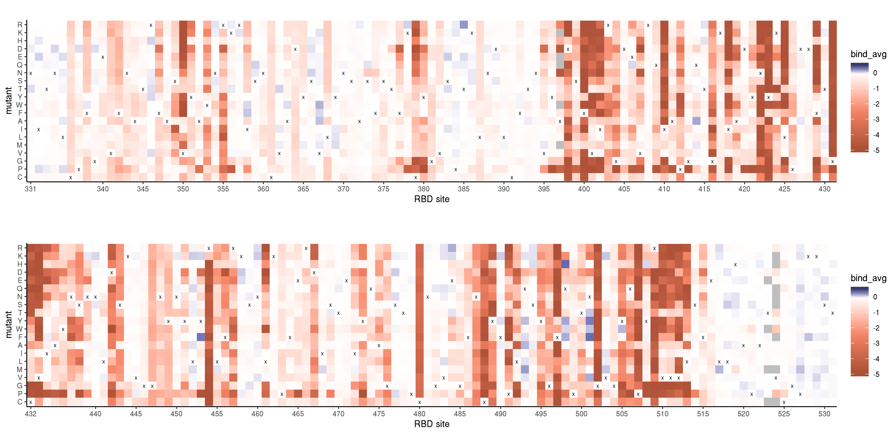

Structure function analysis of mutational effects
================
Tyler Starr
5/11/2020

This notebook analyzes our single mutant effects on binding and
expression in light of structural features of the RBD.

``` r
require("knitr")
knitr::opts_chunk$set(echo = T)
knitr::opts_chunk$set(dev.args = list(png = list(type = "cairo")))

#list of packages to install/load
packages = c("yaml","data.table","tidyverse","bio3d","gridExtra")
#install any packages not already installed
installed_packages <- packages %in% rownames(installed.packages())
if(any(installed_packages == F)){
  install.packages(packages[!installed_packages])
}
#load packages
invisible(lapply(packages, library, character.only=T))

#read in config file
config <- read_yaml("config.yaml")

#read in file giving concordance between RBD numbering and SARS-CoV-2 Spike numbering
RBD_sites <- data.table(read.csv(file="data/RBD_sites.csv",stringsAsFactors=F))

#make output directory
if(!file.exists(config$structure_function_dir)){
  dir.create(file.path(config$structure_function_dir))
}
```

Session info for reproducing environment:

``` r
sessionInfo()
```

    ## R version 3.6.1 (2019-07-05)
    ## Platform: x86_64-pc-linux-gnu (64-bit)
    ## Running under: Ubuntu 14.04.6 LTS
    ## 
    ## Matrix products: default
    ## BLAS/LAPACK: /app/easybuild/software/OpenBLAS/0.2.18-GCC-5.4.0-2.26-LAPACK-3.6.1/lib/libopenblas_prescottp-r0.2.18.so
    ## 
    ## locale:
    ##  [1] LC_CTYPE=en_US.UTF-8       LC_NUMERIC=C              
    ##  [3] LC_TIME=en_US.UTF-8        LC_COLLATE=en_US.UTF-8    
    ##  [5] LC_MONETARY=en_US.UTF-8    LC_MESSAGES=en_US.UTF-8   
    ##  [7] LC_PAPER=en_US.UTF-8       LC_NAME=C                 
    ##  [9] LC_ADDRESS=C               LC_TELEPHONE=C            
    ## [11] LC_MEASUREMENT=en_US.UTF-8 LC_IDENTIFICATION=C       
    ## 
    ## attached base packages:
    ## [1] stats     graphics  grDevices utils     datasets  methods   base     
    ## 
    ## other attached packages:
    ##  [1] gridExtra_2.3     bio3d_2.3-4       forcats_0.4.0    
    ##  [4] stringr_1.4.0     dplyr_0.8.3       purrr_0.3.2      
    ##  [7] readr_1.3.1       tidyr_0.8.3       tibble_2.1.3     
    ## [10] ggplot2_3.2.0     tidyverse_1.2.1   data.table_1.12.2
    ## [13] yaml_2.2.0        knitr_1.23       
    ## 
    ## loaded via a namespace (and not attached):
    ##  [1] Rcpp_1.0.1       cellranger_1.1.0 pillar_1.4.2     compiler_3.6.1  
    ##  [5] tools_3.6.1      digest_0.6.20    lubridate_1.7.4  jsonlite_1.6    
    ##  [9] evaluate_0.14    nlme_3.1-140     gtable_0.3.0     lattice_0.20-38 
    ## [13] pkgconfig_2.0.2  rlang_0.4.0      cli_1.1.0        rstudioapi_0.10 
    ## [17] parallel_3.6.1   haven_2.1.1      xfun_0.7         withr_2.1.2     
    ## [21] xml2_1.2.0       httr_1.4.0       hms_0.4.2        generics_0.0.2  
    ## [25] grid_3.6.1       tidyselect_0.2.5 glue_1.3.1       R6_2.4.0        
    ## [29] readxl_1.3.1     rmarkdown_1.13   modelr_0.1.4     magrittr_1.5    
    ## [33] backports_1.1.4  scales_1.0.0     htmltools_0.3.6  rvest_0.3.4     
    ## [37] assertthat_0.2.1 colorspace_1.4-1 stringi_1.4.3    lazyeval_0.2.2  
    ## [41] munsell_0.5.0    broom_0.5.2      crayon_1.3.4

## Setup

Read in tables of variant effects on binding and expression, for single
mutations to the SARS-CoV-2 RBD and for a panel of homolog RBDs from the
sarbecovirus clade.

``` r
homologs <- data.table(read.csv(file=config$homolog_effects_file,stringsAsFactors = F))
mutants <- data.table(read.csv(file=config$single_mut_effects_file,stringsAsFactors = F))

#rename mutants site indices to prevent shared names with RBD_sites, simplifying some downstream calculations that cross-index these tables
setnames(mutants, "site_RBD", "RBD_site");setnames(mutants, "site_SARS2", "SARS2_site")

#add color column to homologs, by clade
homologs$clade_color <- as.character(NA); homologs[clade=="Clade 1",clade_color := "#EF4136"]; homologs[clade=="Clade 2",clade_color := "#009444"]; homologs[clade=="Clade 3",clade_color := "#EE2A7B"]; homologs[clade=="SARS-CoV-2",clade_color := "#2E3192"]
```

## Overall relationship between structure and function

Let’s investigate how the RBD structure influences mutational effects on
expression and binding. First, we compute the *mean* effect of mutations
on binding and expression for each site in the structure, as well as the
best (max) and worst (min) mutational effects on these two measurements
(excluding nonsense and synonymous mutants).

``` r
RBD_sites[,mean_bind := mean(mutants[SARS2_site==site_SARS2 & wildtype != mutant & mutant != "*",bind_avg],na.rm=T),by=site_SARS2]
RBD_sites[,max_bind := max(mutants[SARS2_site==site_SARS2 & wildtype != mutant & mutant != "*",bind_avg],na.rm=T),by=site_SARS2]
RBD_sites[,min_bind := min(mutants[SARS2_site==site_SARS2 & wildtype != mutant & mutant != "*",bind_avg],na.rm=T),by=site_SARS2]

RBD_sites[,mean_expr := mean(mutants[SARS2_site==site_SARS2 & wildtype != mutant & mutant != "*",expr_avg],na.rm=T),by=site_SARS2]
RBD_sites[,max_expr := max(mutants[SARS2_site==site_SARS2 & wildtype != mutant & mutant != "*",expr_avg],na.rm=T),by=site_SARS2]
RBD_sites[,min_expr := min(mutants[SARS2_site==site_SARS2 & wildtype != mutant & mutant != "*",expr_avg],na.rm=T),by=site_SARS2]
```

First, let’s see how mutational effects on binding expression correlate
at the level of individual mutations and at the level of site-level mean
effects of mutation. We can see below that for many mutations and sites,
mutational effects on expression and binding are intertwined. However,
several positions are tolerant to mutation with respect to expression
despite being sensitive to mutation with respect to binding. Below, we
output the sites of these mutations, which we can visualize on the
ACE2-bound RBD structure using `dms-view`, linked [here for
per-site](https://dms-view.github.io/?pdb-url=https%3A%2F%2Fraw.githubusercontent.com%2Fdms-view%2FSARS-CoV-2%2Fmaster%2Fdata%2FSpike%2FBloomLab2020%2F6m0j.pdb&markdown-url=https%3A%2F%2Fraw.githubusercontent.com%2Fdms-view%2FSARS-CoV-2%2Fmaster%2Fdata%2FSpike%2FBloomLab2020%2FBloomLab_rbd.md&data-url=https%3A%2F%2Fraw.githubusercontent.com%2Fdms-view%2FSARS-CoV-2%2Fmaster%2Fdata%2FSpike%2FBloomLab2020%2Fresults%2FBloomLab2020_rbd.csv&condition=natural+frequencies&site_metric=site_entropy&mutation_metric=mut_frequency&selected_sites=447%2C449%2C456%2C473%2C476%2C487%2C489%2C496%2C500%2C502%2C505)
and [here for
per-mutation](https://dms-view.github.io/?pdb-url=https%3A%2F%2Fraw.githubusercontent.com%2Fdms-view%2FSARS-CoV-2%2Fmaster%2Fdata%2FSpike%2FBloomLab2020%2F6m0j.pdb&markdown-url=https%3A%2F%2Fraw.githubusercontent.com%2Fdms-view%2FSARS-CoV-2%2Fmaster%2Fdata%2FSpike%2FBloomLab2020%2FBloomLab_rbd.md&data-url=https%3A%2F%2Fraw.githubusercontent.com%2Fdms-view%2FSARS-CoV-2%2Fmaster%2Fdata%2FSpike%2FBloomLab2020%2Fresults%2FBloomLab2020_rbd.csv&condition=natural+frequencies&site_metric=site_entropy&mutation_metric=mut_frequency&selected_sites=443%2C455%2C456%2C475%2C487%2C489%2C496%2C498%2C500%2C501%2C502%2C505).
We can see that these sites exhibiting binding-specific mutational
sensitivity are invariably at the ACE2-contact interface, or in the case
of at least one mutation (S443N), perhaps second shell posititions that
are still ACE2-proximal.

``` r
par(mfrow=c(1,2))
plot(RBD_sites$mean_expr,RBD_sites$mean_bind,pch=19,col="#00000050",xlab="mean mutational effect on expression",ylab="mean mutational effect on binding",main="binding versus expression effects,\naverage per site")

plot(mutants$expr_avg,mutants$bind_avg,pch=19,col="#00000050",xlab="mutational effect on expression",ylab="mutational effect on binding",main="binding versus expression effects,\nper mutant")
```


``` r
#output sites and mutations with seemingly binding-specific detrimental effects
RBD_sites[mean_expr > -1 & mean_bind < -1,site_SARS2]
```

    ##  [1] 443 447 449 456 473 475 476 487 489 496 500 502 505

``` r
mutants[expr_avg > -0.5 & bind_avg < -2,.(SARS2_site,mutation)]
```

    ##     SARS2_site mutation
    ##  1:        443    S443N
    ##  2:        455    L455D
    ##  3:        455    L455E
    ##  4:        456    F456A
    ##  5:        456    F456E
    ##  6:        456    F456G
    ##  7:        456    F456N
    ##  8:        456    F456Q
    ##  9:        456    F456R
    ## 10:        456    F456S
    ## 11:        475    A475D
    ## 12:        487    N487C
    ## 13:        487    N487E
    ## 14:        487    N487K
    ## 15:        487    N487L
    ## 16:        487    N487M
    ## 17:        487    N487Q
    ## 18:        487    N487R
    ## 19:        489    Y489A
    ## 20:        489    Y489C
    ## 21:        489    Y489E
    ## 22:        489    Y489I
    ## 23:        489    Y489K
    ## 24:        489    Y489L
    ## 25:        489    Y489N
    ## 26:        489    Y489P
    ## 27:        489    Y489Q
    ## 28:        489    Y489R
    ## 29:        489    Y489S
    ## 30:        489    Y489T
    ## 31:        489    Y489V
    ## 32:        496    G496D
    ## 33:        496    G496E
    ## 34:        496    G496F
    ## 35:        498    Q498K
    ## 36:        500    T500I
    ## 37:        501    N501D
    ## 38:        501    N501K
    ## 39:        501    N501R
    ## 40:        502    G502A
    ## 41:        502    G502C
    ## 42:        502    G502D
    ## 43:        502    G502E
    ## 44:        502    G502F
    ## 45:        502    G502H
    ## 46:        502    G502I
    ## 47:        502    G502K
    ## 48:        502    G502L
    ## 49:        502    G502M
    ## 50:        502    G502N
    ## 51:        502    G502P
    ## 52:        502    G502Q
    ## 53:        502    G502R
    ## 54:        502    G502S
    ## 55:        502    G502T
    ## 56:        502    G502V
    ## 57:        502    G502W
    ## 58:        502    G502Y
    ## 59:        505    Y505A
    ## 60:        505    Y505C
    ## 61:        505    Y505D
    ## 62:        505    Y505E
    ## 63:        505    Y505G
    ## 64:        505    Y505I
    ## 65:        505    Y505K
    ## 66:        505    Y505L
    ## 67:        505    Y505M
    ## 68:        505    Y505Q
    ## 69:        505    Y505R
    ## 70:        505    Y505S
    ## 71:        505    Y505T
    ## 72:        505    Y505V
    ##     SARS2_site mutation

The relative solvent accessiibility (RSA) of an amino acid residue is
known to be a dominant factor influencing its tolerance to mutation.
Let’s see how RSA of a position is related to its mutational
sensitivity for binding. We use RSA in two different structural contexts
– the free RBD structure, and the RBD structure when complexed with
ACE2. We can see that mutational sensitivity of a position with respect
to binding is better described by RSA in the ACE2-bound RBD complex.

``` r
par(mfrow=c(1,3))
plot(RBD_sites$RSA_unbound,RBD_sites$mean_bind,pch=19,col="gray80",xlab="Residue relative solvent accessibility, unbound",ylab="Mean effect of mutation on binding",main="Unbound RBD",xlim=c(0,1))

plot(RBD_sites$RSA_bound,RBD_sites$mean_bind,pch=19,col="gray20",xlab="Residue relative solvent accessibility, ACE2-bound",ylab="Mean effect of mutation on binding",main="ACE2-bound RBD")


plot(RBD_sites$RSA_unbound,RBD_sites$mean_bind,pch=19,col="gray80",xlab="Residue relative solvent accessibility",ylab="Mean effect of mutation on binding",main="overlaid")
points(RBD_sites$RSA_bound,RBD_sites$mean_bind,pch=19, col="gray20")
```


``` r
#save pdf
invisible(dev.print(pdf, paste(config$structure_function_dir,"/mean-bind_v_RSA.pdf",sep="")))
```

To further visualize site-wise mutational sensitivity on the 3D
structure, let’s output `.pdb` files for the ACE2-bound RBD structure in
which we replace the B factor column with metrics of interest for each
site: 1) the mean effect of mutation on binding, 2) the mean effect of
mutation on expression, 3) the max effect of any mutation on binding,
and 4) the max effect of any mutation on expression. In PyMol, we can
then visualize spheres at each Calpha, colored by spectrum from low
(yellow) to high (blue) for each metric by manually executing the
following commands in a PyMol session in which one of the output `pdb`
files is opened: `hide all; show cartoon color warmpink, chain A; color
gray80, chain E set sphere_scale, 0.6 create RBD_CA, chain E and name ca
hide cartoon, RBD_CA; show spheres, RBD_CA spectrum b, yellow green
blue, RBD_CA`

``` r
pdb <- read.pdb(file="data/structures/ACE2-bound/6m0j.pdb")
```

    ##    PDB has ALT records, taking A only, rm.alt=TRUE

``` r
#color by mean effect on binding
pdb_mean_bind <- pdb
pdb_mean_bind$atom$b <- NA
for(i in 1:nrow(pdb_mean_bind$atom)){
  res <- pdb_mean_bind$atom$resno[i]
  chain <- pdb_mean_bind$atom$chain[i]
  mean_bind <- RBD_sites[site_SARS2==res & chain_6M0J==chain & !is.na(chain_6M0J),mean_bind]
  if(length(mean_bind)>0){pdb_mean_bind$atom$b[i] <- mean_bind}else{pdb_mean_bind$atom$b[i] <- 0}
}
#save pdb
write.pdb(pdb=pdb_mean_bind,file=paste(config$structure_function_dir,"/6m0j_b-factor-mean-bind.pdb",sep=""), b = pdb_mean_bind$atom$b)

#color by max effect on binding
pdb_max_bind <- pdb
pdb_max_bind$atom$b <- NA
for(i in 1:nrow(pdb_max_bind$atom)){
  res <- pdb_max_bind$atom$resno[i]
  chain <- pdb_max_bind$atom$chain[i]
  max_bind <- RBD_sites[site_SARS2==res & chain_6M0J==chain & !is.na(chain_6M0J),max_bind]
  if(length(max_bind)>0){pdb_max_bind$atom$b[i] <- max_bind}else{pdb_max_bind$atom$b[i] <- 0}
}
#save pdb
write.pdb(pdb=pdb_max_bind,file=paste(config$structure_function_dir,"/6m0j_b-factor-max-bind.pdb",sep=""), b = pdb_max_bind$atom$b)

#color by mean effect on expression
pdb_mean_expr <- pdb
pdb_mean_expr$atom$b <- NA
for(i in 1:nrow(pdb_mean_expr$atom)){
  res <- pdb_mean_expr$atom$resno[i]
  chain <- pdb_mean_expr$atom$chain[i]
  mean_expr <- RBD_sites[site_SARS2==res & chain_6M0J==chain & !is.na(chain_6M0J),mean_expr]
  if(length(mean_expr)>0){pdb_mean_expr$atom$b[i] <- mean_expr}else{pdb_mean_expr$atom$b[i] <- 0}
}
#save pdb
write.pdb(pdb=pdb_mean_expr,file=paste(config$structure_function_dir,"/6m0j_b-factor-mean-expr.pdb",sep=""), b = pdb_mean_expr$atom$b)

#color by max effect on expression
pdb_max_expr <- pdb
pdb_max_expr$atom$b <- NA
for(i in 1:nrow(pdb_max_expr$atom)){
  res <- pdb_max_expr$atom$resno[i]
  chain <- pdb_max_expr$atom$chain[i]
  max_expr <- RBD_sites[site_SARS2==res & chain_6M0J==chain & !is.na(chain_6M0J),max_expr]
  if(length(max_expr)>0){pdb_max_expr$atom$b[i] <- max_expr}else{pdb_max_expr$atom$b[i] <- 0}
}
#save pdb
write.pdb(pdb=pdb_max_expr,file=paste(config$structure_function_dir,"/6m0j_b-factor-max-expr.pdb",sep=""), b = pdb_max_expr$atom$b)
```

## DFEs and heatmaps

Let’s look at the distribution of single-mutant effects on binding, and
compare the fraction of mutations that are within the window defined by
known functional RBD homologs for these two phenotypes.

For the binding plot on the left, the intermediate blue point on the
x-scale is RaTG13, which *can* promote huACE2-mediated cell entry in in
vitro cellular infection assays (though less efficiently than
SARS-CoV-2), though whether this is sufficient to enable efficient viral
replication in more complex models is uncertain. For the cluster of
points near 0, the farthest-left point is LYRa11, which according to
Letko et al. can also promote huACE2-mediated cellular entry, though
less efficiently than SARS-CoV-1 and other bat CoV isolates such as
WIV1/16 (identical RBDs). Therefore, these two points define a window of
affinites that can at least support in vitro cellular infection – but in
reality, the window of possible “neutrality” with regards to actual
human infectivity is probably better set by the remaining four points
with delta log<sub>10</sub>(*K*<sub>A,app</sub>) values \~ 0, consisting
of SARS-CoV-1, WIV1/16, SARS-CoV-2, and GD-Pangolin RBDs, in that
rank-order. Taken together, we identify 1732 single mutants (45.55%)
whose affinity effects are mild enough to potentially enable human
infectivity (SARS-CoV-1 cutoff), and 3188 single mutants (83.85%) whose
affinity is potentially sufficient to enable in vitro cellular
infectivity (RaTG13 cutoff). Taken together, this suggests a quite large
sequence space of RBD diversity that is consistent with huACE2 binding
and entry.

``` r
plot(density(mutants[wildtype != mutant,bind_avg],na.rm=T,adjust=0.5),main="SARS-CoV-2 mutant log10Ka,app",xlab="delta log10(KA,app)"); polygon(density(mutants[wildtype != mutant,bind_avg],na.rm=T,adjust=0.5),col="gray50",border="black")
set.seed(100);points(homologs[,bind_avg],sample(seq(1.45,1.55,by=0.005),nrow(homologs)),col=homologs[,clade_color],pch=19,cex=1.1)
```


``` r
# plot(density(mutants[wildtype != mutant & mutant != "*",expr_avg],na.rm=T,adjust=0.5),main="SARS-CoV-2 mutant expression",xlab="delta expression"); polygon(density(mutants[wildtype != mutant & mutant != "*",expr_avg],na.rm=T,adjust=0.5),col="gray50",border="black")
# set.seed(100);points(homologs[,expr_avg],sample(seq(0.63,0.67,by=0.002),nrow(homologs)),col=homologs[,clade_color],pch=19,cex=1.1)
#can also make plot for expression, but our expression range is less well calibrated, probably because of the issue with rare barcodes exhibiting lower than expected expression probably due to unseen defects in the plasmid.
```

Next, let’s make heatmaps of per-amino acid mutational effects on
binding and expression. We first make these heatmaps for all mutations
at all sites, colored by delta log<sub>10</sub>(*K*<sub>A,app</sub>). (I
would eventually like to flesh out these heatmap by providing additional
indicator variables as ‘heatmap’ style rows on the top – things could
include a color scale for RSA, conservation, an asterisk or something to
indicate contact residues, indicators for NLGS or disulfides, an
indicator for strucutrla contacts in full length Spike trimer, etc. I
also want to think about whether there are better color scales to use,
including the “divergence” in scale between the blue (goes from white to
bluest in a 0.5-unit scale), versus red (0 to reddest in a 5-unit
scale). Happy for additional things to think about to refine these
plots):


And next, the same heat map, colored by delta mean fluorescence
(expression) (once again, happy for thoughts. Do we like having the stop
variants in here (and altering the scale?):


We next make these heatmaps, zooming in on residues in special
structural and functional classes: (disulfides, putative N-linked
glycans and possible new introductions, RBM, contact residues, “key”
contacts \[sites of adaptation within SARS-CoV-1\], sites with diversity
in SARS-CoV-2 clade, differences between SARS-CoV-1 and SARS-CoV-2)

Does mutational tolerance with respect to binding and/or expression
differ systematically between positions in the core-RBD versus the RBM
loops?

Next let’s look at beneficial mutations on binding and expression. We
want to look at where they occur, and identify any interesting
hypothesized biochemical mechanisms, etc. Pick some to validate\!

## Output for dms-view visualization of mutational effects
