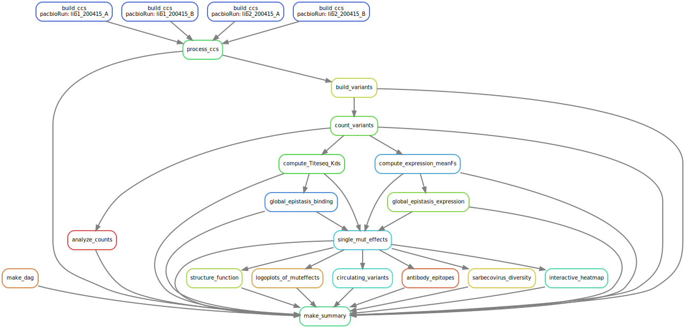

# Summary

Analysis run by [Snakefile](../../Snakefile)
using [this config file](../../config.yaml).
See the [README in the top directory](../../README.md)
for details.

Here is the DAG of the computational workflow:

Here is the Markdown output of each Jupyter notebook in the
workflow:

1. [Process PacBio CCSs](process_ccs.md).

2. [Build variants from CCSs](build_variants.md).

3. [Count variants by barcode](count_variants.md).

4. [QC analysis of sequencing counts](analyze_counts.md).

5. [Computation of ACE2-binding *K*D](compute_binding_Kd.md).

6. [Computation of expression mean fluorescence](compute_expression_meanF.md).

7. [Global epistasis decomposition of binding effects](global_epistasis_binding.md).

7. (alt)[Tobit regression decomposition of binding effects](tobit_regression_binding.md).

8. [Global epistasis decomposition of expression effects](global_epistasis_expression.md).