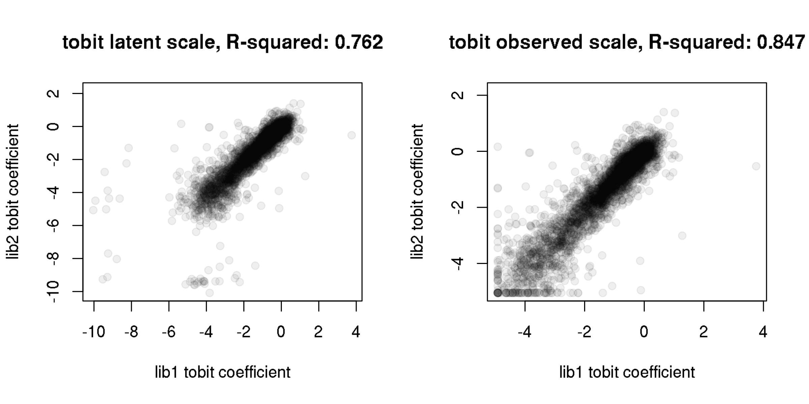

Fit Tobit regression to per-barcode binding measurements
================
Tyler Starr
5/6/2020

This notebook takes the per-barcode measurements of
-log10(*K*<sub>D,app</sub>), and fits a censored regression (Tobit
regression) model to deconvolve single mutant effect coefficients.

``` r
require("knitr")
knitr::opts_chunk$set(echo = T)
knitr::opts_chunk$set(dev.args = list(png = list(type = "cairo")))

#list of packages to install/load
packages = c("yaml","data.table","tidyverse","VGAM","caret")
#install any packages not already installed
installed_packages <- packages %in% rownames(installed.packages())
if(any(installed_packages == F)){
  install.packages(packages[!installed_packages])
}
#load packages
invisible(lapply(packages, library, character.only=T))

#read in config file
config <- read_yaml("config.yaml")

#read in file giving concordance between RBD numbering and SARS-CoV-2 Spike numbering
RBD_sites <- read.csv(file="data/RBD_sites.csv",stringsAsFactors=F)

#make output directory
if(!file.exists(config$tobit_regression_binding_dir)){
 dir.create(file.path(config$tobit_regression_binding_dir))
}
```

Session info for reproducing environment:

``` r
sessionInfo()
```

    ## R version 3.6.1 (2019-07-05)
    ## Platform: x86_64-pc-linux-gnu (64-bit)
    ## Running under: Ubuntu 14.04.6 LTS
    ## 
    ## Matrix products: default
    ## BLAS/LAPACK: /app/easybuild/software/OpenBLAS/0.2.18-GCC-5.4.0-2.26-LAPACK-3.6.1/lib/libopenblas_prescottp-r0.2.18.so
    ## 
    ## locale:
    ##  [1] LC_CTYPE=en_US.UTF-8       LC_NUMERIC=C              
    ##  [3] LC_TIME=en_US.UTF-8        LC_COLLATE=en_US.UTF-8    
    ##  [5] LC_MONETARY=en_US.UTF-8    LC_MESSAGES=en_US.UTF-8   
    ##  [7] LC_PAPER=en_US.UTF-8       LC_NAME=C                 
    ##  [9] LC_ADDRESS=C               LC_TELEPHONE=C            
    ## [11] LC_MEASUREMENT=en_US.UTF-8 LC_IDENTIFICATION=C       
    ## 
    ## attached base packages:
    ## [1] splines   stats4    stats     graphics  grDevices utils     datasets 
    ## [8] methods   base     
    ## 
    ## other attached packages:
    ##  [1] caret_6.0-84      lattice_0.20-38   VGAM_1.1-1       
    ##  [4] forcats_0.4.0     stringr_1.4.0     dplyr_0.8.3      
    ##  [7] purrr_0.3.2       readr_1.3.1       tidyr_0.8.3      
    ## [10] tibble_2.1.3      ggplot2_3.2.0     tidyverse_1.2.1  
    ## [13] data.table_1.12.2 yaml_2.2.0        knitr_1.23       
    ## 
    ## loaded via a namespace (and not attached):
    ##  [1] Rcpp_1.0.1         lubridate_1.7.4    class_7.3-15      
    ##  [4] assertthat_0.2.1   digest_0.6.20      ipred_0.9-9       
    ##  [7] foreach_1.4.4      R6_2.4.0           cellranger_1.1.0  
    ## [10] plyr_1.8.4         backports_1.1.4    evaluate_0.14     
    ## [13] httr_1.4.0         pillar_1.4.2       rlang_0.4.0       
    ## [16] lazyeval_0.2.2     readxl_1.3.1       rstudioapi_0.10   
    ## [19] rpart_4.1-15       Matrix_1.2-17      rmarkdown_1.13    
    ## [22] gower_0.2.1        munsell_0.5.0      broom_0.5.2       
    ## [25] compiler_3.6.1     modelr_0.1.4       xfun_0.7          
    ## [28] pkgconfig_2.0.2    htmltools_0.3.6    nnet_7.3-12       
    ## [31] tidyselect_0.2.5   prodlim_2018.04.18 codetools_0.2-16  
    ## [34] crayon_1.3.4       withr_2.1.2        ModelMetrics_1.2.2
    ## [37] MASS_7.3-51.4      recipes_0.1.6      grid_3.6.1        
    ## [40] nlme_3.1-140       jsonlite_1.6       gtable_0.3.0      
    ## [43] magrittr_1.5       scales_1.0.0       cli_1.1.0         
    ## [46] stringi_1.4.3      reshape2_1.4.3     timeDate_3043.102 
    ## [49] xml2_1.2.0         generics_0.0.2     lava_1.6.5        
    ## [52] iterators_1.0.10   tools_3.6.1        glue_1.3.1        
    ## [55] hms_0.4.2          survival_2.44-1.1  colorspace_1.4-1  
    ## [58] rvest_0.3.4        haven_2.1.1

## Setup

Read in per-barcode measurements of -log10(*K*<sub>D,app</sub>) (also
called log10(*K*<sub>A,app</sub>)).

``` r
dt <- data.table(read.csv(file=config$Titeseq_Kds_file,stringsAsFactors = F)) #later on, could imagine also loading in other targets and having these as additional factors int the tobit regression?
```

## Deconvolving single-mutant effects on binding using censored linear regressions

Our -log10(*K*<sub>D,app</sub>) scale is additive, meaning the effect of
a double mutant as change in -log10(*K*<sub>D,app</sub>) is expressed as
the sum of the two component single mutational effects on
-log10(*K*<sub>D,app</sub>). The exception to this is that we have
known, harsh censoring of our measurements at the boundary condition of
10<sup>-6</sup>M (we could also consider an upper boundary of
10<sup>-13</sup>M, as we still have the 0M point, plus we didn’t end up
having any variants with binding at this boundary condition anyway)
imposed by our concentration range in the assay. (The validity of this
additive linear range, apart from range censoring, is supported from our
initial attempts to fit an Otwinowski et al. style global epistasis
model to these data, which essentially fit strong censoring at the lower
boundary, and a more-or less linear response through the dynamic range
of our assay.) We will therefore use this knowledge of the underlying
nonlinearity to motivate the use of *censored linear regression* models
to decompose single mutant effects from our barcode-level measurements.

First, we will set up our model matrix encoding our factor variables for
the regression. We remove columns that are unidentifiable

``` r
#split concatenated aa_substitutions, which will become our model factors
dt[,aa_subs_list := list(strsplit(aa_substitutions,split=" ")),by=(barcode)]

#split into dt for each library to avoid undetermined mutations from one library becoming undetermined values in the other; censor for complete observations
dt_1 <- dt[library=="lib1" & !is.na(log10Ka),]
dt_2 <- dt[library=="lib2" & !is.na(log10Ka),]

#make model matrix type data frame, where each column is a mutation, and each row is a barcode measurement. Cells are 1 if a barcode has the mutation given in the column, 0 if a barcode does not have the mutation. It is therefore quite a sparse matrix.
levels_1 <- levels(factor(unlist(dt_1[,aa_subs_list])))
matrix_1 <- as.matrix(do.call(rbind, lapply(lapply(dt_1[,aa_subs_list], factor, levels_1), table)))

levels_2 <- levels(factor(unlist(dt_2[,aa_subs_list])))
matrix_2 <- as.matrix(do.call(rbind, lapply(lapply(dt_2[,aa_subs_list], factor, levels_2), table)))

#check that the number of mutations in each barcode as the matrix rowSum matches the number of mutations annotated in the dt table
stopifnot(rowSums(matrix_1)==dt_1$n_aa_substitutions)
stopifnot(rowSums(matrix_2)==dt_2$n_aa_substitutions)
```

Initial attempts at fitting Tobit regressions for lib1 revelaed the
matrix is not full-order – that is, there are probably some combination
of at least 2 mutants which are only found together, and not resolvable
from one another. Let’s identify co-linear mutation factor combinations
that need to be removed. We then remove any barcodes that carry these
mutations, and remove them from the model matrix.

(The mutations are T193Y and V194G, which are found on 14 (\!) barcodes,
but only together in combination.)

``` r
#check whether any mutations in each matrix are non-identifiable
#matrix_1_linearCombos <- findLinearCombos(matrix_1)
#save(matrix_1_linearCombos, file="results/tobit_regression_binding/matrix_1_linearCombos.Rda")
#matrix_2_linearCombos <- findLinearCombos(matrix_2)
#save(matrix_2_linearCombos, file="results/tobit_regression_binding/matrix_2_linearCombos.Rda")
load(file="results/tobit_regression_binding/matrix_1_linearCombos.Rda")
load(file="results/tobit_regression_binding/matrix_2_linearCombos.Rda")


#matrix 1, need to remove column 3332 and 3064 to get a solvable regression. For matrix 2, it's solvable as is.
#first, need to remove rows from dt_1 that have the co-linear mutations
dt_1_tofit <- copy(dt_1[-which(matrix_1[,matrix_1_linearCombos$remove]==1),])
#and remove these columns and rows from the model matrix
matrix_1_tofit <- matrix_1[-which(matrix_1[,matrix_1_linearCombos$remove]==1),]
matrix_1_tofit <- matrix_1_tofit[,-matrix_1_linearCombos$linearCombos[[1]]]

dt_2_tofit <- copy(dt_2)
matrix_2_tofit <- matrix_2

stopifnot(rowSums(matrix_1_tofit)==dt_1_tofit$n_aa_substitutions)
stopifnot(rowSums(matrix_2_tofit)==dt_2_tofit$n_aa_substitutions)
```

Fit tobit regressions to the data.

``` r
#lm_1 <- lm(dt_1$log10Ka ~ matrix_1)
#save(lm_1, file="results/tobit_regression_binding/lm_1.Rda")
#lm_2 <- lm(dt_2$log10Ka ~ matrix_2)
#save(lm_2, file="results/tobit_regression_binding/lm_2.Rda")

#tobit_1_vglm <- vglm(dt_1_tofit$log10Ka ~ matrix_1_tofit, tobit(Lower=6,imethod=3), trace=T)
#save(tobit_1_vglm, file=paste(config$tobit_regression_binding_dir,"/tobit_1_vglm_manual.Rda",sep=""))

#tobit_2_vglm <- vglm(dt_2_tofit$log10Ka ~ matrix_2_tofit, tobit(Lower=6,imethod=3), trace=T)
#save(tobit_2_vglm, file=paste(config$tobit_regression_binding_dir,"/tobit_2_vglm_manual.Rda",sep=""))

load(file=paste(config$tobit_regression_binding_dir,"/tobit_1_vglm_manual.Rda",sep=""))
load(file=paste(config$tobit_regression_binding_dir,"/tobit_2_vglm_manual.Rda",sep=""))
```

``` r
coef_lib1 <- coef(tobit_1_vglm)
for(i in 3:length(names(coef_lib1))){
  name <- names(coef_lib1)[i]
  name_short <- paste(strsplit((strsplit(name,split="_")[[1]][3]),split="")[[1]][-c(1:5)],collapse="")
  names(coef_lib1)[i] <- name_short
}

coef_lib2 <- coef(tobit_2_vglm)
for(i in 3:length(names(coef_lib2))){
  name <- names(coef_lib2)[i]
  name_short <- paste(strsplit((strsplit(name,split="_")[[1]][3]),split="")[[1]][-c(1:5)],collapse="")
  names(coef_lib2)[i] <- name_short
}

coefs <- data.frame(mutation=as.character(unique(c(names(coef_lib1),names(coef_lib2)))))
for(i in 1:nrow(coefs)){
  #print(i)
  effect_1 <- coef_lib1[names(coef_lib1)==coefs$mutation[i]]
  if(length(effect_1)==0){
    coefs$effect_lib1[i] <- NA
  }else{
    coefs$effect_lib1[i] <- effect_1
  }
  effect_2 <- coef_lib2[names(coef_lib2)==coefs$mutation[i]]
  if(length(effect_2)==0){
    coefs$effect_lib2[i] <- NA
  }else{
    coefs$effect_lib2[i] <- effect_2
  }
}

par(mfrow=c(1,2))
x <- coefs$effect_lib1[-c(1,2)]
y <- coefs$effect_lib2[-c(1,2)]
plot(x,y,pch=19,col="#00000010",xlab="lib1 tobit coefficient",ylab="lib2 tobit coefficient",main=paste("tobit latent scale, R-squared:",round(summary(lm(y~x))$r.squared,digits=3)))

lib1_cutoff <- 6-coef_lib1[1]
x_cens <- x
for(i in 1:length(x_cens)){
  if(!is.na(x_cens[i]) & x_cens[i]< lib1_cutoff){x_cens[i]<- lib1_cutoff}
}

lib2_cutoff <- 6-coef_lib2[1]
y_cens <- y
for(i in 1:length(y_cens)){
  if(!is.na(y_cens[i]) & y_cens[i]< lib2_cutoff){y_cens[i] <- lib2_cutoff}
}

plot(x_cens,y_cens,pch=19,col="#00000010",xlab="lib1 tobit coefficient",ylab="lib2 tobit coefficient",main=paste("tobit observed scale, R-squared:",round(summary(lm(y_cens~x_cens))$r.squared,digits=3)))
```



Next, fit a joint tobit model to pooled measurements from both libraries
simultaneously

``` r
dt_joint <- dt[!is.na(log10Ka),]


#make model matrix type data frame, where each column is a mutation, and each row is a barcode measurement. Cells are 1 if a barcode has the mutation given in the column, 0 if a barcode does not have the mutation. It is therefore quite a sparse matrix.
levels_joint <- levels(factor(unlist(dt_joint[,aa_subs_list])))
matrix_joint <- as.matrix(do.call(rbind, lapply(lapply(dt_joint[,aa_subs_list], factor, levels_joint), table)))

#check that the number of mutations in each barcode as the matrix rowSum matches the number of mutations annotated in the dt table
stopifnot(rowSums(matrix_joint)==dt_joint$n_aa_substitutions)

#check whether any mutations in each matrix are non-identifiable
matrix_joint_linearCombos <- findLinearCombos(matrix_joint)
save(matrix_joint_linearCombos, file="results/tobit_regression_binding/matrix_joint_linearCombos.Rda")

#no linear combos to remove
dt_joint_tofit <- copy(dt_joint)
matrix_joint_tofit <- matrix_joint

stopifnot(rowSums(matrix_joint_tofit)==dt_joint_tofit$n_aa_substitutions)

#fit joint tobit
#tobit_joint_vglm <- vglm(dt_joint_tofit$log10Ka ~ matrix_joint_tofit, tobit(Lower=6,imethod=3), trace=T)
#save(tobit_joint_vglm, file=paste(config$tobit_regression_binding_dir,"/tobit_joint_vglm_manual.Rda",sep=""))
load(file=paste(config$tobit_regression_binding_dir,"/tobit_joint_vglm_manual.Rda",sep=""))
```

Save coefficents together into a dataframe analogous to the output of
global epistasis models for analyzing coefficients in the subsequent
single\_mut\_effects.Rmd script.

``` r
#
coef_joint <- coef(tobit_joint_vglm)
for(i in 3:length(names(coef_joint))){
  name <- names(coef_joint)[i]
  name_short <- paste(strsplit((strsplit(name,split="_")[[1]][3]),split="")[[1]][-c(1:5)],collapse="")
  names(coef_joint)[i] <- name_short
}

for(i in 1:nrow(coefs)){
  #print(i)
  effect_joint <- coef_joint[names(coef_joint)==coefs$mutation[i]]
  if(length(effect_joint)==0){
    coefs$effect_joint[i] <- NA
  }else{
    coefs$effect_joint[i] <- effect_joint
  }
}

coefs[,c("site","wildtype","mutant")] <- NA

for(i in 3:nrow(coefs)){
  coefs$wildtype[i] <- strsplit(as.character(coefs$mutation[i]),split="")[[1]][1]
  coefs$mutant[i] <- strsplit(as.character(coefs$mutation[i]),split="")[[1]][length(strsplit(as.character(coefs$mutation[i]),split="")[[1]])]
  coefs$site[i] <- as.numeric(paste(strsplit(as.character(coefs$mutation[i]),split="")[[1]][-c(1,length(strsplit(as.character(coefs$mutation[i]),split="")[[1]]))],collapse=""))
}
coefs <- coefs[order(coefs$site,coefs$mutant),]

#write csv
write.csv(coefs,file=config$tobit_regression_binding_file)
```
